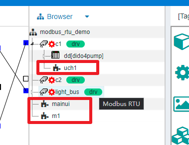

特殊节点：UI(HMI)
==

IOT-Tree Server一个很激动人心的功能是能够在你的项目中，直接提供在线的交互UI界面定义、设计和发布。

在项目(Prjoect)-通道(Channel)-设备(Device)-标签组(Tag Group)的每个层级都可以定义对应的UI界面节点。并且遵循节点包含相关资源访问。比如，设备(Device)下面的UI界面，可以引用设备和设备下面所有节点的资源。而项目(Project)根目录下的UI界面，可以使用整个项目的所有资源——这个资源包含子节点下的UI子界面。

UI(HMI)节点支持在线编辑，里面的图元可以使用图元库中的相关内容。另外，UI节点在项目中的唯一路径即是在项目运行时的外部访问URL中的资源路径。

UI(HMI)内容比较多，在本文档中专门使用一章进行详细说明。

详细内容请参考[人机交互（HMI）][hmi_idx]

[hmi_idx]: ../hmi/index.md
