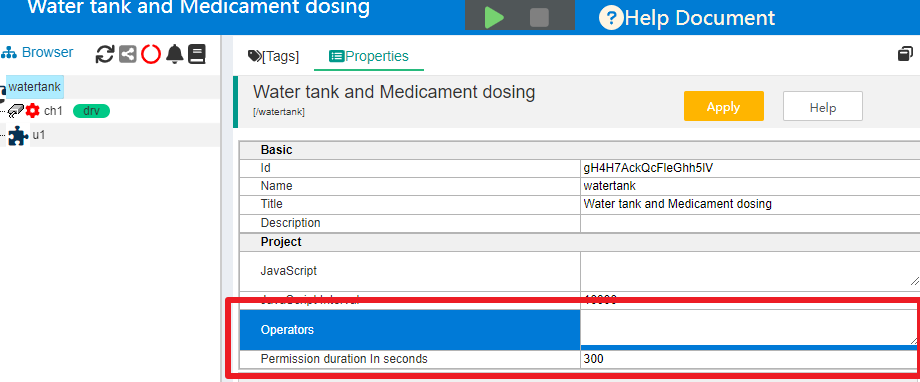
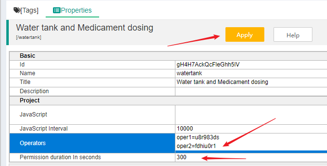
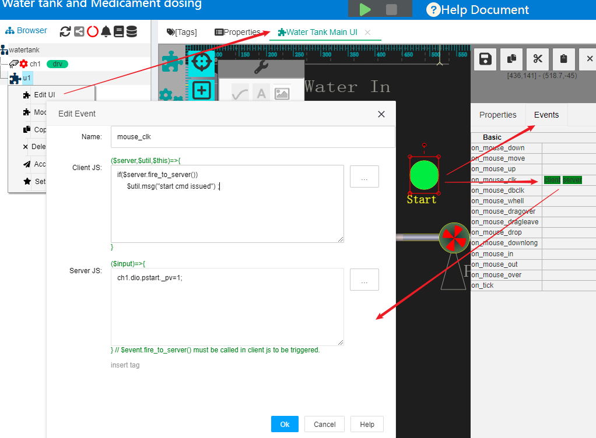
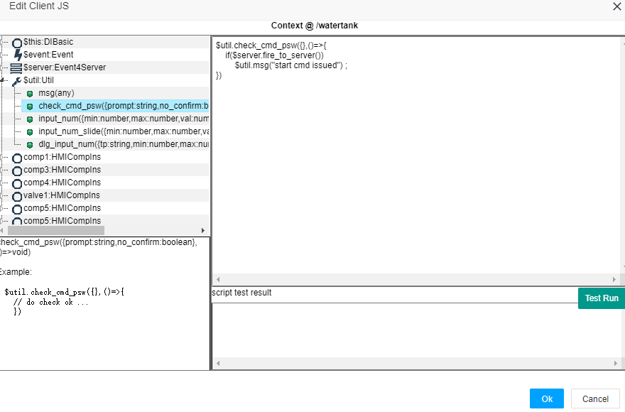
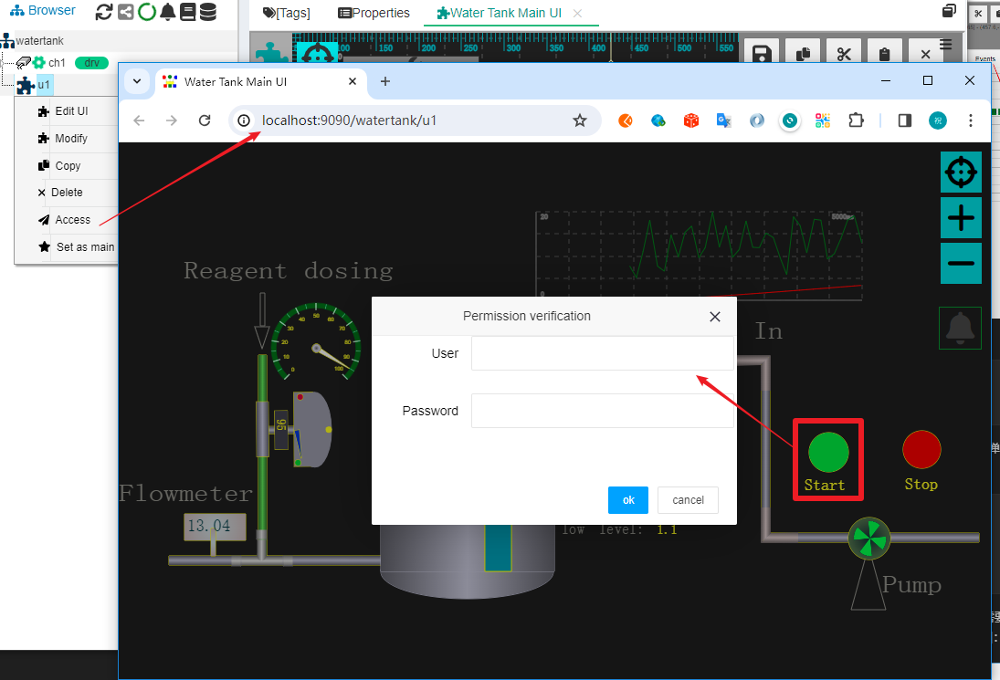
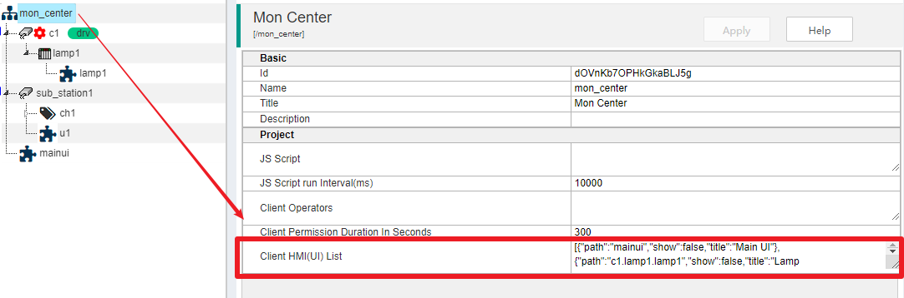
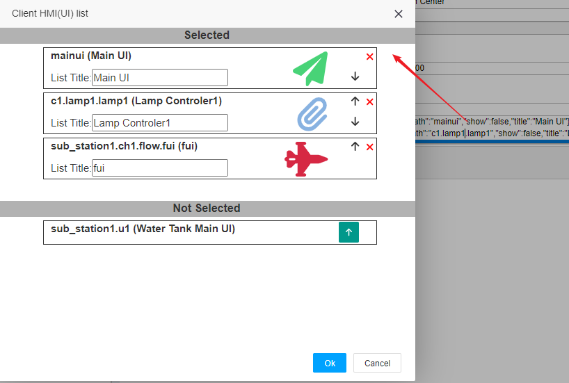
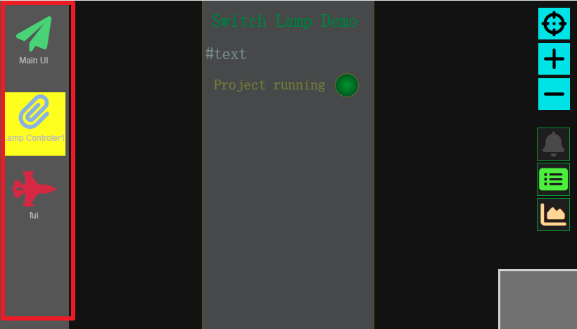
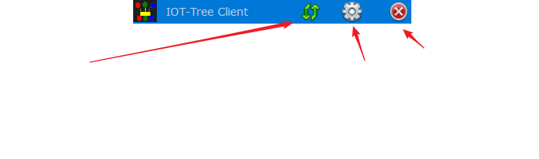
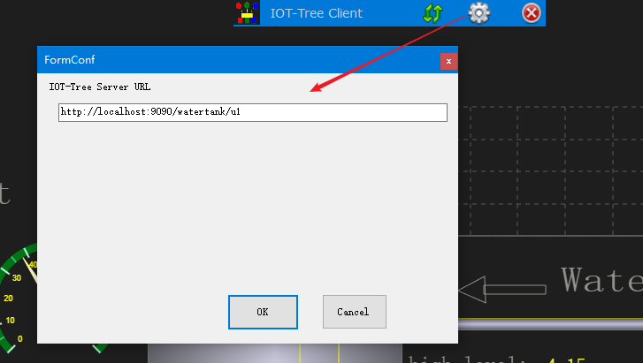

HMI客户端支持
==


你使用IOT-Tree的时候，可能会遇到这样一个典型需求：

1 IOT-Tree运行在一个工业自动化监控中心或触摸屏上，这台计算机接入现场设备数据，并配置了相关的监控画面（HMI）；

2 这台计算机日常工作中持续运行，由工业现场相关工作人员使用；

3 你希望日常运行过程中，只要这台计算机启动，那么就会自动打开监控画面，并且充满整个屏幕；

4 监控画面启动时不需要输入密码；

5 当操作员下达指令时，需要输入操作密码；

为了支持以上需要，IOT-Tree在发布的release程序包中，专门有个client目录，里面提供了这个客户端HMI程序支持。


## 1 HMI客户端运行环境


当前实现的客户端只支持Windows系统，使用C# .net开发，内部使用微软的WebView2控件支持。

后续我们计划使用Chromium实现客户端，使之能够支持Linux系统，敬请期待。


## 2 IOT-Tree部署和权限设定</en> deployment and permission settings</en>


在日常监控客户端打开时，要尽快展示出现场工艺界面，此时要求对应的画面URL是不需要登录的。你的IOT-Tree如果没有设置权限插件，就是这种情况。

但为了安全或防止误操作，需要操作员在下达指令时，输入操作员密码。这样可以防止非相关人员对于监控系统有下达指令的可能性。因此，在你设置监控画面HMI(UI)时,对于操作下达指令的图元应该使用对应的JS验证代码进行。

如果你对IOT-Tree的HMI和JS不熟悉，请参考：


<a href="../hmi/index.md" >人机交互（HMI）</a>

<a href="../js/index.md">JS脚本支持</a>


我们还是以IOT-Tree内部自带的演示项目"Water tank and Medicament dosing"为例子，通过调整此项目的一些参数，使之能够快速的支持Client监控和操作员下指令的验证。


### 2.1 设置项目的操作员和操作密码


进入项目管理界面之后，点击项目根节点，右边选择Properties选项卡，可以看到Project属性分组下面，有两个属性项：Operators和Permission duration in seconds。





点击Operators右边的输入框，会弹出一个大的文本编辑框。你可以在里面输入操作员用户名和密码，一行一个，本例子使用如下内容：


```
oper1=u8r983ds
oper2=fdhiu0r1
```

点击"Ok"按钮之后，你会发现上方的"Apply"按钮会变亮，你需要点击进行保存才会起作用。这样我们就新增了两个操作员用户和操作密码（当前IOT-Tree对此支持的比较简单，后续版本可能会做更好的改进）。





把这个这个操作员信息分配给不同的日常监控工作人员之后，在项目中的HMI画面中，如果触发操作员验证，用户就可以输如相关的操作员和密码。

而对于"Permission duration in seconds"这个参数，则代表了当前操作员正确输入验证信息之后，在多少秒的时间内，有其他指令操作，则不需要再次输入密码验证——这样可以很大的方便短时间内多次操作。而一旦超过此时间，那么下次再次触发指令时，还需要再次验证。因此，如果你的操作时间很短，请尽可能设置此数值小一些。以防在操作员完成指令下达离开之后，其他人员不需要验证就可以下达指令。

设置了操作员信息之后，我们还需要对监控画面的操作按钮进行稍微调整，使得在用户点击按钮时，做操作员验证。


### 2.2 配置操作员点击HMI图元验证


鼠标右键HMI(UI)节点u1,选择"Edit UI"打开UI编辑窗口，在编辑画面中选中圆形按钮"Start",然后点击右边Events列表框，在"on_mouse_clk"右边点击打开JS事件脚本编辑窗口，如下图：





可以看到，当前用户点击这个圆形按钮时，会触发Client JS的代码如下：


```
if($server.fire_to_server())
    $util.msg("start cmd issued") ;
```

这个代码直接触发事件到server端，然后打印一个提示信息。我们双击JS编辑框，弹出JS编辑辅助对话框，修改代码如下：


```
$util.check_cmd_psw({},()=>{
    if($server.fire_to_server())
        $util.msg("start cmd issued") ;
})
```

这个代码先运行$util.check_cmd_psw这个函数，此函数会自动判断当前操作是否需要输入用户和验证密码。并且在用户输入成功之后，才回调后续的发送指令动作。如下图：




如果你对函数"$util.check_cmd_psw()"不熟悉，可以在左边的上下文中，展开$util对象，点击里面这个函数就可以看到相关的帮助。

修改之后，确保点击ui编辑画面的保存按钮。

这样我们已经准备好了监控画面和操作员验证了。我们鼠标右键"u1"节点，选择"Access"打开运行时画面。并且启动项目，然后点击"Start"按钮。你可以看到弹出了操作员验证对话框：




你只有在输入用户名和密码正确的情况下，才可能真正下达指令。接下来，我们就可以配置客户端了。


## 3 HMI客户端导航


客户端监控画面有可能需要多个。在一般情况下，大多数现场中控计算机监控画面也就几个就够了。同时，在我们的项目树中。也可能会有定义有多个HMI节点，一些节点作为顶层节点的子画面存在。那么我们也需要有个需要部署到客户端的画面导航列表，从中只列举用户关心的几个画面就行。

IOT-Tree在1.5.2版本中支持了一个项目属性配置：


<b>户端画面列表</b>


在项目树中点击根节点，然后打开右边"Properties"列表选项卡。如下图：





点击"Client HMI(UI) List"这个属性项的输入区，你就可以看到弹出窗口：





此窗口分上下两部分，下面是项目中未选择到列表中的HMI节点，上面是选中的HMI节点。你可以点击下面未选项的选择按钮进行添加。

而对于选中的HMI节点，你还可以设置列表标题，修改顺序，选择列表图标和颜色。确定之后，别忘点击属性应用按钮"Apply"。完成之后，相关的监控画面在客户端显示时，左边就会出现一个导航栏，用户可以很直观的在多个画面中进行切换。如图：




## 4 HMI客户端配置


我们假设你的客户端和IOT-Tree运行在同一台计算机上，那么你只需要通过本地链接就可以直接访问u1监控画面：


```
http://localhost:9090/watertank/u1
```

在IOT-Tree安装目录下，找到client目录，打开"wclient.exe"这个客户端程序。你会看到这个程序会根据你启动的显示屏位置，全屏展示出监控画面。

请把鼠标移动到显示器上方中间位置，就会看到显示出一个工具条。如下图：





这个工具条有刷新按钮、设置按钮和关闭程序按钮。请点击设置按钮，然后在"IOT-Tree Server URL"参数中输入上面的url内容。如果你的IOT-Tree Server部署在局域网其他机器上，那么根据你的项目请使用对应的url即可。

确定之后，点击刷新按钮，就可以展示出对应的画面了。




## 5 配置随着windows启动自动启动


接下来，你为了方便你的客户操作员，希望在电脑启动时能够自动启动这个监控客户端。

1. 首先你在client目录下面对"wclient.exe"建立一个快捷方式。鼠标右键，选择"创建快捷方式"即可。你会发现在client目录下多了这个内容。

2. 按组合键Win+R，在弹出的运行框中输入命令 "shell:startup",回车之后就可以看到wondows弹出了当前用户的启动目录。你只需要把刚才的快捷方式放入其中即可。


## 6 总结


当前IOT-Tree提供的Client相对简单，但也满足很多场合的自动监控的需要。后续版本中，我们也会对此作改进，也希望你们多提建议。


