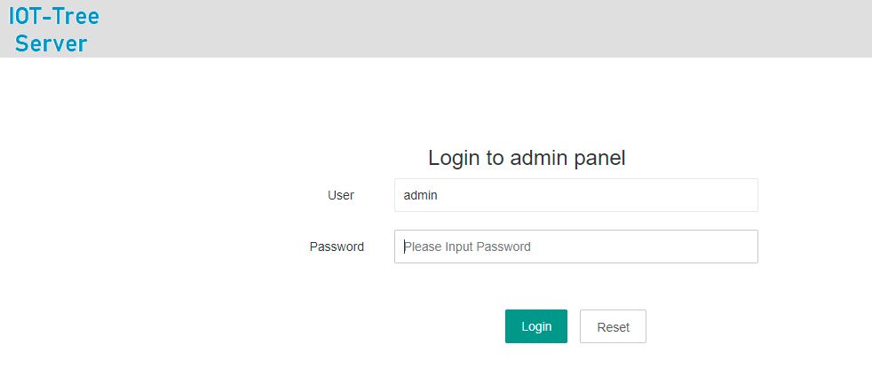
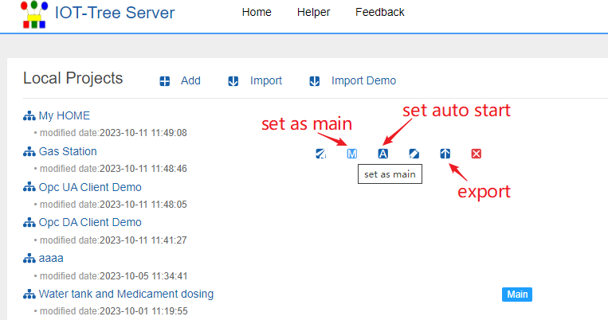
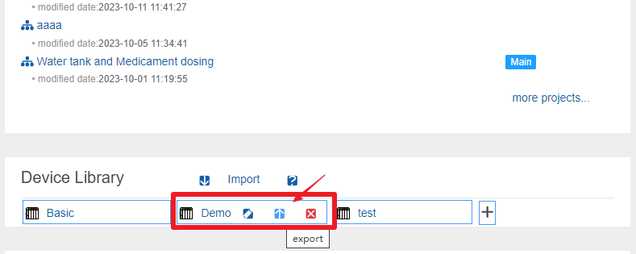
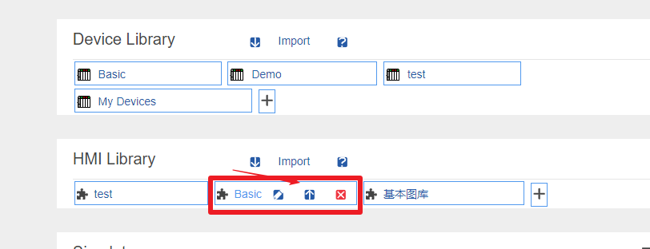
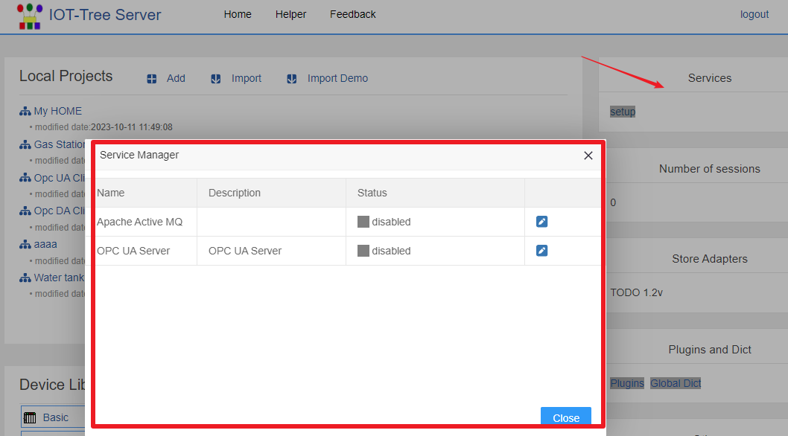
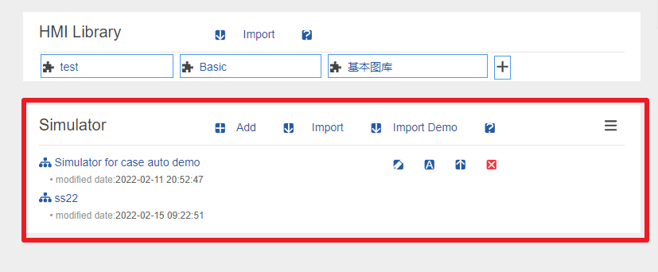

IOT-Tree Server - 总体和项目组成
==

本部分内容对IOT-Tree Server做了总体和每个项目组成部分进行深入说明。你如果需要充分利用IOT-Tree，那么请仔细理解内部的内容。

IOT-Tree Server是一个可以独立运行的物联网软件，主要使用Java开发，可以运行在各种环境下面。

她可以整合接入各自数据资源，并且通过统一数据层次和上下文对接入的数据进行组织管理。以此为基础提供了相关的管理和控制功能。IOT-Tree Server提供了类似工业OPC统一标准接口的支持。通过对接入的设备和数据来源进行简单明了的管理，屏蔽了底层复杂的设备和数据源的差异性，可以极大的方便工业、自动化系统和物联网系统的实现。

她提供了完全基于Web方式的访问和后台管理相关功能。使用她，你可以基本不需要编写程序就可以轻松完成物联网系统的底层支持和顶层应用。

## 1 IOT-Tree Server 整体组成

IOT-Tree Server提供Web方式的管理界面，你只需要访问 http://yourhost:port/admin 就可以进入管理界面。而由于IOT-Tree提供了RESTful风格的访问方式，所以"admin"这个名字不能作为你的项目名称了。

IOT-Tree Server安装完成之后，在本地和缺省端口访问地址为：http://localhost:9090/admin/。此时会出现登陆界面，并且第一次登陆会让你设置管理员密码。后续登陆你只需要输入管理员密码即可。

管理登录之后，你就可以到管理主界面，可以看到如下内容：

**项目(Projects)**

一个运行实例可以支持多个项目，你可以根据你自己的项目情况在一个运行实例中，建立多个项目,形成项目列表。如下图：

 

既然项目有多个，那就有主次和运行管理。你可以指定某个项目为主项目(Main Project)。对于主项目，如果内部某个UI节点被指定为主界面，那么在IOT-Tree Server提供的Web访问根路径，就会直接显示此主项目中的主界面。列表右边的"Access"，可以打开项目中自己的主界面。

项目右边的"set auto start"的按钮，可以设定项目在IOT-Tree Server启动的时候自动启动。这个在生产系统中，部署注册成系统服务的情况下很重要。如果某个项目不需要使用了，只需要进行设置不自动启动，而没必要进行项目删除。

在项目列表中，可以进行项目新增和现有项目导入和导出。IOT-Tree内部还自带了一些演示项目，可以直接导入。

**设备库**

IOT-Tree的设备库管理非常灵活方便，你可以非常容易的从项目中导出一个设备到库中，这样其他项目就可以很方便的引用。

设备库的丰富，可以极大方便项目配置。在管理主界面，可以在"Device Library"区域管理多个库，每个库可以单独的进行导入导出。在使用时，建议你可以根据自己的业务需要建立自己的库，然后可以在不同的IOT-Tree Server部署环境下导入使用。当然，IOT-Tree在发布版本中，会自带一部分设备库内容。

 

每个库点击之后可以看到内部还可以支持一级分类，每个分类下可以建立多个设备,这种"库-分类-设备"三级结构可以满足任意多的设备，同时还保证了简洁和共享的方便。

**图元库**

图元库是用来支持项目中的UI节点在编辑UI界面时，提供的基础支撑，这可以使得日常作图可以更快更高效。

在管理主界面，可以在"HMI Library"区域管理多个库，每个库可以单独的进行导入导出。在使用时，建议你可以根据自己的业务需要建立自己的库，然后可以在不同的IOT-Tree Server部署环境下导入使用。当然，IOT-Tree在发布版本中，会自带一部分图元库内容。

 

每个库点击之后可以看到内部还可以支持一级分类，每个分类下可以建立多个图元,这种"库-分类-图元"三级结构可以满足任意多的图元，同时还保证了简洁和共享的方便。

**公共服务（Services）**

一个部署IOT-Tree Server实例，内部还带有一些公共的服务，这些服务能够为物联网应用提供特殊支持。如支持MQTT Broker的Apache Active MQ等。

**设备模拟器**

IOT-Tree Server提供的设备模拟器，可以提供特定通信条件的虚拟设备支持。如厂家某个设备支持Modbus协议，但软件调试时没有厂家设备，可以使用设备模拟器支持相关的配置操作。

在管理主界面，可以在"Simulator"区域管理多个模拟器，每个模拟器实例可以单独的进行导入导出。每个模拟器实例，可以模拟多个通信通道和多个设备。模拟设备内部支持JS脚本实现设备内在逻辑。

## 2 IOT-Tree Server 一些限定

**为了更加方便地为其他系统提供基础支持，IOT-Tree Server对内部一些内容做了一些约束或限定。**

系统内所有地配置项，如果有名称(Name)要求输入，则此名称必须符合一般编程语言的变量名称要求，起始字符必须a-z A-Z，后续字符a-z A-Z 0-9 _。对于 _ 这个字符之所以不允许作为起始字符，是因为IOT-Tree Server内部系统自带的变量都以这个为开头。对于接入、树节点、数据项节点的名称，都会受此限制。

## 3 IOT-Tree内在JS支持

IOT-Tree内部支持JS脚本。你可以使用脚本定义数据标签、任务运行代码、事件处理等。

## 4 IOT-Tree 插件支持

IOT-Tree支持你使用Java语言进行插件的开发。这些插件可以扩展你的JsApi，可以支持对接权限控制等。

