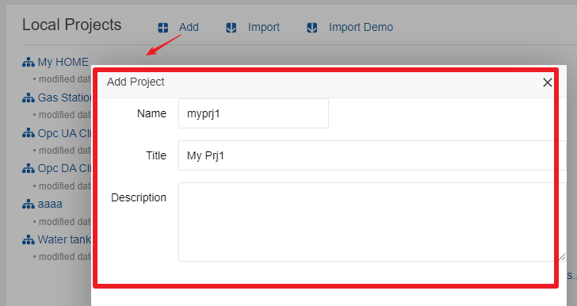
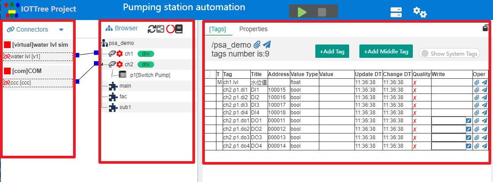
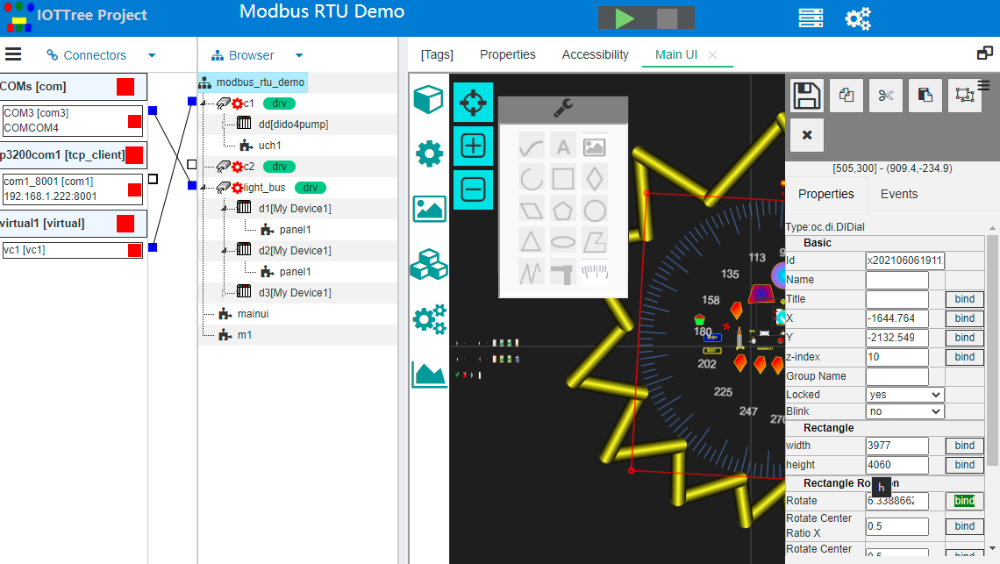
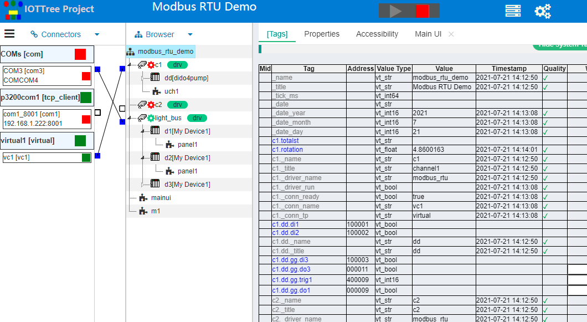

IOT-Tree项目(Project)
==

一个IOT-Tree Server实例配置、运行、监视和维护，其主要围绕项目进行。前面已经说到，在IOT-Tree主管理界面中，可以管理多个项目，这些项目有一个是主项目，并且项目也可以设定随着IOT-Tree Server自动启动。

本文档我们深入一个项目进行项目组成的分析介绍。

## 1 项目主界面

### 1.1 新建项目

在管理主界面"Local Projects"区域，点击"Add"按钮，弹出新增项目窗口，只需要输入项目名称、标题和描述即可。

**再次提示**

系统内所有地配置项，如果有名称(Name)要求输入，则此名称必须符合一般编程语言的变量名称要求，起始字符必须a-z A-Z，后续字符a-z A-Z 0-9 _。对于 _ 这个字符之所以不允许作为起始字符，是因为IOT-Tree Server内部系统自带的变量都以这个为开头。对于接入、树节点、数据项节点的名称，都会受此限制。

### 1.2 主界面

在管理主界面，点击某个项目弹出新窗口。进入了项目主界面。如下图：

此界面分为接入区（Connectors）、树型浏览区（Browser)和主内容区。按照左-中-右排列。

其中，主内容区以标签页（Tab）的形式存在，可以根据需要打开显示多个标签页。当前主要有\[Tags]和Properties，他们分别对应中间
树型浏览区（Browser)当前选中节点的Tags和属性内容。另外，在树形节点右键某些操作，可以使得相关功能界面在主内容区进行显示，或者不需要了也可以进行关闭。

在项目界面上方，除了显示项目标题之外，还可也通过启动/停止按钮对项目进行启动和停止操作。项目启动之后，通道、驱动等动态运行内容，也会体现到此界面中。同时，在Tags标签页中，所有的上下文数据（Tags）实时数据，会进行展示。如下图。

## 2 接入Connectors

IOT-Tree的接入部分单独与数据组织浏览区（Browser)进行分离，可以使得基于底层的通信链路能够有更好抽象和更灵活的运用。

我们根据接入数据来源和特点，抽象为：链路、绑定和消息三大类。在后续的设备驱动（也即是数据来源的处理）实现时，也基于此进行实现，极大的简化了设备驱动的开发。

另外，我们也根据当前信息系统之间数据共享的特点，针对一些流行的共享数据结构做了一些特殊支持，可以直接通过配置定位提取数据，然后直接推送到数据组织浏览区（Browser)中，整个过程和设备驱动无关。

这样的接入机制更能适应当前传统信息系统和物联网系统接入统一。

**接入的两极管理机制**

一个项目可以包含多种方式的接入，为了能够提供足够灵活的接入组织，同时保证简洁性，IOT-Tree提供了"接入提供者（ConnProvider）"-"接入点(ConnPt)"两级管理。

不同的接入类型可能会有一个或多个"接入提供者（ConnProvider）"，然后其下可以有多个具体的"接入点(ConnPt)"。每个接入点受它的提供者管理和限制。如，一个Tcp Server接入提供者，可以接收远程Client连接，每个接收成功的Tcp链路就会成为此Tcp Server接入提供者的子节点。

要更深入的了解请参考[接入Connectors章节][conn]。

>提示：如果你在接入区不知道如何操作，请尝试在相关节点上鼠标右键，你就会看到相关支持的操作菜单。

[conn]:../conn/index.md

## 3 浏览区（Browser)

在上面项目中间浏览区（Browser)，我们可以看到一颗管理树，根部是项目名称。此内容是整个项目的中心，左边的接入数据会更新到此组织的对应的节点中，并且后续的数据利用也基于此树形结构。事实上，IOT-Tree还利用此树形结构进行数据权限的限定。

IOT-Tree这颗数据组织树中，有通道(Channel)、设备(Device)和标签组(Tag Group)等三种容器节点。容器节点的意思是，每个节点下面还可以包含其他内容。其中最主要的内容就是标签(Tag)，在容器节点内部可以包含多个标签(Tag)，每个标签代表了一个具体的数据项（含数据项名称、数据类型等）。

对于这些容器节点，IOTTree还有如下规定：

>通道(Channel)节点限定在项目根节点下，这样形成的一个通道列表可以与接入中的"接入点(ConnPt)"进行关联。同时，如果通道下面的设备需要驱动，也由通道统一分配。如果你要详细了解通道、接入、驱动之间的关系，[请参考相关章节][ch_conn_drv]。

>设备(Device)节点必须在通道节点下面，这样通道-设备两级关系可以满足大部分数据组织要求。但是，如果你的应用很特殊还不满足，可以使用标签组(Tag Group)，只要在通道以下，你可以任意建立多级标签组(Tag Group)，这样你可以自由的分配这些容器节点下面允许内容（如标签Tag）。

如果你要详细了解通道、设备、标签组，[请参考相关章节][ch_dev_tagg]。

标签(Tag)虽然可以成为容器节点下的叶子节点，由于内容简单并且数量很大，放在中间的浏览区不合适，所以放在在下面介绍的主内容区。相关详细内容[请参考标签列表章节][tags]

除了标签Tag属于容器节点之外，你还可以在容器节点和项目根下面建立HMI（UI）叶子节点。由于UI节点很特殊，并且数量不多，为方便管理，直接放在了浏览区的树中。IOT-Tree对UI节点专门做了在线编辑支持，相关内容请[参考UI专门的章节][hmi]。

>提示：如果你在接入区不知道如何操作，请尝试在相关节点上鼠标右键，你就会看到相关支持的操作菜单。

[hmi]:../hmi/index.md
[tags]:./tags.md
[ch_conn_drv]:./ch_conn_drv.md
[ch_dev_tagg]:./ch_dev_tagg.md

## 4 主内容区

在项目主界面右边主内容区，是浏览区节点详细内容展示部分。主内容去使用选项卡（Tab）的方式进行展示，并且固化了标签列表（\[Tags\]）和属性(Properties)两个选项卡，当点击选择中间某个节点时，这两个选项卡里面的内容会自动跟着变化。[请参考标签列表章节][tags]。属性(Properties)两个选项卡展示的是当前选择的节点属性，特别是针对通道节点，属性选项卡会根据分配的设备驱动，自动展示此驱动需要的相关属性参数内容，你可以在此进行具体的参数设置。具体内容[请参考属性内容][props]和[设备驱动相关章节][dev_drv]。

当然，你可以在鼠标右键点击UI节点，选择打开编辑UI的选项卡，相关内容请[参考UI专门的章节][hmi]。

[props]:./properties.md
[dev_drv]:../device/index.md
