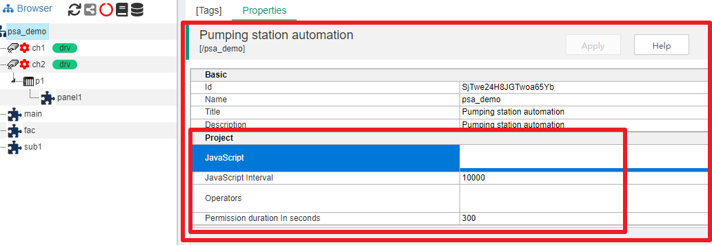
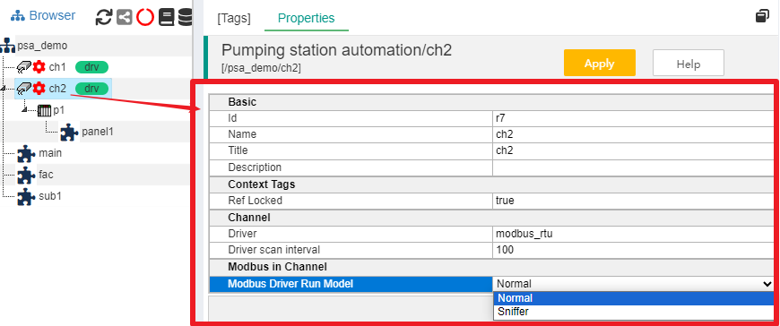
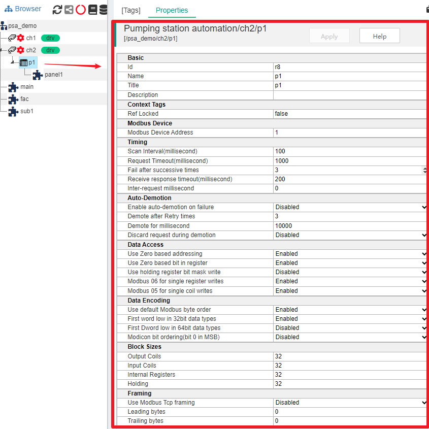
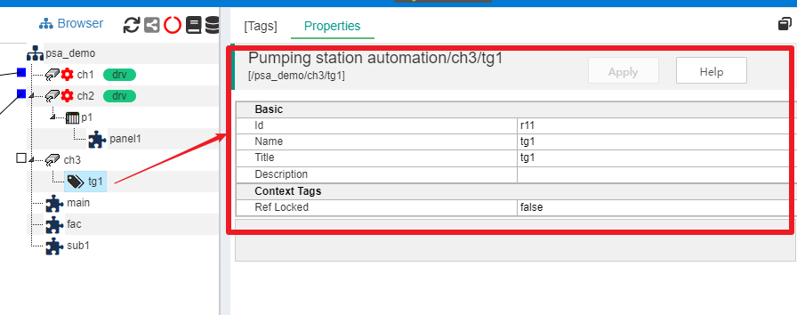

属性
==

在IOT-Tree项目主界面中，点击某个容器节点，主内容区的Properties选项卡就会展示此节点的所有属性。每个节点除了公共的Id、Name和Title等属性之外，还有节点自身的特殊属性。下面就以根节点为开始，逐步说明不同节点的属性内容。

## 1 项目根节点属性

如图，项目根节点有专门的Project属性分组，_本部分内容放置哪些内容，IOT-Tree项目组目前还在规划中，你如果有好的建议，可以向我们提出_。

Project相关属性基本关系到整个项目全局需要支持和配置的参数。目前考虑有如下内容：

>全局定时运行JS脚本（和任务Task类似，并且此运行脚本以更节点为上下文，可以访问内部所有的节点和资源）。

>项目有数据写入权限的操作员（Operators），在监控画面，要下达指令时，需要输入操作员用户和密码，可以在此进行设置。

## 2 通道(Channel)节点属性

如图，通道(Channel)节点由于可能会选定设备驱动，所以会有自身的属性项目。其中，Channel分组下面有驱动名称Driver（只读）、驱动内部线程扫描时间间隔"Driver scan interval"（可读写）。这两个参数是给设备驱动使用的。

另外，如果一些驱动很特殊，需要在通道的层次设置一些参数，那么也会在此进行列举。如上图modbus_rtu驱动，可以支持在通道层级设置参数"Modbus Driver Run Model"，它有Normal（正常的Modbus Master模式）和Sniffer（只监听总线上的数据包并获取数据）两种。

## 3 设备(Device)节点属性

设备(Device)节点由于隶属于某个通道，而通道内部可能设置了设备驱动，此时设备属性也就包含的这个驱动在具体到某个设备节点参数。如上图，设备p1属性包含了Modbus驱动相关的参数。

如果要了解这些参数的含义，请参考[设备、设备库和驱动][dev]

[dev]:../device/index.md

## 4 普通容器节点属性

这些节点包含标签组、无设备驱动的设备节点等。

如果一个容器节点是TagGroup，或者此节点所属的通道没有设备驱动，那么此节点也仅仅是个容器作用，相关属性也很简单，在此就不分解讲述了。

