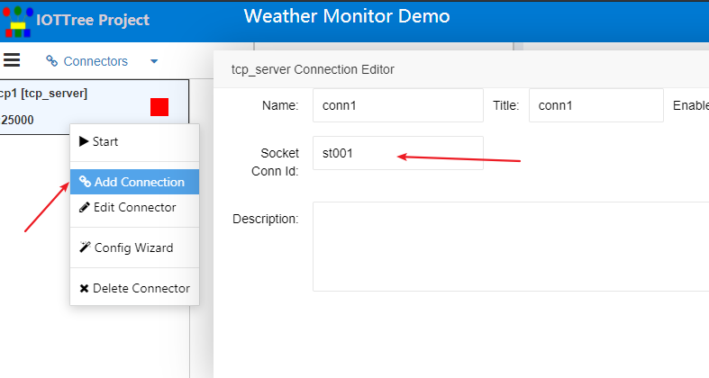
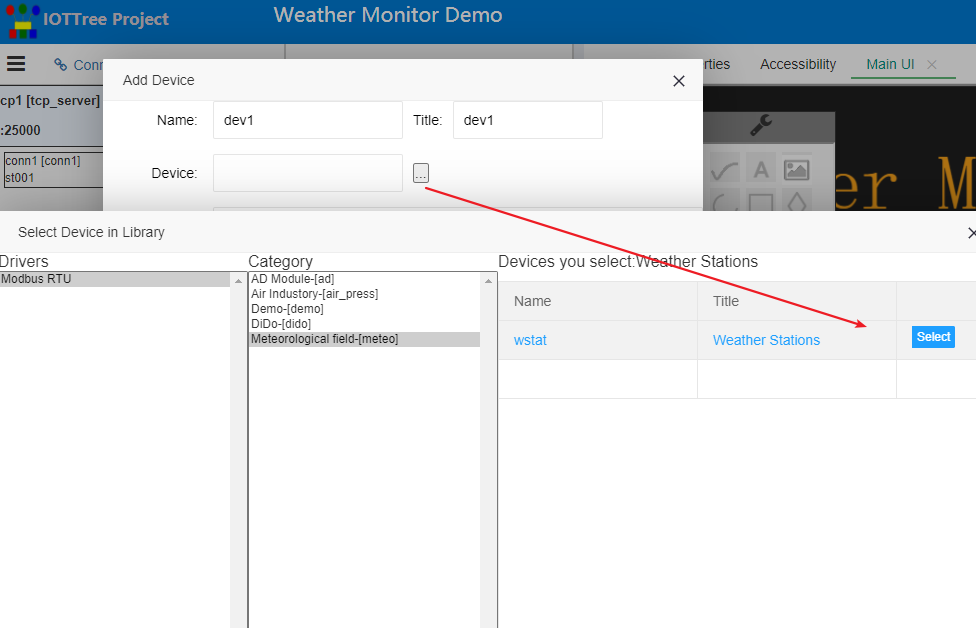

快速理解TcpServer接入器
==

## 1 TcpServer接入器使用背景

如果您有个云端服务器（有着固定公网地址），并且准备作为物联网项目的接入服务器。

你的项目很可能是相对比较简单的采集设备，每个监测点在特定的位置采集的指标相对固定。就好比气象站，每个监测点都很相似，大致采集的数据指标诸如气温、湿度、风速、风向和降雨量等等。但这样的监测点数量可能比较多，同时分布比较广。

每个监测点你可能会使用一个GPRS或4G通信模块，这个设备能够通过电信无线网络接入互联网，也就是可以和您的云端服务建立链接。这个通信设备在本地则提供了最简单的RS485接口。由此，你的现场监测传感器大概率能够提供RS485 Modbus RTU对接接口和协议。这样，你的现场监测电路可以做的非常简单，只需要简单供电和一个RS485总线就搞定了。

那么，你如何把数据传递到云端服务器呢？当然也可以采用最简单的方式：你的GPRS/4G通信模块主动链接你的云端服务器，成功建立tcp链接之后，立刻发送自己的身份和验证信息，云端服务器确定链接的身份之后，接下来就成为了此监测节点的主管理端（master），通信模块在后续的工作仅仅是透明转发本地RS485总线和云端的互相往来的数据即可（当然也包含链接断了之后的自动重新链接）。

以上的使用方式非常简单而有效。接下来你肯定会问了，既然设备通信这么简单了，云端我该怎么办呢？

很简单，在你的项目中使用IOT-Tree Server吧，你会发现云端也会简单到让你感叹！

## 2 在云端使用IOT-Tree Server管理所有设备和数据

你可以参考[quick start][quick_start]在你的云端服务器轻松安装部署IOT-Tree Server。

接着，你可以查看IOT-Tree Server具体某个设备驱动协议下面是否有你的现场设备。如果还没有，那请参考[quick know device definition][qn_devdef],在已经部署的IOT-Tree Server中定义好你的现场监测设备。这些都搞定后，接下来就很简单了。

### 2.1 建立Tcp Server Connector

参考下图，增加Connector Provider - TcpServer

通过设定TcpServer端口、链接标识判定方式等。如此，IOT-Server就成为了一个接入服务器。

启动项目之后，TcpServer会接受到远端每个监测点的tcp链接。由此，每个现场接入都会有个对应的链接Connector。

参考下图，在tcpserver下面添加Connector。其中，conn必须设定对应的接入id，这个id会和现场接入匹配。

### 2.2 为每个链接Connector添加通道Channel和对应的驱动
参考下图，在Browser树中添加通道(含选择设备驱动)，我们设备在此例子中使用Modbus RTU协议的驱动。

建立通道Channel和链接Connector之间的关联

### 2.3 选择添加设备，运行查看接入数据

在通道下面鼠标右键，选择添加设备。如下图：

其中设备已经通过设备管理进行了添加，具体可以参考[设备定义][qn_devdef]。此时，可以直接通过设备选择就可以直接获取，如下图：

添加设备成功后，点击Browser树中的新增加设备节点，并且在右边主内容区Tab标签选择[Tags],可以发现在设备定义中定义的设备相关标签和子节点都已经加入到项目中。如下图：

更进一步，设备定义的关联节点也都成为了项目的一部分，如此设备对应的监控画面UI组件等。如下图

具体的设备加入到通道下面时，可能还需要根据项目中的实际情况做很少的参数设置。比如，本例子由于使用Modbus RTU驱动，加入到通道的设备很可能在总线上需要设定自己的地址（Modbus 1字节地址）。此时，你可以点击主设备节点，并切换内容区到Properties标签。在此，你可以修改在此通道下的设备Modbus地址。如下图：

其他设备也类似，你可以重复以上过程，增加接入、通道和设备。

在此，你应该已经发现了。一个TcpServer下面的接入数量和现场设备一样多。比如，典型的可能有几十个，每个接入链接都需要对应一个通道Channel，而且每个通道下面的设备都相似。

IOT-Tree考虑到这种情况了，专门在TcpServer Provider上面增加了一个向导。你可以通过向导快速的完成接入、通道、设备的添加，以及接入和通道的关联。详情请查看 [TcpServer快速接入向导][qn_tcpserver_wizard]。

到此为止，你可以启动项目，如果你的现场设备、接入和配置参数都正常，则可以在Tags标签界面下面看到接入成功之后的实时数据。

### 2.4 使用在线编辑组态UI建立你的项目监控画面

本部分请参考 

[人机交互(HMI)][qn_hmi]

[人机交互UI(HMI UI)编辑操作说明][qn_hmi_w]

### 2.5 使用存储机制，自动存储你的设备数据

本部分内容预期在1.2版本实现，敬请期待。

你可以通过Restful接口，定时读取项目所有的标签实时数据，然后根据自己的需要进行数据库的存储和数据使用。

### 2.6 使用IOT-Tree Server RestFUL接口给你的应用提供api

你可以通过项目主内容区，Accessibility标签查看项目中所有的http restful api和对应的数据格式。

[qn_devdef]:./quick_know_device_definition.md
[qn_hmi]:./quick_know_hmi.md
[qn_hmi_w]:./quick_know_hmi_edit.md

[quick_start]:../quick_start.md
[qn_tcpserver_wizard]: ./quick_know_tcpserver_wizard.md
