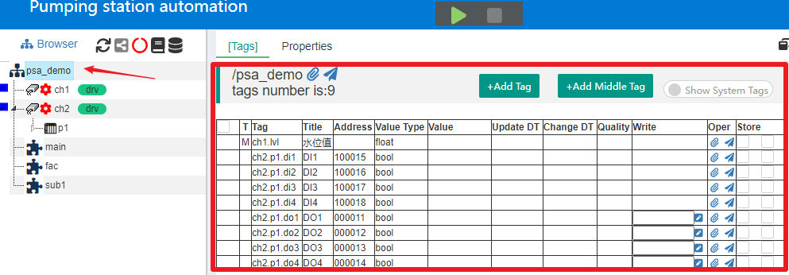
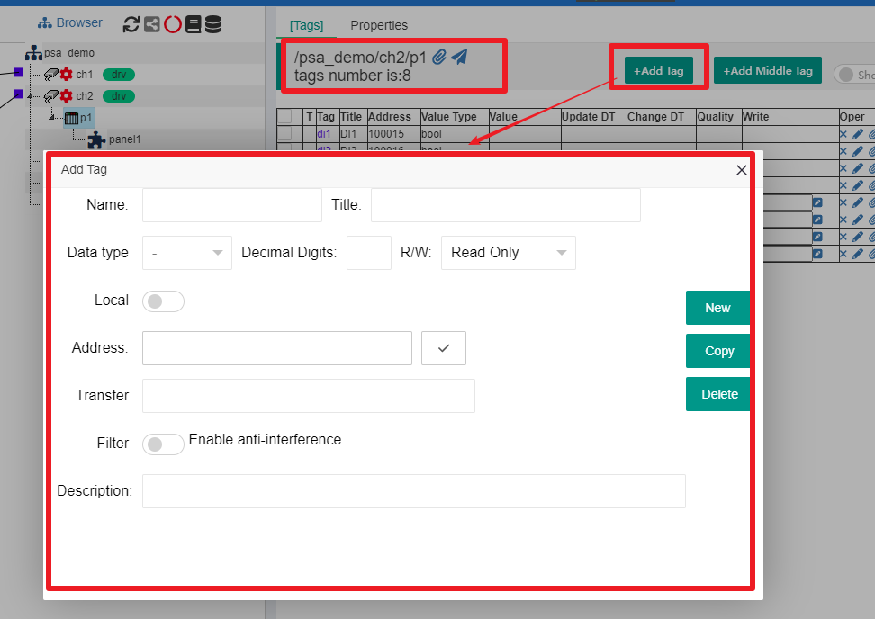
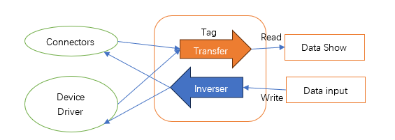
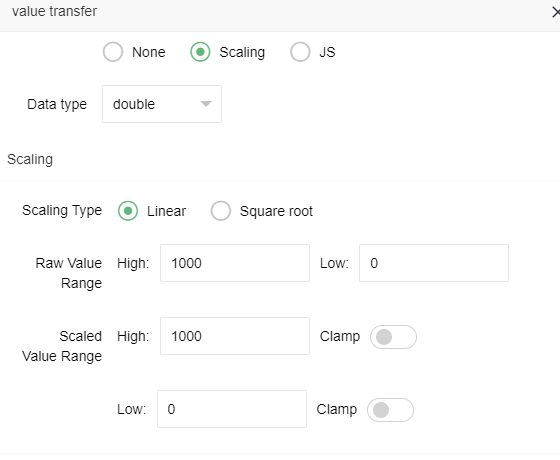
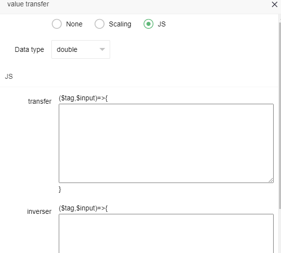
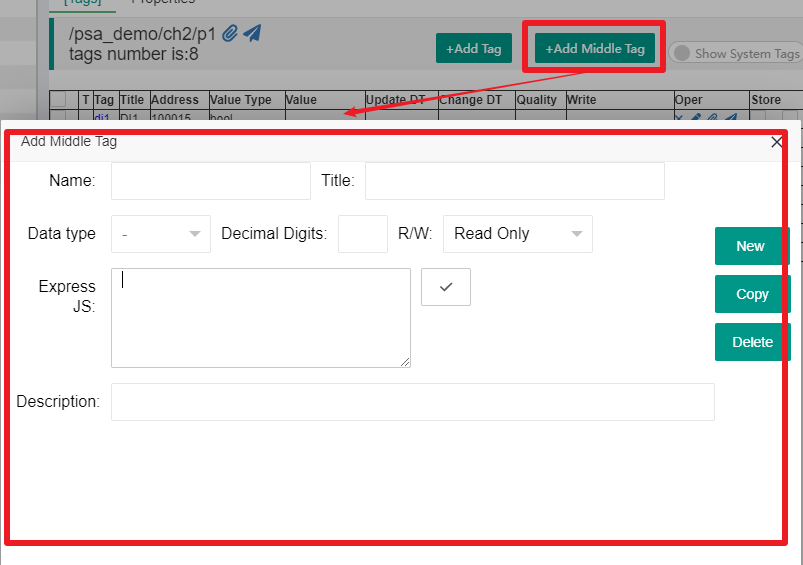
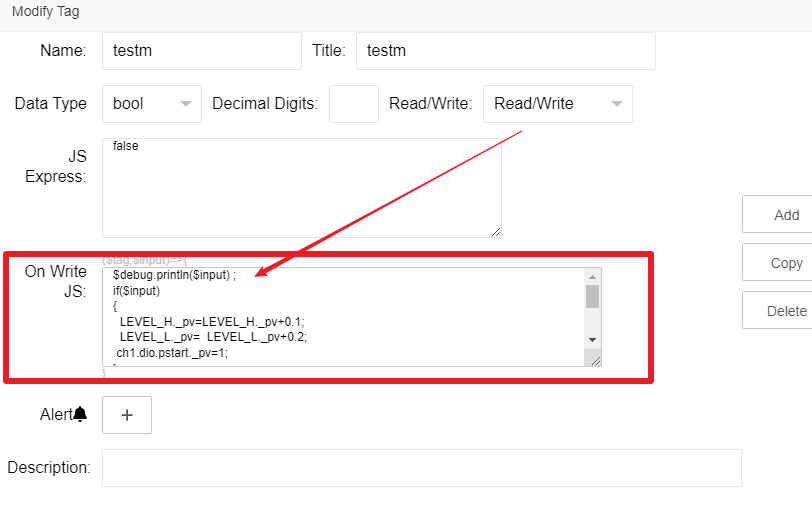

标签列表
==

在IOT-Tree项目主界面中，点击某个容器节点，主内容区的Tags选项卡就会展示此节点下的所有数据标签。如果选择项目根节点，则会显示整个项目定义的所有数据标签列表。如图所示：

## 1 标签类型

在容器节点下面，标签有三种类型：普通标签、中间标签和系统标签。

>普通标签是内部最基础的标签，可以从接入和驱动获取更新数据，如果驱动支持写入操作，那么也可以通过标签写入输出数据到设备或其他系统中。普通标签内部也可以带有转换器，可以根据输入的原始数据做必要的转换（如把通用信号量数据转换成某种监测指标的具体数据）。

>中间标签是在普通标签基础之上建立，是只读的。通过内置的表达式或JS脚本生成自己的数值（表达式和JS脚本基于普通标签作为变量数据输入），因此可以支持一些复杂的数据转换。很明显，一个中间标签可以输入多个其他标签数据，然后做相关转换。例如，某个监测指标数据在设备驱动获取原始数据时，跨越了多个普通标签，需要对这些标签数据做组合或其他转换才能计算得出，此时使用中间标签是个很好的解决方法。

>系统标签是IOT-Tree内部自带的标签。如节点名称、驱动名称、通信状态等等。这些标签的名称都以"\_"开头。这也同样规定了，我们在定义普通或中间标签时，名称不能以"\_"开头。通常情况系统标签不显示，你可以在标签列表右上角点击"Show System Tags"，打开显示系统标签开关。

## 2 标签上下文

在前面的文档已经说明，容器节点的层次关系决定了内在资源的可访问性，容器节点可以访问自身内部和子孙节点的所有资源。因此，在某个容器节点下，每个标签的唯一标识是以当前容器节点为根的相对路径。每个路径以符号"."划分层级。路径前面是父容器名称，最后一级就是标签名称。

>IOT-Tree还规定，标签列表中，只有当前容器节点下面的直接标签允许编辑，并且在某个容器节点下面，新增的标签都是直接属于当前容器。

## 3 标签的新增和编辑

鼠标选中个容器节点，在标签列表中，可以看到"+Add Tag"和"+Add Middle Tag"两个按钮，点击"+Add Tag"按钮，弹出一个当前容器节点下的新增标签编辑窗口，如下图：

从图中，我们可以看到当前节点是/psa_demo/ch2/p1,分别是/项目/通道/设备。并且，你可以发现标签列表里面的直接子标签都是可编辑的。

>我们可以输入标签的名称和标题，其中名称必须符合IOT-Tree的名称限定要求(A-Z a-z起始，后续可以是A-Z a-z 0-9 _)。接着我们可以指定数据值类型，如果是浮点数还可以限定小数位数。R/W表示标签是否是只读，还是可以读写。

>标签"Local"参数比较特殊，如果为true，则代表此标签为“本地化”标签，打开此开关，你可以看到界面可以允许你输入缺省值，并且是否要Auto Save的开关选项。如果Auto Save=true，那么此标签的数值被修改之后，系统会自动保存。如果IOT-Tree Server重启之后，此标签值会自动装载上次更新的值，这样的标签很适合作为参数化的数值而存在。如，你的项目需要在运行时调整一些控制参数，这些参数可以有初始值，那么可以用这个标签定义。当设定Auto Save=true时，标签值每次变化都会触发保存动作，所以尽量避免高频度更新。

>标签地址（Address）,标签的地址和标签所属的通道、设备驱动相关。如果所属的通道没有限定设备驱动，那么标签地址没有意义（不需要填写）。如果有相关的设备驱动，那么地址就和这个驱动规定有关。例如：如果此标签所属的通道限定设备驱动是Modbus RTU，那么此标签地址可能是 400001；又如：如果驱动是西门子PLC S7-200 PPI，那么此地址可能是I1.0、Q0.2、T40等。此部分内容请参考:

[设备、设备库和驱动][device]

>标签值转换(Transfer)，当接入或驱动获取数据推送到此标签时，有可能原始的数据和我们具体的监测指标单位不一致，此时我们可以在标签内部设定自动转换器。此部分内容请参考本文中"数值读取、写入和转换(Transfer)"相关内容。

>标签过滤器(Filter)，在一些实际工程中，一些设备的监测数据由于受到不确定因素，偶尔可能会出现一些干扰数据。如数据的突变或为获取异常。这些干扰数据不仅无效，而且还可能造成系统的误判。此时，我们可以设定此参数，使能抗干扰。IOT-Tree内部会用一些滤波算法对新获取的数据进行滤波处理，使得数据能够一定程度的抗干扰。

[device]:../device/index.md

## 4 数值读取、写入和转换 (Transfer)

普通标签通过接入或驱动获取数据时是个数据读取过程。而标签数值写入可以有手工输入（列表手工输入或通过UI界面输入）或内部JS程序自动输入。

如果有内部有转换（Transfer）参与其中，在Tag对外提供读取的数值则是转换之后的内容。同样的，如果这个标签是可写的，那么除了对于的正向转换之外，还需要一个反向转换(Inverser)，否则就会造成数据不一致。

在普通标签编辑界面中，点击Transfer输入框，可以看到里面支持两种转换,Scaling和JS：

<table>
    <tr>
        <td></td>
        <td></td>
    </tr>
</table>

其中，Scaling支持通过线性或平方根的方式输入的原始数据做转换，当然内在的反向转换也就自动支持了。而通过JS转换，则要区分正向和反向两种情况，他们分别要实现对应的JS脚本。

从JS转换界面中，我们可以看出，一个转换在IOT-Tree内部其实是个匿名JS函数，输入参数有$tag和$input，分别是代表标签的JS对象和输入值。你只需要填入函数内部代码，通过"return"语句返回结果即可。

关于JS脚本支持，请参考：

[IOT-Tree的JS脚本][js]

[js]:../advanced/adv_js.md

## 5 中间标签的编辑

在某个容器节点对应的标签列表中，点击按钮"+Add Middle Tag"按钮，弹出新增编辑中间标签窗口。

### 5.1 只读中间标签

可以看出，除了名称、标题、数据类型相关属性之外，还有一个Express JS内容。此内容以当前容器节点作为上下文，可以运行输出此标签值的JS代码。

### 5.2 读写中间标签

在Read/Write选择框选择读写(Read/Write)选项,你可以看到出现一个On Write JS输入框。你可以在输入框中填写JS脚本，这个JS脚本会在此标签被写入时触发。

请仔细看这个输入框，可以发现JS代码本质是一个函数内部代码，有两个输入参数 $tag $input。其中$input代表标签被写入的值，这个值的类型由Data Type确定。

中间节点的写入与读取正好相反，你可以在此提供多个数据的更新或特定的JS逻辑。

中间标签支持写入触发JS脚本，可以对外提供简化的控制指令下达。比如，IOT-Tree某个控制过程触发之后需要对多个其他标签做写入操作，在本地监控画面中，用户点击某个按钮就可以轻松实现，但如果我们部署的IOT-Tree实例需要对第三方系统提供Api，第三方系统只通过此特殊的中间标签就可以方便的实现相同功能。

相关JS支持请参考:[IOT-Tree的JS脚本][js]

## 6 标签列表其他辅助功能

在可编辑的标签列表中，你可以用鼠标多选标签，并进行复制和粘贴功能。这些辅助操作支持，可以很大的方便你的项目数据设置。

