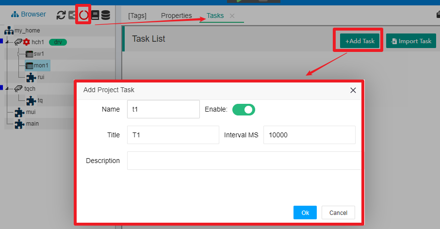
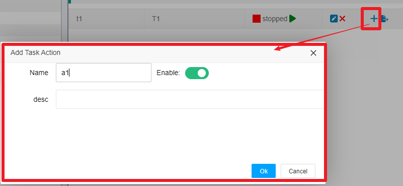
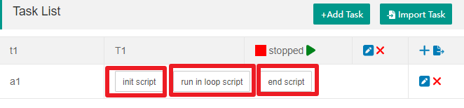

项目任务
==

在IOT-Tree中的一个项目中，除了通过Connector接入设备或数据、然后你建立了一个项目树，并且对节点下面的数据进行了组织。接下来你可能会需要项目为你做一些持续运行的工作。这些工作可能如下：

> 你需要项目后台连续运行一个逻辑，根据一部分输入的数据进行判断，然后对另外一些标签(Tag)做写入数据而输出，形成特定的控制，这个和一个PLC控制器很相似——你的IOT-Tree设备如果运行在嵌入式设备中，并且控制着一台特定的机器。

> 有一个云端网站，需要你在IOT-Tree中定时的推送规定格式的数据（如IOT-Tree作为物联网一个边缘计算设备而存在，你需要使用安全可靠的通信方式对接云端）。

一般来说，如果你需要某个项目持续的进行一些内部工作，那么就应该考虑使用IOT-Tree的任务(Task)机制来解决。

## 1 任务Task和动作Action

在IOT-Tree一个项目中，你可以定义多个任务Task，每个任务运行时会占用一个线程。

在每个任务里面，可以定义多个活动Action，这些活动Action共享所属任务的线程。

任务Task和动作Action两级管理可以你可以灵活的进行任务和动作的分配。

### 1.1 任务和活动的添加

在项目管理主界面中，点击项目树上方的任务运行状态图标，你可以看到右边选项卡新增了Tasks，里面就是本项目的任务列表管理界面。点击右上角的"+Add Task"按钮，在弹出的新增任务窗口中填写如下内容：

除了任务名称标题，你必须设置Enable，这样任务才会在项目启动时也跟着启动运行。另外，你可以设定任务的运行时间间隔（单位毫秒ms）。

点击"Ok"按钮之后，任务列表中就出现了你新增的任务。

每个任务必须至少包含一个活动Action，否则这个任务也毫无意义，在t1这个任务项右边，点击"+"这个新增Action图标，在弹出的活动Action编辑界面填写如下内容：

点击"Ok"，你就可以看到在任务t1下面出现了这个a1项。

很明显，我们新增的这个活动还没完成，因为我们还需要告诉这个Action应该如何干活。在每个Action中，具体的动作全部由JS脚本支持。但为了能够使得我们实现某个活动Action有章可循，我们也对每个活动Action做了一些JS脚本功能划分。

### 1.2 活动Action中的JS脚本划分

我们看上面新增的活动a1，如图所示：

可以看到，每个活动内部会有三个脚本划分:"init script","run in loop script","end script"。他们分别对应"初始化脚本","在循环中重复运行脚本","运行结束脚本"。

>初始化脚本init script:在任务启动时，只运行一次，你可以在里面定义初始化变量，一些后续需要的JS函数声明。

>在循环中重复运行脚本run in loop script:这个JS脚本，在任务运行期间，根据任务设定的运行时间间隔，会被重复运行。

>运行结束脚本end script:在任务正常停止时，会被运行一次的脚步，你可以对此进行善后工作。

每个活动的这三个部分JS脚本，你可以根据需要点击编辑即可，当然如果某个部分你没有设定任何脚本，那么等于不起作用。

任务活动中的脚本编写说明，请参考[JS在任务(Task)中的使用][js_in_task]

### 1.3 辅助支持

任务的导出导入支持

## 2 IOT-Tree任务JS脚本

任务活动中的脚本编写说明，请参考[JS在任务(Task)中的使用][js_in_task]

[js_in_task]:../js/js_in_task.md
