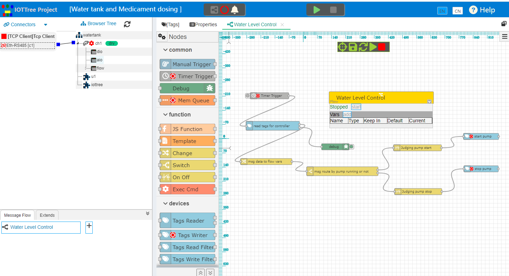
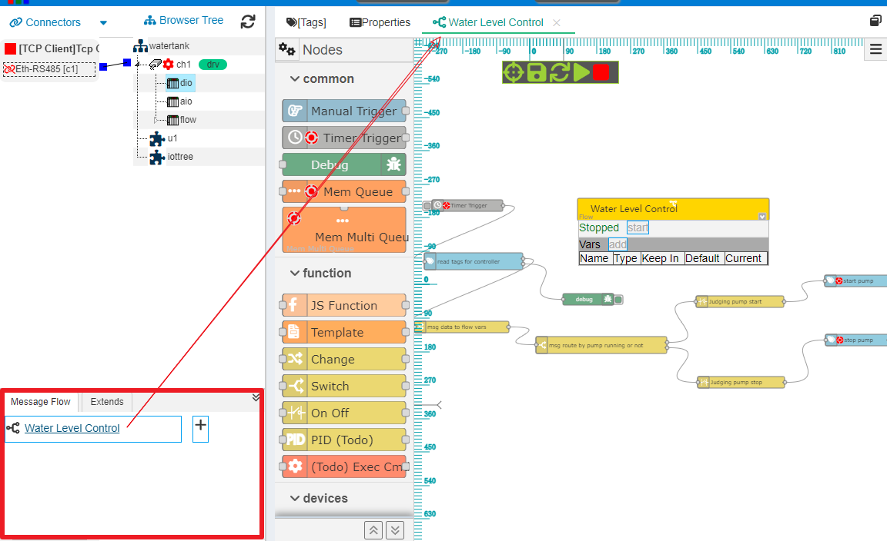
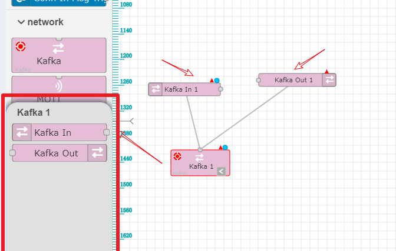
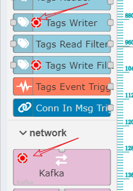
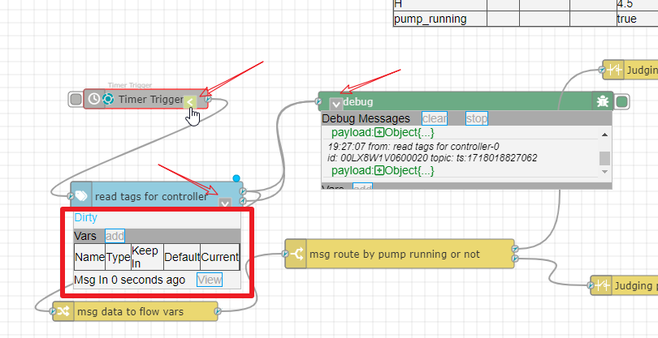

消息流/网络 Message Flow/Net
==

在IOT-Tree 1.7.0之前，IOT-Tree尝试了多种方式使用/处理树根采集到的数据。比如，报警模块、任务调入功能、存储支持以及数据路由等。这些模块分别针对一些特定的方面提供了针对性的数据处理和使用，但每个功能总是有限。可以想象，如果在后续使用过程中，IOT-Tree要能够提供更强大的树上功能，只会增加更多有限功能模块，这样会使得系统在树枝和树叶层面的应用越来越复杂。

比如，为了使IOT-Tree能够直接支持ERP、MES等系统的数据推送；或者为生产线上的工位提供承上接生产任务，启下对接现场传感器等设备，那么现有的功能模块注定无法满足需要。唯一的实现方式是通过二次开发对接IOT-Tree的实时数据，然后对现场数据实现分析处理并整合到顶层系统中。这样，IOT-Tree在里面的角色仅仅是个OPC Server或IO数据接口，相关应用的实现也会变得很复杂。

为解决以上问题，在1.7.0版本，IOT-Tree引入了重要功能：

消息流(消息网络) Message Flow/Net

## 1 整体说明

此功能能够替换前面版本实现的报警模块、任务调度功能、存储功能和数据路由所有功能。其整体思路参考了Node-Red：基于消息Message的方式，建立流程管理。里面的节点Node提供了基础功能，你可以根据需要组合这些节点，建立各种消息处理流程/网络，达到顶层各种业务需要。

消息流程以消息为基础，在流程/网络节点中进行传递和处理。这与传统的工作流不同，传统的工作流节点代表了处理过程或工作项，路径可以有上下文数据运行条件，可以自主决定流程走向。同时，这与PLC的梯形图也不同，PLC梯形图路径代表了信号线，节点的粒度可以非常小，基本就是为实现控制逻辑而存在。

虽然消息流/网络参考了Node-Red，但与之也不相同。Node-Red基于Node.js提供了各种基础节点，基本思路是基于消息节点替代消息处理代码编程。相关节点功能粒度也很细，但整体流程网络运行又偏向屏蔽复杂的底层。这造成了一点的矛盾——如果要实现简单功能问题不大，但如果要实现复杂的业务路径，可能会造成网络很庞大，失去了直观性（有可能还不如直接写代码，这是我个人观点，如果我理解不对请对我指出批评）。

综合各种流程的利弊，IOT-Tree基于消息的流程提供如下策略：

1) 充分利用消息流程的直观性，简化开发。

2) 避免流程太庞大，尽可能提供中粒度节点：节点功能尽可能独立但不划分太细

3) 支持现场控制，提供异步运行节点，并能够支持流程中直观观察运行状态，其中的Debug节点可以独立展示接收到的消息列表。

4) 支持上下文数据直观展示，使得用户可以对流程运行有着更好的把控

5) 支持标准的java webapp开发方式提供业务节点插件，使得系统能够无限扩展，并且能够应付各种千变万化的需要。

至此，IOT-Tree从架构上可以认为是两个功能：一个是树根功能接入各种设备传感器，并形成统一规整的数据；一个就是树上消息流程/网络，可以为各种复杂的业务功能提供强大高效率的支持，同时保持模块之间轻耦合。

## 2 消息流/网络组成

### 2.1 项目、流程、节点三个层次

IOT-Tree中的消息流依附于项目，一个项目可以定义多个消息流对象，每个流程可以有多个节点，通过连接建立消息走向逻辑。

因此，对于运行时上下文来说，相关变量使用范围如下：

1. 流程中变量，可以被所有节点使用

2. 节点中变量，可以被节点内部的处理过程使用

而消息对象，可以认为是动态产生的内存，每个触发的消息通过流程不同节点运行之后，就会消失。

### 2.2 流程Flow

基于项目建立的流程，自然就可以直接使用项目中定义的数据。同时，流程的启动和停止也受控于项目的启动和停止。

流程中，可以任意放置不同类型的节点。你可以放置多个能够触发消息的起始节点，多个中间处理节点和结束节点。一些中间节点也可以当作结束节点而使用。

因此，某种意义上来说，你可以在一个流程中，完成一个项目所有的运行需要。

在IOT-Tree的项目管理主界面中，流程列表管理在左下角，你可以在里面增加、删除和修改流程的基本信息。点击某个流程标题，在右边主内容区就会出现对应的消息流编辑UI界面。

#### 2.2.1 流程编辑区的基本操作

消息流编辑区，展示的流程采用无极缩放方式，你可以使用鼠标滚轮进行画面的放大和缩小。

使用鼠标右键，对画面进行移动漫游。

使用鼠标左键，进行节点、路径的选择、移动和修改操作。

节点或路径被选中之后，点击"Del"按键，就可以删除相关节点。

当某个节点被移动时，节点右上角会出现修改小圆圈，代表了此节点位置等基本信息被改变，此时需要点击上面的保存按钮，才能同步到服务端。

### 2.3 节点和路径

流程主要以节点组成，节点间可以灵活的建立关联路径。当前，路径只是代表了节点间的消息传递通路，而没有其他任何功能意义。因此，流程相关的节点能力就成为了关键。

#### 2.3.1 节点总体说明和基本操作

IOT-Tree消息流的节点，表示为一个矩形块，左右两边分别对应输入和输出。其中，每个节点最多只能有1个输入，而输出可以根据节点需要不限制数量。

1. 新增节点

在消息流编辑UI中，所有节点在左边列表中展示，你可以通过鼠标点击拖拽到内容区进行节点的添加。

2. 修改节点参数

添加之后的节点，要设置参数，使用鼠标双击就可以打开节点参数编辑对话框。

3. 建立节点之间的路径

在节点左右两边输入输出连接点，鼠标左键点击之后不松开，移动时就会有连接线出现，当鼠标移动到另一个节点（或节点两边的连接点）上方松开左键，如果条件允许，则会建立一个路径

4. 删除节点

选择节点之后，按"Del"键就可以删除对应的节点

#### 2.3.2 模块

模块是一种特殊的节点，本身没有输入输出连接点，上下有个关联点，它代表了一种功能模块集合，并且可以携带自身的配套节点。

比如，支持Kafka通信的模块，可以代表一个Kafka客户端链接。点击此模块，在左边的节点列表会弹出模块对应的配套节点列表。可以同样用拖拽的方式新建配套节点，这些节点都会有个关联线条到模块节点。新建的配套节点都会共享模块里面的资源。

我们可以用同样的方式双击模块或配套节点，打开参数编辑对话框进行设置。

#### 2.3.2 异步运行节点

IOT-Tree对消息流的时间控制也比较明确。一般情况下，节点之间的消息传递本质是函数调用——也即是说，消息传递过程中，前面节点的运行会受到后面节点运行时间影响。如果某个节点处理时间比较长，就会造成前面节点的消息接收处理，这对于时间要求较高的场合是不可忍受的。

因此，节点实现时，可以有自己的内部处理线程：也即是异步处理方式。消息传递进来时马上就接收返回，然后使用内部的异步线程进行具体的处理过程。异步节点都会有个运行状态图标，如下图：

#### 2.3.4 节点运行时状态信息

IOT-Tree对消息流的运行调试观察提供了强有力的支持，每个节点都可以在选中之后，出现一个运行状态显示/隐藏按钮，点击此按钮就可以在节点下方显示或隐藏状态信息。特别对于"Debug"节点，则能够列举出所有接收到的消息。如图：

#### 2.3.5 基础节点

1. <a href="n__com.manual.md">手动触发器</a>

手动触发消息，此节点一般用来测试

2. <a href="n__com.timer.md">定时触发器</a>

此节点内部有个定时器，可以根据一定的策略（如时间间隔）触发新的消息

3. <a href="n__com.debug.md">调试</a>

支持打印接收消息的列表，可以用来跟踪调试消息流特定节点的输出消息数据

4. <a href="n__com.mem_que.md">内存队列</a>

节点内部有一个队列和队列监听线程，这样可以使输入消息能够快速被接收,避免一些后续节点阻塞前面节点的消息处理。

#### 2.3.6 功能节点

1. <a href="n__func.js_func.md">JS函数</a>

此节点内部支持服务端JS代码的运行，你可以非常灵活地实现对输入消息的处理和输出消息的控制。

2. <a href="n__func.template.md">模板</a>

此节点内部支持带有{{}}的模板文本，配合消息、节点变量和流程变量进行组合，输出特定格式的消息负载数据。

3. <a href="n__func.change.md">设置修改</a>

此节点	支持上下文数据的设置或交换，如你可以把消息中的数据保存到节点或流程中的变量中

4. <a href="n__func.switch.md">路径切换</a>

当有输入消息时，根据一定的条件判断从哪个通道输出

5. <a href="n__func.onoff.md">开关</a>

对输入的消息根据一定的条件判断是否通过或不通过

#### 2.3.7 设备节点

1. <a href="n__dev.tag_reader.md">标签数据读取</a>

根据选择的标签和变量命名，读取当前运行项目中标签值，形成JSON数据输出

2. <a href="n__dev.tag_writer.md">标签数据写入</a>

根据选择的写入标签和赋值方式，对标签进行写入操作。由于标签写入可能涉及底层驱动和通信，会有一定的延迟，因此此节点还支持异步方式运行

3. <a href="n__dev.tag_filter.md">标签读取过滤器</a>

根据一定的过滤条件（项目树根和节点属性），读取设备实时数据（JSON格式的树形结构）

4. <a href="n__dev.tag_filter_w.md">标签写入过滤器</a>

节点接收特定格式的JSON数据，可以由外界决定对哪些标签进行写入操作。节点可以设定可写标签的范围

5. <a href="n__dev.tag_evt_trigger.md">标签事件触发器</a>

通过选择标签中的事件配置项，监听相关标签在运行过程中值变化产生的事件，并根据一定策略产生事件消息输出

### 2.3.8 网络节点

1. Kafka

2. MQTT

3. HTTP
