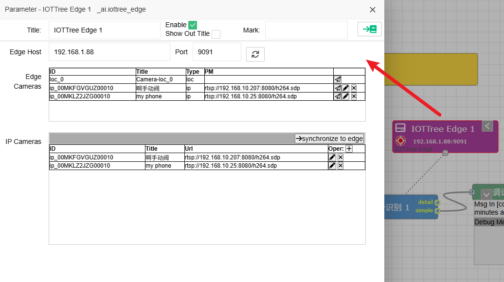

模块: IOT-Tree Edge
==

本模块以开源项目：[IOTTree AI Edge][iot-tree-edige]为配套，用来在消息流中支持Edge相关的功能。如视觉识别等。

内部可以配置IOT-Tree AI Edge可以支持的摄像头，包含Edge运行环境本地摄像头和IP摄像头。

[iot-tree-edige]: https://github.com/bambooww/iottree-ai-edge
