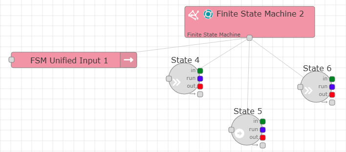
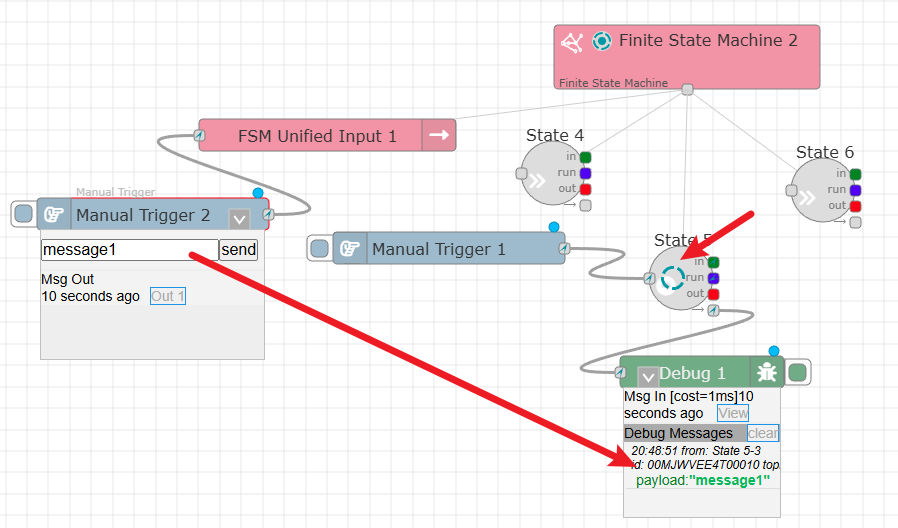

模块: 有限状态机(FSM)
==

IOT-Tree消息流中的有限状态机与程序中的状态机实现有所不同，使用时要充分理解她的运行机制。

每个状态机由一个主模块代表，可以关联多个状态子节点。主模块内部有个运行线程，被所有的子状态节点共享。

其中，FSM统一输入节点可以使得状态机成为一个消息转发切换器。

## 1 状态节点说明

一个状态机模块对应的所有状态，同一时刻最多只能有一个状态节点激活。

每个状态是个圆形，有一个输入端子和4个输出端子。其中，输入端子只要有消息输入，就会使状态机进入此状态——此时此状态会有个圆形标记。

状态节点有4个输出端子，分别对应in run out 和当前状态消息转发，他们分别在如下情况会触发消息输出。

**in** 端子

运行中，状态进入时，此端子会触发消息输出——流程可以通过此端子处理进入此状态时的一些处理（如初始化一些变量等）。

**out** 端子

状态退出时（状态转移到其他状态节点），此端子会触发消息输出——流程可以通过此端子处理退出此状态时的一些处理。

**run** 端子

当状态节点处于激活状态时，此端子会定时触发消息。这个时间间隔由状态内部定义的时间间隔参数决定。

**⟶** 端子

此端子配合FSM统一输入节点的输入，用来转发输入的消息。

## 2 消息转发功能

当有消息输入到FSM统一输入节点时，当前状态机的激活状态节点的⟶端子会输出此消息。因此，状态机内部自带消息切换功能。

