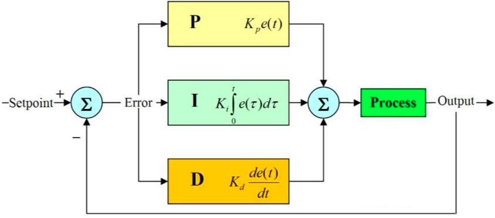
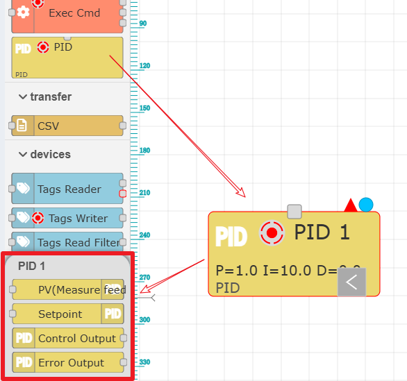
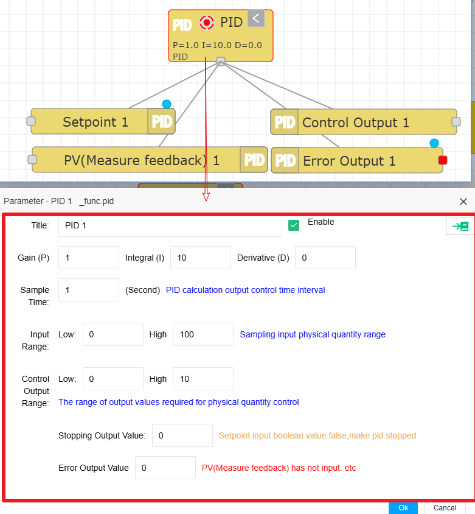
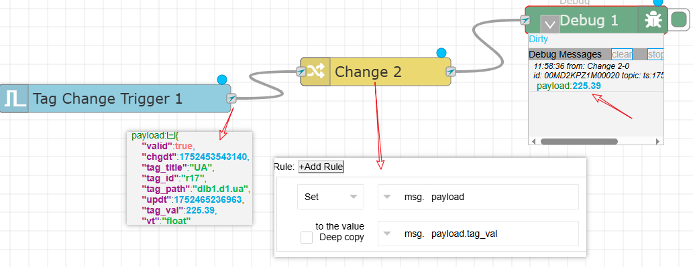
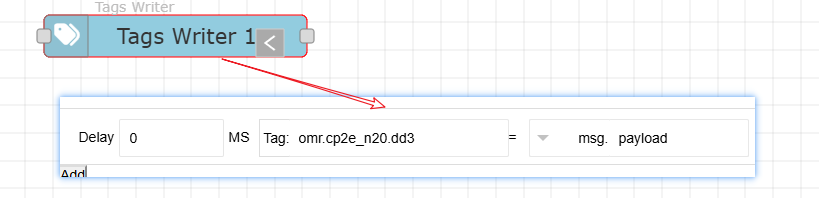
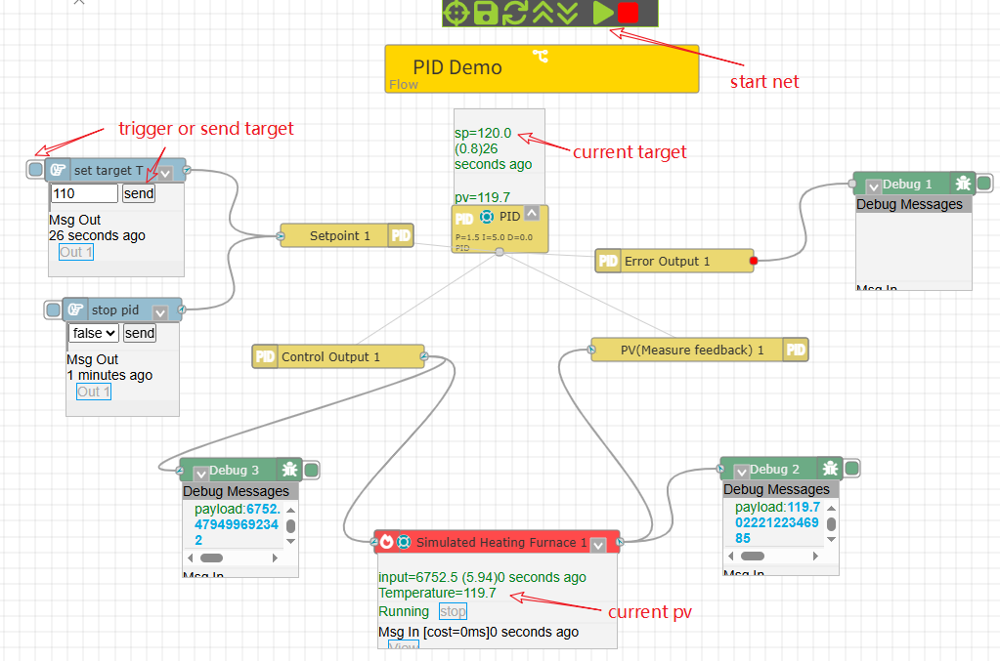

模块: PID控制器
==

PID控制的核心思想是利用系统当前状态与期望目标状态（设定值）之间的偏差，通过比例（P）、积分（I）、微分（D） 三种作用的线性组合来计算出控制量，驱动系统输出向设定值靠近，并尽可能减小超调、缩短调节时间、消除稳态误差。

P - 比例： 控制输出与当前偏差成比例。偏差越大，控制作用越强。

I - 积分： 控制输出与偏差随时间的累积成比例。用于消除系统的稳态误差。

D - 微分： 控制输出与偏差变化的速率（趋势） 成比例。具有预见性，能抑制超调，提高系统稳定性。

三种控制作用如下：

1 比例控制：产生与偏差大小成比例的控制作用。

偏差越大，控制力越强，能快速减小偏差。单独使用比例控制通常无法完全消除稳态误差（系统最终稳定值不等于设定值）。Kp 越大，响应越快，稳态误差越小，但也可能导致系统振荡加剧甚至不稳定。存在稳态误差缺点。

2 积分控制：产生与偏差随时间的累积量成比例的控制作用。它关注的是“历史”偏差的总和。

只要存在偏差（即使很小），积分作用就会持续增加控制量，最终能够完全消除稳态误差。Ki 越大（或 Ti 越小），积分作用越强，消除稳态误差越快。但过强的积分作用会显著增加超调量，使系统振荡加剧，响应变慢，甚至导致不稳定。缺点： 可能引起超调、振荡，响应变慢。

3 微分控制：产生与偏差变化率成比例的控制作用。它关注的是偏差变化的“趋势”（是变大还是变小，变化有多快）。

当偏差开始减小时（如系统响应接近设定值时），微分作用产生一个反向的控制力，起到“刹车” 的作用，有效抑制超调，减小振荡，提高系统的稳定性。当偏差开始增大时，微分作用产生一个正向的控制力，试图提前阻止偏差的增大。

## 1 IOT-Tree中的PID控制模块

实际的PID控制中，PID至少需要两个输入和一个输出。输入给定值（控制目标，如温度120度）和实际被控物理量采集反馈值（如当前实际测试温度93度）；而输出是PID对温度调节执行器的控制输出值（如加热器的功率）。同时，还需要考虑实际设备运行过程中，总是会出现异常情况，如现场温度传感器故障没有及时反馈当前实际温度，此时PID模块也需要考虑这种情况，并提供相关的输出以方便这种特殊情况的需要。

在消息流编辑界面中，在功能区找到PID模块，拖拽添加模块，点击选择此PID节点，可以看到左边的子节点菜单如下：

左边列表四个节点：PV(Measure feedback),Setpoint,Control Output和Error Output分别对应以上的两个输出和两个输出。我们把这几个模块内部节点都添加到编辑区。然后双击主PID模块节点，弹出PID参数设置界面，如下：

## 2 PID模块参数说明

**增益Gain (P),积分Integral (I)，微分 (D):**

分别对应PID的三个主要参数。此参数在不同的控制场合需要根据实际情况调节使用，本文就不深入说明了。

**采样时间(Sample Time):**

这是以秒为单位的PID计算并输出控制的时间间隔。此间隔非常重要，对于一些需要快速调节的场合此时间间隔就必须短，这样才能及时根据反馈快速调整，而另一些场合由于输出控制之后，从执行到反馈时间会比较长，此时采样时间设置太短也是不合理的。

<b style="color:red">注意：IOT-Tree运行在操作系统中，由于操作系统时间片调度特点，如果你需要控制的时间间隔要严格控制在几十毫秒以下，请不要使用IOT-Tree中的PID控制功能。这种场合你最好使用PLC等实时时间更精准的设备来实现。</b>

**输入范围，上下限：**

这是实际被控物理量的采样值的范围，大部分传感器在输出都会有一个信号范围，如电压信号的0-10V，电流信号的4-20mA等。通过AD模块转换之后，也会对应一个数值范围，如0-10或4000-20000等。这个输入范围需要根据你的采样反馈传感器的具体特点来配置。当然如果你采样直接获取了最终的温度值，那么也是可以的。

**控制输出，上下限:**

在控制执行机构中，也可能通过模拟或数字信号进行输出调节。如可控硅可以根据输入的4-20mA信号，调整电流大小，进而可以控制加热棒的输出功率。而DA模块对于输出4-20mA信号从协议上需要的数字范围可能是4000-20000。或者直接的电压信号0-10等。这个也需要你根据实际情况进行处理。

**停止时输出值**

在控制输出的基础上，如果出现的PID停止控制（通过给定输入节点），那么控制输出就会自动输出一个控制值，以确保安全。

**异常时输出值**

如果PID控制在运行中，出现异常如反馈信号没有及时更新等。则会自动输出一个控制值，以确保安全。

## 3 给定值输入节点(Setpoint)

给定值输入节点支持外界在输入消息的payload中直接放置满足上面输入范围的物理量值（控制目标）。设定之后PID模块才能根据此目标值进入循环控制状态。当然，外界可以根据需要不断的输入改变此控制目标。

如果要控制PID停止工作，可以在payload直接设置bool值=false。那么PID模块会进入停止状态（同时会在控制输出中输出设定好的值）。

## 4 测量值输入节点(PV)

由外界传感器采集获取的值进行输入，与给定值输入节点使用统一的范围。此输入要求低于PID设定的采样时间，也即是允许高频度往里面输入数值。

注意：如果此节点输入停止时间超过3个采样周期，PID会进入异常状态，不仅异常输出节点会有输出，同时控制也会自动输出一个设定好的值

## 5 控制输出节点(Control Output)

此节点的输出应该对接外部执行器的控制输入，如写入标签值等操作。

## 6 异常输出节点(Error Output)

此节点在PID出现异常时有输出，你可以通过处理此输出消息产生报警，提醒控制出现异常，需要及时人工介入处理。

## 实际项目使用建议

**如何使用标签Tag作为输入反馈**

IOT-Tree以标签Tag组织为基础，代表了各种接入设备和数据，很明显我们输入反馈基本上需要使用某个标签值的变化作为输入，此时你需要使用"Tag Change Trigger"节点设置需要监听的标签。然后使用"Change"节点，对标签JSON对象输出里面的tag_val属性进行提取。如下图：

通过此方式的反馈数据获取和处理，最终输出可以直接输入到PID对应的PV节点中。

**如何使用标签Tag作为输出**

同理，如果我们要输出控制指令，如对DA模块写入属于的电流信号值，那么很可能是通过对应标签做数据写入（最终可能会促使Modbus驱动做设备写入指令）。因此对于控制输出，需要接入"Tags Writer"标签，并且对标签设置如下规则：

<b style="color:red">注意：由于标签的写入最终会通过设备驱动和通信进行，需要考虑可能会失败情况，而Tags Writer使用异步方式写入时，本身无法知道指令最终是否真正下达。在此建议通过设备读取写入点的数据更新变化进行判断。

1，判断一定时间之内此写入点数据是否有效且是否有更新，如果没有时间更新说明此点本身应该是无效的，因此不能参与PID的控制，此时应该直接产生报警输出。
2，写入指令之后，判断写入点值是否变化，如果没有变化着也产生报警输出。
</b>

## 7 更多参考

### demo

你可以在IOT-Tree自带的Demo程序中，导入PID Demo这个项目进行查看。这个项目使用模拟加热炉进行配合，完整演示了整个PID控制过程。

