使用消息流程实现控制逻辑
==


在1.7.0版本之前，接入设备规整数据标签之后，如果要实现控制，只能使用任务调度功能，通过定义定时运行的JS服务端代码，读取标签实时数据，然后输出控制指令。

当你看到这篇文章，那么你再也不需要使用任务调度的方式实现控制逻辑了。当然，任务调度功能也会一直保留。


### 1 使用消息流实现控制的优势


1\. 更加直观展示

通过节点和路径建立的流程，天然就比纯代码直观明了，也更不容易出差错，实现效率也就更高。

2\. 流程节点能够天然的代表状态

控制的本质是通过不断的获取现场传感器控制器中的实时数据，然后根据控制逻辑计算实现一些结果，并输出到现场控制器或执行器中的过程。这里面的控制都可以看成是在当前某种状态下，需要哪些控制逻辑，并且随着状态的变化而切换。这就是一个控制状态机。

而消息流由节点和路径组成，节点本身就可以代表了一种状态。因此，实现控制会更清晰。

3\. 调试或运行中可以随时监控流程运行状态

IOT-Tree的消息流每个节点都可以有自己的运行状态监视，可以随时进行对流程的每个环节进行监视。而直接使用代码实现的控制逻辑，在运行时除了可能日志输出之外，基本就是一个黑盒。

4\. 限定带来更好的实现

消息流对控制的实现有一定的限定，不可能像代码一样随心所欲。但这反而能够带来更大的好处。一些特殊节点的充分能够使得控制实现更轻松（如使用消息队列节点），并且还能够在实现模式上让大多数技术水平各异使用人员达到同样的可靠效果。


### 2 控制流程的实现


我们使用系统自带的演示项目（Water tank and Medicament dosing）来做个控制逻辑的实现过程。这个演示项目之前已经使用任务调度和JS实现了水位和水泵运行状态的控制。具体请参考:


　　　　<a href="../case/case_auto.md" target="main">&nbsp;&nbsp;&nbsp;工业现场自动化系统</a>

现在使用消息流来实现同样的控制过程。

#### 2.1 控制实现思路


这个水位控制非常简单，我们只需要读取当前水位值(water_lvl)、最高水位限定(H)、最低水位限定(L)和水泵运行状态(pump_running)这四个参数。

然后，以水泵运行状态作为状态机，进行控制实现：

1\. 状态1：水泵停止——判断水位是否低于L，如果满足条件，则输出启动水泵指令。

2\. 状态2：水泵运行——判断水位是否高于H，如果满足条件，则输出停止水泵指令。


#### 2.2 具体实现过程


请参考其他文档导入演示项目（Water tank and Medicament dosing）和配套的模拟器，确保能够正常运行。然后进入项目管理主界面，点击上方任务图标，把里面自带的任务调度设置"Enable"参数勾选去掉，使得任务不会被运行。如下图：


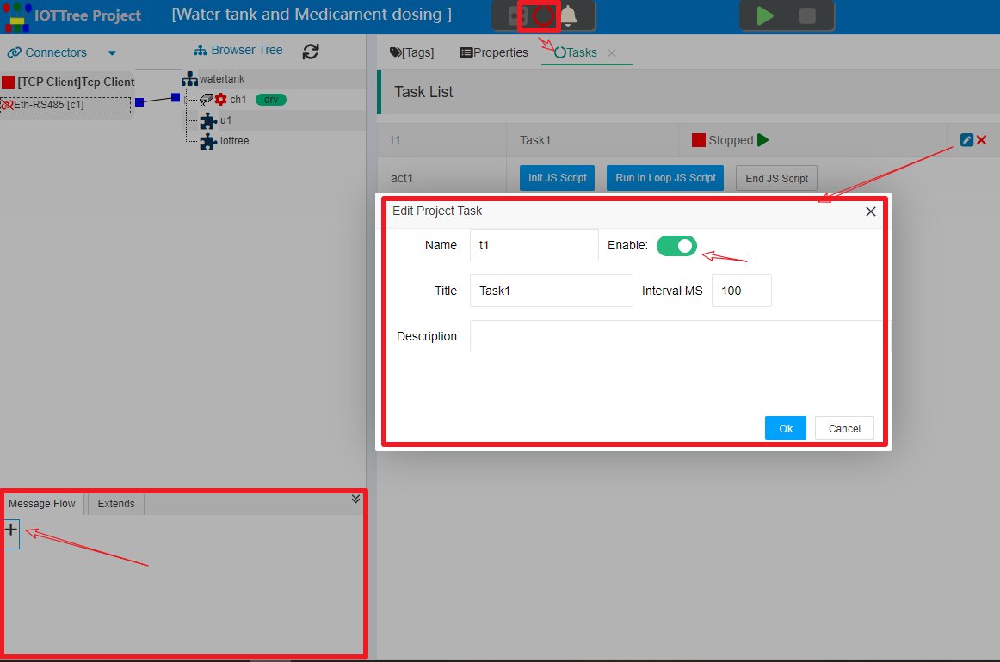

#### 2.2.1 项目中新建消息流


参考上图左下角，是项目的消息流管理区，点击"+"按钮添加新的消息流，在弹出对话框，填写如下内容:


```
Name:lvl_ctrl
Title:Water Level Ctrl
```

确定之后，左下角区域就出现了这个消息流。点击标题，主内容区就会展示出此消息流的详细内容：


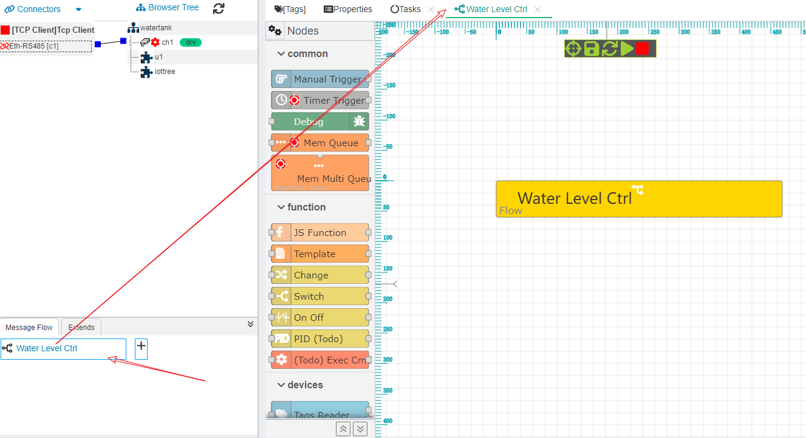

流程中，会有个主流程节点显示其中，我们后续的节点添加，可以围绕此节点进行。

#### 2.2.2 获取标签数据

##### 2.2.2.1 手工获取标签数据


按照前面的状态机控制思路，我们首先要获取项目中已经定义好的标签数据。在左边节点列表中，"devices"分类下，鼠标左键点击"Tags Reader"这个节点，拖拽到"Water Level Ctrl"下方释放，这就完成了节点的添加。


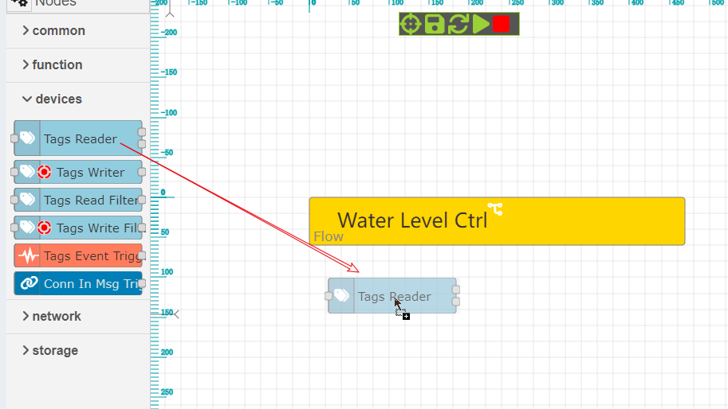


接着我们双击打开此节点参数设置对话框，点击里面的"+Add"按钮添加多个读取标签项，并且在每个读取项中选择标签，并填写对应的变量名称。他们分别对应四个变量，当前水位值(water_lvl)、最高水位限定(H)、最低水位限定(L)和水泵运行状态(pump_running)。如下：


确定之后，此节点就完成了参数设置，里面的四个变量名称，会被用作输出消息的payload JSON对象中的成员存在。此时，我们需要查看这节点输出数据是否满足我们的要求，但这个节点不能自己触发，需要在输入端有消息进来才能触发。

那就增加一个手工触发节点进行测试吧！

在左边节点列表分类common中，选择"Manual Trigger"节点，用同样方法加入。然后点击此节点右边连接点，拉出连接线到"Tag Reader 1"，释放之后就建立了路径。"Tag Reader 1"节点不要求输入消息格式，只需要有消息进来就能运行获取配置好的标签数据。


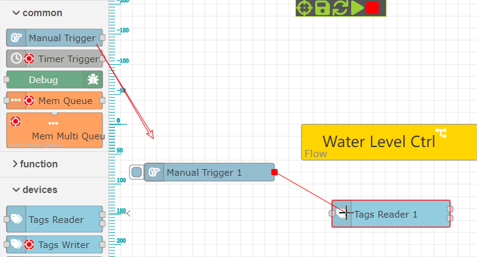


此时，点击"Manual Trigger 1"左边的触发按钮，就可以触发消息，通过路径使"Tags Reader 1"工作。为了查看"Tags Reader 1"的输出，选择此节点，点击显示/隐藏运行状态图标，可以看到此节点"Out 2"有输出。


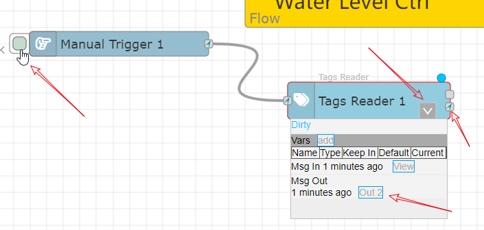


这个输出点说明节点读取的数据是无效的，payload内容是无效的标签数组，你可以点击"Out 2"这个按钮进行查看。那为什么会无效呢——这是因为项目没有启动，所有的标签都是无效的（如果你已经启动了项目则是另一种结果）。启动项目，确保所有的标签都获取有效数据。再次手工触发，可以看到"Out 1"也出现了，点击之后能够在弹出对话框中，看到输出的消息，如下图：


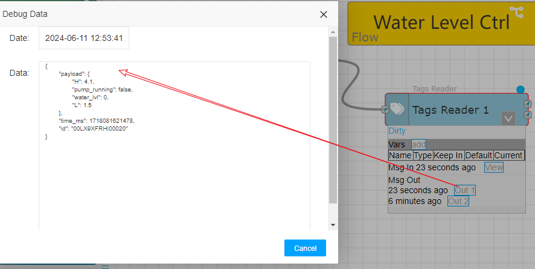

可以看到输出第一个通道输出消息中的payload内容是,这就是我们想要的数据:

```
{
    "H": 4.1,
    "pump_running": false,
    "water_lvl": 0,
    "L": 1.5
}
```

##### 2.2.2.2 定时获取


现在可以确定"Tags Reader 1"这个标签已经能够正常运行，我们添加一个定时触发器,用来驱动这个标签定时读取数据。

在左边节点列表"common"分类下，选择"Timer Trigger",新建此节点，并与"Tag Reader 1"建立路径。双击此节点，选择Repeat=Interval  interval=100 (MS)，这代表了定时器每100毫秒触发一个消息。打开这个定时器节点运行状态，点击里面的"start"按钮，就可以启动。你会发现定时器进入运行状态，连接点上面的小箭头不断旋转，这代表了节点不断的有消息通过。


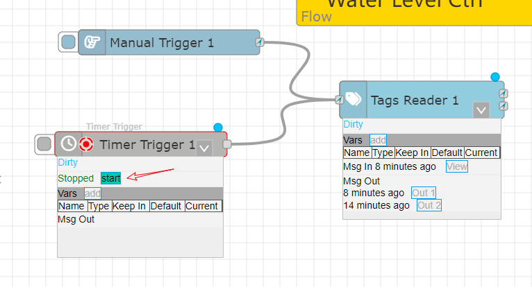


此时，我们只能在"Tag Reader 1"上查看最新的一个消息，如果想查看每个消息列表，那么就需要使用"Debug"节点了。


##### 2.2.2.3 Debug 消息


选择左边的"Debug"节点，新建节点"Debug 1"。然后，从"Tag Reader 1"的第一个输出点建立到这个Debug节点的路径。打开这个节点的运行状态，可以看到快速刷新的消息列表。这个过程你不需要停止任何节点，如图：


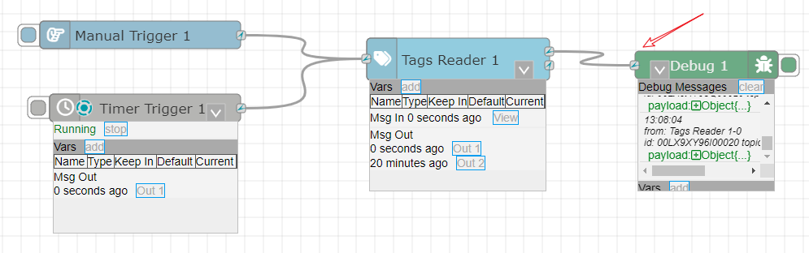


你可以放大画面方便查看消息列表，如果想查看具体消息，可以先暂停列表刷新，这样你就可以展开消息的payload内容了。

接下来，我们就要利用这个消息进行状态切换和控制了。


#### 2.2.3 设置消息数据到流程变量中


我们已经能够获取标签数据，这些数据目前只能在消息中，为了方便这些数据能够被其他节点随时使用，可以把"Tag Reader 1"的输出设置到消息流的上下文变量中。

选择左边"function"分类下的"Change"节点加入流程中，从"Tags Reader 1"的第一个输出点接入。双击打开参数对话框。选择填写信息如下：


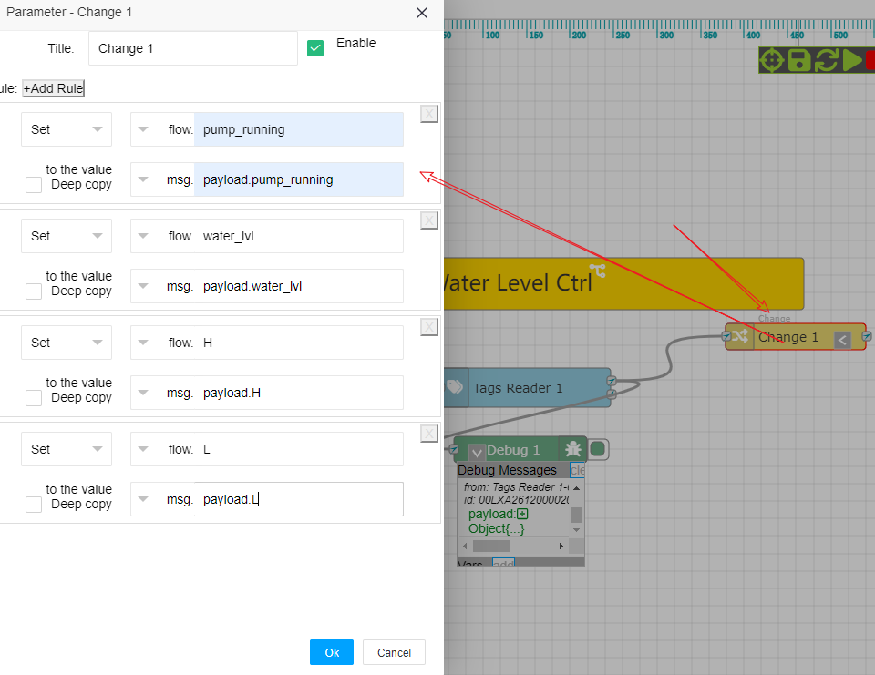


其中，里面每条规则都是从输入的msg的payload的JSON对象中，获取某个属性，并设置到flow的对应变量。确定之后，点击流程主节点，展开运行状态信息，你会发现有四个变量在里面了。


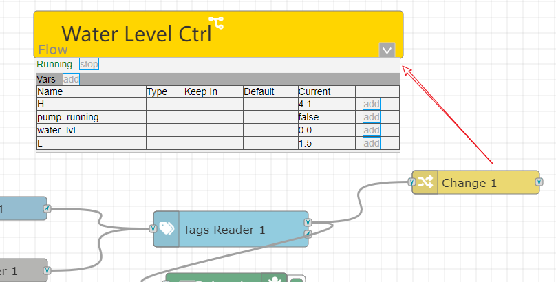


你可以看到里面的数字不会变化，这是因为水泵没有启动，水位值自然不会变化。这些变量因为在流程中，所以可以在所有的节点中使用。


#### 2.2.4 根据水泵状态切换路径


接下来我们就要实现不同状态的控制了，这个状态基于pump_running这个变量进行，因此，我们在左边function分类选择Switch添加到"Change 1"后面，双击打开编辑参数如下：


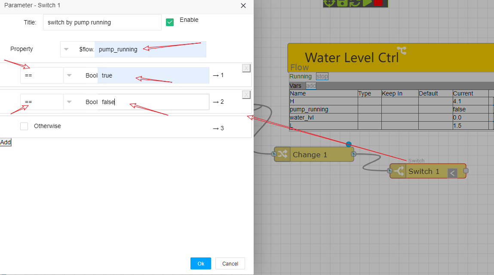


其中，我们使用flow中的变量pump_running作为判断依据，然后添加了两个输出，分别对比Bool常数true和false，他们分别对应1，2两个输出点。顺便也修改了此节点的标题为"switch by pump running"。点击"Ok"之后，你可以看到这个节点右边有两个输出点。当pump_running=true时，消息会被切换到1输出点，如果pump_running=false,则消息会被切换到2输出点。如图：


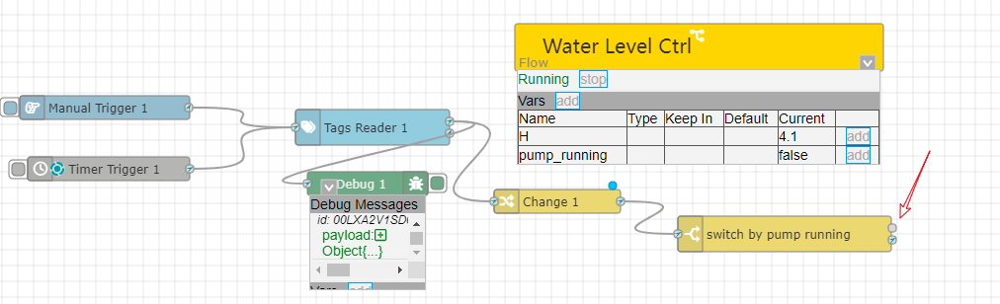

#### 2.2.5 建立两个状态开关


我们在左边"function"分类下，选择"On Off"节点，加入两个到"switch by pump running"右边，分别对接1和2输出点。这是消息开关节点，此节点可以设定内部条件来决定消息是否通过。

对于1通道输出的消息，说明此时水泵是运行状态，因此在此状态下，节点判断是否满足停泵条件，如果不满足则不让消息通过，如果满足停泵条件，则让消息通过。因此，我们设置此节点标题为"Judging pump stop(判断水泵停止)"

而对于2通道输出的消息，说明此时水泵是停止运行状态，此节点判断是否满足启动条件，如果不满足则不让消息通过，如果满足这让消息通过。我们设置此节点标题为"Judging pump start(判断水泵启动)"


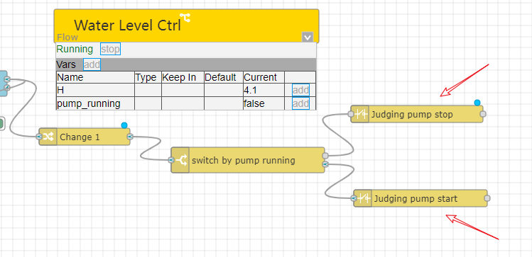


我们双击打开"Judging pump stop",根据流程中的水位变量water_lvl和高位变量H，判断是否满足停泵条件  "flow.water_lvl>=flow.H"


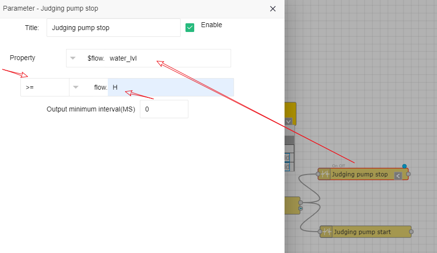


同理，双击打开"Judging pump start",设置判断是否满足启动水泵条件"flow.water_lvl<=flow.L";

此时，请仔细观察，由于水泵没有启动，消息一直流向"Judging pump start"这个代表状态的节点。

很明显，我们在这个节点右边，需要放置一个启动水泵的节点，这就涉及到标签Tag写入了。


#### 2.2.5 标签写入输出水泵启停指令


本项目中，如果需要启动水泵，就需要对标签"ch1.dio.pstart"写入true或1；停止水泵则对标签"ch1.dio.pstop"写入true或1；

在左边节点列表分类"devices"中，选择添加"Tag Writer"节点，修改标题为"start pump",接入到"Judging pump start"后方。双击之后，修改参数如下：


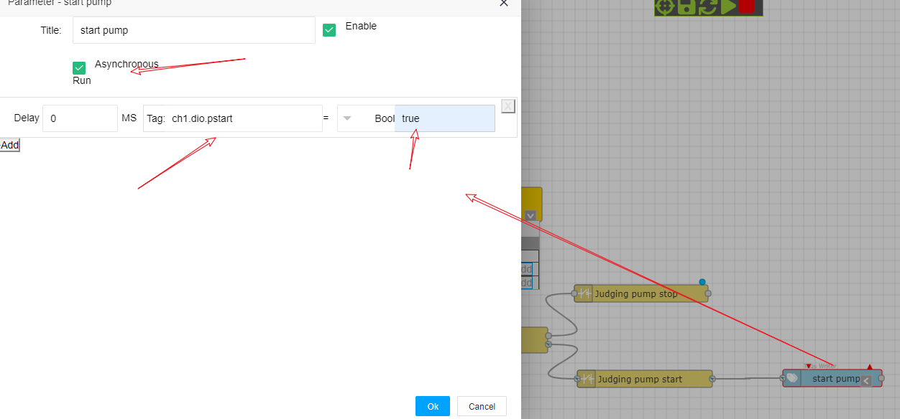


其中，选择此节点采用异步运行方式，Tag选择"ch1.dio.pstart"赋值常量true。

同理，再次添加此类型节点"stop pump",节点采用异步运行方式，Tag选择"ch1.dio.pstop"赋值常量true。结果如下：


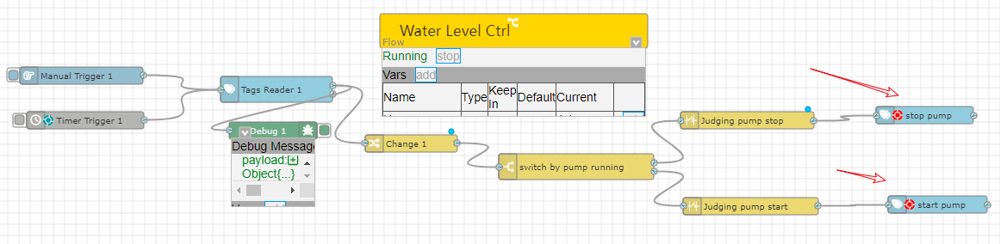

#### 2.3 运行效果


如果以上设置过程中，你最前面的定时器没有关闭，那么此时流程控制已经起作用了。你会发现水泵会控制水位在高H低L位之间变化。

<font color="red">请不要在实际项目中这么操作，相关消息流设置必须全部完成并通过测试，才能对接实际的现场设备进行测试！</font>

你也可以打开监控画面，对比你做的消息流控制。另外，你也可以新增多个Debug节点，查看里面的消息运行情况。

如果你对某个节点功能不熟悉，请在节点列表中双击这个节点，右边会弹出帮助说明。

比较使用JS代码并通过任务调度实现，很明显这个控制流程轻松愉快多了！


