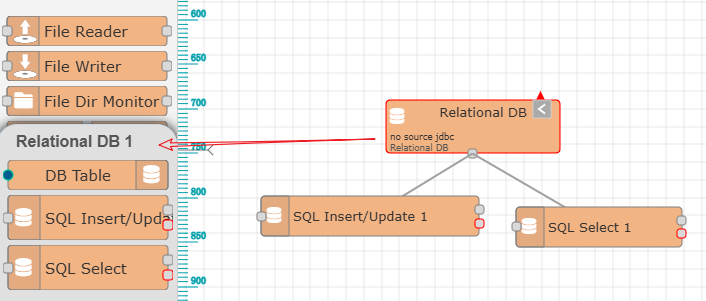

消息流程整体说明
==

前面的接入、设备、以及各种驱动和通信协议的支持，使得等各种数据统一使用树状组合和标签达到了统一，由此极大的方便了后续的利用。
你已经可以通过各种调用接口来获取数据，接入到你的顶层业务系统中。

然而，新的问题出现了，在利用上述的统一数据过程中，会发现有很多通用的需求，如数据转换、控制逻辑的实现、数据存储、数据推送，协议转换（设备模拟）等。
如果顶层业务系统在和IOT-Tree进行组合使用过程中，如果都需要重复实现这些通用功能确实也是一个麻烦事。由此，IOT-Tree值统一组织的数据上方，实现了一个重大功能——消息流程。

一个项目中可以实现多个消息流程网络，每个网络内部有多个节点和路径组成，节点由定义好的功能块组成，每个网络会随着项目的启动而运行。

你可以发现，IOT-Tree的节点实现借鉴了Node-Red的一些思想，但结合IOT-Tree本身的需求做了很多改进，能够更方便的支持你的功能实现。

## 项目消息流整体说明

每个项目可以建立多个流程。进入项目管理主界面之后，你可以看到左下角有个"Message Flow"列表框，点击"+"按钮，填写名称标题就可以完成一个流程的添加。


点击流程列表中的某个标题，就可以在项目管理主区域打开一个Tab界面，可以看到详细的流程画面。

其中，左边是当前系统支持的流程节点列表，右边是流程详细画面。新增节点时，只需要鼠标左键选中对应节点，拖拽到右边绘图区释放即可。

另外，在节点列表中双击节点，可以在右边展开此节点的详细帮助信息和参数配置字典。一些节点可能的配置参数需要重复使用，
这些参数可以存储到字典中，这样在其他地方新增节点时，可以从字典中直接选取。

## 1 消息流中节点详细说明

本质上，消息流也是一个由节点组合而成的运行程序，每个节点可以看成程序的运行逻辑节点，并且很明显节点是可以重用的。
对此，IOT-Tree对节点功能界定有如下准则：

### 1.1 节点功能遵循中粒度规模

和其他一些图形化编程节点不同，IOT-Tree建议每个节点的功能不要定义的太小，功能粒度小虽然可以达到最大的灵活性，但也会使得实现一个简单功能会组合出一个庞大的网络，
这是很得不偿失的——因为这完全可以通过JS脚本替代，同时绘制的网络节点多了，反而更不直观、更难理解和更难调试而失去意义。

### 1.2 节点类型

#### 1.2.1 普通节点

普通节点和Node-Red中的节点相似，每个节点最多只允许一个输入，但允许可以有多个输出，节点之间的路径只是代表了消息的流向。
这样最大程度的保证了流程的简洁。如下节点列表都是普通节点：


普通节点输入输出连接点在左右两侧，左边必须是输入，右边必须是输出，因此这也决定了连接两个节点的流程路径方向。

如果某个节点没有输入节点，则可以认为是起始节点。如果没有输出，可以认为是结束节点。当然，消息流没有严格的起始和结束节点定义，也没有起始和结束限制。

#### 1.2.2 模块节点

模块节点左右没有输入输出，因此无法直接参与流程的走向，但模块节点可以包含多个普通子节点。选中已经添加的模块节点，就可以看到左边会弹出模块关联的子节点列表，
添加子节点之后，可以看到模块和子节点之间会有关联的线条。如下图：



通过模块节点及包含的子节点，我们可以实现一个功能集合，能够降低单个节点实现复杂功能输入输出的繁琐关系，并提供更简洁更易理解的使用体检。

#### 1.2.3 流程节点

每个消息流建立时，自动就会有个流程节点，你可以在此节点中查看流程整体情况。

####  1.2.4 资源节点

资源节点本质也是一个普通节点，只是在此基础上可以作为一个资源的定义：如一个数据库表等。此节点可以成为一个配置信息。


### 1.3 节点基本特点

#### 1.3.1 节点外观和基本操作

你可以发现，对于普通节点，由于输入输出在左右两边，那么连接点也在左右两侧；而模块节点，由于只和自己的子节点有包含关系，关联节点在中间位置。

选中节点之后，可以看到会多出一个展开收缩按钮（灰色带方向箭头），点击可以打开节点面板或关闭面板。这个面板可以在流程运行时查看节点运行情况。
特别的，Debug节点可以展示接收到的消息列表，而手动触发节点(Manual Trigger),则支持运行时填写输出消息值并手工触发新的输出消息：


你可以鼠标拖拽节点对流程进行整体布局，当节点位置改变或调整了面板的现实或隐藏，你会发现右上角会出现蓝色小圆标记——此标记说明此节点被调整，需要进行保存。
如果不保存，那么下次打开流程画面时，会恢复到之前位置或显示状态。

**建立节点间路径**

当需要使得某个节点的输出关联到另一个节点的输入，则必须鼠标移动到输出节点对应的连接点上方，鼠标会变成十字，按下左键拖拽连接线到输入节点上方释放即可。

#### 1.3.2 节点参数配置

不同节点都有自身参数设置界面，只需要鼠标双击节点，就可以弹出设置对话框。除了每个节点都有的标题、使能等基本信息，剩下的内容都和节点功能相关而不同。

如：双击"Relational DB 1"这个关系数据库模块节点，可以看到里面非常简单，只是一个数据源的选择。而双击"Change"节点，就会发现比较复杂，
你可以在里面添加多个规则，每个规则可以改变不同的对象——消息对象、节点对象和流程对象等。


如果节点参数不完备，也就意味着节点无法运行，那么右上角就会出现红色三角形提示。

在一些节点参数配置界面右上角，会有个存入字典库的图标按钮。你可以把当前节点的配置信息保存并命名，后续使用直接从字典库里选择添加。

#### 1.3.3 可自行运行节点


如上图，你会发现一些节点有个旋转标记，并且运行时会变绿且动态旋转。这代表了此节点有个内部线程，可以按照自己的节奏自动运行。

比如对于上面的内存队列节点（Mem Queue），其内部有个内存队列，并且队列尽头有个线程不断的从队列中取出内容并输出，
这意味则此节点可以为后续的消息处理提供异步功能。节点前面的输入消息节点直接会被放入消息队列，速度快而不会阻塞。这个功能可以为一些
消息记录存储功能提供优异的性能。如产生消息速度很快，如果每个消息都马上写数据库那么就会成为一个处理瓶颈，通过这种异步方式，
使得接收消息速度几乎不受影响，并且还可以优化后续的数据存储数据（批量写入数据库性能会有明显提升）。

## 2 节点消息详细说明

IOT-Tree在消息流运行时，内部的消息传递本质是个JSON对象，可以有很大的灵活性。为了能够有更好的使用体验，做了如下约束：

每个消息主要内容都放置在payload成员中，并且其他都是消息头部，特别包含一个topic消息头（消息头也可以不需要）。
因此，大多数节点对消息的处理基本都围绕payload进行。payload可以是一个基本数据类型如int、float、bool、string等，还可以是JSON对象。

以"JS Function"这个节点作为消息处理说明最合适，此节点支持你自己编写JS代码处理输入的消息，双击已经添加的JS Function节点。如下图：


可以看到，JS代码块本质是个JS函数：

```
function on_msg_in(topic,heads,payload,node,flow){
    // add you code when msg in
 //you can use vars or functions defined in init JS 

    //return payload for out msg ,null will has no out msg. [] for idx output
    return {} ;
}
```
输入参数有topic,heads,payload分别代表了输入消息的基本内容，内部主要处理的就是payload内容，并且此函数的return返回内容，
会自动打包输出消息的payload中。（而node参数代表了自身节点，flow代表了当前流程对象。你可以通过node中的函数自己控制消息的发送，或者从flow中获取流程全局变量值。）

既然节点是个灵活的JSON对象，那么在编辑流程时，如何才能准确知道消息格式和内容？请充分利用通用节点"Debug".

你可以利用添加Debug节点，并且打开节点的面板，接收需要查看的其他节点输出即可。debug节点在自己面板会列出接收到的消息，
你还可以随时中断接收，进行详细查看某个消息的内容，以方便消息的处理。


## 3 流程上下文说明

大部分节点提供的功能只是类似一个程序函数，只需要合适的输入消息，根据自己的功能计算并输出对应的消息。
但对于一些流程运行来说，这是不够的，因为一些流程要求多个节点之间能够共用一些数据，甚至需要流程运行中保持一些中间状态，
便于下次启动时能够装载这些数据以才能满足持续运行需要。

IOT-Tree在流程节点和特点节点定义了变量列表，这些变量列表可以手动添加也可以动态添加。
这些变量列表形成了一个消息流程的数据上下文。


流程变量可以在整个流程所有的节点之间共享，而节点变量只是节点自身实例中存在。

<b>目前变量的修改只有Change和JS Function节点支持</b>

### 3.1 变量的编辑和差别

你可以直接在流程节点列表或节点列表中点击添加或修改图标，弹出编辑界面如下：


其中，处理名称、变量值类型，缺省值等基本信息之外，还有个保持类型选项：里没有内存(mem)和保存(save)两种。确实是内存类型，这种变量
值只保存在内存中，如果IOT-Tree重启等操作，就会失去之前设定的值；而保存(save)对应的变量会被定时写入到文件系统中，并且能够在
下次启动时指定装载对应的值。

<b style="color:red">请注意：对于保存类型变量，必须在整个项目启动之后才会装载，并且被设置修改了值之后才会指定保存到文件系统中！</b>

### 3.2 变量的设定和读取使用

对于支持变量列表的节点，打开节点面板之后，都可以看到这个变量列表。这也意味着此节点可以对变量进行设定、修改、保存和读取使用。因此，
如果一个流程需要使用变量，则就应该添加此类节点实现需要。

#### 3.2.1 通过Change节点设定和读取

Change通过定义一个或多个规则，可以为节点自身和流程节点设定相关的变量。我们添加一个Change，展开面板，鼠标双击打开参数编辑窗口。如下：


其中，规则1通过选择flow对象，并填写成员名称"xxx"（也即是变量名称）作为设定目标，然后写入消息msg中的payload值。而规则2是对自身这个节点
设置变量"abc"作为目标，也写入msg中的payload值。

通过一个手动触发前置节点，输入payload，就可以看到流程节点和这个Change节点自身都会自动出现这个变量。你可以点击对应变量的编辑按钮对
这个变量进行更详细的设置。如图：


上面是通过Change设置节点自身或流程节点中的变量值。同理，你也可以反过来定义一个规则，设定一个消息payload为目标，从flow中读取某个
变量值写入其中，这样输出消息就获得了flow变量值并提供给后续节点使用。

#### 3.2.2 通过JS Func节点设定和读取

添加展开JS Func节点面板，你也可以看到变量列表，鼠标双击打开参数编辑窗口。在左边JS上下文树中，展开flow和node节点，你都可以看到
里面有如下函数：

```
void setVarVal(str,Object) //设定变量值
Object getVarVal(str)   //读取变量值
```
因此，你可以在JS代码中，使用node和flow对象调用此函数，达到读取变量和写入变量值的目的。如下图：


可以看到里面的JS代码和相关功能：

```
node.setVarVal("j1",$sys.tick_ms()); //对自身节点设置j1变量的值为系统时间毫秒数
flow.setVarVal("jx1",payload);  //对流程节点设置变量jx1为消息输入的payload内容
```
可以通过前置手工触发节点，输入消息查看结果如下：


## 4 其他参考

以上就是IOT-Tree消息流整体框架和运行机制，整体还是非常简单且直观的，但同时又有着足够的灵活性。以此为基础，我们可以不断的添加
积累各种功能的节点，使得消息流能够为顶层灵活多变的业务提供最大程度的支持。

由于不同节点有着自身的技术特点，如果后续要充分使用流程强大的功能，必须对相关节点的能力有一定的了解。相关内容请参考具体的节点配套文档

你还可以参考流程实现各种功能的案例，这可以有着更直观快速的了解消息流的能力。


