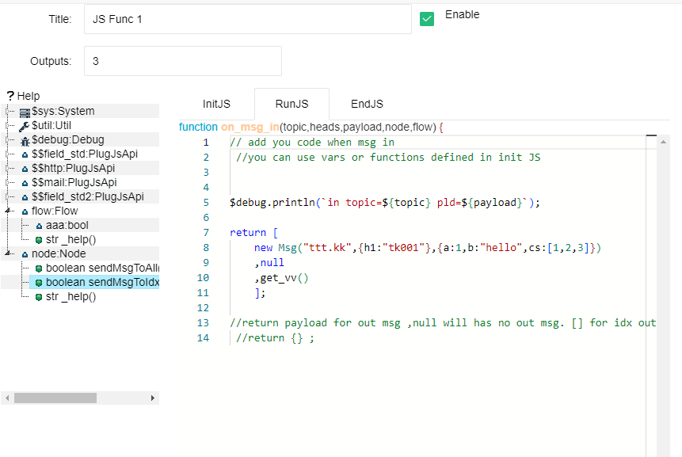

节点：JS脚本功能
==


此节点支持使用JS脚本实现对输入消息、节点变量、流程变量的处理，并控制新的消息输出。

双击节点，可以打开参数设置对话框。如下：




### Outputs

此节点可以定义1个或多个输出。输出通路通过Outputs的参数设置决定。

### InitJS


此输入框中，你可以定义节点运行中需要的JavaScript变量和函数。这些变量和函数会被其他的参数使用。

里面的JS脚本内容会在节点运行时运行一次。

<font color="red">请注意：里面定义的变量在下次启动时不会自动保存。你如果需要永久存储某些变量，请使用节点Node或流程Flow中的变量。</font>


### RunJS


此脚本本质是一个消息处理JS函数，节点接收到一个输入消息时，这个函数就会被调用,你只需要填写函数中的内容即可：


```
function on_msg_in(topic,heads,payload,node,flow) {

}
```

其中，topic、heads和payload是输入消息的主题、头和数据内容；node代表了本节点对象，你可以访问里面的变量和支持函数；flow代表了本流程对象，你可以访问里面的变量和支持函数。


**此函数的返回值代表了此节点的输出，有如下方式**

1. return null; 或者 无return语句：这个代表此节点没有消息输出

2. return obj; 此obj代表了一个基本数据或一个{}对象,则代表此节点对所有的输出通道输出相同的消息对象，这个消息对象的payload就是这个obj。

3. return \[null,obj,null\]; 返回一个数组代表了对多个通道输出的控制，数组从0位开始对应每个通道的输出消息payload。如果某一位是null，则代表此通道没有输出。


以上直接返回的内容，只会影响到通道输出消息的payload。如果你希望输出某个消息有着更详细的内容：如设定主题或heads。那么请使用内定的Msg对象。


**输出Msg对象**


Msg对象是内定的JS对象，你可以进行如下构建并返回，就可以完全控制消息整体结构：


```
let obj = new Msg(topic,heads,payload) ;
return obj;  // or return [null,new Msg(topic,heads,payload),null]
```
其中topic是字符串类型的主题，heads是普通对象{}，payload是消息负载内容。

**使用节点支持函数输出消息**


你在实现此节点时，可能会遇到这样的需求：一个输入消息被处理之后，会被分解成多个输出消息。此时，仅仅通过上面函数返回值就无法满足这个输出要求。

此时，你可以在JS脚本中，调用node对象里面的函数：


```
node.sendMsgToAll(msg)

node.sendMsgToIdx(idx,msg)
```

他们分别对应对所有通道输出，或者对指定的某个通道输出消息。其中，idx是0开始的整数，分别对应不同的输出通道。msg必须是Msg对象。

<font color="green">
你的JS代码如果调用了以上函数，那么事实上就不需要return语句了。当然，你如果写了return语句，那么最终return的内容也会起作用。</font>


### EndJS

本质也是一个函数,此函数会在流程正常停止运行时被调用一次

```
function on_end(node,flow) {

}
```
