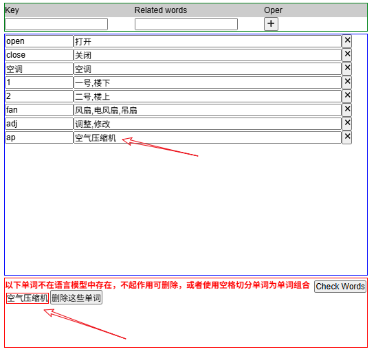
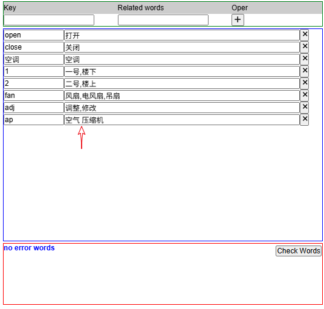

语音识别
==


支持语音流输入，并根据设置的语音库对输入的音频数据进行识别并转换为文字。

此节点可以和\[麦克风输入]节点的byte[]输出数据配合使用。


### 如何添加语言模型到系统中


IOT-Tree安装包为了控制大小，没有把语言模型打包装入其中，安装部署IOT-Tree之后，请访问<a href="https://alphacephei.com/vosk/models" target="_blank">下载地址</a>，下载你需要的语言模型。并在IOT-Tree安装目录data下面建立目录 ./vosk/models/。
解开模型目录放置到此目录下，并在此目录下建立一个文件: list.json。

例如下图里面配置了两个模型：


```
vosk-model-small-cn-0.22
vosk-model-small-en-us-0.15

```
最终目录如下:
```
─vosk/
    └─models/
        ├─vosk-model-small-cn-0.22/
        ├─vosk-model-small-en-us-0.15/
        └─list.json
```
编辑list.json如下内容:

```
{
	"models":[
		 {"n":"en_us","t":"American Engish","dir":"vosk-model-small-en-us-0.15"}
		,{"n":"cn_zh","t":"中文普通话","dir":"vosk-model-small-cn-0.22"}
	]
}
```

确保格式符合JSON格式要求，保存之后，重新启动IOT-Tree，双击此节点，就可以在参数界面中选择对应模型了。


## 限制指令参数说明


IOT-Tree使用本节点最大的目标是实现语音控制指令输出，而本节点推荐使用的是几十兆的小模型，以避免占用太多资源（对于大模型来说，最好在高性能服务器上部署，形成语音识别Server，然后通过http等方式api进行调用）。

同时，控制指令的输出根据现场控制的需要相关的语音单词肯定是有限的，如果能够限定语音识别在一个有限的单词集合内，不仅可以减少识别干扰，同时还可以提升识别成功率和识别性能。

更进一步，和动作、被控对象相关的单词很可能有多个（多种说法），用户语音输入时如何更准确的定位到特定被控对象，也需要有个对应关系。

**由此，本节点在参数设置是，增加了“限制指令”选项。通过此选项，你可以通过key来唯一区分动作和被控目标，同时针对一个key还可以设置一个或多个语音单词进行关联；并且在识别之后的输出也会把相关的唯一key也作为数据输出。这样能够更好的为后续的控制逻辑(状态机)等提供一个更准确的数据结构**

双击节点，在打开的对话框中，使能"限制指令"之后，界面如下：


其中表格上方是新增key - 关联单词(words)的区域，中间是当前已经添加的key-words列表。每个key可以有多个words，不同单词之间可以用','隔开。

下方是单词检查结果区，点击"Check Words"，可以返回当前填写的单词哪些是模型中不存在的。这是因为模型对于支持的单词是有限的，我们针对某个key定义的语言单词(Word)都必须在模型中存在。如果有不存在的单词，你只需要根据提示进行调整处理。


## 节点的输出


节点有两个输出点，第一个是普通的识别结果输出，也即是payload是简单的由识别出的单词组合而成的一个字符串。如：

```
open air conditiong
```

而第二个输出时设置了限制指令之后的结构化输出。格式如下：

```
[{"key":"k1","word":"xxxx"},{"key":"2","word":"yyy"},...]
```

整体是个JSON数组，里面每个对象都是一个单词并且对应的key。后续处理就可以基于唯一的key进行动作确定和目标定位。

## (<b style="color:red">*</b>)


<b style="color:green">由于本节点内部使用轻量级语音识别相关模型，如果一些组合单词如“空气压缩机”在模型中就可能找不到对于的单词，但如果拆开成"空气"、"压缩机"两个单词就可以都找到对应内容，并且识别时也会输出两个单词。为了更好的支持这种组合对象，本节点内部实现了一套匹配算法进行了支持</b>

以识别“空气压缩机”这个对象为例，我们设置了如下限定参数：

```
Key=ap
Related words=空气压缩机
```
点击按钮“Check Words”之后，模型返回此单词不存在。



此时，你可以在空气后面增加一个空格字符，使之变成两个词的组合，再次点击按钮“Check Words”，就可以发现可以通过了。



建立识别网络，从麦克风"打开空气压缩机"这个语音命令，可以看到如下更准确的基于Key的结果输出：


## <font color="red">重要说明</font>


语音识别很容易受周边噪声干扰，如果希望使用效果好，请使用更理想的输入设备，并且尽量避免周边影响。

请尽可能在识别网络中定义指令接收之后的状态，然后通过提示确认（问答或画面图示等方式），确保指令下达之前是准确可靠的。

在一些重要的涉及安全的控制场合，除非你能够做出指令发送前的准确反馈确认机制——能够100%确保安全可靠，那么可以使用此节点。否则建议你们不要使用此交互机制。


