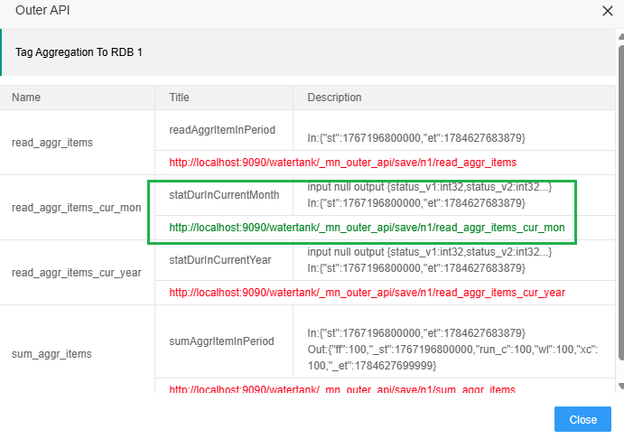

节点直接对外开放http api
==

从版本2.0.0开始，IOT-Tree的一些消息流节点可以直接对外开放RESTful Api接口，此机制极大的增强了消息流节点的功能。

例如，对于数据记录的节点InfluxDB Module，是提供系统运行过程中，对采集数据标签（Tags）进行存储记录的功能。此节点配置直接包含数据库基本信息，同时它也包含多个关联子节点，这些节点可以是数据查询和数据统计分析节点。这些节点在消息流中当然可以与其他节点配合实现需要的功能，但对于物联网系统来说，有很多前端展示或第三方系统都希望IOT-Tree能够通过RESTful Api提供相关数据。

对于上面的需求，你也可以使用RESTful Api等专门的消息流节点构建出对外api以满足需要。但仔细考虑就会发现，对外开放的api基本早就存在于InfluxDB 节点内部，因此直接开放这些节点的对外Api，可以带来极大的方便。

## 1 支持外部Api的节点

如果某个消息流节点支持对外Api，则会有API标记，如下图：

## 2 设置打开需要的对外Api

双击打开相关节点，如果此节点支持对外api，则弹出的对话框上方有如下内容：

其中，你在下拉列表中勾选需要打开的api，同时必须填写此节点唯一命名。这个唯一命名可以保证在同一个消息流中唯一，用来区分不同节点。

## 3 查看开放的对外Api访问路径

先选中节点，然后展开节点下拉框，可以在里面看到Outer Apis内容：

点击按钮“View Detail”，弹出的对话框，可以看到所有的api列表，并且里面包含已经对外开放的访问url

你可以使用一些RESTful api客户端软件或插件进行测试。很明显，这些api可以直接对前端做输出。

