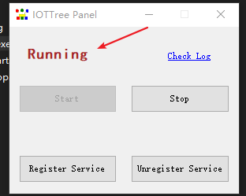
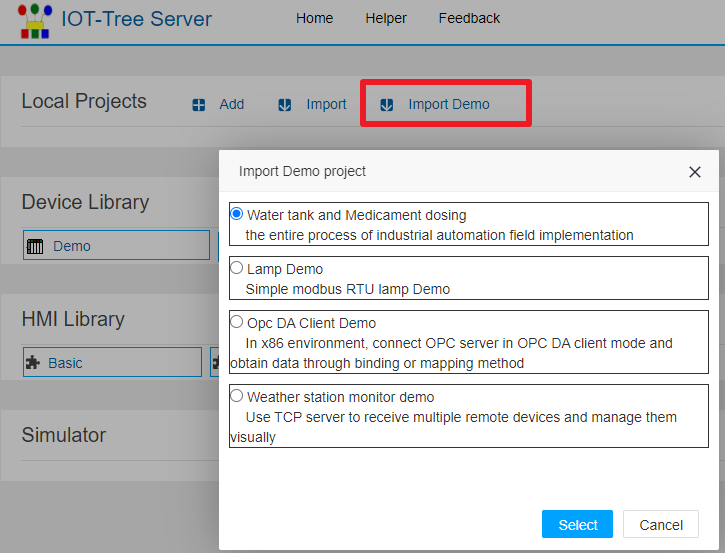
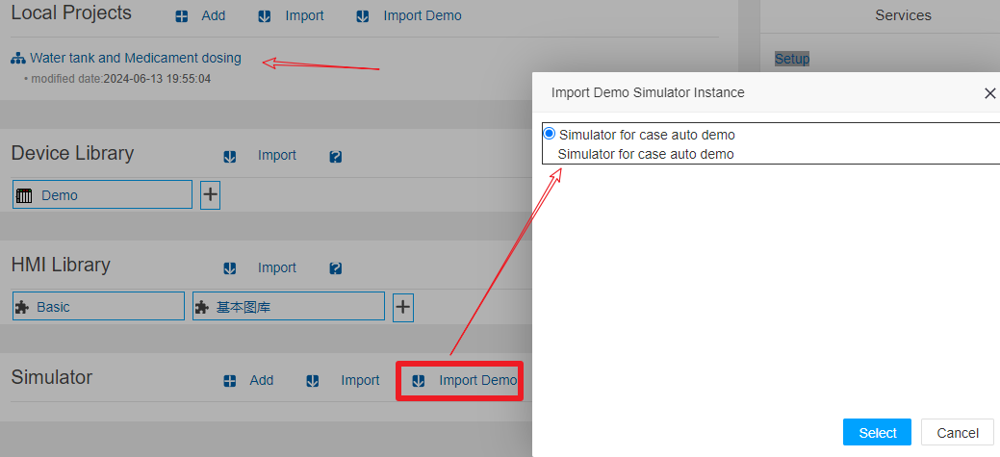

快速入门
====


# 下载解压

下载压缩包，解压到你希望的目录下面即可。

如你运行环境是windows，推荐下载"iot-tree-xx.xx.x-winjdk.zip"版本，这个版本内部自带windows x64版本的jdk，这样你可以使用最简单的方式启动。

<a href="http://121.40.64.41/iottree/" target="_blank">下载地址</a>


# 运行条件

如你运行环境是windows x64，并且下载了"iot-tree-xx.xx.x-winjdk.zip"版本，那么你已经具备了全部的运行条件。下面的运行条件也就不需要关心了。

## iot-tree-xx.xx.x.zip版本运行条件
Java运行环境版本在1.8及以上，并且确保你的运行环境针对Java的环境变量如Path JAVA_HOME已经被设置好了。

如果你还没有安装Java运行环境，请到<a href="https://www.oracle.com/java/technologies/" target="_blank">Oracle Java</a>或其他相关网站下载并根据提示安装，选择Java SE版本即可。

例如：
那么windows环境下，您的Java安装目录为 c:\jdk1.8，请设置


```
set PATH=%PATH%;c:\jdk1.8\bin
set JAVA_HOME=c:\jdk1.8
```

这两个环境变量最好在windows下"高级系统设置"-"系统属性"-"环境变量"中进行设置。设置完成之后，打开一个cmd窗口，输入以下命令进行检查。


```
echo %PATH%
echo %JAVA_HOME%
java -version
```


在Linux环境下，请设置当前用户.profile文件，（假设你java安装在/usr/java/jdk1.8.0_281）


```
export JAVA_HOME=/usr/java/jdk1.8.0_281
export PATH=$JAVA_HOME/bin:$PATH
```


# 配置

使用文本编辑器打开config.xml文件，配置里面的访问端口,默认值是9090，你可以修改成其他的端口号


# 启动

## windows X64环境下面板方式注册、启动和停止

在Windows X64环境下，IOT-Tree Server提供了一个控制面板，用来支持系统服务的注册、启动和停止等控制，极大地方便您的使用。

在安装目录中，双击文件iottree_win_panel.exe。由于程序需要管理员权限，你确定授权之后，系统会则启动了控制面板，如下图：


点击按钮"Register Service",如果注册成功，则会弹出成功提示。此时，您就可以点击"Start"按钮启动IOT-Tree Server，弹出提示成功之后，你可以看到面板上的运行状态也有变化，如下图：





您也可以点击"Stop"按钮停止服务，或者点击"Unregister Service"进行取消服务注册。


## 命令启动方式

Windows下运行 iot-tree.bat

Linux下运行 iot-tree.sh

出现启动画面，并提示成功之后，可以开始使用


```
_________ _______ _________           _________ _______  _______  _______
\__   __/(  ___  )\__   __/           \__   __/(  ____ )(  ____ \(  ____ \
   ) (   | (   ) |   ) (                 ) (   | (    )|| (    \/| (    \/
   | |   | |   | |   | |      _____      | |   | (____)|| (__    | (__
   | |   | |   | |   | |     (_____)     | |   |     __)|  __)   |  __)
   | |   | |   | |   | |                 | |   | (\ (   | (      | (
___) (___| (___) |   | |                 | |   | ) \ \__| (____/\| (____/\
\_______/(_______)   )_(                 )_(   |/   \__/(_______/(_______/   version xx.xx.xx

web port: 9090
iottree->
```

# 访问管理界面，修改管理员密码
打开浏览器，在地址栏中输入安装并启动IOT-Tree的主机地址。如下： 


```
http://localhost:9090

```

第一次管理登录需要接受软件使用许可条款，并且输入管理员密码，请牢记此密码，后续对此系统的管理员登录都需要输入此密码。

管理员登录之后，可以看到系统的管理主界面，你可以在此界面下面新增项目等相关后续工作。当然，你如果需要帮助，也可以点击上面的"Helper"打开帮助文档。


# Windows环境下，命令方式注册成服务

使用管理员打开Cmd窗口，并通过命令行到你的IOT-Tree Server安装目录，假设你的目录为 d:\iot_tree
则输入如下命令，即可把IOT-Tree Server注册成windows的服务，可以在windows启动时，自动启动。

```
cd d:\iot_tree
iot-tree-setup.bat install
```

当然，如果要取消注册的服务，只需要运行

```
iot-tree-setup.bat uninstall
```

注册成功之后，您打开windows服务管理器，可以看到如下内容：


# Linux环境下后台启动
在iot-tree按照目录下面输入如下命令，使IOT-Tree以后台方式运行：
```
./iot-tree-service-start.sh
```
启动之后，原先的控制台输出会输入到nohup.out文件中。你可以使用tail -f nohup.out进行查看。
如果要停止后台程序，运行:
```
./iot-tree-service-stop.sh
```

当然，也可以使用systemd相关机制把iot-tree-service-start.sh作为服务方式，随着系统的启动自动运行。


# 查看系统内部自带的演示项目

您如果是第一次使用IOT-Tree Server，那么可以尝试导入系统内部自带的演示项目进行最直观的感受。访问下面的登录系统管理链接。
```
http://localhost:9090/admin/
```
在Local Projects区块中，点击Import Demo。选择其中的演示项目，如下图：





选择之后，在导入项目提示中，点击Do Import,如下图：


成功之后，项目列表出现了您刚刚导入的演示项目。点击此项目，在弹出的新窗口中，展示了此项目的管理配置界面。在此，你可以看到项目的左边Connector部分，中间的Browser部分和右边的Tab主内容显示区域：





在中间Browser部分展开的树节点，选中一个UI节点，鼠标右键，在弹出的菜单中选择"Edit UI"，可以看到在右边新增一个UI编辑子窗口。如下图：


