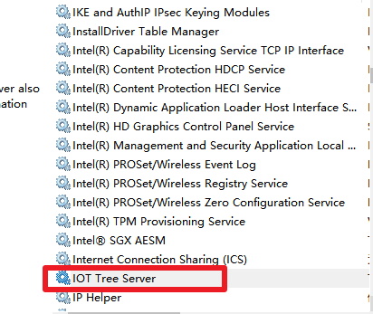

快速入门
====


# 运行条件

为了运行IOT-Tree,你需要有如下条件：

Java 运行环境版本在1.8以上，并且确保你的运行环境针对Java的环境变量如Path JAVA_HOME已经被设置好了。

例如：
那么windows环境下，您的Java安装目录为 c:\jdk1.8，请设置


```
set PATH=%PATH%;c:\jdk1.8\bin
set JAVA_HOME=c:\jdk1.8
```

在Linux环境下，请设置当前用户.profile文件，（假设你java安装在/usr/java/jdk1.8.0_281）


```
export JAVA_HOME=/usr/java/jdk1.8.0_281
export PATH=$JAVA_HOME/bin:$PATH
```

# 安装

下载压缩包，解压到你希望的目录下面即可

<a href="http://121.40.64.41/iottree/" target="_blank">下载地址</a>


# 配置

使用文本编辑器打开config.xml文件，配置里面的访问端口,默认值是9090，你可以修改成其他的端口号


# 启动

Windows下运行 iot-tree.bat

Linux下运行 iot-tree.sh

出现启动画面，并提示成功之后，可以开始使用


```
_________ _______ _________           _________ _______  _______  _______
\__   __/(  ___  )\__   __/           \__   __/(  ____ )(  ____ \(  ____ \
   ) (   | (   ) |   ) (                 ) (   | (    )|| (    \/| (    \/
   | |   | |   | |   | |      _____      | |   | (____)|| (__    | (__
   | |   | |   | |   | |     (_____)     | |   |     __)|  __)   |  __)
   | |   | |   | |   | |                 | |   | (\ (   | (      | (
___) (___| (___) |   | |                 | |   | ) \ \__| (____/\| (____/\
\_______/(_______)   )_(                 )_(   |/   \__/(_______/(_______/   version xx.xx.xx

web port: 9090
iottree->
```

# 访问管理界面，修改管理员密码
打开浏览器，在地址栏中输入安装并启动IOT-Tree的主机地址。如下： 


```
http://localhost:9090

```

第一次管理登录需要接受软件使用许可条款，并且输入管理员密码，请牢记此密码，后续对此系统的管理员登录都需要输入此密码。

管理员登录之后，可以看到系统的管理主界面，你可以在此界面下面新增项目等相关后续工作。当然，你如果需要帮助，也可以点击上面的"Helper"打开帮助文档。


# Windows环境下，注册成服务
使用管理员打开Cmd窗口，并通过命令行到你的IOT-Tree Server安装目录，假设你的目录为 d:\iot_tree
则输入如下命令，即可把IOT-Tree Server注册成windows的服务，可以在windows启动时，自动启动。

```
cd d:\iot_tree
iot-tree-setup.bat install
```

当然，如果要取消注册的服务，只需要运行

```
iot-tree-setup.bat uninstall
```

注册成功之后，您打开windows服务管理器，可以看到如下内容：





# Linux环境下后台启动
在iot-tree按照目录下面输入如下命令，使IOT-Tree以后台方式运行：
```
./iot-tree-service-start.sh
```
启动之后，原先的控制台输出会输入到nohup.out文件中。你可以使用tail -f nohup.out进行查看。
如果要停止后台程序，运行:
```
./iot-tree-service-stop.sh
```

当然，也可以使用systemd相关机制把iot-tree-service-start.sh作为服务方式，随着系统的启动自动运行。


