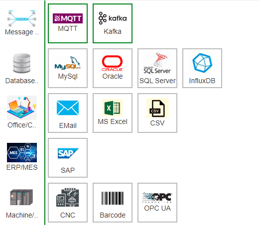

数据路由Data Router
==

在1.6版本中，IOT-Tree引入了一个新模块——数据路由。这个名称看着有点奇怪，不过我们找不到更合适的，也就将就使用了。

这个模块在规划中，是整个Server的一个重要框架内容，我们分析了IOT-Tree应用情景，发现对接云端或外界各种其他系统是一个很重要的使用方向。虽然之前版本IOT-Tree已经有了URL的RESTFul接口、外部数据源存储等支持，但我们发现还远远不够。通过细致分析，我们在整体框架中引入了这个数据路由概念。

## 1 数据路由的总体概念

IOT-Tree之前实现的功能，从树的内容上看，主要以树根为主，底层传感器、控制器好比树根的触须，通过各种驱动汇总到IOT-Tree的项目实例中。那么如何利用这些数据，就好比树根之上的树干、分支和叶子花果。我们希望IOT-Tree能够开出各种各样的果实给你带来各种好处——数据路由就是产生这些花果的框架基础。

IOT-Tree的潜在使用者会产生各种数据的后续处理，数据路由定义了一套直观的管理机制对此进行支撑。通过适配器插件的方式不断的扩展外界系统的对接数据交换支持。如下图是我们初步规划要支持的外部数据生成或交换支持：

可以看到，有了这些外部数据交换支持，IOT-Tree可以为你发挥更多的好处。
