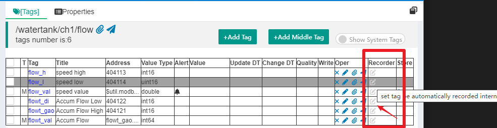
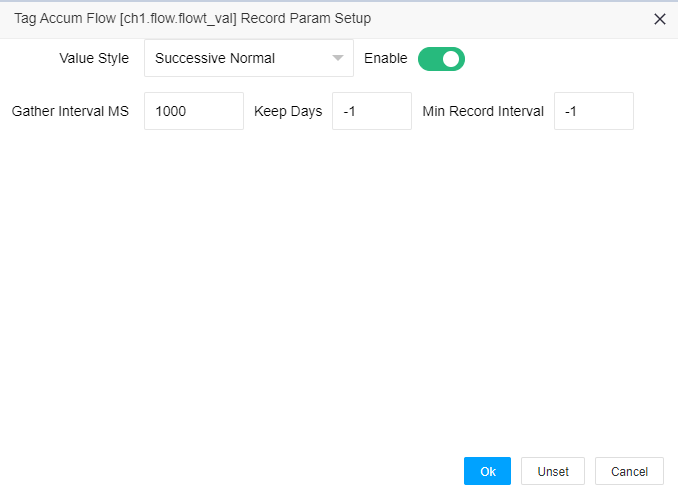
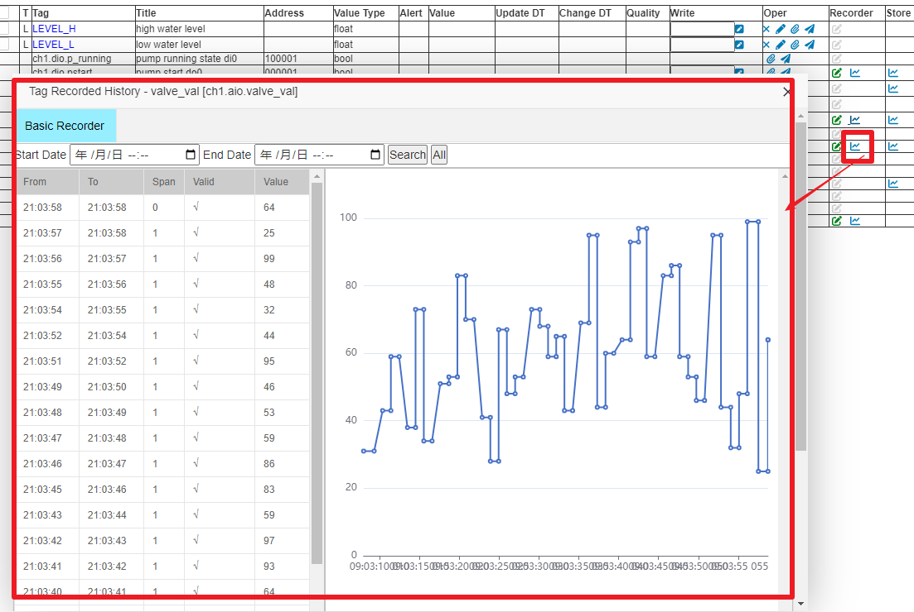

内部时序段记录器(TSSDB)
==

## 1 IOT-Tree的内部时序段记录机制

在数字化时代，我们人类对这个物理世界的感知和记录只能是使用一定的时间间隔，对被测对象的某些指标进行获取——这个就是所谓的采样频率。对于一些板级（PCB层级）的采样，大部分间隔时间都非常短，甚至可能都是纳秒级别。而我们使用IOT-Tree管理物联网现场设备，基本都是毫秒级及以上的，很多现场传感器甚至使用分钟级也是足够使用的。比如一个区域的温度变化，液体流量的累积值，大部分是秒级或分钟级都可以满足要求。不管这些记录数据时间间隔的长短，每次记录事实上都是某个特定的时间点数据。

对于物联网应用场合，在管理上位系统中，大部分数据标签采集频率都不需要太高。事实上，很多传感器自身由于为了数据的更加可靠，还可能加入滤波算法，这使得很多采集的数据变化更慢。当然，你如果把IOT-Tree应用在某种复杂机器的内部控制，可能一些指标变化是毫秒级，但大多数情况下，这样的控制标签大多数情况是不需要记录全部信息的。

### 1.1 时序段记录器Timing Segment Series Recorder

IOT-Tree在内部通过队列的方式对标签变化提供高速记录功能。并且使用了时序段记录概念——当连续多次采集的某个标签值没有变化，则只使用同一个记录。这样记录的结果是（标签Tag、值、有效性、起始时间、结束时间）这个五元组，每个五元组可以认为是一个时序段。因此，我们称之为时序段记录器(Time Segment Series Recorder)。

### 1.2 异步存储记录

IOT-Tree内部对这些记录有队列缓存，当标签Tag值告诉变化时，只更新内存中的记录段。系统通过单独的线程对这些段进行写入存储。这样可以保证数据变化记录的高效率，同时也保证了批量写入的高效率。

唯一缺点是，当系统突然断电之类的异常情况，内存中没有及时写入保存的数据会被丢失。仔细想这种情况的特殊性，在大多数情况都是可接受的——对系统来说这个时间段就采集了一段无效数据即可。

## 2 设置标签(Tag)记录参数

当你配置好一个数据标签Tag(如果你对标签Tag不了解，相关内容请参考前面的文档)。在项目启动运行之后，虽然这些标签可能会获取数据，并随着时间而变化，但缺省情况下这些变化并不会被记录。如果我们希望某这个重要的标签变化数据要被记录，就需要对此进行一些设置。

设置非常简单，在项目管理主界面中，点击内容区域的“\[Tag\]”块,你可以看到标签列表右边有个"Recorder“列：

如果这个标签的类型支持记录，则会有个设置内部记录小图标，点击此图标就可以设置记录参数，如下图：

其中，标签值风格 Value Style有如下几个选项：普通连续值(Successive Normal)，累积连续值(Successive
 Accumulation)和离散值(Discrete)。对于模拟量信号，绝大多数都是普通连续值，如温度、液位等；而累积连续值代表了仪表累积值，如累积流量值；对于离散值则可以是布尔bool和枚举值等内容。通过设定这个参数，可以使得标签数据有了更多的意义。

 (注：后续可能还会引入标签指标参数Indicator，可以设定某个标签代表的是温度、液位、速度、位置等有标准单位的指标参数)

 对于收集间隔毫秒(Gather Interval MS)这个参数，是进行时序段记录时，用来判断两次采集间隔最小值。因为，现实物理世界比我们想象的复杂，某个现场传感器可能出现异常（如断电、断网等），我们软件采集到某个值时，可以通过和上一次采集的值进行比较。如果发现时间超过这个参数的若干倍数，则可以认为中间有无效数据段。这样可以更加忠实记录现场实际情况。

 保留天数Keep Days可以对一些标签控制记录保存时常，而没必要一直存放过去已经不需要的记录（-1表示一直保留）。

 最小记录时间间隔Min Record Interval。一些指标的数据采集更新频度很高，并且每次采集值都可能有变化，但对于的指标可能并不需要这么密集的记录，为了使得这样的标签减少数据记录数，则可以设定这个参数。通过设定最小记录时间间隔，可以使得在这个时间之内数据变化都会被忽略。
 
 举个典型的流量计例子，因为可以同时获取当前流速和累积流量值，我们可能需要对流速进行告诉采集，这样用来判断速度的突变，但对累积流量来说，不需要高速记录，只需要每分钟甚至每小时记录一次即可。然而我们获取累积流量和流速的同时的，这样的累积流量更新速度也会非常高，这时就可以通过这个参数进行记录限制。另外，对于流速我们可能只需要存储100天之内的数据就行，而累积流量这个标签记录数据就需要永久保存。

## 3 查看记录数据

对于设定了记录参数的标签，右边会有个查看记录数据的小图标，点击可以打开查看历史记录信息。如图：

 
