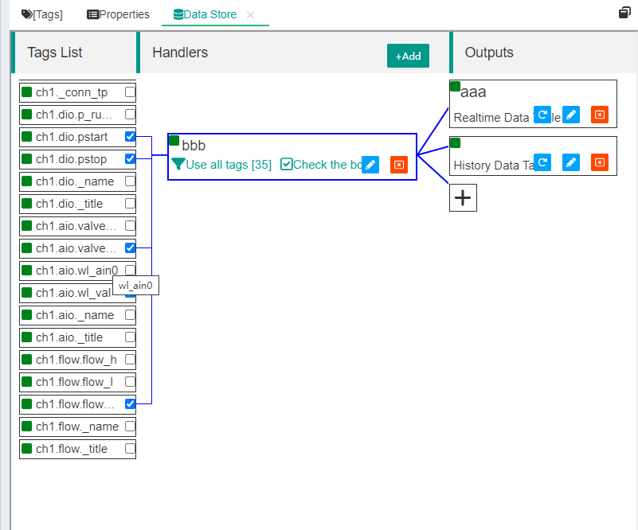

标签数据简单存储和输出
==


IOT-Tree对数据存储的支持也非常有特色。非常直观明了。可以让对数据库系统不熟悉的自动化工作人员，快速配置数据存储表，对系统内部的标签Tags数据进行存储，以满足更多要求。如：记录一下指标数据使得可以按照时间进行相关统计。

某种意义上来说，数据存储也是一种数据共享方式。当数据写入配置的数据库中，其他系统也就可以从中获取对应的数据。这对于异构系统之间的数据共享也是一种简单高效的方式。

IOT-Tree在储存支持上主要有三个内容：数据源(Data Source)、存储处理(Store Handler)和存储输出(Store Out). 下面分别进行说明


## 1 数据源 Data Source


IOT-Tree在管理主界面中，统一定义数据源，这些数据源可以被内部所有的项目使用。


### 1.1 数据源的添加/编辑


我们访问并登录IOT-Tree的管理界面，如 "http://localhost:port/admin/" 之后，可以在右边看到"Data Source"栏目。其右上角有个"+"按钮。点击之后就可以弹出数据源类型选择对话框，如下图所示:


JDBC(MySql,Sql Server)这个选项，代表了当前主流的关系型数据库的此支持。当前支持的数据库有MySql、SqlServer、Oracle、SQLite等。当然，我们后续版本会支持更多。点击此选项，可以看到如下弹出对话框，我们根据提供的具体数据库填写如下内容：


其中,Name是数据源名称，要求符合IOT-Tree对Name的严格规定(a-z A-Z起始符合程序的变量名)。并且名称不能和现有的其他数据源重名。Title是这个数据源的标题。

Driver对应你使用的具体数据库的驱动，IOT-Tree考虑了同一个厂家数据库不同版本，比如"Sql Server2000"和"Sql Server2019"使用的驱动并不相同，你需要区别选择。

DB Host和Port分别对应你使用的数据库主机地址和端口。DB Name是你使用的数据库名称。

User 和Password是访问数据库建立链接的安全验证。

<font color=green>注意:如果数据库不是你自己部署提供，那么需要向数据库管理人员获取以上信息</font>。

点击"Ok"之后，你就可以看到在"Data Source"栏目中，出现了你新增这个数据源列表项。

当然，你鼠标移到这个项目上方，就可以看到三个按钮：测试、编辑和删除。如下图：


你可以点击测试按钮，IOT-Tree就会根据你填写的参数信息，尝试连接对应的数据库服务器，如果成功则会提示"succ"。如果失败，则提示错误信息。

数据源的添加就这么简单。之后，你就可以在项目中对此进行使用。


### 1.2 SQLite数据源的特殊情况


SQLite是基于单文件的本地数据库。你如果使用此驱动，则不需要DB Host、Port、User和Password这些参数，如下图：


除了基本信息，后面只需要一个参数 DB Name。在使用此SQLite数据源存储数据时，IOT-Tree会在本地文件系统中自动建立对应的xxx.db文件。具体目录是 "IOT-Tree安装目录/data/db_sqlite/"

如果在运行过程中，你需要查看这个文件内部的数据，建议你使用相关软件，如"DB Browser for SQLite"等。

有了我们定义的数据源之后，下面我们就可以在项目中使用这些数据源进行存储了。


## 2 存储处理和输出

由于IOT-Tree的所有接入和组织好的数据最终都以标签Tag方式进行，那么存储的数据来源也基于此。不过我们很快就会发现一个问题，不同的项目根据接入设备、传感器规模不同，对应的标签数量可以从几十个到上千个。如何有效的从中提取数据，并进行存储，确实也是个挑战。

IOT-Tree的存储实现策略基于如下实际需要：

1. 我们不需要存储所有标签数据。事实上，IOT-Tree根据接入设备及通道组织管理，除了一些普通标签Tag之外，还有很多系统标签，这些标签大部分是不需要进行存储的。

2. 由于标签数量可能很多，需要一种高效的过滤和选择。

3. 存储的输出可能会根据需要有多个,并且可能指向不同的数据库。

4. 输出的数据包含实时数据和历史记录

由此，IOT-Tree在标签Tag的基础上，定义了两个层次:处理Handler和输出Output。其中，处理用来过滤和选择相关的标签，并且每个处理Handler内部有个线程，通过固定的运行间隔扫描相关的标签数据，形成输出数据。并且提交给和自己关联的一个或多个输出(Output)。而输出Output用来设置指定数据源对应的数据表，包括数据库表的自动建立，数据的更新或写入，相关动作由管理的处理(Handler)触发。

我们还是以项目中具体的例子来说明。在项目管理主界面，中间Browser上方，点击"Data Store"图标，在右边的主内容区，就会出现"Data Store"选项卡内容。如下图：


可以看到数据存储管理界面分为左中右三部分，左边是标签列表(Tags List)，中间是处理(Handler),右边是输出Outputs。由于标签内容比较多，只有点击某个Handler时，才会显示，如下图：




可以看到，IOT-Tree通过非常直观的方式，向你展示了数据标签Tag、处理Hander和输出Outputs的相互关系。


### 2.1 存储处理 Store Handler


存储处理(Handler)内部有三个功能：过滤标签、选择标签和扫描时间间隔。

一个项目可以定义任意多个处理(Handler)，这样可以根据需要过滤和选择标签形成不同的数据集合，然后输出。


#### 2.1.1 新建/编辑处理Handler


我们点击Handlers上方的"+Add"按钮，或点击某个现有Handler的编辑图标，就可以新增或修改某个处理。如下图：


除了基本的Name Title Enable几个参数之外，剩下的几个参数和handler运行机制相关：

Scan Interval:代表此处理(Handler)扫描相关标签的时间间隔，单位是毫秒数。此参数只在运行时使用。

Filter:是标签过滤选项，由于数据存储以项目根为上下文，可以访问项目下面的所有标签内容，因此通过过滤选项来更灵活的限定哪些标签可以进入此处理。选项有两个值：
  1. Use all tags:表示所有标签都被进入
  2. Filter by prefix:表示在项目下，标签唯一标识的前缀，当选择此项时，会出现一个文本框，你可以在里面填写多个标签标签前缀——每一行对应一个。


设置过滤器之后，点击此Handler，左边就会列举所有满足条件的标签。此时，你的handler才完成一半，在过滤的前提下，你需要设置选择器(Selector)选项之后，Handler才能最终确定使用哪些标签。

Selector有两个选项:"Check the box"，表示在过滤之后的列表里，你需要一个一个勾选出具体标签内容；而"Select all"选项则代表使用全部过滤之后的标签。


通过过滤和选择，Handler就可以很方便的在很大数量的标签列表中，提取自己关心的标签集合。当你点击选择某个Handler时，会出现标签列表，并且已经选择的标签会有关联线条。并且，在"Select all"这个设置下，所有的标签选择框会变灰（因为此时已经不需要你进行具体的勾选了）。

<font color=red>注：如果你的选择(Selector)使用"Check the box",当你勾选左边的标签改变内容时，对应的Handler会显示出"Save"按钮，你必须在选择完成之后，点击此"Save"按钮，否则不会起作用。</font>


#### 2.1.2 新建/编辑输出Outputs


每个handler都可以对应一个或多个输出，在已经定义好的Handler右边，会有按钮"+"，用来为此Handler添加新的Output。当然，如果已经存在Output，你也可以点击对应的编辑按钮对此进行修改。

当前，IOT-Tree的输出支持两种类型（后续可能还会添加更多）:实时数据表"Realtime Date Table"和历史数据表"History Data Table"。


其中，实时数据表根据Handler选中的标签，在运行时进行同步更新，表中的数据记录数和Handler中选择的标签数量相同。而历史表在运行中则会根据标签Tag值的变化，不断的新增记录。相关的配置内容主要数据库表参数进行。

当前，IOT-Tree的这两种输出规定了固定的数据库表结构，你在配置中主要能设定的仅仅是表名称和列名称。例如，你选择新增实时数据表时，对话框如下：


其中，Name Title Enable是输出的基本信息。

Data Source是我们在此部署实例主管理界面中定义好的数据源。如果没有定义数据源，那么你的Output也就没有意义了。

Table 表示数据源中对应的数据库表名称。

DB Coloumn则是具体的数据库列名称。两种输出方式的列有所区别，下面分别解说：


##### 2.1.2.1 实时数据表数据库列


Tag列对应标签唯一标识；Valid代表此标签运行时数据是否有效；Update Date是标签数据读取成功时间；Change DateTime则是标签值变化之后的时间；Value Type是标签值类型；Value Str是标签值的字符串表示形式（不管标签类型是什么，都会转换成字符串值进行更新）；Alert Num则是此标签报警个数；Alert Inf则是标签报警信息；

这个表结构由于记录条数有限，外界程序访问此数据库表也不需要索引之类的支持。并且具体的数值建议通过类型和字符串值进行转换之后使用。


##### 2.1.2.2 历史数据表

历史数据表输出编辑对话框如下：


除了基本信息、数据源、表名、Tag列、Valid、Update Time、Change DateTime、Value Type、Alert Num和Alert Info与实时表一致之外。有如下其他内容：

Value Bool、Value Int、Value Float分别对应标签值对应的布尔、整数和浮点数三种数据类型，之所有这样存储，是为了方便对历史数据的统计分析。

Retention Days代表对历史数据的保留时间（以天为单位）。IOT-Tree的运行过程中，对于历史表的运行使用如下策略：

1. 当发现某个标签上一次的值和当前值没有改变，那么不新增记录，只在当下最新的这个值的记录中，更新Update DateTime列。如果值变化了，则会新插入一条数据。

2. 为了避免一个数据库表数据太多，IOT-Tree每天会对此历史输出表进行一次过期检查——主要是检查"Update DateTime"这个列的值，如果超过保留时间，则记录会被删除。


## 3 具体配置例子


我们进入IOT-Tree的自带演示项目"Water tank and Medicament dosing"，进入数据存储管理选项卡。此演示项目已经自带了本文档中的Handler和Outputs(其中Handler为非Enable状态)。


### 3.1 准备数据源


此Handler的输出使用sql1数据源，如果没有这个数据源则运行会不正常。我们以Sql Server数据库为例子，数据库具体安装和配置过程请参考相关文档。我的数据库服务器在另一台服务器上，地址为192.168.18.19，端口1433，数据库名称db1，用户u1,密码xxxxxxxx。以这些参数我们新增一个数据源sql1。如下图：


确保点击数据源测试按钮时，提示成功。这表明IOT-Tree连接此数据源成功。


### 3.2 编辑/新建处理Handler


接着，我们进入处理Handler的新增或编辑——通过勾选，选择多个标签。为了能够测试效果，我们选择的标签数值有三种类型：Bool、Integer和Float。具体选择的标签如下：


```
ch1.dio.pstart   bool
ch1.dio.pstop   bool

ch1.aio.valve_val  int16

ch1.aio.wl_val float
ch1.flow.flow_val  double

```

勾选之后，我们点击Handler中的"Save"按钮，就行勾选保存。此时，你可以看到点击选中Handler之后，被勾选的标签都会和此Handler关联。


### 3.3 编辑/新建处理Outputs


我们在上面定义的Handler新增两个输出，一个数据库表(t1)对应实时数据，另一个表(t_his1)对应历史数据。他们选择的数据源都是sql1。相关的数据表列参数信息如下


<table>
  <tr>
    <td></td>
    <td></td>
  </tr>
</table>

最终完成之后如下图：


## 4 运行查看数据输出情况

### 4.1 IOT-Tree端查看运行情况


我们启动此项目（注：此项目自身携带的Handler Enable=false，如果你使用此项目进行测试，请设置Enable=true）。

项目启动之后，我们发现，Handler和Output都会出现一些运行状态提示，如下图：


如果输出出现问题，比如远端的数据库服务器断开了。则会提示出错(IOT-Tree充分考虑这种情况，如果数据库链接恢复正常，则会自动重新连接并继续输出数据)：


### 4.2 数据库端查看数据更新情况


如果运行一切正常，我们就可以到数据库端查看数据更新情况。如下图


可以发现，IOT-Tree自动在对应的数据源数据库下面建立了两个表:t1和t_his1。查询里面的记录，你会发现t1表里面的记录条数固定，只会更新时间和数值。

而对于历史表t_his1。里面的数据则不断增长，仔细查看数据会发现，每个标签数据的值，会根据类型而写入不同的列。这样的数据很适合其他业务系统对此进行统计查询或分析：


## 5 总结


IOT-Tree对数据的数据库输出做了直观明了的支持，这些支持已经能够满足你的大部分数据共享要求了。假如你是要Spring等技术开发顶层的业务系统，则可以直接基于这些数据表即可。

后续我们还会支持更多的数据库——如实时数据库等。

另外，对于标签历史数据的存储，后续IOT-Tree也可能提供相关的高层应用功能，初步思路有：

1. 根据某个标签的历史数据，提供一些常用的统计数据输出支持。如一些累计数据，可以根据不同的时间点生成按每月、每周、每天、每小时的差值数据，这个数据能够直观的展示一个时间端的标签指标变化情况。

2. 根据标签历史数据，生成一些图表


