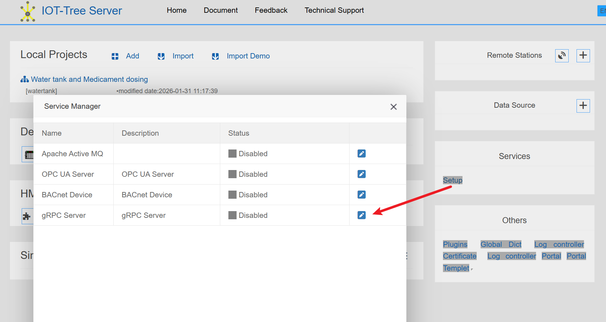
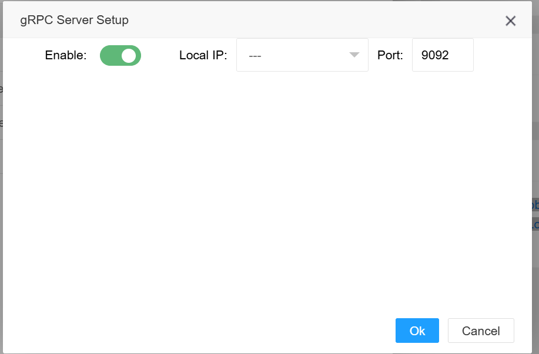
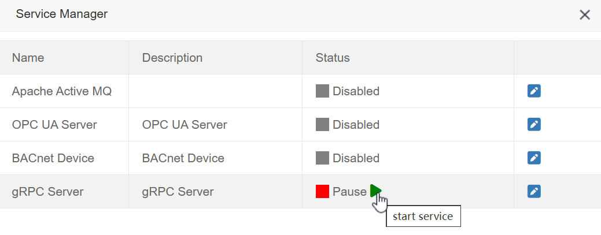
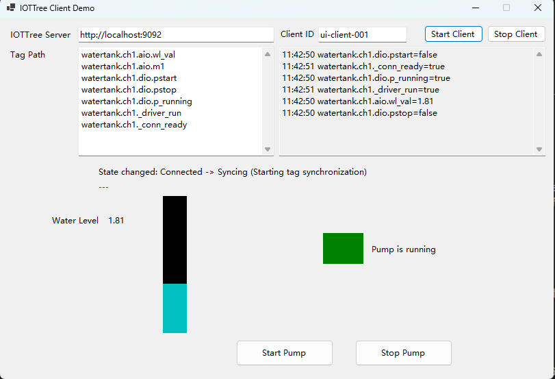

实现你自己的.Net客户端
==

IOT-Tree Server支持gRPC服务，并且在配套开源项目[iottree.net][iottree.net]中提供了gRPC客户端调用封装库。

你可以方便且高效的使用此库提供的api访问IOT-Tree Server，并使用微软.net技术开发你需要的客户端UI。

当然，运行此客户端也必须把你的IOT-Tree Server运行实例一起部署。

IOT-Tree Server自身只支持Web方式的管理UI和监控画面，在很多场合需要设备能够直接随着电源的启动打开对应的工作界面，因此必须使用纯客户端方式的程序。

IOT-Tree Server提供了gPRC支持，因此你可以使用各种客户端软件开发技术高效且简单地调用此gPRC接口。

[iottree.net][iottree.net]直接使用c#对gPRC接口进行了封装，你可以直接在你的.net程序中调用，避免了繁琐的gPRC接口定义。


## 1 使用此客户端库带来的好处


1 IOT-Tree Server在后台已经为你现场设备（如各种PLC）做好了对接，你要实现自己的客户端只需要支持IOT-Tree Server已经整理好的标签列表，每个标签使用类似 xxx.xx.xxx 格式的唯一路径标识。

这样你的客户端软件不需要考虑任何设备各种差异信息——如PLC中的数据地址等。这可以大大简化你的客户端开发过程。

2 使用gPRC可以使得一个IOT-Tree Server实例支持多个客户端同时访问，这在一些现场会有很大的好处。

3 如果你运行的是单机系统，IOT-Tree Server和你的.net客户端程序运行在同一个系统中，这样可以达到最好的性能。


## 2 如何使用此库

### 2.1 环境准备


首先你得使用IOT-Tree Server配置你的项目——包含设备接入、数据组织，并且打开gPRC服务。具体如下：


#### 2.1.1 建立IOT-Tree Server项目


本部分请参考IOT-Tree现有文档和网络上的很多项目文章。如 [Quick Start][quick_start],各种PLC的对接和数据获取[wiki][wiki]。


[quick_start]: ../quick_start.md
[wiki]: https://github.com/bambooww/iot-tree/wiki

#### 2.1.2 启用gRPC服务


在IOT-Tree Server实例中的项目运行正常之后（相关的采集数据标签都运行更新正常）。你就可以启用gRPC，这样就可以支持其他客户端程序调用了。

在IOT-Tree Server管理主界面（非项目管理界面），点击服务程序（Services）里面的“设置Setup”按钮，在弹出的服务列表中，有个"gRPC Server"。如下图：





点击对应的"编辑"图标，在弹出的窗口中，使能此服务，并且选择你希望的对外服务端口，完成之后，就可以启动此service了。如下：


<table>
<tr>
<td>

</td>
<td>

</td>
</tr>
</table>


本文使用的项目是IOT-Tree Server内部自带的演示项目:Water tank and Medicament dosing。你可以参考[Quick Start][quick_start]这篇文档查看如何在一分钟之内启动正常运行这个演示项目。


### 2.2 使用微软.Net语言开发你的客户端

#### iottree.net 开源项目


访问下载[iottree.net][iottree.net]这个配套开源项目。使用微软Visual Studio软件打开工程。你可以看到里面有3个子项目。其中lib是使用c#对访问IOT-Tree Server的gRPC接口调用进行了封装，这样可以提供更直观简单的调用接口。另外两个是console demo和client demo。

你可以编译启动iottree_client_demo这个项目。界面如下：


你需要设置IOTTree Server gRPC地址和端口，本例子是http://localhost:9092。虽然看着是http协议但gPRC内部使用的是高效的通信支持。

每个client都必须有自己的一个唯一id，以便于IOT-Tree Server区分不同的客户端。

Tag Path是此客户端需要监听同步和控制输出的标签列表，它的格式是 prj_name.xx.xx.tag_name。很明显，IOT-Tree Server中可以同时运行多个项目，而一个客户端可以同时监听多个项目中的数据标签。通过这种方式，你可以发现IOT-Tree Server的客户端调用非常简单，只需要以这种唯一标签列表作为基础，而不需要考虑各种设备的复杂通信协议。因为这些复杂性都由IOT-Tree Server的项目给你搞定了。

点击按钮"Start Client",你可以发现正常连接成功之后，运行效果：





你可以通过下面的按钮控制水泵的启动和停止，也可以在右上角查看监听的标签数据更新变化情况。


#### iottree.net lib 封装库调用说明


你可以把lib库放到你的客户端项目中，主要涉及3个封装类IOTTreeClient，IOTTreeTagVal，IOTTreeTag。下面是此lib库如何调用的说明。

IOTTreeClient是客户端主封装类。调用非常简单：

创建对象,并设置需要监听的标签路径列表：


```c#
// create IOTTreeClient
client = new IOTTreeClient(url, clientid);
// tagpaths is List<string>
client.SetTagPaths(tagpaths);
```


由于标签路径是IOT-Tree Server项目中提供，你可以在IOT-Tree项目管理界面的标签列表进行导出复制，如图：


接下来我们就可以基于client对象提供的事件，进行监听并作后续处理：


```c#
client.StateChanged += (sender, e) =>
{
    ShowInf(false, $"State changed: {e.OldState} -> {e.NewState} ({e.Message})");
};

client.TagValueChanged += (sender, e) =>
{
    // Console.WriteLine($"Tag updated: {e.TagPath} = {e.Value} at {e.UpdateTime}");
    UpdateUI();
    IOTTreeTagVal tagval = e.TagVal;
    if (tagval.Path == "watertank.ch1.aio.wl_val")
    {
        UpdateWaterLvl(tagval);
    }
    if(tagval.Path== "watertank.ch1.dio.p_running")
    {
        //do something ....
    }
};

client.ConnectionLost += (sender, e) =>
{
    ShowInf(false, "Connection lost!");
};

client.ConnectionRestored += (sender, e) =>
{
    ShowInf(false, "Connection restored!");
};

client.ErrorOccurred += (sender, e) =>
{
    ShowInf(true, $"Error occurred: {e.Message}");
};

```

然后就可以启动或停止此client

```c#

client.Start();
client.Stop();

```

client启动正常连接IOT-Tree Server之后，你才能使用以下函数：

```c#
public IOTTreeTagVal GetTagValue(string tagPath);

public List<IOTTreeTagVal> GetTagValues();

public Dictionary<string, IOTTreeTagVal> GetTagValuesMap();

public List<IOTTreeTag> GetRegisterTags();
```

写或设置标签数据到IOT-Tree Server使用如下函数，这些函数都会触发单独的gRPC调用：

```c#
//write value to tag,it may cause device driver to do write operation
public async Task<bool> WriteTagValueAsync(string tagPath, string value);

//set tag value in memory
public async Task<bool> SetTagValueAsync(string tagPath, string value)
```

从IOT-Tree Server查询项目列表和项目下面的标签列表函数（会触发单独的gRPC调用）：
```c#
public async Task<List<PrjItem>> ReadProjectListAsync() ;

public async Task<List<TagItem>> ReadTagsInProjectAsync(string projectName);

```
[iottree.net]: https://github.com/bambooww/iottree.net


