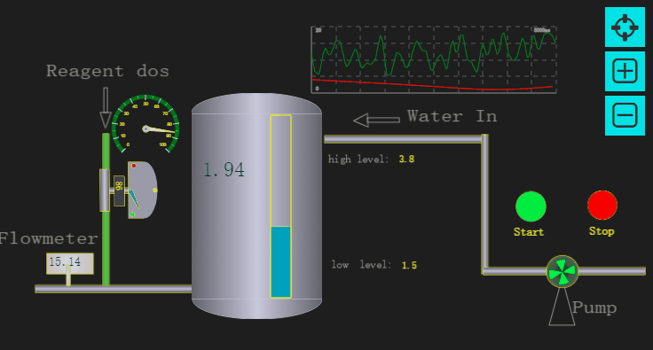
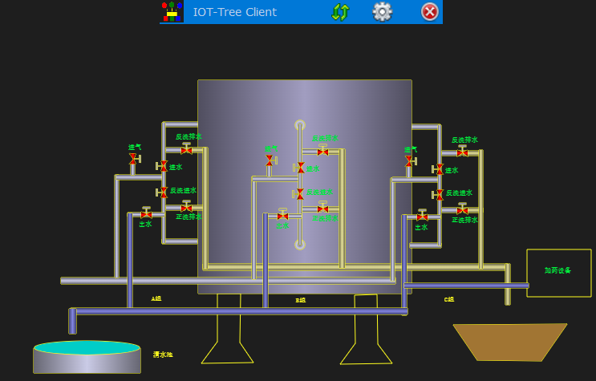

What is IOT-Tree Server?
==

IOT-Tree Server is a service software system with Internet of things access, data normalization and human-computer interaction display.

She uses a clear architecture, including communication connection, channel, device driver, data tag and other levels. The Internet of things system is managed and organized in a tree like manner in all aspects.

Based on this tree management, IOT-Tree Server provides the design, configuration and online application of online configuration interface (Human-Computer Interaction Interface) based on Web.

IOT-Tree Server is mainly developed using Java. It's admin ui is completely web-based.

[Quick Start][quick_start]

[Document Menu][nav]

[Demo][demo_link]

<a href="https://github.com/bambooww/iot-tree/releases" target="_blank">Download</a>

## 1 What does IOT-Tree Server do?

### 1.1 It can be used as an industrial field(SCADA) or edge computing node

You can use IOT-Tree server as the PC side configuration software in the industrial field.

Select the appropriate access mode according to the field communication situation, and select the appropriate driver and associated devices. You can quickly make field projects orderly and clear at the computer management end. Then, you can quickly configure the human-computer interaction according to the operating conditions.

If a device or sub station is complex, you can design the sub control ui first, and then reference it in the general control ui.

If a device is complex but has defined the ui elements it can provide, you only need to introduce the device, and the ui elements associated with the device can directly become the referenced content in your project.

running...

#### Use Case

[Lamp Demo][lamp_demo] 

  [Pump Controller Demo][pump_demo] 

[Demonstration of Industrial Automation][case_auto_demo]

### 1.2 Data Access and Integration Capability

IOT-Tree Server supports access to data from different data sources (different standards):

Communication protocol: Modbus (Modbus RTU/Modbus TCP), Siemens PPI/S7 protocol (PLC S7-200/300/1200/1500),Mitsubishi PLC protocol, Omron PLC protocol

Application Protocols: OPC (OPC UA, OPC DA) related protocols, HTTP, MQTT

Database: MySQL, SQL Server and Oracle

IOT-Tree Server provides support for the unified standard interface for industrial OPC. Through simple and clear management of the access devices and data sources, the differences between the underlying complex devices and data sources are shielded, and the interconnection of industry, automation systems, Internet of Things systems and the Internet is achieved with great ease of operation.

IOT-Tree Server provides strong support for access to inter-network resources, such as accurate crawling for HTTP access, precise data extraction in Web pages, and integration into unified data management.

### 1.3 embedded into the device

If you have an embedded device with sufficient performance to run Java virtual machine, IOT-Tree Server can easily make your device a controller. And the controller can support online configuration and UI design, and provide online real-time operation services.

[Embedded Demo][embed_ctrl_demo]

### 1.4 as an IOT Middleware

At the intermediate level from the IOT sensing layer to the cloud, the IOT-Tree Server node is deployed to collect local relevant IOT data. By integrating the publication and subscription of the message bus of the system, it can provide efficient and flexible data interaction for the high-level management system (MES or ERP, etc).

The development of the top-level production management system can be based on the existing mature database and it technology framework. The IOT-Tree Server shields the complex professional knowledge of the bottom production line, greatly reducing the development difficulty of the top-level management system.

### 1.5 As a IOT Server

If you are an Internet company, you have just come into contact with the Internet of things project. Limited by the lack of experience in professional device access and data management, or you research and develop relevant device access protocols and data collection management from scratch. This process will take up a lot of your development resources and time at the same time.

You can try IOT-Tree Server, just like database service, and make it a server supported behind your project.

If your devices happens to be supported by our built-in driver, IOT-Tree Server is expected to give you a surprise.

According to our open source strategy, most of your projects can be used for free. A very important point is that over time, we will support more and more drivers. I hope IOT-Tree Server can save you a lot of costs and get more benefits.

### 1.6 As a node of distributed applications

IOT-Tree Server can be deployed as a shared node based on multiple communication modes by project. The local node is a complete automatic monitoring site that can run independently. Other IOT-Tree Servers in the network can refer to this node in the project to become a part of themselves and become the upper level node of this node.

This distributed function can greatly facilitate the linkage of cross regional monitoring sites. For example, each monitoring site only needs broadband for secure communication with the cloud message queue server, which can easily form a hierarchical relationship. The top IOT-Tree Server node system can monitor the communication link and use this communication state as the system communication exception to deal with multiple related functions.

[Center-substation remote monitoring][center_substation]

## 2 Composition of IOT-Tree Server

### 2.1 project based management mechanism

IOT-Tree Server is basically composed of projects. You can set up different projects in different applications according to your needs. Each project includes data access, channel devices organization and management, data items, human-computer interaction UI, control logic, etc.

### 2.2 Device library management mechanism

The IOT-Tree Server device library function is independent of the project and can be shared by all projects. You can accumulate your own devices according to your own business needs to facilitate subsequent project development.

In the project, the device belongs to the content below the channel. A device can include data items, data organization levels and human-computer interaction UI. In a project, you can add the newly defined device to the library at any time, so that it can be directly used by other projects.

### 2.3 online UI editing function

The project or the device definition in the device library can add UI items, and can be edited online directly. The system provides powerful WYSIWYG editing tools online support.

### 2.4 Mechanism of UI element library

IOT-Tree Server provides an independent UI element primitive library function, which is managed through different libraries - Classification - UI Element, and also provides online editing function.

### 2.5 Flexible, intuitive, and powerful auxiliary support

#### Alert triggering and handling

IOT-Tree is based on an internally unified data tags definition, which allows for flexible and convenient definition of alert sources, alert handler, and alert outputs. And it can be defined and displayed in a clear and intuitive way.

#### Store Output

Based on internally unified tags, you can flexibly and conveniently define the database output of real-time and historical data.

### 2.6 Client support

IOT-Tree provides a client program for monitoring UI to facilitate the use of on-site computers (or all-in-one PCs that support touch functionality) in the monitoring system. It can facilitate automatic startup of the device and fill the monitoring screen.

## Know more

[Quick Start][quick_start]

[Document Menu][nav]

[Demo][demo_link]

If you encounter problems with the system or have suggestions, you can send us email feedback: iottree@hotmail.com

[quick_start]: ./doc/quick_start.md
[nav]: ./nav.md
[demo_link]: ./doc/case/index.md

[dl_link]: https://github.com/bambooww/iot-tree/releases

[pump_demo]: ./doc/case/example_psd.md
[case_auto_demo]: ./doc/case/case_auto.md
[lamp_demo]: ./doc/case/example_lamp_demo.md

[embed_ctrl_demo]: ./doc/case/example_embed.md
[center_substation]: ./doc/advanced/main_sub_station.md
