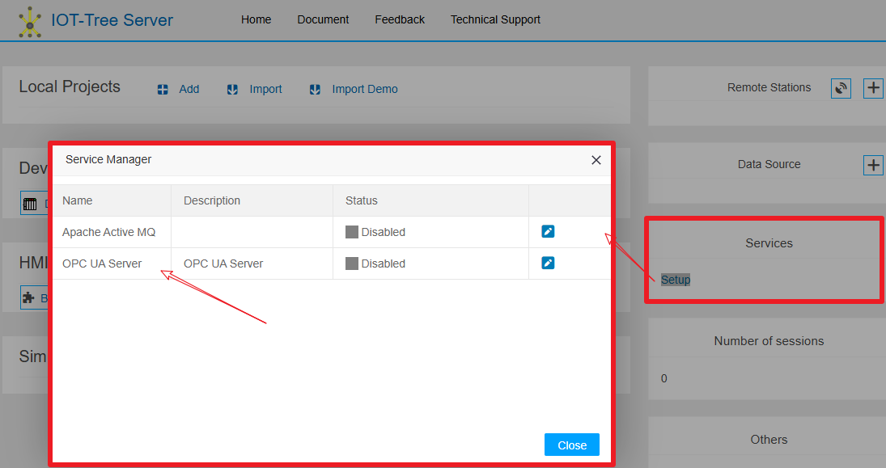
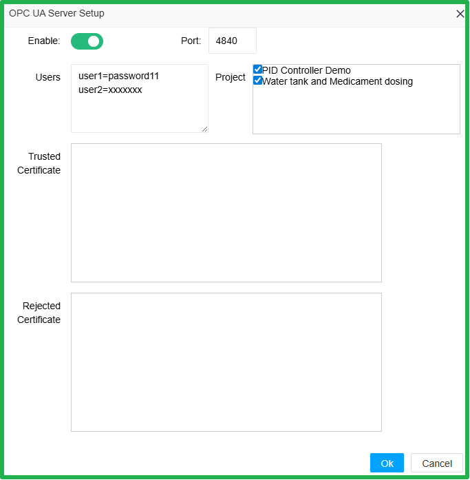
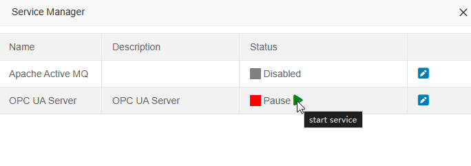
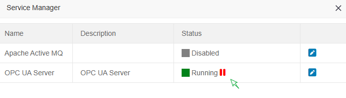
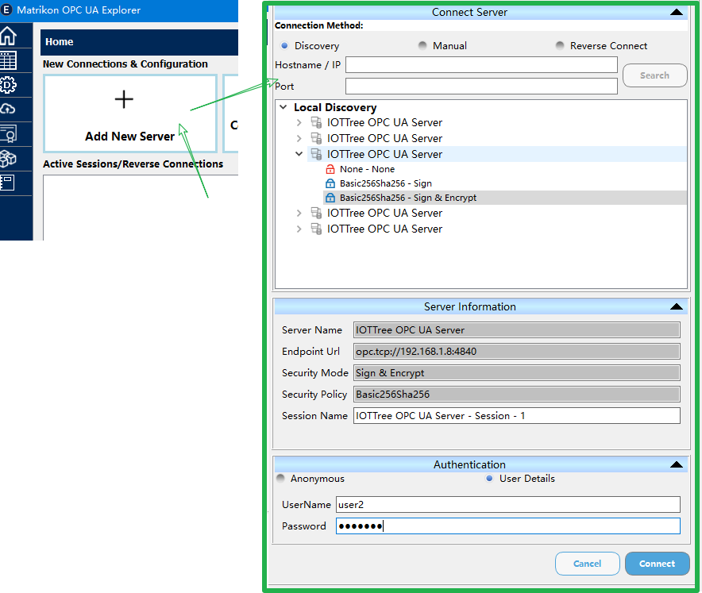
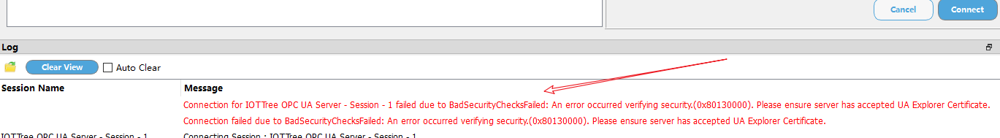
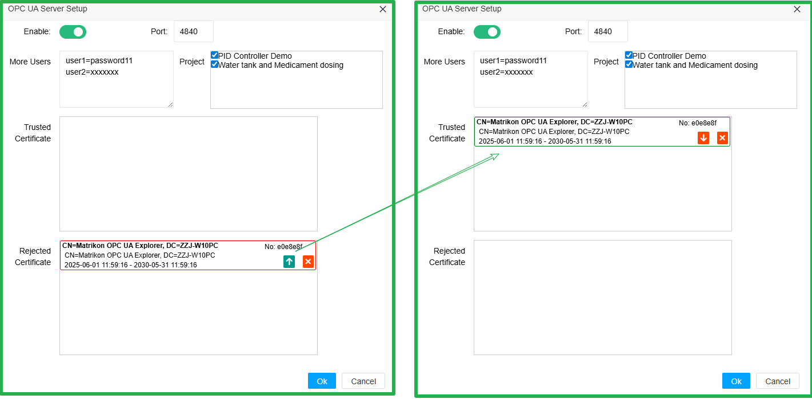
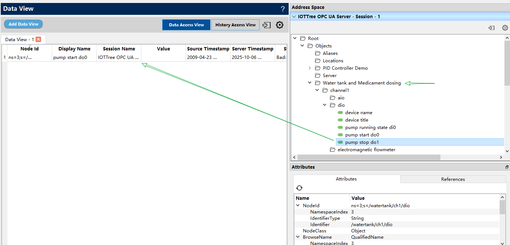

Provide OPC UA interface externally
==

## 1 The OPC UA Service of IOT-Tree Server


IOT-Tree Server provides direct support for OPC UA Server, which is provided through the Service way. In the main page of IOT-Tree Server, click the "Settings" button of "Services", and you can see the "OPC UA Server" service in the pop-up dialog box. You can set the parameters of this service or control its start and stop. As shown in the figure:



Click the "Edit" button to bring up the detailed parameter setting dialog



By default, the OPC UA Server is not enabled and uses port 4840. You can modify the port to enable the OPC UA Server.

You can configure the user authentication required for OPC UA Client access. Each line represents a user and password, in the following format:

```
user1=password11
user2=xxxxxxx
```

In the project list, you can see all the projects included in this IOT-Tree instance. You can check the projects that need to provide external OPC access.

The trusted certificate and rejected certificate below are the certificate management required for the OPC UA Client to access this OPC UA Server. For detailed information, please refer to the subsequent content.


## 2 Access using OPC UA Client


After successfully setting the above parameters, click the "Start Service" button in the "Service" list. Once clicked, the IOT-Tree Server instance will start the OPC UA Server.


<table>
<tr>
 <td></td>
 <td></td>
</tr>
</table>


You can install the "Matrikon OPC UA Explorer" software on your computer, which is used in this article to represent the OPC UA Client. Open the software and click "Add New Server". You can see the "Connect Server" area on the right side directly displays the Local Discovery list, because the OPC UA Server port configured above is the default port, and this Client software and IOT-Tree are running on the same computer. Therefore, this Client can directly discover the Server we have configured. If it is not the default port or not on the same computer, you can manually enter the host and port, and click "Search" to find the corresponding Server. As shown below:





Expand the corresponding IOT-Tree OPC Server node to view the access methods associated with it. These include anonymous access, signature (certificate) access, and signature (certificate) with encryption access.

Below, you can also enter the username and password required to connect to the server. This must match the username and password configured above.

According to the above figure, we selected the signature (certificate) and encrypted access method, and filled in the user and password. Click the "Connect" button. You can see that it failed, as shown below:





**This is because in the certificate verification connection mode, the Client will automatically create a certificate and submit it to the OPC UA Server, but the Server will automatically record the certificate for the first access and directly reject it. You need to trust the new Client certificate in the IOT-Tree OPC UA Server management dialog.**

Return to the OPC UA Server service management list and click the "Edit" button. You will notice a change in the pop-up dialog: a connection certificate has appeared in the "Rejected Certificates" list. Simply click the up arrow button and set the "trust it" to move this certificate to the trusted list, thereby completing the process of granting access to the Client. As shown below:





Go back to the "Matrikon OPC UA Explorer" software (note the user password), click the "Connect" button again, and you can see that the connection is successful. In this successful session, you can find the corresponding project in the top right corner of the tree directory, and expand the node that needs to be monitored. As shown below:



