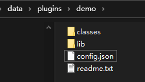

Plugins Development
==

# 1 IOT-Tree Server的插件机制

IOT-Tree Server本身提供了丰富多彩的物联网支持功能。但在很多场合，直接使用这些功能还不能满足你的需要。

比如，您如果想在系统内部运行的JS脚本增加一些特殊功能或Api，这些特殊功能不可能由IOT-Tree Server提供。典型的一种情况是：您的组织内部有一套特殊的消息推动通道，如邮件服务器或某个手机短信接口。你希望在IOT-Tree Server内部运行的JS任务中加入这个消息推送功能。那么使用IOT-Tree Server的插件支持机制，就可以达到你的目的。

由于IOT-Tree Server本身使用Java语言开发，这些插件也必须使用Java语言进行开发。因此，您必须有一定的Java语言开发经验。

## 1.1 插件在系统中的位置

在IOT-Tree Server安装目录"$IOT_TREE/data/plugins/"下面就是存放插件的地方。每个插件对应一个目录。

每个目录下面都必须有一个config.json文件，用来说明此插件的相关配置信息。同时，由于插件可能会依赖一些java类和库文件（.jar）。因此，内部还可以有classes/目录和lib/目录。其中，classes文件存放java类，而lib存放jar文件。

当然，如果你实现的插件本身还需要更多的配置文件或资源文件，则还可以在此目录下面存放。然后，可以在实现插件的java类中进行装载或使用。

上面就是IOT-Tree Server安装之后系统自带的一个演示插件的文件例子，你可以到你安装的目录下面进行查看。

## 1.2 config.json文件说明

config.json文件本身是个标准的json对象（JSONObject）文件格式。每个插件都有一个唯一的名称，每个json 对象都有 "name" 和 "title"属性。

接下来，其他属性则根据不同的插件类型而进行设定。

# 2 支持的插件类型

基于每个插件都必须提供的config.json文件，我们可以在此JSON对象内部定义具体的插件支持。很明显，你可以在一个插件目录下定义多种具体插件类型支持。

目前，IOT-Tree Server支持的插件有如下。

## 2.1 JsApi插件

JsApi插件可以使得IOT-Tree Server服务器端JS脚本支持更多的特殊api，这样会让系统更加贴近您的业务需求。在[JS Script Usage][js_main]中，提到了服务器端运行的脚步上下文中，有成员名称格式为$$xxx（以两个$符号起始），这种成员就是Js插件提供的支持对象。

你可以点击此处查看更详细的说明:[插件开发-JsApi][plug_js_api]

[js_main]:../js/index.md

## 2.2 权限(Authority)插件

IOT-Tree Server对外提供了多种服务接口，如树形节点下面的实时JSON数据URL接口，监控画面的展示访问等。在你的业务系统中，在浏览器端可能需要嵌入到你的相关业务界面中。

另外，如果你定义的设备操作界面还可能需要用户进行指令的输入和下达，而你的业务系统已经有一套用户和权限，如何让IOT-Tree Server统一使用您已经存在的用户和权限管理机制。可以使用authority插件实现。

你可以点击此处查看更详细的说明:[插件开发-authority][plug_auth]

[plug_js_api]: ./adv_plugin_jsapi.md
[plug_auth]: ./adv_plugin_auth.md
