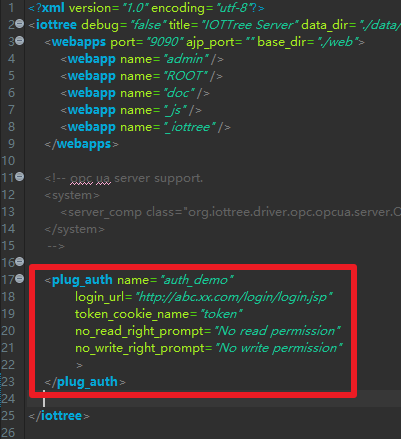

Plugin - Authority
==


IOT-Tree comes with a very simple permission management internally. If you want to access the management page of IOT-Tree "http://host:port/admin", The system will automatically ask you to provide an administrator and password. In addition, the system has no restrictions on project monitoring HMI(UI) and data reading during operation. If you want to issue instructions in the monitoring UI, you can also configure data write permissions as needed. You only need to fill in the configured user password.

Obviously, this simple permission restriction may not meet your needs. You may need to directly reference the monitoring page, real-time JSON data, or write data of IOT-Tree in your business system. Moreover, your business system already has its own set of user authentication and permission subsystems, so you certainly hope that IOT-Tree can share this set of users and permission control.

This requires the Authority plugin supported by IOT-Tree. The Authority plugin allows the IOT-Tree Server to authenticate using the user and permission mechanisms you already have before providing services externally.

If you are not familiar with the plugin mechanism of IOT-Tree Server, please check [Plugin Development][plug] first.


## 0 Token in the shared system cookie


If your business system needs to integrate IOT Tree related URL monitoring pages, or access real-time data of some URLs through ajax, and use "Authority plugin" to unify user restrictions.

You need to unify the URL access of your business system and the Web access of IOT Tree into one domain name space, so that after your business system users log in, they can share the http request header resources.

The typical method is to use nginx as the front-end unified portal. After the business system login, a token "cookie_name=token" is written in the cookie of the current session http request to represent the temporary identity of the current user. Then, IOT Tree can also use this token to call the "Authority plugin" for user permission verification.

Based on the token content in the shared cookie, the IOT Tree "Authority plugin" verification has a foundation. Next, it can be implemented concretely.


## 1 Java Class Development


You can use any tool to develop this Java class. IOT-Tree only has some naming restrictions on Java classes of "Authority plugin". There is no java interface or abstract class for you to implement or inherit. In this way, you do not need to rely on anything provided by IOT-Tree when coding this class. Of course, the class you implement may has its own special dependencies. Please refer to the lib/ or classes/directory specified in [Plug in Development][plug].


### 1.1 Implementation regulations for Java plugin classes

#### 1.1.1 User class definition


Due to the need of permissions and user login information, the IOT-Tree "Authority plugin" must have a user object as the return value after authentication. When you implement this user class, the class name is not qualified. You can use User, XxUser, etc. IOT Tree specifies that this class must contain the following methods.


```
public String getId()

public String getRegName()

public String getFullName()
```


These methods correspond to the unique user ID, user registration name (login name), and user full name respectively. Typical implementations are as follows:


```
package com.xxx.plug;

public class User
{
	String id,regName,fullName ;
	
	public User(String id,String regname,String fulln)
	{
		this.id = id ;
		this.regName = regname ;
		this.fullName = fulln ;
	}
	
	/**
	 * unique id  (option method)
	 * 
	 *  
	 * @return
	 */
	public String getId()
	{
		return this.id ;
	}
	
	/**
	 * get registion name (unique name for login)  (must have method)
	 * @return
	 */
	public String getRegName()
	{
		return this.regName ;
	}
	
	/**
	 * get display name (option method)
	 * @return
	 */
	public String getFullName()
	{
		return this.fullName ;
	}
}

```


With this basic user class, you can write plug-in classes. Let's assume that the plug-in class is named AuthDemo, and the following methods must be included in it.


#### 1.1.2 Initialization Method - init_plug


There must be an initialization plug-in method inside the plug-in class, which is defined as follows:

```
void init_plug(File plugdir, HashMap<String, String> params)
```


This method name must be 'init_plug' and have two parameters. One is the directory where this plugin will be deployed, and the other is the input parameter. This method will be automatically called before the plugin is loaded and used. You can perform some initialization work inside based on the plugin directory and input parameters. It can roughly include the following content:

>You can use the plugin root directory provided by "plugdir" to locate the absolute location for plugin deployment and load specific files required for plugin operation. These files are determined by the plugin implementation itself, for example, you can locate a special configuration file through this directory.

>You can initialize the required content for subsequent runs through the parameters (which come from the plugin configuration "config.json"). For example, for email sending, you can configure the email server address, port, user, and authentication information.


#### 1.1.3 Plugin class method - checkAdminUser

```
public User checkAdminUser(String reg_name,String password)
```


This method is used to support IOT-Tree's own project management page administrator user authentication, so only the user registration name and password are required as parameters. If the authentication is successful, the corresponding User object will be returned.


#### 1.1.4 Plugin class method - checkUserByToken

```
public User checkUserByToken(String token)
```


This method is used to support the authentication of current users accessing IOT-Tree. IOT-Tree will obtain the token of the current user when the page is accessed, and then call this method to determine the relevant permissions. If the verification is successful, the corresponding User object will be returned.

Obviously, this method will communicate with your business system permissions. The typical way is that you use Redis to store the token information of the current login user. Then access the Redis interface in this method to obtain user information.


#### 1.1.5 Plugin class method - checkReadRight

```
public boolean checkReadRight(String node_path,String reg_name)
```


This method is used to determine whether a registered user is allowed to access a node. IOT Tree resources provide URL services to me in the form of tree paths, such as hmi and json.

You only need to right-click the node in the IOT Tree project tree and select "Access" to open a new browser window and access related resources - please carefully observe the URL path of the newly opened browser, and you will find that it contains the path of the corresponding node. This path is also the first parameter "node_path" that we implement this method.

The second parameter is the current registered user name.


#### 1.1.6 Plugin class method - checkWriteRight

```
public boolean checkWriteRight(String node_path,String reg_name)
```


This method is used to determine whether a node allows a registered user to write. IOT Tree resources provide URL services to me in the form of tree paths, such as hmi and json. The second parameter is the current registered user name.

In the HMI UI, if an instruction is to be issued, this method will be called to verify whether the current user has write permission to the node (corresponding to "node_path").


### 1.2 Implementation examples


As you can see, the "Authority plugin" implementation is also very simple. You only need to implement "init_plug" and the methods specified above according to the regulations. The following is the complete code of this verification plug-in.

```
package com.xxx.plug;

import java.io.*;
import java.util.*;

/**
 * auth demo plugin for
 * IOT-Tree Server
 * 
 * You can implement the methods in this plug-in by sharing data.
 *  For example, through relational database, redis, WebService or other
 *  
 *  
 *  
 *  The key point is that you need to bind the node tree in the IOT-Tree Server 
 *  as a resource with your user system.
 * 
 * @author demo
 *
 */
public class AuthDemo
{
	/**
	 * this method will be called when plug is inited.
	 * you can do some initial work here
	 * 
	 * @param plugdir
	 * @param params
	 * @throws FileNotFoundException
	 * @throws IOException
	 */
	void init_plug(File plugdir, HashMap<String, String> params) throws Exception
	{
		
	}
	
	/**
	 * option method
	 * 
	 * when you access http://iot_tree_server_host:port/admin,you must login by register name and password
	 * 
	 *  if this method is here,the default user authentication provided by the system will be ignored.
	 *  
	 *  
	 * @param reg_name
	 * @param password
	 * @return
	 */
	public User checkAdminUser(String reg_name,String password)
	{
		if("admin".equals(reg_name) && "123456".equals(password))
			return new User("","admin","Adminstrator") ;
		
		return null ;
	}

	/**
	 * Obtain user information according to the token
	 * 
	 * @param token provided by page cookie or other ways
	 * @return
	 */
	public User checkUserByToken(String token)
	{
		if(token==null||"".equals(token))
			return null ;
		
		if(token.startsWith("user1"))
			return new User("","user1","User1") ;
		else if(token.startsWith("admin"))
			return new User("","admin","Adminstrator") ;
		return null ;
	}
	
	/**
	 * this method will be called when outer will access node path in iottree like /prjname/n1/u1
	 * 
	 * The node related to this path may be a context node that returns JSON data. 
	 * Or the HMI UI node outputs the UI picture
	 * 
	 * @param node_path  like /prjname/n1   /prjname/n1/u1
	 * @param reg_name login user name or null or empty
	 * @return
	 */
	public boolean checkReadRight(String node_path,String reg_name)
	{
		if("admin".equals(reg_name)||"user1".equals(reg_name))
			return true ;
		return false;
	}
	
	/**
	 * this method will be called when outer will write some data to node path in iottree like /prjname/n1/u1
	 * 
	 * this may be update some tag value in node or send cmd in hmi
	 * 
	 * @param node_path
	 * @param reg_name
	 * @return
	 */
	public boolean checkWriteRight(String node_path,String reg_name)
	{
		if("admin".equals(reg_name))
			return true ;
		return false;
	}
}

```


The above code is only for demonstration, and the implementation is very simple. In your business, you may obtain the Redis interface parameters in the "init_plug" method to initialize Redis related objects,  and then use this object in other methods to achieve the corresponding functions.


## 2 Plugin deployment

### 2.1 </en>Plugin deployment Directory</en>


Compile Java classes to generate User.class and AuthDemo.class files. If your implemented class depends on some library files, these jar files will be placed in the lib directory.

On the premise that you have installed and configured the IOT Tree running environment, find the data/plugins/directory under the IOT Tree installation directory. Create a new directory "auth_demo" in it.

The overall deployment directory and file structure are as follows:

```
│  config.json
│  readme.txt
│
├─classes
│  └─com
│      └─xxx
│          └─plug
│                  AuthDemo.class
│                  User.class
│
├─lib
└─src
    └─com
        └─xxx
            └─plug
                    AuthDemo.java
                    User.java
```


After deploying the files and directories, we also need to edit the configuration file "config.json" in order to finally complete the deployment of the plugin.


### 2.2 Authority plugin configuration


Because config.json not only supports Authority plugins, but also other plugin types, Authority is only a part of this configuration file.

Similarly, we can publish multiple Authority content in a single plugin directory. In the config.json file in the plugin directory, the configurations related to Authority are all under the "auth" attribute, and "auth" corresponds to a JSON array. Each member of the array is a JSON object, and each object corresponds to a object of the API. (This example only has one)

As follows:

```
{
	"name":"auth_demo","title":"Auth Plug,a demo for auth",
	"js_api":
	[
	],

	"auth":
	[
		{
			name:"auth_demo",
            class:"com.xxx.plug.AuthDemo",
            params:{}
		}
	]
}
```


The object corresponding to each 'auth' has the following attributes: 'name', 'class', and' params'. Among them, "name" and "class" are essential. Moreover, the value of the "name" attribute is a string that matches the naming of the JavaScript variable, and "class" is the full name of the Java object provided with it. This class must exist in the plugin directory 'classes/' or in a jar file of 'lib/'.

"params" are the parameters required for the initialization function "init_plug", and the it is determined by the plugin class.

In this example, the name of the authentication plug-in is "auth_demo".

For general IOT Tree plug-ins, this configuration has been completed. However, the Authority plugin is very special. One IOT-Tree deployment instance only allows one "Authority plugin" to work. Then, we may have multiple "Authority plugin" under the plugins directory. Which one should we choose?

Obviously, we need to specify which "Authority plugin" IOT-Tree running instance uses. To do this, you must edit the main configuration file "config.xml" under the IOT Tree Server installation directory. In this file,we specify "Authority plugin" to be used, and set some other parameters.




As shown in the figure above, we add a "plug_auth" xml element in the main configuration file "config.xml", with the following parameters:


```
name="auth_demo" 
login_url="http://abc.xx.com/login/login.jsp"
token_cookie_name="token"
no_read_right_prompt="No read permission"
no_write_right_prompt="No write permission"
```


Among them, name specifies the name of the deployed "Authority plugin", "login_url" specifies the page after the login jump, and "token_cookie_name" specifies the name of the cookie in which the shared token is stored. The remaining two parameters correspond to the prompt message that the current user has no read permission and no write permission.

From the above configuration requirements, we can see that if the main configuration file "config.xml" does not specify which "Authority plugin" to use, no "Authority plugin" will work.

After this configuration, we need to restart the IOT-Tree Server to work.


## 3 Plugin usage and testing


In our release version, "auth_demo" already exists. You just need to modify the config.xml file, remove the corresponding comments, and restart the IOT-Tree Server.

You will find that if the "Authority plugin" is enabled, the administrator login verification is different from the default. You can also print out several permission verification input parameters to view the node path information entered when we access a resource content. In turn, you can take this node path as a resource and put it into your business permission system for management.


[plug]: ./adv_plugin.md
