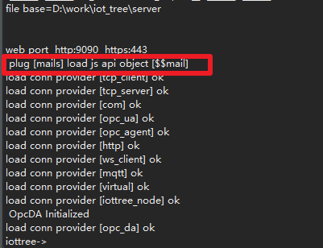
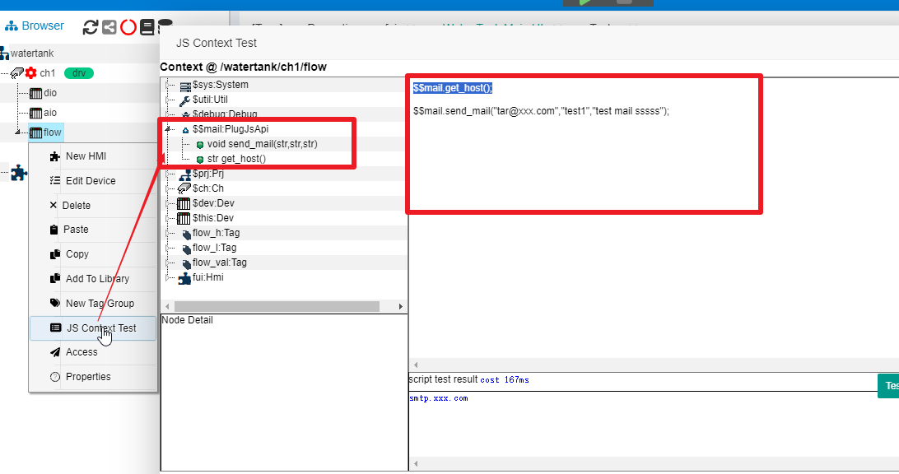

Plugin-JsApi
==

JsApi插件可以使得IOT-Tree Server服务器端JS脚本支持更多的特殊对象($$xxx)，并且这些对象提供特殊的函数支持，这样可以使得系统更加贴近您的业务需求。比如，你的应用需要使用IOT-Tree作为某个物联网现场的边缘计算节点，需要通过私有协议的安全通道与云端通信（推送数据），那么你就可以针对此通信专门实现对应的JsApi插件，然后在IOT-Tree中的任务Task中，使用JS脚本组织数据，并通过这个插件对象调用相关函数发送数据。

如果你对IOT-Tree Server的插件机制不了解，请先查看 [插件开发][plug]。

为了更直观的详细描述JsApi的开发、部署和使用。我们使用一个例子来说明。

为了使IOT-Tree服务端JS脚本支持邮件的推送，专门实现一个$$mail的插件，这个对象里面包含邮件发送等相关函数支持。

## 1 Java类开发

你可以使用任何工具进行这个Java类的开发，IOT-Tree对JsApi插件的Java类仅有一些命名上的限定。并没有提供java接口(interface)或抽象类给你实现或继承。这样你开发这个类的时候不需要依赖IOT-Tree提供的任何东西。当然，你实现的这个类有自己的特殊依赖，那就参考[插件开发][plug]里面规定的lib/或classes/目录中存放即可。

### 1.1 Java插件类的实现规定

#### 1.1.1 初始化函数

在类内部必须有个初始化插件函数，定义如下：

```
void init_plug(File plugdir, HashMap<String, String> params)
```

这个函数名称必须为init_plug，并且有两个参数一个是本插件部署之后所在的目录，另一个是输入参数。在插件被装载使用前，这个函数会被自动调用。你可以在里面根据插件目录和输入的参数进行一些初始化工作。大致可以有如下内容:

>你可以通过plugdir提供的插件根目录，定位到插件部署绝对位置，装载插件运行需要的特定文件。这些文件由插件实现自己决定，比如你可以通过这个目录定位到一个特殊的配置文件。

>你可以通过params参数（这些参数来自于插件配置config.json中的内容），初始化后续运行需要的内容。如，对于邮件发送，你可以配置邮件服务器地址端口、用户和验证信息。

#### 1.1.2 JS支持的函数

在你实现的插件类中，如果想开放某个函数给JS使用，那么这个函数名必须使用"JS_"作为开头，如

```
public String JS_get_host()

public void JS_send_mail(String to_mail, String mail_title, String mail_content) 
```
IOT-Tree在装载这个插件类之后，会查找以"JS_"开头的函数,并设定为JS可以调用的成员函数。其中，在JS调用是，是不需要写"JS_"内容的。如以上两个函数在JS调用时，使用如下方式：

```
String host = $$mail.get_host();

$$mail.send_mail("xx@xxx.com","mail title","hello send mail") ;
```

<font color="red">请注意，为了方便JS调用，IOT-Tree规定，你在定义开放函数的时候，函数参数和返回值都只能使用基本类型。因为如果要实现更复杂的对象作为参数，虽然IOT-Tree可以开放更多的依赖和接口，但同时也会使得插件的开发复杂很多，并且调试困难。事实上，绝大多数的插件应用使用的基本类型就可以满足要求。</font>

### 1.2 具体的实现例子

可以看到，JsApi的插件实现非常简单，只需要按照规定实现init_plug和JS_开头的函数即可。下面就是这个邮件发送实现的全部代码。

```
package com.xxx.plug;

import java.io.File;
import java.io.FileNotFoundException;
import java.io.IOException;
import java.util.Date;
import java.util.HashMap;
import java.util.Properties;

import javax.mail.Message;
import javax.mail.Session;
import javax.mail.Transport;
import javax.mail.internet.InternetAddress;
import javax.mail.internet.MimeMessage;

/**
 * use JavaMail and smtp protocal to send mail it will be a JsApi plugin for
 * IOT-Tree Server
 * 
 * @author demo
 *
 */
public class JsApiMail
{
	private String smtpHost = null;
	private String mailUser = null;
	private String mailPsw = null;
	private String senderMail = null;

	void init_plug(File plugdir, HashMap<String, String> params) throws Exception
	{
		smtpHost = params.get("smtp_host");
		mailUser = params.get("mail_user");
		mailPsw = params.get("mail_password");
		senderMail = params.get("sender_mail");
	}

	public String JS_get_host()
	{
		return smtpHost ;
	}

	public void JS_send_mail(String to_mail, String mail_title, String mail_content) throws Exception
	{
		Properties props = new Properties();

		props.put("mail.smtp.host", smtpHost);
		props.put("mail.smtp.auth", "true");

		Session session = Session.getInstance(props);
		session.setDebug(true); //

		MimeMessage message = new MimeMessage(session);

		message.setFrom(new InternetAddress(senderMail));
		message.setRecipient(Message.RecipientType.TO, new InternetAddress(to_mail));
		message.setSubject(mail_title);

		message.setContent(mail_content, "text/html;charset=UTF-8"); //send as html
		message.setSentDate(new Date());
		message.saveChanges();// 

		// send mail
		Transport transport = null;
		try
		{
			transport = session.getTransport("smtp");
			transport.connect(mailUser, mailPsw);
			transport.sendMessage(message, message.getAllRecipients());
		}
		finally
		{
			if (transport != null)
				transport.close();
		}
	}
}

```

从以上代码可以看到，你完全可以在你熟悉的Java开发环境中进行实现并测试，生成类文件 JsApiMail.class。完成之后你就可以在IOT-Tree环境中进行部署和使用。

## 2 插件部署

### 2.1 插件部署目录

前提，你可以按照配置好了IOT-Tree运行环境，然后在IOT-Tree安装目录下找到 data/plugins/这个目录。在里面新建一个目录mail。

另外，在此邮件插件还需要两个依赖的java库文件 activation-1.1.jar,mail-1.4.jar。这个也需要对此进行部署。

整体部署目录和文件结构如下：

```
│  config.json
│  readme.txt
│
├─classes
│  └─com
│      └─xxx
│          └─plug
│                  JsApiMail.class
│
├─lib
│      activation-1.1.jar
│      mail-1.4.jar
│
└─src
    └─com
        └─xxx
            └─plug
                    JsApiMail.java
```

文件和目录部署之后，我们还需要编辑配置文件config.json，这样才能最终完成插件的部署

### 2.2 JsApi插件配置

因为config.json不仅支持JsApi插件，同时也支持其他插件类型，所以JsApi仅仅是这个配置文件中的一部分。

同理，我们完全可以在一个插件目录中，发布多个JsApi内容。在插件目录下的config.json文件中，和JsApi相关的配置都在"js_api"属性下面，"js_api"对应一个JSON数组，数组每个成员都是一个JSON对象，每个对象对应一个js_api的对象。（本例只有一个）

如下:
```
{
	"name":"mails",
	"title":"Mail Plug,support send mail. using $$mail.send_mail(to_mail,mail_title,mail_content)",
	"js_api_doc":"//will set js run context global var $$xxx then you can use these global variable object,and call public method in js code",

	"js_api":
	[
		{
			name:"mail",
			class:"com.xxx.plug.JsApiMail",
			params:
			{
				"smtp_host":"smtp.xxx.com",
				"sender_mail":"uuu@xxx.com",
				"mail_user":"uuu@xxx.com",
				"mail_password":"xxxxxxx"
			}
		}
	]
}
```
每个js_api对应的对象，有如下属性"name","class"和"params"。其中，"name"和"class"是必不可少的。并且，"name"属性的值是个符合js变量命名的字符串，"class"这是配套提供的java对象全名称。这个类必须在插件目录下的"classes/"或"lib/"中的某个jar文件中存在。
"params"是对应插件init_plug初始化函数需要用到的参数，可以根据插件具体实现的提供格式定义和支持。

本例子这个JsApi插件名称为mail，对应JS上下文成员为$$mail。

## 3 插件使用和测试

通过以上开发、部署和配置，我们就可以对此插件在IOT-Tree的内部脚本中进行测试了。

### 3.1 部署前测试建议

<font color=red>在此有个很重要的建议：建议你你开发此插件调试过程中，就对此插件进行测试。可以使用如下代码：</font>

```
	public void test1() throws Exception
	{
		JsApiMail jam = new JsApiMail() ;
		HashMap<String,String> params = new HashMap<String,String>() ;
		params.put("smtp_host","you host addr");
		params.put("mail_user","user");
		params.put("mail_password","your password");
		params.put("sender_mail","xxx@xxx.com");
		jam.init_plug(null, params);
		
		jam.JS_send_mail("tar@ttt.com","title test 1", "hello mail");
	}

```
<font color=green>只要在你的测试环境中通过测试，那么就可以认为你开发的插件基本没问题，并且配合的测试环境也正常，这样部署到IOT-Tree运行环境中，可以大大减少出错的概率。毕竟在IOT-Tree内部JS调用出现问题的时候，由于环境复杂了很多，找问题的难度也大了一些。</font>

### 3.2 部署启用插件

如果IOT-Tree Server已经运行，那么在部署新的插件之后，必须对此Server重启启动，这样才能装载新的插件内容。

我们在IOT-Tree Server启动打印的提示符中，可以看到这个插件装载成功的内容：



<font color=green>这个插件对象 $$mail装载成功之后，可以在整个IOT-Tree部署实例的所有项目中共享使用。</font>

我们也可以在Server端JS编辑界面中查看和测试此插件。

我们打开Demo项目"Water tank and Medicament dosing"，在主目树的任意某个容器节点鼠标右键，选择"JS Context Test"，就可以打开对应的JS运行上下文编辑测试窗口，如下图：



我们可以看到在左边的JS上下文成员中，有个$$mail节点，并且下面有两个函数 send_mail、get_host。右边JS编辑区域，我们可以编写测试代码，并点击测试按钮运行测试。


[plug]: ./adv_plugin.md
