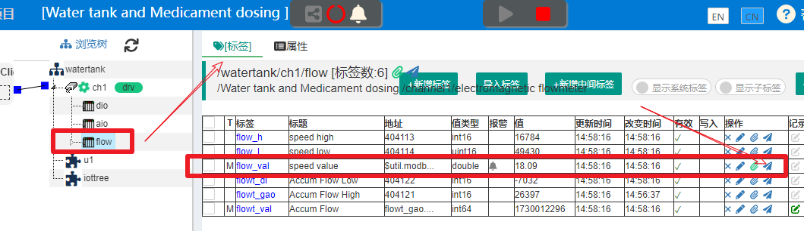
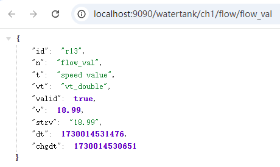
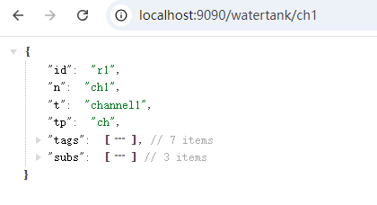
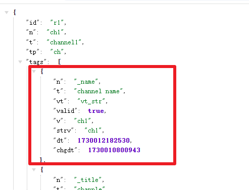
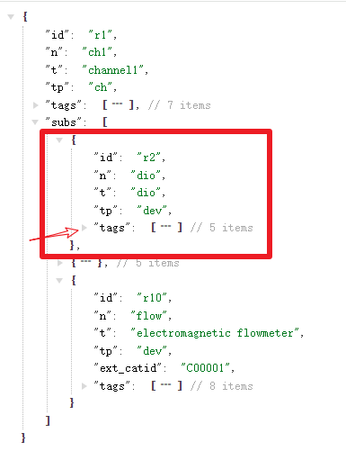
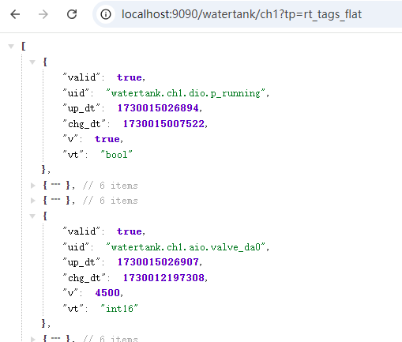
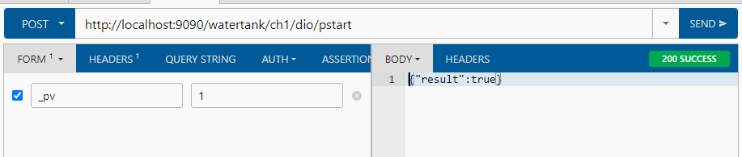
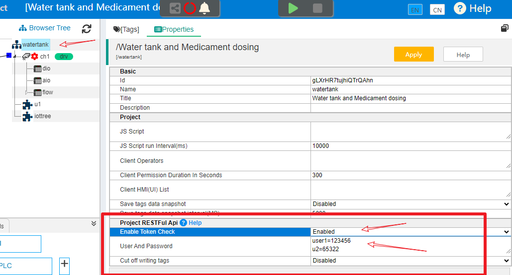
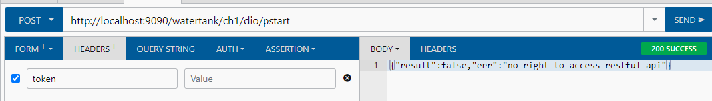
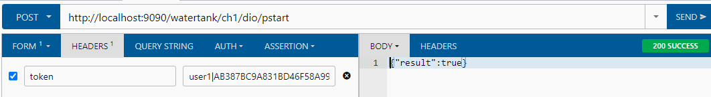

Provide RESTFul Api externally
==


The projects in IOTTree provide an external RESTful api. Compared with OPC UA, RESTful reads and writes organized data via http, which is more suitable for the current Internet related technical architecture and simpler.

As long as your IOT-Tree deployment environment meets the requirements for RESTful calls, it is recommended to use this method.

Any container node, simply right-click and select the "Access" menu option. You can pop up a tree data output with this container node as the root - the output format is JSON structure. At the same time, in the tag list corresponding to the container node, clicking the "Access" icon in the "Operation" column on the right side of the tag can also pop up the RESTful URL connection for this tag, and the output format is also the current status and data of the tag in JSON structure.


## 1 Retrieve data using HTTP GET method

### 1.1 Tag data acquisition


Let's take the IOT Tree's built-in demo project "Water Tank and Medication Dosing" as an example. If you are not familiar with this demo project, please refer to:


<a href="../quick_start.md"> Quick Start</a>


After starting and running this project normally, click on the node "flow" in the browsing tree, and click on the "access" icon corresponding to the tag "flow_val" in the tag list on the right, and a new page window will pop up:


<table>
 <tr>
   <td></td>
   <td></td>
 </tr>
</table>

We can see that the pop-up URL address is:

```
http://localhost:9090/watertank/ch1/flow/flow_val
```


The access path in the URL follows a hierarchical structure of '/project/channel/device/tag'. This is also why IOT-Tree has strict values for node names. By complying with the naming restrictions of program variables, it can bring great convenience to subsequent data usage.

In addition, we can also see that since the tag is a leaf node, the output JSON is just a simple JSON object with the relevant properties of this tag inside


```
{
    "id": "r13",
    "n": "flow_val",
    "t": "speed value",
    "vt": "vt_double",
    "valid": true,
    "v": 8.63,
    "strv": "8.63",
    "dt": 1730012429054,
    "chgdt": 1730012428849
}
```


The property "id" represents the node ID, "n" represents the node name, "t" represents the node title, "vt" represents the tag value type, "valid" represents the validity of the tag value, "v" represents the tag value, "strv" represents the string form of the tag value, "dt" represents the update time of this tag value, and "chgdt" represents the last change time of the tag value.


### 1.2 Container node data acquisition


In the project browsing tree, right-click on the channel node "ch1" and select the "Access" menu option. The pop-up new page URL is as follows (it is obvious that you can directly modify the URL path above):


```
http://localhost:9090/watertank/ch1
```



As can be seen, the output is also a JSON object, but it is quite complex. In addition to the basic properties, there is also a node type property called 'tp'.

Next, we can see that there are two array members in the object, "tags" and "subs". Expanding tags reveals that each member in the array is a tag JSON object. Please refer to the previous section for specific format:





Expand subs and you can see the JSON object corresponding to each device under this array member. Each device object has its own array member "tags", as shown in the figure:





It can be imagined that if there are tag groups below the container node, it can also contain more levels.


### 1.3 Parameter tp=rt_tags_flat


Directly outputting the data of a node in the tree structure above can basically meet the needs of your program to obtain data. However, due to the hierarchical structure of the tree, your program may need to continuously loop through data to meet the requirements.

Many times, you only need to call the real-time data of IOT-Tree tags, and do not want to filter and extract data through complex tree hierarchies. At this point, you can add the parameter "tp=rt_tags_flat" to the URL. Taking the ch1 channel access URL as an example, you only need to access:

```
http://localhost:9090/watertank/ch1?tp=rt_tags_flat
```


This URL GET method outputs a JSON array, where each object inside the array is tag data, as shown in the following figure:





Among them, the tag object has a "uid" property, which is a unique identifier from the project root name to the tag name. Other basic parameters include real-time data values, validity, time, and data types, which can be easily obtained directly based on tags.


## 2 HTTP POST tag writing

### 2.1 Instructions for Writing Tags


Tags under some driver channel, writing values will ultimately trigger the corresponding device driver to generate device write instructions (or control instructions). Therefore, in addition to the GET method mentioned above, we can read tag data from IOT-Tree projects and write tag data in reverse through POST.

Let's still check the URL address corresponding to the tag "/watertank/ch1/dio/pstart" in the demo project:


```
http://localhost:9090/watertank/ch1/dio/pstart
```

Use the browser RESTFul plugin to perform the following settings and operations:




As can be seen, by using the form method to post the parameter "_pv=1" to the URL of the pstart tag above, the startup of the demonstration water pump can be triggered. (During testing, it should be ensured that the simulation devices and demo project start up normally). And after successful writing, return JSON result


```
{"result":true}
```


Next, we will stop the Demo project and click "send" again. You will see that an error is returned:


```
{"result":false,"err":"JS_set _pv=1 err in tag /watertank/ch1/dio/pstart err:write to driver failed"}
```

### 2.2 Parameters supported by tag writing

#### 2.2.1 _pv


This parameter will perform the most fundamental write action based on the tag type. If the tag corresponds to a certain driver, the driver will ultimately be called to perform the write action; If it is a local tag, it may trigger the tag to store records locally.


#### 2.2.2 _value

This parameter only supports changing tag data in memory.

#### 2.2.3 _func


Function calls can support more complex operations on containers or tags. (TODO Future Support)


## 3 Security verification and debugging support


IOT-Tree connects to various devices on site, each operating in different states. Some IoT devices that only do data collection have read-only data, so there is no security risk for integration (but there is also a risk of data leakage); However, many device in industrial sites are different. If the device is running during docking, issuing control commands casually may cause serious consequences. Therefore, in order to ensure security and enable the upper (cloud) system to effectively interface with IOT-Tree, IOT-Tree provides some restrictive measures for the RESTful caller.

<font color="red">First of all, there is a suggestion: when IOT-Tree provides RESTFul api calls to external parties, it is best to perform them between internal network systems, and the relevant basic network security is provided by internal network security protection</font>

At the same time, in order to prevent other systems from accessing the URL provided by IOT-Tree at will, token verification support has been added; In addition, to meet the needs of docking and debugging without affecting the operation of on-site devices, IOT-Tree also provides write request cutting and debugging support.


### 3.1 Token restrictions for REST Ful calls


In order to prevent URLs from being accessed by unrelated systems, token verification support can be set up in the IOT-Tree project.

Click on the root node in the project management main page, and in the "Properties" tab on the right, you can see the "RESTful API" property group:





Set 'Enable Token check' to 'Enabled' and set one or more user passwords. This example uses the following user password to illustrate:


```
user1=123456
```


After saving, the verification of the RESTFul interface is initiated. In subsequent RESTFul requests, a verification token string must be set in the token attribute of the HTTP header for each request. This string can only be used once per generation, and a new one must be generated for each subsequent request.

For the calculation and generation of Tokens, please refer to the attachment "Token.java" at the end of this article. The caller first constructs a Token object using the provided username and password:

```
Token tk = new Token("user1","123456") ;
```


Then, before each RESTFul request is initiated, use the following code to generate a new one and place it in the HTTP header token attribute:


```
String tknew = tk.createNew() ;
```


The "Token.java" code in the attachment is recommended to be copied directly into your project for use.

Let's still look at the previous request example:





As can be seen, due to the token verification enabled, the HTTP header did not set the token and returned an error directly


```
{"result":false,"err":"no right to access restful api"}
```


We generate a verification string using Token as follows, fill it into the HTTP HEADER, click "send", and you will find that it returns successfully.


```
user1|AB387BC9A831BD46F58A99D5B5F86A1F5E4EBE382A8F50F21C6F68BD1DD6A06C6C287ADCEAFEF47A
```



However, if you do not modify this token value and send the same request again, it will return a failure message: 'no right to access restful api'. Because the previous token has already been used, a new token needs to be generated before it can be allowed.

IOT-Tree uses the user in the token to search for the password, decrypt the subsequent encrypted string, obtain the UUID of each request, and keep a record. If the same UUID is used next time, it will be rejected.


### 3.2 Write tag cutting off and debugging


In practical project scenarios, when the upper system calls the IOT-Tree RESTFul api to write tags, it triggers the device driver associated with the tag to perform a write action, thereby generating real execution instructions for the on-site devices. This will bring a big problem, as our upper system needs to be developed and debugged. However, many on-site devices are currently in production and operation, and it is not allowed to write instructions casually at this time. So how should we debug it?

Of course, we can disconnect the IOT-Tree instance from the device, but at this point, there will be no data read, and the upper system is likely to lose its current operating state and enter an abnormal state, which may not meet the testing conditions. And upon careful consideration, it will be found that this is definitely a foolish method.

IOT-Tree provides support for RESTFul write tag access cutting off testing, as indicated by the root node's "REST Ful Api" property group. You just need to enable 'Cut off writing tags', click' Apply 'to save, and all subsequent RESTful requests will be accepted and "result=true" will be returned. But it will not continue to write down, only print information on the IOT-Tree console (or log).


```
2024-10-30 12:34:15 [WARN] PrjFilter - cut off write tag [/watertank/ch1/dio/pstart] with _pv=1
2024-10-30 12:34:34 [WARN] PrjFilter - cut off write tag [/watertank/ch1/dio/pstart] with _pv=1
```


Thus, you can check whether the call is correctly made in the IOT-Tree log or console output in conjunction with the caller, without affecting the running device.


## Attachment Token.java

```
import java.security.SecureRandom;
import java.util.ArrayList;
import java.util.List;
import java.util.StringTokenizer;
import java.util.UUID;

import javax.crypto.Cipher;
import javax.crypto.SecretKey;
import javax.crypto.SecretKeyFactory;
import javax.crypto.spec.DESKeySpec;

/**
 * Token token = Token(user,psw) ;
 * 
 * Every time it is called, a new Restful HTTP header token attribute must be create new one
 * 
 * String newtoken = token.createNew() ;
 * 
 * @author jason.zhu
 *
 */
public class Token
{
	public static final String KEY_ALGORITHM = "DES";

	public static final String CIPHER_ALGORITHM = "DES/ECB/NoPadding";

	String user;

	String psw;

	SecretKey secretKey;

	Cipher encCipher;

	Cipher decCipher;

	public Token(String user, String psw) throws Exception
	{
		if (user == null || "".equals(user) || psw == null || "".equals(psw))
			throw new IllegalArgumentException("user psw cannot be null or empty");

		this.user = user;
		this.psw = psw;

		byte input[] = psw.getBytes("UTF-8");
		byte[] kbs = "00000000".getBytes();
		System.arraycopy(input, 0, kbs, 0, input.length <= 8 ? input.length : 8);
		DESKeySpec desKey = new DESKeySpec(kbs);
		SecretKeyFactory keyFactory = SecretKeyFactory.getInstance(KEY_ALGORITHM);
		secretKey = keyFactory.generateSecret(desKey);

		encCipher = Cipher.getInstance(CIPHER_ALGORITHM);
		SecureRandom random = new SecureRandom();
		encCipher.init(Cipher.ENCRYPT_MODE, secretKey, random);

		decCipher = Cipher.getInstance(CIPHER_ALGORITHM);
		decCipher.init(Cipher.DECRYPT_MODE, secretKey);
	}

	public String createNew() throws Exception
	{
		String uuid = UUID.randomUUID().toString();
		//System.out.println("new uuid=" + uuid);
		String dd = user+"="+uuid;

		byte[] bs = dd.getBytes("UTF-8");
		int blen = 0;
		if ((blen = bs.length % 8) != 0)
		{
			byte[] newbs = new byte[bs.length + 8 - blen];
			System.arraycopy(bs, 0, newbs, 0, bs.length);
			for (int i = bs.length; i < newbs.length; i++)
				newbs[i] = 0;
			bs = newbs;
		}
		bs = encCipher.doFinal(bs);
		return user + "|" + byteArray2HexStr(bs);
	}

	private static String byteArray2HexStr(byte[] bs)
	{
		return byteArray2HexStr(bs, 0, bs.length);
	}

	private static String byteArray2HexStr(byte[] bs, int offset, int len)
	{
		return byteArray2HexStr(bs, offset, len, null);
	}

	private static String byteArray2HexStr(byte[] bs, int offset, int len, String delim)
	{
		if (bs == null)
			return null;

		if (bs.length == 0 || len <= 0)
			return "";

		StringBuilder sb = new StringBuilder();
		for (int i = 0; i < len; i++)
		{
			if (i > 0 && delim != null)
				sb.append(delim);
			int tmpi = 255;
			tmpi = tmpi & bs[i + offset];
			String s = Integer.toHexString(tmpi);
			if (s.length() == 1)
				s = "0" + s;
			sb.append(s);
		}
		return sb.toString().toUpperCase();
	}

	private static byte[] hexStr2ByteArray(String hexstr)
	{
		if (hexstr == null)
			return null;

		if (hexstr.equals(""))
			return new byte[0];

		if (hexstr.indexOf(' ') < 0)
		{
			int s = hexstr.length() / 2;
			byte[] ret = new byte[s];
			for (int i = 0; i < s; i++)
			{
				ret[i] = (byte) Short.parseShort(hexstr.substring(i * 2, i * 2 + 2), 16);
			}
			return ret;
		}

		List<String> ss = splitStrWith(hexstr, " ");
		int s = ss.size();
		byte[] ret = new byte[s];
		for (int i = 0; i < s; i++)
		{
			ret[i] = (byte) Short.parseShort(ss.get(i), 16);
		}
		return ret;
	}

	private static List<String> splitStrWith(String str, String delimi)
	{
		if (isNullOrEmpty(str))
			return null;

		ArrayList<String> rets = new ArrayList<String>();
		StringTokenizer st = new StringTokenizer(str, delimi);
		while (st.hasMoreTokens())
			rets.add(st.nextToken());

		return rets;
	}

	private static boolean isNullOrEmpty(String s)
	{
		if (s == null)
			return true;

		return s.equals("");
	}

}

```
