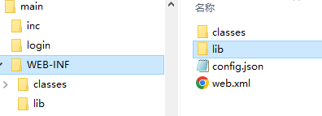
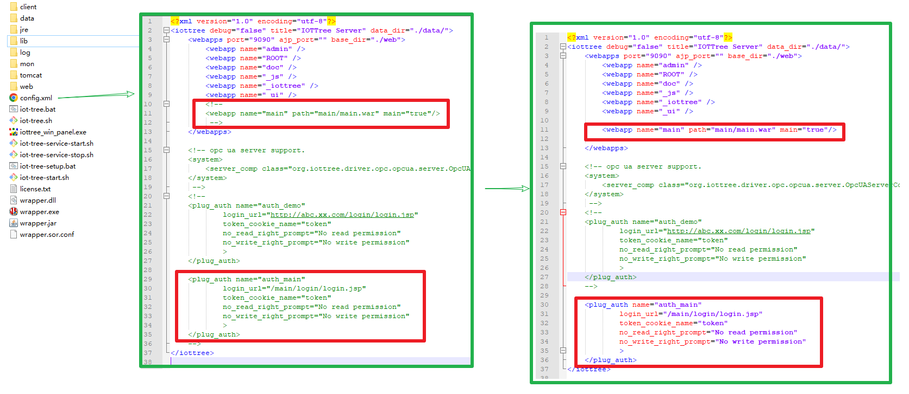
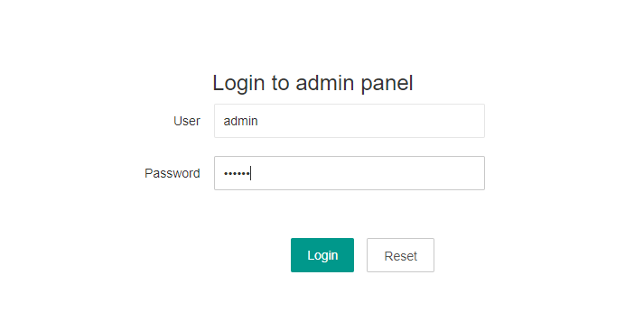
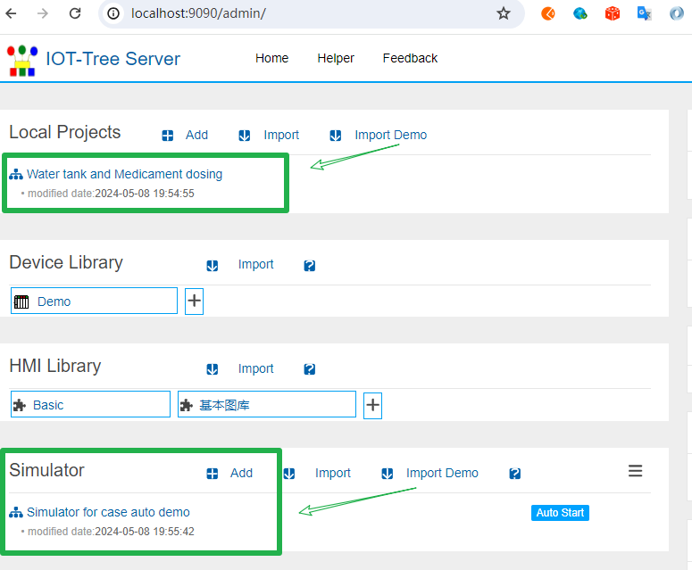
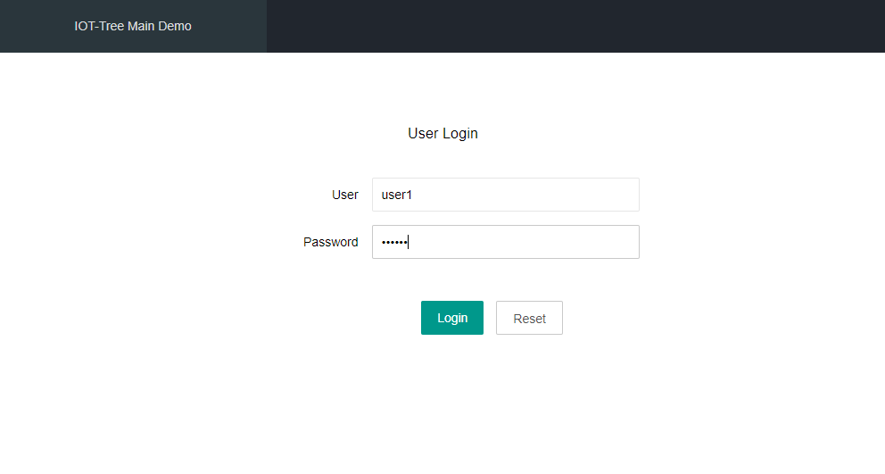
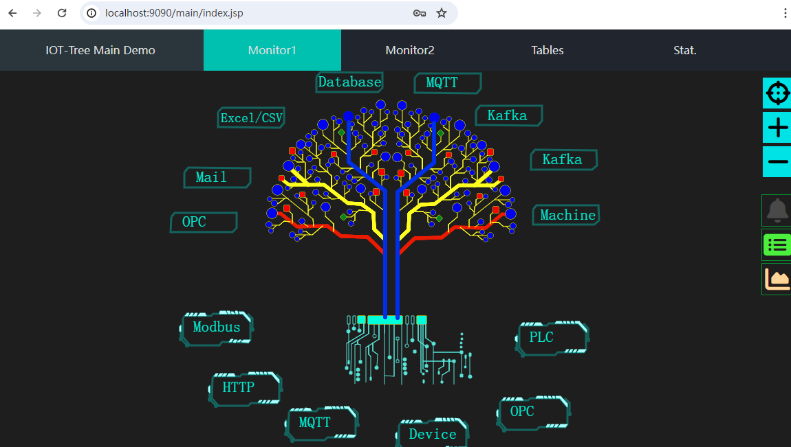

Custom Project Management (Webapp)
==


In many traditional SCADA systems, to support on-site monitoring and business of a certain scale, it is often necessary to configure a lot of UI content in the software, and then use specific navigation components for integration. Due to the limitations of the technology used in the monitoring UI, your performance is limited, and slightly more complex business functions are not easy to implement. 

If you need to use IOT-Tree to implement a larger scale SCADA system, the UI requirements should be similar to many popular management systems - including navigation, local databases, monitoring UI, chart statistics and analysis, GIS map functions, 3D display effects, etc. How should it be implemented?

You can fully use Webapp related development methods to implement top-level SCADA services, and then integrate monitoring UI and JSON data from the independently running IOT-Tree. By using nginx as the front-end unified entry point, IOT-Tree and your webapp can share cookies in the same domain space, achieving unified permissions. Specific reference can be made to:


[Plugin Development - Authority][plugin_auth]


The above method is based on the premise that your business system is very large and complex, consisting of multiple web server instances, and daily maintenance work is not small. For most SCADA systems, there is no need to make them so complex. Is there a better choice? That's the content of this article.


## 1 Customized webapp technology background

In our original plan, we also considered using traditional configuration UI methods - by providing specialized navigation draw item and configuration parameters to define navigation content, and then using several JavaScript APIs to support UI switching and dialog box calls. Later, we realized that it was completely unnecessary. There are mainly the following reasons:

1) In order to achieve SCADA software with different monitoring UI and navigation content (including different permission restrictions) after logging in from different locations and users. Many traditional SCADA software clients have similar effects to the browsers we use. Essentially, they are data centers that aggregate on-site data, provide unified services, and then the client loads different monitoring UI (including navigation) based on permissions. It can be said that the rendering capabilities currently supported by browsers can completely replace such clients.

2) The current top-level business data and management functions have been largely monopolized by browsers. As long as you have worked on web applications, you will have a deep understanding of this. Browser based front-end technology is developing rapidly, and the interactive capabilities displayed are becoming increasingly powerful. The client-side approach not only presents high development difficulties, but also poses a headache and hassle for post deployment maintenance. Unless you are developing some special tool software or proprietary systems, you will not consider developing software systems using a client-side approach. In fact, IOT-Tree provides a completely web-based monitoring UI, which is also based on this reason - it can better adapt to the Internet of Things+Internet environment.

3) The IOT-Tree Server is developed using Java and embedded with the Tomcat web container, which can fully leverage the advantages of Tomcat. You only need to be able to develop standard Java Servlet/JSP Webapps to deploy them to IOT-Tree Server, and then add some plugin classes and simple configuration files to make your Webapp the main UI of IOT-Tree Server, making it easy to complete SCADA systems with a certain degree of complexity.

If you are not familiar with Java Webapp, it is recommended that you take a little time to learn it, as it may not be overwhelming; Or you can find a Java programmer to help you a little. This article is based on the "main webapp" that comes with the release version, and will explain in detail the implementation method of this webapp, which is also a good learning content.

If you are familiar with Java Webapp development, no matter what technology you use (such as spring, etc.), it is best to package the war file and deploy it to the appropriate directory on the IOT-Tree Server. Please refer to the following for specific content.


## 2 Overall Description of Main Webapp


In the IOT Tree release version, after decompression, you can see the file main.war, a Java webapp, in the directory web/main/. The war file is essentially a zip compressed file. After decompression, you can see the resource files related to the web page inside. Among them, the WEB-INF/ directory is the Webapp server-side program information, which contains classes/ and lib/directories, respectively, storing Java class and jar library files, as well as the configuration file web.xml. Among them, config.json inside is the configuration file related to the IOT-Tree plugin.





Below, this article provides an overall explanation of the "main demo" related code.

Please refer to other documents for the deployment and installation of IOT-Tree. This article does not describe it, and the port enabled by the server is 9090.


### 2.1 Enable main webapp


By default, the configuration in the IOT-Tree Release version does not enable this webapp. At this point, please open the config.xml file in the root directory of the IOT-Tree Server deployment and uncomment the two annotated configuration contents inside. As shown in the following figure:




```
<webapp name="main" path="main/main.war" main="true"/> 
```


This configuration enables the main webapp, where main="true" indicates that this webapp is the main webapp in this IOT-Tree. This represents the URL address when accessing IOT-Tree http://host:port/, the system will automatically redirect to http://host:port/main/.

```
<plug_auth name="auth_main" 
        login_url="/main/login/login.jsp"
        token_cookie_name="token"
        no_read_right_prompt="No read permission"
        no_write_right_prompt="No write permission"
        >
</plug_auth>
```


This configuration indicates that this IOT-Tree deployment instance uses the "auth_main" permission plugin. This "auth_main" is also provided by the main webapp, which is the plugin information by WEB-INF/config.json.  This content will be explained in detail later.


### 2.2 Start IOT-Tree and prepare the dependency demo project


First start the IOT-Tree Server, then access it http://localhost:9090/admin/ Enter the project management login page:





<font color="red">Please note that the admin login verification has been taken over by the plugin in the main webapp. Please enter the password: 123456 to log in</font>

In order to demonstrate the integration effect of the monitoring UI and this webapp in the project, we also need to import the demo project that comes with the release version: "Water tank and Medical Dosing"; This demo project also relies on the device simulator project "Simulator for case auto demo". We import them separately using the "Import Demo" button. The final is shown below:




We will launch the device simulator and project separately - please refer to the following contents:

 [Case of industrial automation system][case_auto]

Now, we can check the running effect of the main webapp.

### 2.3 Running Effect


Access address http://localhost:9090/ You will find that the page will automatically redirect to http://localhost:9090/main/login/login.jsp . This is the login page provided by the main webapp for end-users. As shown in the following figure:





This login page is completely controlled by the main webapp itself. As you can imagine, if this is your Java webapp, then it should be your own defined login page. In fact, when IOT-Tree is accessing http://localhost:9090/, the address to be redirected is http://localhost:9090/main/ At this point, it is taken over by the main webapp, and in the main webapp permission judgment, it automatically jumps to the login URL.

Please fill in username=user1 and password=123456. After logging in, enter the page with navigation function as follows:





The main webapp demonstrates a simple,with just one level of navigation above. After clicking, the main content area below can switch content. For example, click on "Monitor2", and the page is as follows:


The above two navigation contents correspond to the two real-time monitoring UI in the "Water tank and Medical Dosing" demo project, while the remaining navigation menus "Table" and "Stat." represent the main webapp's own tables and statistical functions. The relevant content is only for display and explanation.

Next, we will enter the code and configuration of this project, providing a detailed explanation.


## 3 Implementation Description of Main Webapp

### 3.1 Simple explanation of Java webapp

#### 3.1.1 Filter and configuration of main webapp


The filter of Java webapp can intercept requests when accessing the URL of the webapp. From here, you can determine whether the user is logged in based on the request information. If no user is logged in, you can force a redirect to the login page. If it is found that the user has already logged in, it can be determined whether this URL allows the current user to access it.

The corresponding class in the main webapp for this demonstration is com.xxxx.app.AppFilter


```
package com.xxx.app;

import java.io.IOException;
...

public class AppFilter implements Filter
{
	public static final String TK = "token";
    
	@Override
	public void init(FilterConfig filterConfig) throws ServletException
	{
		
	}

	
	@Override
	public void doFilter(ServletRequest request, ServletResponse response, FilterChain chain)
			throws IOException, ServletException
	{
		HttpServletRequest req = (HttpServletRequest) request;
		HttpServletResponse resp = (HttpServletResponse) response;
		HttpSession session = req.getSession();
		//this.getServletContext()..getRequestDispatcher(getServletInfo())
		response.setContentType("text/html;charset=UTF-8");
		String cxtp = req.getContextPath() ;
		String path = req.getServletPath() ;
		//System.out.println("uri="+uri +"  qs="+qs);
		if(path.startsWith("/login/"))
		{
			chain.doFilter(request, response);
			return ;
		}
		
		String tk = (String)session.getAttribute(TK) ;
		if(tk!=null&&!tk.equals(""))
		{
			chain.doFilter(request, response);
			return ;
		}
		
		resp.sendRedirect(cxtp+"/login/login.jsp");
	}
	
	
	@Override
	public void destroy()
	{
		
	}

}

```


This filter implementation determines whether there is a token in the session. If not, it indicates that no user is currently logged in and forces a redirect to the login URL. If available, allow page output. This filter needs to be configured in the WEB INF/web.xml file, as follows:


```
<?xml version="1.0" encoding="utf-8"?>
<web-app ...>
    <description></description>
    <display-name>main</display-name>
    
    <filter>
        <filter-name>AppFilter</filter-name>
        <filter-class>com.xxx.app.AppFilter</filter-class>
        <init-param>
            <param-name></param-name>
            <param-value></param-value>
        </init-param>
    </filter>
    <filter-mapping>
        <filter-name>AppFilter</filter-name>
        <url-pattern>*.jsp</url-pattern>
    </filter-mapping>
</web-app>
```

#### 3.1.2 Login Pages


In the login/ directory, there are two files: login.jsp and login.ajax.jsp. Among them, login.jsp displays the login page, where the user enters their password and clicks to log in. The data will be submitted to the login_ajax.jsp. Perform the specific login process in this JSP content.

The code for login_ajax.jsp is as follows:


```
<%@ page contentType="text/html;charset=UTF-8" isELIgnored="false"%><%@ page import="java.util.*,
				java.io.*,
				java.net.*,
				java.util.*,
				org.iottree.core.*,
				org.iottree.core.util.*,
				java.net.*"%><%
	String op = request.getParameter("op") ;
	String user = request.getParameter("user") ;
	String psw = request.getParameter("psw") ;
	if(op==null)
		op="" ;
	switch(op)
	{
	case "login":
		if("user1".equals(user) && "123456".equals(psw))
		{
			session.setAttribute("token", "user1_1111111") ;
			Cookie ck = new Cookie("token","user1_1111111") ;
			ck.setPath("/") ;
			response.addCookie(ck) ;
			out.print("ok") ;
		}
		else if("admin".equals(user) && "123456".equals(psw))
		{
			session.setAttribute("token", "admin_1111111") ;
			Cookie ck = new Cookie("token","user1_1111111") ;
			ck.setPath("/") ;
			response.addCookie(ck) ;
			out.print("ok") ;
		}
		else
		{
			out.print("login failed") ;
		}
		return ;
	case "logout":
		out.print("ok") ;
		return ;
	default:
		out.print("unknown op") ;
		return ;
	}
%>
```


This login process is only for demonstration purposes and supports two accounts, user1 and admin. When verification is successful, the "token" attribute will be placed in the current session (the previous AppFilter used this as the content to determine whether to log in).

Next, it is more important to include this token in the browser's cookie, so that it can be shared and used by the monitoring UI pages in IOT-Tree. This way, there is also a chance for these monitoring pages to be controlled and output by the "main webapp".


#### 3.1.3 Main page with navigation index.jsp


This page is very simple to implement as it is only a demonstration experiment. The page content is divided into two parts: the top is the navigation menu, and the bottom is the specific content. Clicking on a navigation menu will call the nav_to JS function, which sets the content in the main content area based on the navigation content. If it is a reference to the monitoring UI, set the iframe content in the main content area, as shown in the following code:


```
<script>

function nav_to(p)
{
	$(".nav_item").removeClass("nav_sel") ;
	$("#ni_"+p).addClass("nav_sel") ;
	switch(p)
	{
	case "iottree":
		$("#main").html(`<iframe src="/watertank/iottree" style="width:100%;height:100%;overflow:hidden;border:0px;"></iframe>`) ;
		return ;
	case "u1":
		$("#main").html(`<iframe src="/watertank/u1"  style="width:100%;height:100%;overflow:hidden;border:0px;"></iframe>`) ;
		return ;
	case "tb":
		$("#main").html(`Your table data here:<br><table style="width:80%"><tr><td>1</td><td>2</td><td>3</td></tr></table>`) ;
		return ;
	case "st":
		$("#main").html(`Your stat data here`) ;
		return  ;
	default:
		alert('navigate to '+p) ;
		return ;
	}
}

nav_to('iottree');
</script>
```


Among them, the following code is the u1 monitoring UI "/watertank/u1" that sets the main content area to include demonstration projects:

```
$("#main").html(`<iframe src="/watertank/u1"  style="width:100%;height:100%;overflow:hidden;border:0px;"></iframe>`) ;
```

### 3.2 Permission plugin code and configuration


According to the limitations of Java webapps, under a tomcat, the context and loaded classes between multiple webapps are isolated from each other. That is to say, the session in different webapps is not shared. Therefore, in order to enable your webapp to control the project page within the instance, IOT-Tree achieves this boundary crossing through plugins.


#### 3.2.1 Plugin Code

Please refer to:

[Plugin Development - Authority][plugin_auth]


The implementation and use of plugin code are exactly the same. In order to avoid relying on interface definitions in IOT-Tree for your implementation, IOT-Tree specifies the function names and parameters in the plugin class, and you can define the class names freely.


com.xxx.app.UserAuth

```
package com.xxx.app;

import java.io.File;
import java.util.HashMap;

public class UserAuth
{
	/**
	 * this method will be called when plug is inited.
	 * you can do some initial work here
	 * 
	 * @param plugdir
	 * @param params
	 * @throws FileNotFoundException
	 * @throws IOException
	 */
	void init_plug(File plugdir, HashMap<String, String> params) throws Exception
	{
		
	}
	
	/**
	 * option method
	 * 
	 * when you access http://iot_tree_server_host:port/admin,you must login by register name and password
	 * 
	 *  if this method is here,the default user authentication provided by the system will be ignored.
	 *  
	 *  
	 * @param reg_name
	 * @param password
	 * @return
	 */
	public User checkAdminUser(String reg_name,String password)
	{
		if("admin".equals(reg_name) && "123456".equals(password))
			return new User("","admin","Adminstrator") ;
		
		return null ;
	}

	/**
	 * Obtain user information according to the token
	 * 
	 * @param token provided by page cookie or other ways
	 * @return
	 */
	public User checkUserByToken(String token)
	{
		if(token==null||"".equals(token))
			return null ;
		
		if(token.startsWith("user1_"))
			return new User("","user1","User1") ;
		else if(token.startsWith("admin_"))
			return new User("","admin","Adminstrator") ;
		return null ;
	}
	
	/**
	 * this method will be called when outer will access node path in iottree like /prjname/n1/u1
	 * 
	 * The node related to this path may be a context node that returns JSON data. 
	 * Or the HMI UI node outputs the UI picture
	 * 
	 * @param node_path  like /prjname/n1   /prjname/n1/u1
	 * @param reg_name login user name or null or empty
	 * @return
	 */
	public boolean checkReadRight(String node_path,String reg_name)
	{
		//System.out.println("checkReadRight "+node_path+" "+reg_name) ;
		if("admin".equals(reg_name)||"user1".equals(reg_name))
			return true ;
		return false;
	}
	
	/**
	 * this method will be called when outer will write some data to node path in iottree like /prjname/n1/u1
	 * 
	 * this may be update some tag value in node or send cmd in hmi
	 * 
	 * @param node_path
	 * @param reg_name
	 * @return
	 */
	public boolean checkWriteRight(String node_path,String reg_name)
	{
		//System.out.println("checkWriteRight "+node_path+" "+reg_name) ;
		
		if("admin".equals(reg_name))
			return true ;
		return false;
	}
}

```


The function "checkAdminUser" in this class is mainly provided for IoT-Tree project admin login verification（ http://localhost:9090/admin ）. The "checkUserByToken" function is provided to the referenced monitoring UI for permission judgment.

As mentioned earlier, after logging in, a token is set in the cookie. Therefore, when the monitoring UI page is referenced, this token will be input into this function in the verification plugin. Your webapp can implement this function to determine the current logged in user information through the token.


#### 3.2.2 Plugin Configuration WEB-INF/config.json


Although the plugin class is implemented above, it will not work in the main webapp without relevant configuration. IOT-Tree regulation: Write the configuration file config.json in the WEB-INF/ directory of the webapp. After deployment, when starting IOT-Tree, it will automatically search for this configuration file when the webapp is loaded, and load plugins based on the configuration information inside - including permission verification plugins. The configuration code for this demo is as follows:


```
{
	"name":"main_plug","title":"Plug In Main Demo",
	"js_api":
	[
	],

	"auth":
	[
		{
			"name":"auth_main","class":"com.xxx.app.UserAuth"
		}
	]
}
```


From it, it can be seen that the permission plugin name is defined as "auth_main", which is the class mentioned above.

Please go back to the initial IOT-Tree configuration file config.xml. You can see that

```
<plug_auth name="auth_main" ...
```


This name is the corresponding name for this plugin.

So far, a basic and complete webapp has been implemented.


## 4 Summary


If you use IOT-Tree to implement SCADA projects with certain top-level business content, it is recommended that you use a custom webapp, combined with permission plugins, to complete your overall system functionality. This not only allows you to fully utilize the convenience of Java in top-level business development, but also allows IOT-Tree to play a greater role in your application.

You can use development frameworks such as "Spring" to implement webapps, so all you need to do is focus on the plugin classes and the WEB INF/config.json configuration file - just make sure these contents are present in the war file.

Your webapp allows you to implement current popular page styles, such as cockpit, 3D landscapes, GIS maps, and more. Then, you can easily integrate the monitoring UI and data from the IOT-Tree project into your rich and colorful pages.


[plugin_auth]: ./adv_plugin_auth.md
[case_auto]: ../case/case_auto.md
