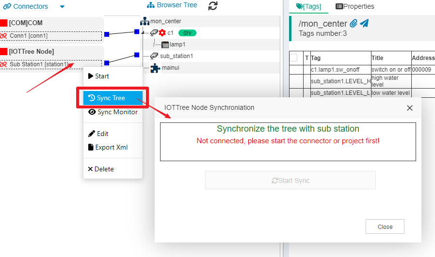

Center-substation remote monitoring
==


At present, many IoT systems often have the following requirements:

1) There are many objects to be monitored in some industrial sites, and the deployment of a single software instance cannot meet the needs of on-site use. In order to simplify and clarify the overall monitoring architecture, it is generally divided into the superior subordinate relationship formed by the sub station and the monitoring center. Each sub station can be regarded as an independent running system, and can have its own main monitoring equipment. This main monitoring equipment can run an instance of IOT-Tree for local monitoring, and the monitoring center can summarize all the sub stations below. The sub station can share all its own data, and can also accept some instructions from the center.

2) Some sub stations in industrial sites may be far away from the monitoring center, and must be connected to the center through a specific communication mode. However, many of our current systems are running inside units/organizations, so how to share data safely, reliably and effectively is a challenge.

IOT-Tree specifically aims at such application requirements and implements project sharing and connection support - which can make you easily solve such large-scale/distributed problems.

## 1 IOT-Tree project sharing and connection mechanism

IOT-Tree currently implements project sharing and connection support based on MQTT.


In a distributed system, the sub station can connect to the local field devices according to its own needs, configure the relevant connections and use device drivers, and then use an IOT-Tree Server for local unified management - the whole process is like an independent system.

Then, we can deploy an "MQTT broker" in the head office or the cloud (in fact, this MQTT broker can also use an IOT-Tree Server, just start the MQTT service inside), and each sub station can share data through this MQTT broker.

Then, deploy an IOT-Tree Server in the monitoring center, and configure the corresponding IOT-Tree node connector for this instance.

### 1.1 MQTT

MQTT is a communication protocol currently used by the Internet of Things system. It mainly provides communication support based on publish/subscribe mode.

Please refer ：<a href="doc/conn/msg_mqtt.md" target="main">&nbsp;&nbsp;&nbsp;Message - MQTT</a>

### 1.2 Benefits of using MQTT communication

Implementing multiple IOT-Tree Server deployment instances based on the topic message publishing and subscription mechanism can bring the following benefits.

1. You can mask various complex network topologies: between different instance nodes, you only need to point to the same MQTT broker. Through flexible subscription mode, multiple sub stations and multi center structure can be realized;

2. The communication reliability of relevant MQTT brokers can be fully utilized;

3. The sharing and connection implementation of the project is also simple;

### 1.3 the sub station becomes a sub tree of the center

The local IOT-Tree of the sub station runs a project tree. After being connected to the central node through sharing, it forms a sub tree of the corresponding channel under a project. The tree structure of the sub station can be copied to the central node as a whole (container nodes in it will be replaced by Tag Groups).

Next, we will use a demonstration to illustrate the whole configuration process.

## 2 IOT-Tree project sharing configuration process

Before detailed description, we prepare the following environment:

1) A cloud environment has a public IP address. We run an IOT-Tree Server on it and start the Apache Active MQ service to provide MQTT Broker running node.

2) Deploy an IOT-Tree Server on one machine in a LAN and start the built-in demonstration project "Water tank and Medical Dosing", which uses an internal simulator devices. This IOT-Tree Server is used to simulate a remote substation.

3) Deploy an IOT-Tree Server on another machine in the LAN as the monitoring center, create a new central project, and then add connector of remote substation through the MQTT broker.


This environment can be said to be a typical IOT application network. Since the remote  station is far from the terminal station, it is usually operated by nobody. The operation control inside can be connected to the cloud through 4G/5G routers. Our central system is basically inside the enterprise/organization LAN for security. Through The MQTT broker in the middle, it can easily form a hierarchical relationship. Using MQTT, complex network relationships can be shielded. When the network environment of the substation is adjusted, the running of the existing system will hardly be affected.

### 2.1 Cloud MQTT Broker Configuration

Prepare a cloud virtual machine with a public network ip: 111.xxx.xxx.xxx. Install and configure an IOT-Tree Server in it. Please refer to relevant documents for the installation and configuration process.

After startup, enter the admin page, click the "Setup" button under Services, and click the "Edit" button under "Apache Active MQ". Fill in the following information:


Among them, we enable MQTT, set the running port 1883, and set the name and password of one or more authentication users who can connect to this MQTT.

After confirmation, you can click the start button of "Apache Active MQ" to ensure that this item enters the normal running state. At this point, we have configured the cloud MQTT Borker node. You can use the command "telnet 111. xxx. xxx. xxx 1883" remotely to test. Please check whether the firewall has restrictions to ensure that the MQTT server broker can be connected remotely.

### 2.2 IOT-Tree Server node configuration of LAN substation

#### 2.2.1 Configure sub station project

The host address of the LAN substation used in this document is 192.168.18.19. Install and configure an IOT-Tree Server. We import the demonstration project "Water tank and Medical Dosing". When importing, we change the project name to "sub_station1", as shown below:


After the project is imported, for the convenience of demonstration, the device simulator required for this project is also imported and started:


#### 2.2.2 Share the substation project to the cloud MQTT broker

Enter the substation project admin page, click the "share project" icon, and fill in the project sharing parameter information as follows:


The MQTT Host and Port point to the relevant address and port of the MQTT broker configured on our cloud. The MQTT User and Password are also the link authentication user passwords defined by our cloud MQTT broker. The content of this document is very simple. Please write a complex password for your actual project to ensure security.

In addition, the "Push Interval" parameter is the time interval in milliseconds for regular push, that is, the time interval for actively pushing updated data to the MQTT Broker during the running of the sub station project. The smaller the time interval is, the faster the data push update speed is, but the larger the network bandwidth is occupied. Please carefully define this time according to your actual situation on site.

Click the "Ok" button to configure the project sharing parameters. At this time, you can start the project and view the changes of this sharing icon. As shown in the figure:


Note: Please do not forget to start the devices simulator required for this project at the same time, so as to ensure that the project starts and runs normally, so as to facilitate our subsequent demonstration instructions.

#### 2.2.3 Obtain the substation project ID

Currently, all work of the substation project has been completed. But we need to get the ID number of this substation project and provide it as a parameter to center. In the main admin page, click the project root node, select the "Properties" tab in the main content area on the right, and copy the ID (this project is e3O8mE92ME6vJuTtytU). As follows:


### 2.3 Configure the center project and get the substation from the cloud MQTT broker

This document is on the host (192.168.10.11) in the local area network of the monitoring center. Install and configure an IOT-Tree Server. We can import a demonstration project randomly. When importing, we change the project name to "mon_center". As shown below:


We use this project as the IOT-Tree instance of the monitoring center. Next, we will configure to link in the substation "sub_station1" from the cloud MQTT broker.

#### 2.3.1 Add "IOTTree Node" connector

Click "Connectors" in the upper left corner of the center project admin page, select "IOTTree Node", and fill in the parameters for MQTT broker and substation's project in the pop-up dialog box:


The filling information is as follows

```
Name=station1
Title=Sub Station1
MQTT Host=111.xxx.xxx.xxx  Port=1883
MQTT User=u1
MQTT User=123456
Share Project=e3O8mE92ME6vJuTtytU
```

In addition to the address, port, user and password required for MQTT connection. The most important parameter is the "Share Project" parameter. We need to fill in the project ID corresponding to the substation. We have prepared this parameter before, and it is OK to fill in it accurately.

Click "Ok" to complete the corresponding sub station connector. You can see that the connector on the left has already appeared in the list.


#### 2.3.2 Add channel and associate this connector

In IOT-Tree, the substation project connector will eventually be reflected in a channel - that is, in the central project, each substation connector will correspond to a channel.

It is very simple to create a channel. Right click the project root node, select "New Channel", and fill in the channel name, as shown below: sub_station1


After confirmation, click on the small box on the right of the connector "station1" node and move it to the small box corresponding to the channel "sub_station1" to release, and then the association between connector and channel can be established. The final effect is as follows:


#### 2.3.3 Synchronization tree structure and data of substation

Next, we need to take the most important step: copy the entire tree structure configured by the substation to the "sub_station1" channel.

Right click the connector node "station1" on the left and select "Sync Tree". You will see a synchronization dialog box.



At this point, it indicates that we must have a connection first. Obviously, if you want to copy the tree structure of the substation, you must ensure that the communication is normal. Now, we can start the project and confirm that the connector is normal (ensure that the left icon of the connector node "station1" turns green). Then open the dialog box again.


At this time, you only need to click the "Start Sync" button, and after some time, you will be prompted that the synchronization is successful. If the synchronization fails, check whether the sub station starts normally and whether the central node communicates with the cloud MQTT broker normally.

Click the "Close" button to close the dialog box, and you will see that the project tree defined by the sub station has been copied. As shown below:


As you can see, in addition to container nodes and tag nodes, HMI (UI) nodes are also copied.


Please compare the tree structure of the substation with that of the center carefully. You will find that the tree of the whole substation becomes a channel branch of the center node. In addition, container nodes such as channel and equipment in the substation are replaced by tag groups.

So far, we have completed the whole process of substation connector to center.

#### 2.3.4 Difference of running between substation and center

##### 2.3.4.1 Update interval difference

We ensure that the center and sub stations are in normal running. From the above configuration information, we can know that when the substation shares itself, it will push data once every 10000 milliseconds, that is, in an average of 10 seconds, the center will receive a data update from the sub station. Therefore, we can see from the list of tags in the center admin page that the tags related to the sub station will refresh once every 10 seconds on average. Open the UI running monitoring page, and you will also see that the dynamic changes in it will become once every 10 seconds.

Obviously, you can reduce the push interval of sub stations according to the need of refresh, and the data refresh of the center will also be accelerated.

##### 2.3.4.2 Write command running difference (very important)

Open the "u1" monitoring page of the sub station in the center (right click the u1 node and select Access). Click the mouse to start or stop the control button. You will find that the center page can also control the running of the pumps in the substation, that is, the center can write instructions to the sub stations.

When the center user clicks the button to issue the command in the monitoring page, the corresponding script will eventually run, as shown in the following figure. We right click "u1" and select "Edit UI", and you will see that we can also open this HMI node to enter the editing status.


Select the "Stop" button in the editing UI, click the event processing js script, and you will see that the script will eventually run in the center node.
```
ch1.dio.pstop._pv=1;
```

This tag assignment code will eventually be processed by connector "station1". It will be pushed to the substation, and the substation will also trigger the writing of this tag - thus triggering the corresponding device driver writing action.

From this, we can see that the center should give instructions to the sub stations, which is ultimately reflected in the writing of Tags. If some special parameters are used by JS script in the monitoring UI, the write tags generated by the center operation may be different from those generated by the substation operation. In addition, if the substation restricts the writing of certain tags when sharing, the writing push of these tags generated by the center will also be ignored.

Therefore, when using the IOT-Tree distributed mechanism, if the center needs to control the writes to the substations, please keep it as simple and clear as possible. If necessary, the sub station can set HMI nodes for the center, and these HMI nodes can provide the center with limited control commands.


## 3 Summary

It can be seen that the integration of multiple deployment instances in IOT-Tree is very simple and unified. If your project meets similar needs, using IOT-Tree can produce great value for you.

The substation of this document runs an IOT-Tree Server independently. In fact, if your site has only a few simple buses and a few devices that can be directly connected to the cloud through 4G/5G DTUs, then the IOT-Tree Server can also be deployed to the cloud (integrated with MQTT Broker), and the devices on the site will be simpler. This deployment instance on the cloud can also be shared and become a substation of central monitoring.


