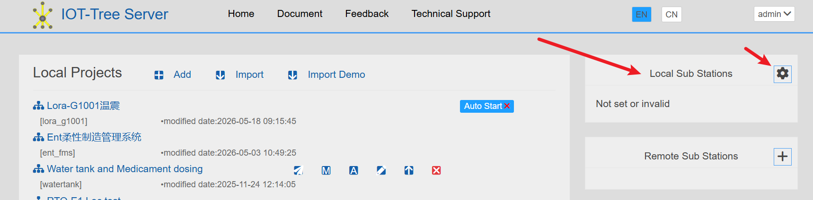
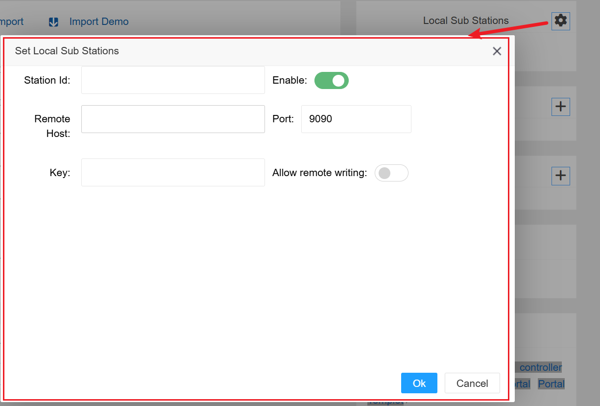
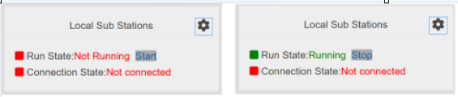
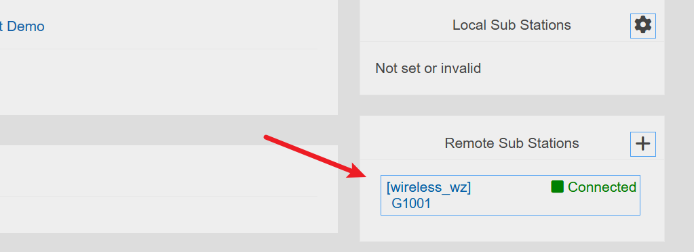
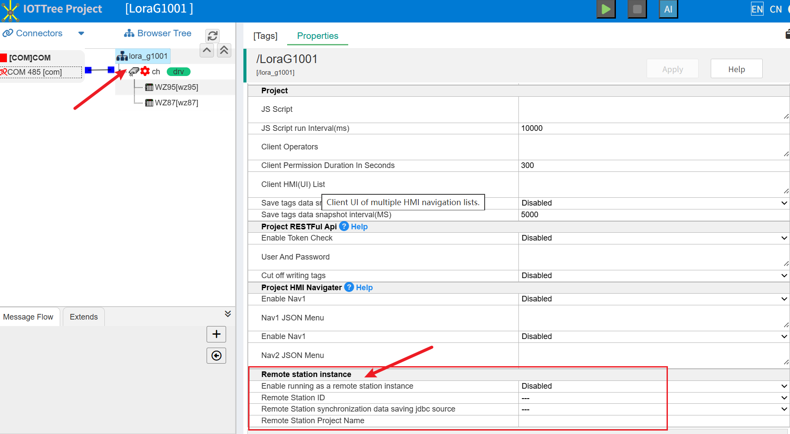
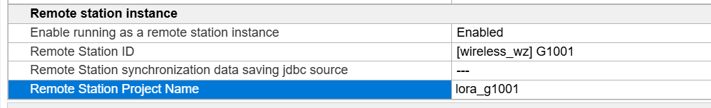
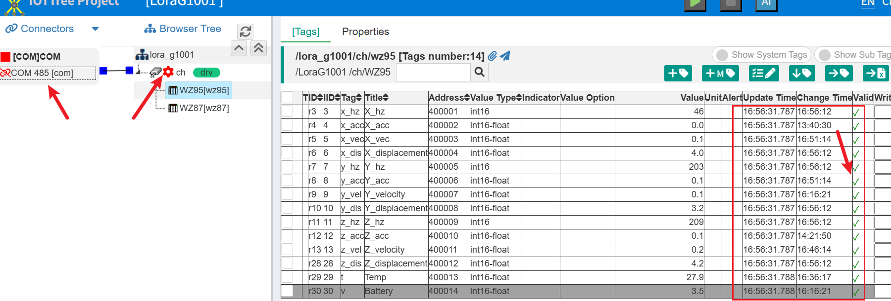

Center-substation data synchronization(Inner)
==


Starting from version 1.9.0, IOT Tree internally ported and open-source the data synchronization function between the center and sub sites. This feature has been used in our development team's enterprise user system for a long time and is stable and reliable enough. The center substation function previously implemented based on the MQTT protocol will no longer be maintained.

In many current IoT systems, there are often the following requirements:

1) There are many objects that need to be monitored in some industrial sites, and a single software instance deployment cannot meet the needs of on-site use. In order to simplify and clarify the overall monitoring architecture, it is generally divided into a hierarchical relationship formed by sub stations and the main monitoring center. Each sub station can be seen as an independent operating system, with its own main monitoring device that can run instances of IOT Tree for local monitoring, while the main monitoring center can consolidate all the sub stations below. The sub stations can share all their data and also accept some instructions from the main station.

2) Some industrial sites and sub stations may be far away from the main monitoring center and must be connected to the main station system through specific communication methods. And many of our current systems run within units/organizations, so how to securely, reliably, and effectively share data and access control is a challenge.

IOT Tree specifically addresses such application requirements by implementing data synchronization between central and sub sites, making it easy for you to solve such large/distributed systems.

## 1. Data synchronization operation mechanism between IOT Tree center and sub sites

Data direction: In daily operation, data is pushed from sub stations to the central station at regular intervals based on the projects in IOT Tree. The push time interval and other parameters are also based on project configuration.

Therefore, each data packet pushed by the sub station is all or changed tag data in a project. That is to say, both the substation and the central station should have projects with the same data structure.


In most cases, each substation runs on site - it can be an on-site industrial computer or an embedded edge device.

The central IOT Server generally operates in the on-site control room, computer room, or cloud. And it is sufficient to provide web services for each substation externally (such as the default 9090 web access port provided by IOT Tree).

Assuming that both the on-site sub station and central station projects have been configured, as shown in the above figure. The on-site site project is directly connected to the on-site equipment (PLC, sensors, controllers, etc.), while the central project has the same tag definition structure as the corresponding on-site project.

After all the above conditions are met, relevant settings need to be made for both the substation and the center to enable automatic data synchronization between them.

## 2 on-site station (sub station) configuration

Accessing the sub site management interface (such as accessing) http://sub_station_ip:9090/admin/ ）. The 'Local Substation' block in the upper right corner is used to set the configuration range for on-site substations.



Click on the settings icon to open the configuration window. as follows



Among them, the site ID is required to be unique across all distributed projects, representing the unique identifier of the current sub site. This identifier only allows ASCII payments and numerical combinations. The remote host and port are the addresses and ports published by the central system to the outside world. Key is the connection key for the local substation, which needs to be paired during subsequent configuration of the connection center.

```
Station Id=wireless_wz
Remote Host=center_host_addr
Port=9090
Key=you_key_xxx
```

After successful configuration, the configuration block will display the current running status information of the substation. Click the "Start" button to start the internal synchronization task of the substation:



It can be seen that even if the backend task has been started, the connection status still cannot connect to the center successfully because the center does not have the corresponding configuration yet.

## 3-center configuration

### 3.1 Remote sub site pairing configuration

Access the central management interface (such as access) http://center_ip:9090/admin/ ）. The second block in the upper right corner, 'Remote Substation', is used to set the configuration interval for central access to remote on-site substations.


Click the+button in the upper right corner to bring up the following window:


Among them, the site ID requirement is the configuration corresponding to the remote terminal station, representing the unique identifier of the current sub station. This identifier only allows ASCII payment and numerical combination. Key is the connection key for the remote terminal station, and the key must be the same.

```
Station Id=wireless_wz
Key=you_key_xxx
Title=G1001
```
After completion, if the sub station is running normally and the network is also smooth, the following can be seen:



You can see that the connection is normal. At this point, returning to the sub station management interface, you can see that the connection has also been successful:


### 3.2 Configure the project for receiving data

The pairing communication from the substation to the center has been completed above. So the next step is to configure the projects that need to be synchronized in this substation. In this example, both the substation and the central station have the same project name "lora_g1001". We need to configure the remote sub station and sub station project name corresponding to this project in the project at this time, so as to determine the synchronized data project corresponding to the center.

Click on the project to enter the main interface of the project management interface, click on the project root, and then go to the main content to click on "Properties", and then in the right property block "Remote station instance", as follows:



Set the attributes as follows:



After clicking the "Apply" button to save, return to the main interface of the central IOT Tree system management (refresh interface). You can see that this project will display the associated remote substation information:


### 3.3 Configure sub station synchronization parameters from the center

As long as the sub station and the center are successfully connected, IOT Tree supports configuring some synchronization parameters of the sub station from the center, such as synchronization time intervals. After all, sub stations are usually located on site (possibly far away), and synchronization parameters such as synchronization intervals may involve traffic restrictions. The main station can set relevant parameters for sub stations, which can greatly facilitate subsequent operation and maintenance.

In the main association interface of the center, move the mouse to the remote substation item configured above, and you can see a synchronization parameter setting button, as follows:


After clicking, a sub station parameter setting dialog box will pop up, where you can see a list of all items for the sub station. You can enable data synchronization and time interval parameters for the projects that need to be synchronized inside. Then click the "Set Parameters to Substation" button to issue setting instructions to the substation:


## 4 Final Results

At this point, in the central IOT Tree, open the corresponding project and the tag list under a certain node, and you can see that the data of the remote substation has been synchronized. At the same time, both the left access and the driver are not running (as they are required by the on-site substation). As shown in the figure below:



At this point, this sub station has successfully connected to the center.

Obviously, other sub stations and internal projects can also be connected to the same center in a project-based manner.

It can be seen that in IOT Tree, the integration of multiple deployment instances based on projects between sub stations and centers is very simple and unified. If your project encounters similar needs, using IOT Tree can generate great value for you.

## 5 More

Due to the fact that the synchronization between the substation and the center is project-based and related to the internal label data structure. After synchronizing a certain project, you can do more things on the central station:

1. It is possible to add monitoring screens

The monitoring screens in the central station can operate normally like those in the sub stations, and you can also add more monitoring screens that are not available in the sub stations

2. Add message flow to the corresponding project for further processing

The central station can add more message streams as needed to process and use synchronized data

3. The central station can provide a unified data API or shared data for the IoT platform


