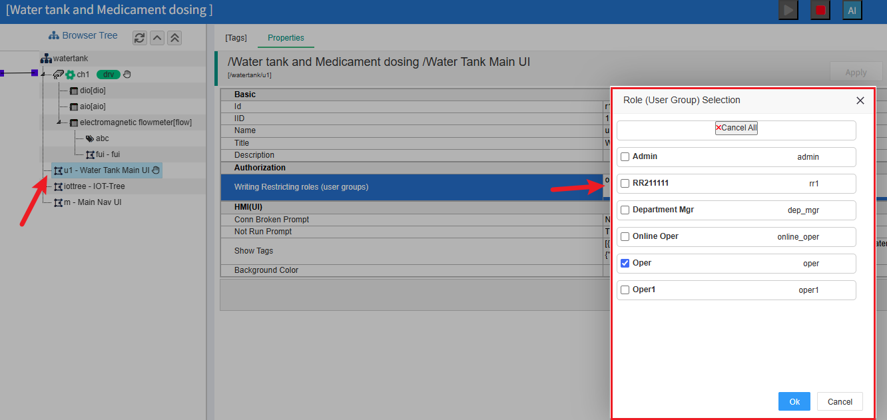
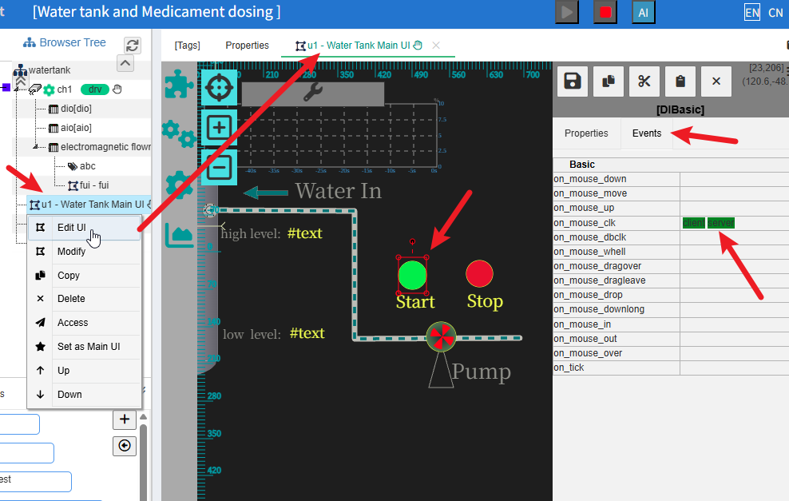
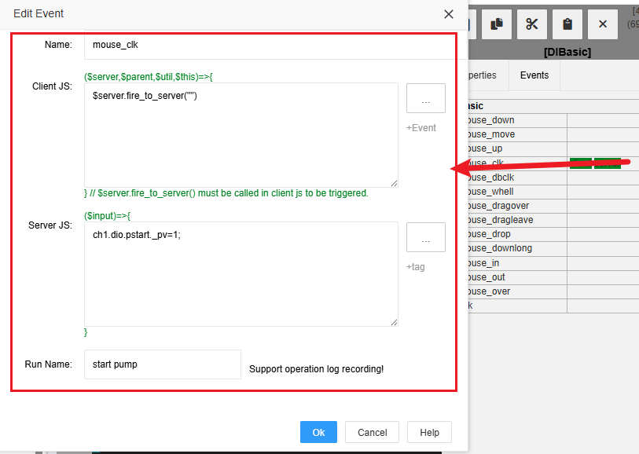
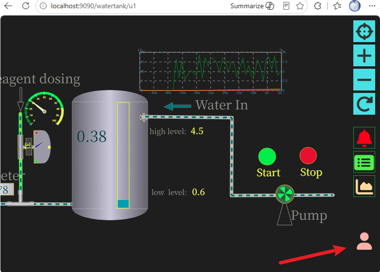
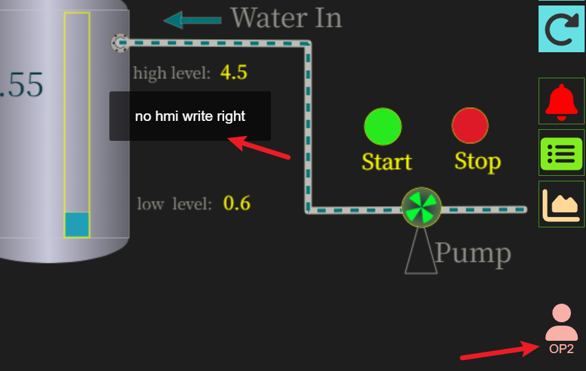

HMI write operation (issue the command) authorization
==

## 1 Role based HMI write operation (issuing commands) authorization mechanism


In the IOT-Tree project organization tree node, the property "Authorization" - "Write restriction role (user group)" has been added. After clicking, you can select the desired role to set in the pop-up dialog box.


When a node sets this restriction role, its descendant nodes will automatically inherit this content, unless the descendant nodes themselves set the restriction role - in this case, the inherited ancestor configuration content is blocked.

Therefore, after setting roles near the root node, all HMI nodes below will use this permission verification requirement.

Note: If no roles are set, it means that the relevant nodes do not need to be verified.


## 2 Specific HMI writing operation examples

We will still use the demo project that comes with the system to explain the relevant permission settings. Please refer to the following article for the import and running of this project:

<a href="../quick_start.md">Quick Start</a>

### 2.1 Prepare users and roles


First, log in as an administrator and go to the main management page http://localhost:9090/admin/ .Click on the top right corner to open the User Role Management dialog box. We have added the following users and roles inside. Users op1, op2, op3; In addition, op1 assigns the role oper, and op2 and op3 assign the role oper1. as follows:

```
op1|oper
op2|oper1
op3|oper1
```


### 2.2 Set node roles

我们进入demo项目，点击hmi节点"u1"。然后在主内容区选项“属性”。点击“写入限制角色（用户组）”对应的编辑框，在弹出的角色选择对话框中，选择角色"oper":



完成之后不要忘记点击属性上方“应用”按钮进行保存设置。这样我们就完成了hmi u1节点的写操作限制。

### 2.3 Set command issuance event binding in HMI UI


We right-click on the "u1" node and select "Edit UI". In the main content area, select the start element and click on the Events list on the right, as shown below:





In the content area corresponding to the event "on_mouse_clk", click to open the dialog box and perform JS scripts for client event triggering and server event processing, as follows:





Client JS runs on the UI page and only requires the following line of code, which triggers a mouse click event from the frontend to the IOT-Tree Server.


```
$server.fire_to_server("")
```


Server JS runs within IOT-Tree Server, and upon receiving an event triggered by the client, this JS code will be executed. This code corresponds to writing a value of 1 to the tag point for starting the water pump, which will ultimately issue a write command to the controller through the device driver.


```
ch1.dio.pstart._pv=1;
```


But Server JS will perform the user permission verification configured above before running. If the verification fails, Server JS will not be run and an error message will be returned.

For 'Run Name', if you want IOT-Tree to automatically record the operator's operation, please fill in the "run name" that can distinguish this operation, so that in the operation log, you can intuitively distinguish what operation it is.


### 2.4 HMI screen operation effect


Ensure that the demo project is launched and running smoothly. Suggest opening a new browser (without user login information). By accessing the following URL, you can find a user icon in the bottom right corner of the UI - this indicates that there is a user authentication requirement when issuing commands on the current UI:


```
http://localhost:9090/watertank/u1
```



At this point, if we directly click on the graphic element for "Start", an operator username and password verification dialog box will automatically pop up. As shown in the figure:


We fill in the user password op1, which matches the role of oper in this UI setting. Click OK. You can see a prompt indicating successful command issuance, and the current user also has the following display:


Now, within a certain period of time, the UI screen does not require you to re verify the user password. But after a certain period of time (which can be set at the root node of the project), if a write operation needs to be performed, the system will also prompt for user password verification - the advantage of this is that it can prevent misoperation and ensure convenient and smooth operation.


#### Switch user


Click on the user icon in the bottom right corner to force a user verification dialog box to pop up. You can enter the verification information of other users here. At this point, we can fill in the user op2. Even if the login is successful, this user does not match the restricted role of this UI, and when issuing commands, it will prompt 'no right'.



