Case of industrial automation system
==


This case is a complete application process in the industrial field. If you have relevant working experience, you can quickly master IOT-Tree Server as a tool for your work in the industrial field. 


# 1 site and control requirements 

## 1.1 site facilities and control requirements 


One of the subsystems in the industrial field has a water storage tank. There is a pump behind the water inlet. The water storage tank is controlled by controlling the start and stop of the pump. The water tank is 5 meters high, so water level needs to be monitored and controlled to ensure that the water level is kept within a certain range. 

The outlet docks with the next subsystem of the industrial process. In addition, an agent is added to the water flow rate at the outlet, which is provided by another independent automation device to control the application of the agent through the opening of the electric valve. 

The control requirements are as follows: 

(1) When the water level is below the low value of 1.1 meters, the pump must start the input water, and when the water level is above 4.5 meters, the pump must stop to prevent water overflow. By controlling the water level within a certain range, the output water can be guaranteed uninterrupted. 

(2) Use the reference scale tables of water flow velocity and opening to control the opening of the valve on the pipeline for dispensing medicines according to the flow rate of the outlet. (Note: The outlet flow rate is controlled by the next subsystem, which is indeterminate for this system) 


## 1.2 Automation-related devices 

### 1.2.1 Pump Control Related devices 


On-site water pumps can be started and stopped by simply interrupting the power supply through the contactor, cooperating with intermediate relay and feedback contacts, and finally starting and stopping control by two 24VDC relay coils. A coil power-on triggers the start of the pump, and a coil power-on triggers the stop of the pump. At the same time, the operation status of the pump is feedback through a passive contact. 

In the control box, a 24VDC switch I/O module is configured, providing RS485 Modbus RTU interface, device address 11, do0 connection to start coil, do1 connection to stop coil. DI0 connects to passive feedback contacts. The register addresses corresponding to do0, do1, and DI0 are 000001,000002,100001, respectively. 

In addition, the on-site control box has two trigger buttons (start button and stop button) and a pump operation status indicator. Used to support field personnel for manual intervention for emergency control. 


### 1.2.2 Valve opening control and water level monitoring equipment 

Put a 0-5 meter water level meter inside the water tank, supply 24VDC power and output 4-20mA current signal. Install an electric valve on the dosing pipeline with opening control via 4-20mA input control. 

In the field control box, configure a multi-channel analogue input and output module, provide RS485 Modbus RTU interface, device address 12, AIN0 (register address 300001, corresponding to 4-20mA value of 2000-10000) to receive the current signal of water level meter, DA0 (register address 400001, corresponding to 4-20mA value of 2000-10000) to add the control signal of electric valve to the medicine. 


### 1.2.3 outlet electromagnetic flowmeter 

An electromagnetic flow meter is installed at the water tank outlet and its transmitter also provides an RS485 Modbus RTU interface to read instantaneous and accumulated flow. Device address 13, flow rate in cubic meters per second, 4 bytes floating point number with register 404113 as high bit and 404114 as low bit. 


### 1.2.3 Upper control computer or embedded controller 

The above devices are connected to the upper system through a twisted shielded cable as RS485 bus, and all the device serial parameters are [9600 N 8 1]. The upper system can be either an industrial computer or an embedded ARM controller with IOT-Tree Server installed and configured internally. 

RS485 bus is connected to the upper controller and corresponds to the serial port COM5 inside the software. Of course, you can also configure a serial server module for RS485 to Ethernet. This enables IOT-Tree Server to transparently access the RS485 bus via Tcp. IOT-Tree Server has 192.168.0.18 device addresses for field use of intranet. Serial server address 192.168.0.10, port 12345. 


### 1.2.4 Use simulator devices 

If your test environment does not have these devices, you can use the modbus device simulators in IOT-Tree Server.For this case, an simulator instance of the above devices, is prepared for you. 

In the main management ui http://localhost:9090/admin/ . Below, there is a Simulator Manage list area. Click Import Demo and select "Simulator for case auto demo" to import the instance. 

Click on this instance, and in the pop-up window, click the Start button. As long as it is working properly, you can access the above RTU devices via tcp. As follows: 


# 2 IOT-Tree Server as subsystem controller

After the previous successful installation and connection of related devices, the next main work is to configure the IOT-Tree of the controller. Refer to the documentation for installing IOT-Tree Server on an industrial computer or embedded controller. In this case, IOT-Tree Server provides a 9090 HTTP protocol port to the outside world. 

If you are on the IOT-Tree Server local industrial computer, just open the browser and access it http://localhost:9090/admin Addresses allow you to log in to the management, configuration, and control interface of the IOT-Tree Server. If you are on a remote computer, you can access http://192.168.0.18:9090/admin . 


## 2.1 New Project 

After logging in to the IOT-Tree Server administration interface, click the Add button in Local Projects to add a new project, as shown below: 


The project name and title are as follows: 


```
watertank
Water tank and Medicament dosing
```


After success, new items appear in the Local Projects list. Click on this item to enter the detailed configuration interface of the project. 


## 2.2 New Connector 

If your device running IOT-Tree Server connects directly to the field RS485 bus through the serial port, you should choose Connector-COM. Connector-Tcp Client mode should be selected if serial server connection is made over Ethernet Tcp to RS485. 

Their respective inputs are as follows: 


The following are all advanced in Tcp Client mode. Next we'll add two levels of Channel-Device content to the tree browser. 

Note: If you use an simulation device that comes with your system, you must use the Tcp Client mode, and Host=localhost, Port=12345 


## 2.3 Add New Channels and Devices 

There is already a project root node "watertank" under Browser. Right-click on the menu that pops up and select "New Channel". In the dialog that pops up, enter or select the following. After that, the channel was added under "watertank". 


```
Name = ch1
Title = channel1
Driver = Modbus RTU
```


Under the channel, we can add devices. There are three devices on the RS485 bus: switch module, analog module and flow meter. We named them dio, aio, flow. 

Select "New Device" with the right mouse button on the new channel node. In the pop-up dialog box, just fill in the following, with the Device option left blank (because the current device is not stored in the device library): 


```
Name = dio
```


In the same way, we only need to fill in one device Name and add two additional devices aio, flow. 

Once the devices are added, there are three device nodes underneath the channel. In the main content area, click on the Properties tab and choose to click on the device node dio. You can see a detailed list of setup parameters for the Modbus RTU device. Since the address of the DIO device is 11, we only need to change the content of the item "Modbus Device Address" to 11 and click the Apply button in the upper right corner. As follows: 


You then click on the other two device aio and flow nodes and modify the parameters corresponding to "Modbus Device Address" to be 12 and 13, respectively. Note: Don't forget to click the Apply button to take effect! 


#### 2.3.1 Associate Connectors and Channels 

To the right of the c1 link or the c2 link of COM sent by Tcp Client, there is a small square box. Moving the mouse over it changes color. When you press the left button and move it, a connection line appears. Stretch the connection line to the small square box on the left side of channel ch1 and release the left button to complete the link to the channel, as shown below: 


## 2.4 configuring device Tags 

### 2.4.1 tags corresponding to water pump control switching value module 

Now it's time to set the data associated with the device. Click the tag "[tags]" in the main content area, then click the device node "dio", and the path "/watertank/ch1/dio" will be displayed in the content area below the tag. At this time, there is no tag data in the list area. 

Click "+Add Tag" and enter the following contents in the pop-up dialog box: 


```
Name = pstart
Title = pump start do0
Data type = bool
R/W = Read/Write
Address = 000001
```


This Tag corresponds to the output do0 of the water pump starting coil, as shown in the following figure: 

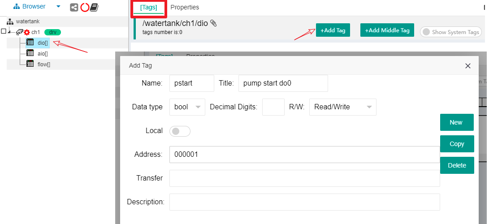


We use the same operation to add another two tags, corresponding to the water pump stop coil and the passive contact of water pump operation state feedback respectively. 

```
Name = pstop
Title = pump stop do1
Data type = bool
R/W = Read/Write
Address = 000002
```
```
Name = p_running
Title = pump running state di0
Data type = bool
R/W = Read Only
Address = 100001
```


Finally, under the device node "dio", there are three tags, as shown in the following figure: 


### 2.4.2 Water level and valve control simulation Tags 

Similar to pump control, we configure valve input and output analog tags and water level read-only analog tags for device aio


```
Name = valve_da0
Title = valve_da0
Data type = int16
R/W = Read/Write
Address = 400001
```
```
Name = wl_ain0
Title = wl_ain0
Data type = int16
R/W = Read Only
Address = 300001
```


The above two tags are the original values of the analog module input and output, ranging from 2000 to 10000. We need to convert the water level to a floating point number in the range of 0-5.0 and the valve opening to an integer of 0-100. To do this, we added wl_val and valve_val 2 tags, and set the transfer parameter inside. 

For wl_val tag, the tag main parameters are similar to the Tag corresponding to the original value, click the Transfer input box, select the Scaling option in the pop-up interface, and then select float in the Data type. Scaling Type selects Linear. In Raw Value Range, High=10000, Low=2000. In Scaled Value Range, High=5, Low=0. As follows: 


For valve_val tag, the tag main parameters are similar to the Tag corresponding to the original value, click the Transfer input box, select the Scaling option in the pop-up interface, and then select int16 for Data type. Scaling Type selects Linear. In Raw Value Range, High=10000, Low=2000. In Scaled Value Range, High=100, Low=0. As follows: 


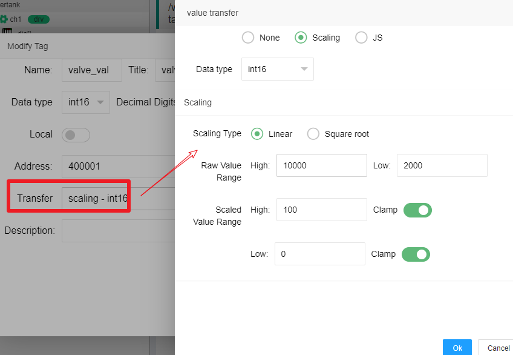


The tags list below the final device aio is as follows: 


### 2.4.3 Electromagnetic Flow Meter Velocity Tag 

Below the device flow node, two new Tags are added, corresponding to the high and low velocity values 


```
Name = flow_h
Title = speed high
Data type = int16
R/W = Read
Address = 404113
```
```
Name = flow_l
Title = speed low
Data type = int16
R/W = Read Only
Address = 404113
```


Next, click on the'+Add Middle Tag'button to add a new middle Tag, which is as follows: 


Notice that the middle tag's Express enters a JS script. This node script is a function call, enter flow_h and flow_l, The two tag values are combined to calculate the floating point value of the flow (in cubic meters per second). After that, we get the following list of tags: 


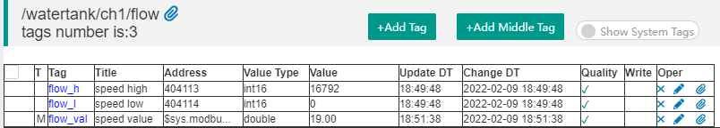


### 2.4.4 parameter tags

We also need two project parameter tags to support the setting of high and low water levels, which are not associated with any device and can automatically maintain the set values. This requires the use of local tags

Click on the root node of the project, click on the'+Add Tag'button in the main content [Tags] area, and select or fill in the following in the pop-up interface: 


```
Name = LEVEL_H
Title = hight water level
Data type = float
R/W = Read/Write
Local=true
DefaultVal=4.5
Auto Save=True
```


As shown in the following figure: 


Then add another local tag in the same way: 

```
Name = LEVEL_L
Title = low water level
Data type = float
R/W = Read/Write
Local=true
DefaultVal=1.0
Auto Save=True
```


These two tags exist as project parameters and can be automatically saved by IOT-Tree Server when the value is modified. After the system restarts, it can also keep the previously set values. (Note: High frequency modifications are not recommended for labels that support automatic saving) 


### 2.4.4 Start Test Tags 

After configuring these Tags, we should first test the effectiveness of these Tags in combination with connected devices. 

Click the Start button of the project management interface to start the project. Note the connection state of the Connectors and the channel state of the tree structure under the Browser. You will find that the pinwheel on the left side of the aisle turns, and if the connection to the field device is successful, the icon on the right side of the corresponding Connector will also become connected. As shown in the diagram: 


In the main content area on the right, click on the [Tags] tag, and in the tree content below Browser, click on the root node of the project. At this point, the [Tags] list the Tags for all devices, and if the field devices are running normally, all Tags have corresponding values and Quality shows ✓, As shown in the following figure: 


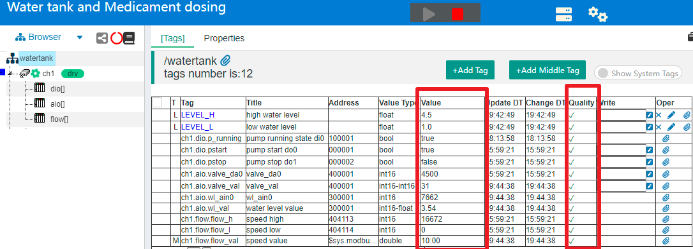


At this point, the device we configured and Tags are working properly, and the data of the field devices are read properly. Check if the water level meter reading is consistent with the field water level and the flow meter reading is consistent with the field instrument head reading. 

Next we can debug locally for different devices: 

In the Tag corresponding to "ch1.dio.pstart" and "ch1.dio.pstop", the input box of the Write column writes 1, respectively, and clicks the small write button on the right to issue the instruction to start or stop the pump. At the same time, the change of the corresponding value of "ch1.dio.p_running" is also observed. 

In the Tag corresponding to "ch1.aio.valve_val", the input box of the Write column writes values in the range of 0-100 (0 valve closed, 100 valve fully open) and clicks the write small button. The change of valve opening is observed on the spot. As shown in the following figure: 


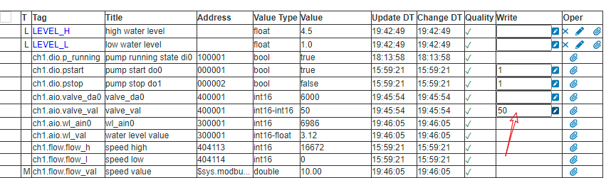


After all of the above is done, it means that we have configured the device and Tags without any problems and that they are effectively associated with the connnected devices. 


## 2.5 Design Monitor UI(HMI)

With the above steps, we have all the devices and corresponding data Tags ready, and then we design the monitor UI based on these contents. 

Right-click on the root node of the project and select "New HMI" from the menu that pops up. In the Add HMI dialog box that pops up, fill in the following, and when finished, the U1 node will appear below the root node below: 


Right-click on the u1 node and select "Edit UI" in the pop-up menu. In the main content area, a type of tab page appears, which is the editing area of this monitoring UI. 


### 2.5.1 Design Home Screen 

In the editing area of the UI, there is a basic toolbar in the upper left corner, from which we start drawing the monitor screen. Let's first add a water tank. 

Click on the Square icon, and move mouse to the drawing area,it will becomes a cross. When you press the left button and stretch at the same time, you release the mouse, and the rectangle is drawn. Select this new rectangular item, in the Properties area on the right, and click'...'on the right in the Fill Style input box button. As shown in the following figure: 


We need to fill this rectangle with a metallic linear gradient. In the pop-up Fill window, click the color selection button in the upper left corner, and select the color value "#c8c8db". And select the "Linear Tab" content, and internally "Color Number=1 Rotation=0". In the Line Color property box of the border line, also enter the color value'#c8c8db'. As shown in the figure below, you can see that the main body of the tank has been rendered. 


Next, we select the Ellipse icon and draw an ellipse in the same way, filling and edge lines in exactly the same way as the rectangle above. Next, the mouse selects the ellipse, moves over the rectangular area to overlap, and fine-tunes the position and size of the ellipse to fit above the rectangle. 

Next, we select the ellipse and in the (z-index) properties input, reduce the default value to be below the rectangular area. The whole process is as follows: 


Then, we select the ellipse, copy by pressing the keyboard key combination "Ctrl-C", and paste by pressing the keyboard key combination "Ctrl-V". A new ellipse appears at the mouse position in the drawing area. We move the ellipse below the rectangular area to fit. We're done with such a water tank. 

In the surrounding area of the water tank, we click the left mouse button and stretch out a dashed multiple selection box to select the three items contained in the whole tank. Then use the left mouse button to move them as a whole so that it is in the center of the drawing area. Then, select each primitive individually, set the "Locked" property to true. You will find that the water tank cannot be moved by dragging. As follows: 


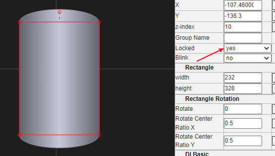


We draw other devices based on this tank. We can click on the zoom in/out icon in the upper right corner of the main content area to make our drawing area fill the whole window. Next, in a similar way, we draw pipes, pump labels, and so on. As shown in the diagram: 


Note: Don't forget to click the Save button at any time. The Save button is as follows: 


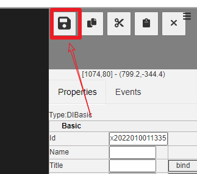


### 2.5.2 Add Dynamic Display Items

##### 2.5.2.1 Add Water Level Dynamic Display 

Click the Components option icon on the left side of the drawing area to display the component classification and list, select the "lique level" classification, and the water level display components appear on the right side of the list. Click on the first component with the left mouse button, drag it to the drawing area and release it. A water level display item appears where the mouse releases in the drawing area, resize and move the primitive to the location of the water tank. 

Then, select the item and set the related properties in the attribute area: 


```
Level Total Height=5
Liquid Color=#219fb8
```


As shown in the diagram: 


Next we'll bind this draw item to the water level Tag:'ch1.aio.wl_val'. 

Select the water level draw item, click the "bind" button to the right of the property "Level Value", and in the pop-up window, select "context tag". And click on the Tag input box below to select the corresponding Tag in the tab selection list window that pops up. Once that's done, we've finished binding the drawitem to the dynamic data. As follows: 


With the water level indicator, we also want to be able to display specific water level data on the edge of this ruler element. 

Click the Txt icon in the toolbar and left-click in the drawing area to add a new text draw item. Adjust the position, color, and size as shown below: 


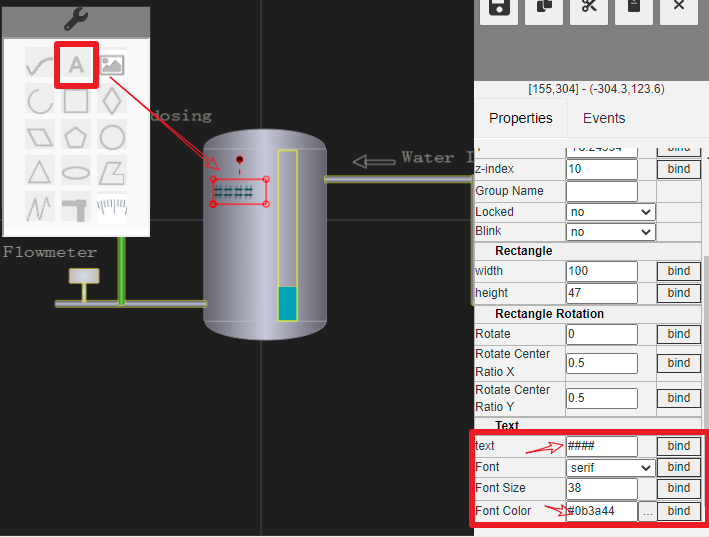


Similarly, select this text draw item, click the "bind" button to the right of the "text" property, and bind the same tag (Tag) as the "Level Value" property :"ch1.aio.wl_val". 


##### 2.5.2.2 Dynamic display of new pump operation 

In the same way as above, we select a rotating component from Components-rotation, drag it onto the drawing area, resize and position it on the pump. 

Set the property "On or Off=False". Click the "bind" button on the right side of this property to bind the label "ch1.dio.p_running" the same way. In this way, the running status of the pump feedback can be reflected dynamically on this draw item. As follows: 


#### 2.5.2.3 Add Valve Status Draw Item 

Similarly, select a valve that supports a 0-100 degree open display from under Components-valve and drag it to the drawing area. Mouse clicks on the small dot on the edge of the item to rotate 90 degrees and move the adjustment position over the pipe. 

Then, on the right side of the property "open value" input box, click the "bind" button and select the tag Tag from the dialog box that pops up: "ch1.aio.value_val". As shown in the following figure: 


#### 2.5.2.4 Add flow speed draw item

Similar to the water level value display, we also use text item to display the flow speed by adding only one new text item to the position of the flowmeter and binding the tag:ch1.flow.flow_val to the "text" property.

Note: Don't forget to click the Save button anytime 


##### 2.5.2.5 Start the project and view the dynamic display of the UI 

After we have finished the above, you can start the project and see how it works on the currently completed UI. 

Click the launch icon above the project management interface, right-click on the u1 node in the tree, and select the Access item in the menu that pops up. A new running picture window will pop up. The operation diagram is as follows: 


The pop-up monitor picture is as follows: 


You can see that the dynamic content in the picture changes as the real-time data of the tag changes. 


### 2.5.3 Add Manual Control Items

The data returned by the device via the bus can already be displayed. Next, we need to add some control input functions to the monitor UI. These functions allow us to give instructions to devices such as starting or stopping pumps and adjusting the opening of electric valves. 

Of course, we also need to set parameters for the high and low water levels of the water tank. This parameter may need to be adjusted more optimally during run time. 


##### 2.5.3.1 Add Pump Control 

We place two circles above the pump, representing the start button and the stop button. Under the two circles, two Txt item, Start and Stop, are placed. Start button is filled with green, stop with red. As follows: 


Select the green start button and click on the blank padding on the right corresponding to "on_mouse_clk" in the right Events column. Fill in the following JS run script in the pop-up dialog: 


Client JS
```
if($server.fire_to_server())
    $util.msg("start cmd issued") ;
```

Server JS
```
ch1.dio.pstart._pv=1;
```


Client JS runs on the client and sends events directly to the server's IOT-Tree Server via '$event'. Server JS is a JS script that runs when the server receives an event. Obviously, the server directly assigns power to the startup coil of the on/off module. 

Similarly, check the red Stop button and fill in the following script in the Events-on_mouse_clk column: 


Client JS
```
if($server.fire_to_server())
   $util.msg("stop cmd issued") ;
```

Server JS
```
ch1.dio.pstop._pv=1; 
```


After clicking the Save button, we can access the running interface again through Access, click the Start button or Stop button to check whether the pump follows the start or stop. 


##### 2.5.3.2 Add Valve Opening Control 

We want to be able to manually enter the valve opening value and submit instructions by clicking on the valve primitive. Similar to the pump-controlled round button, I only need to make similar script settings to the Events-on_mouse_clk column of the valve element. 

Before that, however, we need to get the opening value of the current valve in the Client JS script, which runs on the client and cannot get the service-side defined tag (Tag) directly. Since the client's meta is already bound to this label, we can get this value from the meta. 

In order to obtain an attribute value for a primitive, we must set a Name for the primitive, which must meet the requirements of the Java language variable name. Select the valve primitive and enter "valve1" for the Name property in the property bar. As follows: 


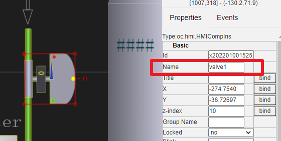


After saving, we can get the corresponding property value from the variable valve1 in the Client JS code. Then, the property "open value" that we bind to the server side label is obviously a title and does not meet the requirements of the JS language variable. At this point, you only need to move the mouse over the property bar title, and the system will automatically display its corresponding property variable name. As you can see, the name is "open_v". As follows: 


Select the valve draw item, and the Events-on_mouse_clk column opens the script editing interface by entering the following script: 

Client JS
```
 var v = valve1.open_v; //$this.open_v;
 $util.dlg_input_num({tp:'slide',min:0,max:100,val:v},(val)=>{
      if($server.fire_to_server(val))
        $util.msg("valve cmd issued") ;
 }) ;
```

Server JS
```
var val = parseInt($input);
if(val<0||val>100)
   return "invalid input value";
ch1.aio.valve_val._pv=val;
```


The editor is as follows: 


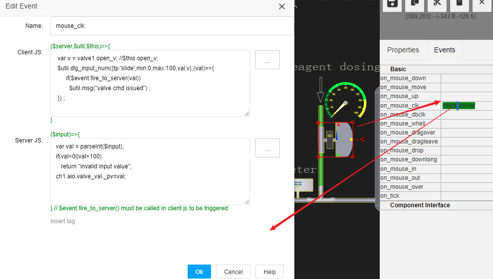


Note: Don't forget to save it before it works. 


##### 2.5.3.3 Add parameter setting support 

We add four Txt item to the edge of the water level ruler, two for identification, two for displaying and setting high and low parameter values, and bind tags, LEVEL_H and LEVEL_L. As follows: 


Next, we set the "on_mouse_clk" event for the Txt item of the two binding tags, respectively, as follows: 

1) High water level Txt item 


Client JS
```
 var v = $this.txt;
 $util.dlg_input_num({is_float:true,val:v},(val)=>{
      $server.fire_to_server(val);
      $util.msg("chang high level issued") ;
 }) ;
```

Server JS
```
var v = parseFloat($input);
if(isNaN(v))
  return ;
LEVEL_H._pv=v;
```


Client JS
```
 var v = $this.txt;
 $util.dlg_input_num({is_float:true,val:v},(val)=>{
      $server.fire_to_server(val);
      $util.msg("chang low level issued") ;
 }) ;
```

Server JS
```
var v = parseFloat($input);
if(isNaN(v))
  return ;
LEVEL_L._pv=v;
```


##### 2.5.3.4 View the results 

Above, we set up manual control of related draw item, events and corresponding processing scripts so that we can run them to see the effect. 

Right mouse button node u1, click on the Access menu item, we can see that the configured interface runs as follows: 


1) Click on the pump to control the two round buttons, pay attention to the instructions issued prompt, the change of pump operation status 

2) By clicking on the valve, you can see a pop-up valve opening input interface and see the change of valve opening after confirming, as shown in the following figure: 

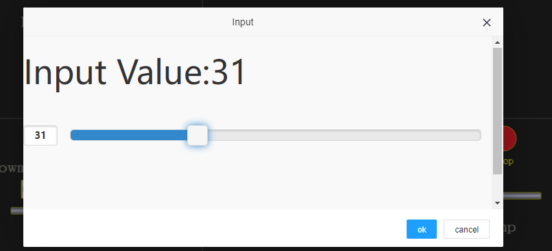


3) Click on the Txt item corresponding to the high and low water levels, enter the adjustment values in the pop-up window, and view the changes after submission. 

At this point, the project you have completed can be manually controlled remotely to issue instructions and monitor the status of field devices. 

Next, we need to finish the last step and write control scripts to enable the system to meet the initial requirements for automatic control. 


<font color="green">


Starting from version 1.7.0, IOT-Tree has added message flow support, and the following automatic controls can be implemented using visual flow. The document also aims to control this demonstration project, easily achieving automatic control. Please refer to:

</font>

<a href="../msgnet/mf_for_ctrl.md" >&nbsp;&nbsp;&nbsp;Using message flow to implement control logic</a>


## 2.6 Write automatic control script 

In the IOT-Tree Server project, automatic run control is accomplished through Tasks. Each task corresponds to a running thread, and there can be multiple actions (TaskAction) underneath each task. These actions share task threads. 

On the right side of the project tree, Browser, there is a task management icon. After clicking, the task management interface appears in the main content area. As follows: 


We click on the'+Add Task'button and the pop-up window fills in the following to add a new task. Fill in "Name=t1, Enable=true". Running time interval is 100ms, as shown below. 


Then on the task line, click the'+'(add action) button, add an action, named act1, and 'Enable=true' 

At this point, you see that in the new TaskAction line, there are three script editing buttons: "init script", "run script", "end script". Where "init script" runs once when you start a task, where you can initialize the JS script functions you need, or other initialization operations. Scripts in "run script" are run repeatedly at an interval of 100 ms, where you can implement the control logic you need. "End script" is called once when the task normally triggers stop. 

as shown below:


Obviously, task scripts can do more things, such as data transformation and forwarding. But here we mainly achieve automatic control of water level and pump start-up, and the linkage control of valve opening and outlet flow rate. 

1) We define JS-related variables and functions in "init script" 


```
//def support func or var
var ob_pump_running = ch1.dio.p_running ;
var ob_water_level = ch1.aio.wl_val;
var ob_flow_speed = ch1.flow.flow_val;
var ob_valve_open = ch1.aio.valve_val;

function pump_start()
{
    ch1.dio.pstart._pv=1;
}
function pump_stop()
{
    ch1.dio.pstop._pv=1;
}
function cal_speed2valve(spd)
{
    if(spd<=0)
      return 0 ;
    var r = spd*5 ;
    if(r>=100)
       return 100 ;
    return r;
}

//pump ctrl by water level
function pump_ctrl()
{
   var wl = ob_water_level._pv;
   if(ob_pump_running._pv)
   {//pump is running
        if(wl>=LEVEL_H._pv)
           pump_stop();
   }
   else
   {
        if(wl<=LEVEL_L._pv)
           pump_start();
   }
}

//valve ctrl by flow speed
function valve_ctrl()
{
    var spd = ob_flow_speed._pv;
    var v_open = cal_speed2valve(spd);
    ob_valve_open._pv=v_open;
}
```


2) Implement control scripts in "run script" 


```
pump_ctrl();
valve_ctrl();
```


The scripting editor is as follows: 


After starting the task, we will view the monitor UI again in "u1-Access". You can see that the start and stop of the pump are automatically controlled according to the water level. Valve opening also varies with flow rate. Of course, you can also issue instructions manually at the same time. 

Note: You may restart the IOT-Tree Server. If you use your own simulation device, do not forget to start this simulation instance, otherwise the device will not be found when this project runs. 

