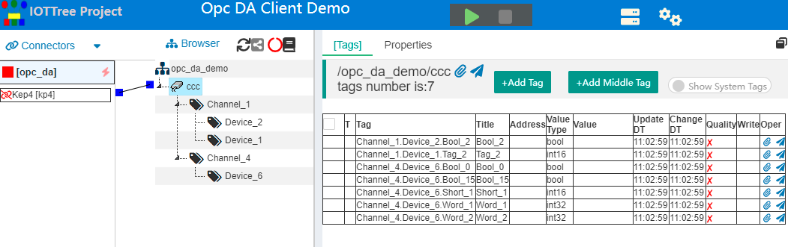
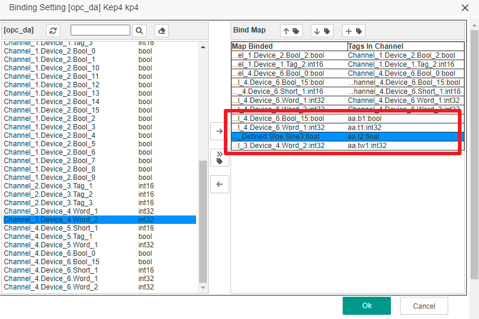

Access data through OPC DA Client 
==


In many fields, there may already be an automated monitoring system, and there is already a configuration software running for many years on the existing PC. 

You will most likely encounter the need to incorporate some of the device state of this system into your new system, which may be in a superior department or on a server in the cloud. 

The premise is that you can't affect the operation of the existing system, so you can't connect through the device interface in the field, so we only have the configuration software of the control room left. 

Fortunately, most of the current configuration software can provide the OPC Server interface, but on some older x86 32-bit computers, only the OPC DA interface can be provided. Moreover, this interface is not accessible through the local network due to security restrictions of the Windows system. Ideally, install some software on the computer of the configuration software, read the local OPC Server interface, get data, and send it to the cloud. 

If you do this from scratch, there are many problems to solve. But with IOT-Tree Server, it's easy. 

IOT-Tree Server specifically provides a version for x86 32-bit windows that supports OPC DA access, which allows you to quickly address these needs. 

This example uses KEPServerEx V4 as an OPC Server to simulate the OPC Server provided by the configuration software. Then, data access, organization, binding, and mapping are done through IOT-Tree Server. 


# 1 Environment Preparation 

## 1.1 Installation Configuration KEPServerEx V4 

Please go to the KEPServerEx website to get this software and install and start it as prompted. 

In the main management interface, open "\KEPServerEx\Projects\simdemo.opf" under the KEPServerEx installation directory, which is a demonstration OPC configuration file that comes with the software. The related channels, devices and data organizations are shown below: 


If you already have configuration software or other OPC Server software, this step can be omitted. But if you want to know more about IOT-Tree Server's support for OPC DA, follow this example. 


## 1.2 Installation Configuration IOT-Tree Server 

Get the IOT-Tree Server package for "iot-tree-x.xx.x-winjre8x86.zip", which integrates OpenJDK x86 32-bit version of JRE so that it can run on some Windows 32-bit systems. 

Refer to [Quick Start][quick_start] 

It is important to note that if you are not using the OPC service in this example, other OPC service programs will most likely need to be accessed with super administrator privileges. At this point, there are two main ways to ensure that the current user you start IOT-Tree Server is a super administrator:

1) If you start IOT-Tree Server by command, right mouse button iot-tree.bat, select Run as Administrator. Or you can open a command window as an administrator and run iot-tree.bat.

2) If you have registered IOT-Tree Server as a Windows service, open Service Management (command services.msc), find the IOT-Tree Server service item, double-click Open Parameter Configuration, and in the Login section, select the super administrator account and input password to ensure that the service starts as an administrator.


# 2 Configuration and Testing 

After starting IOT-Tree Server and entering the management interface, we started the related project configuration. 


## 2.1 New Project 

We create a new project as follows: 

```
Name=opc_da_demo
Title=OPC DA Client Demo
```


## 2.2 Add OPC DA Client Connector

Click on the project title to enter the main interface of project configuration management, on the Connectors menu, click on OPC DA Client, and fill in the relevant parameters in the pop-up window. "OpcHost=localhost" stands for this machine; Program ID lists all the "OPC Server Ids" of your machine. You can just select "KEPware .. V4" . As follows: 


After clicking OK, you can see that the connection item appears under the Connectors. 


## 2.3 Add Channel and Associate Connector 
At the project root node under Browser, right-click, select "New Channel", fill in "Name=ccc" in the pop-up window, and nothing else needs to be filled in, as shown below: 


You will find a small square to the left of the new channel and a small square to the right of "Connector kp4" on the left. When you click one of the squares and drag a line to the other, you can establish a connection between the two. As follows: 


## 2.4 Bind or copy content from OPC Server below channel

With these simple steps, you're ready for access and channels, and now you can think about what data is available in OPC Server.

IOT-Tree Server associates the content in Opc Server with the Tag node underneath the channel by mapping (Map). First let's see what the added OPC DA Client link can bring to us.

Right-click KP4 under Connectors and click Bind. In the pop-up window, we can see that the left part lists all the data nodes that OPC Server can provide. As follows:


You can see all the data lists and type information related to OPC Server on the left side of the pop-up window. On the right is the bound content area. At this point, because there is no tag Tag under the associated channel ccc, it is blank.

At this point, you may want to copy the data on the left (with hierarchical information) directly under the channel ccc, then you can select the data item on the left that needs to be copied and click the middle "copy create tag and bind" button. At this point, you can see a bound data item on the right that has the same content as the Tag below the channel.

Press the "Ctrl" key and select the following nodes on the left: "Channel_4.Device_6. *, Channel_1.Device_1.Tag_2, Channel_1.Device_2.Bool_2"; Then click on the middle "copy create tag and bind" button, and the result is as follows:


By clicking on the "Ok" button of the pop-up window, IOT-Tree Server automatically establishes the relevant Tag groups and corresponding Tags under the channel ccc according to the mapping relationship above. Please refresh the tree structure of Browser and you can see the following results:

As follows: 




 when you start the project, you will find that the automatically created content can already get data 

As follows: 


Very easy, right. The problem is, this structure may be defined by the old system you are docking with. You want to define your own hierarchy and Tag name in your IOT-Tree Server, and then map the data in the old system to the Tag you created. 

In addition, you may find that all node names in IOT-Tree Server must comply with the specification of programming variables, and can only be A-Z, a-z and numbers. If the bound path contains illegal characters, it becomes impossible to directly copy the hierarchy and automatically establish relevant nodes. At this time, you can only create your own tag and obtain the data value through mapping.


## 2.5 Mapping Binding to Get Data in OPC Server 

Stop running the project and add the following custom Tag Groups and the following Tag content under the CCC channel. 

Right mouse button ccc, select "New Tag Group", add this node name as "aa". Click on this node "aa", in the main content area, select "[Tags]", and add the following Tags through the "+Add Tag" button. We fill in the name and value type for Tag and select Read/Write for "b1", "tw1". As follows:


Above we have prepared our own hierarchy and Tag. Next, we map something from OPC Server. 

Right-click "kp4" under Connectors and select Bind to reopen the settings window you just opened. You will find some data items content is already in the "Bind Map" area in the right of the window. These are under "Tags in Channel" and the "Map Binded" on the left is empty, waiting for us to bind. 

Let's select the first line "aa.b1", select "Channel_4.Device_6.Bool_15" on the left, then click the corresponding right arrow button to bind it, as shown in the following image: 


Similarly, we have map bindings for "aa.t1", "aa.t2", "aa.tw1". As follows: 




After saving, we start the project again and click on the channel "ccc", you can see that both data acquisition methods are working on the right. As follows: 


## 2.6 Reverse write data 

Note that our custom label "aa.b1" is writable. Alternatively, you can modify a Tag that has been mapped or configured to change from a read-only "Read Only" to a read-write "Read / Write". You can then fill in and write the Write column for the corresponding row in the Tag category. 

In this example, the label bound to "aa.b1" is bool type, and OPC Server changes very slowly, so we can write new values by binding IOT-Tree Server. The numerical changes are then observed in the OPC Quick Client. 

We open the OPC Quick Client window above the KEPServerEx management interface and switch to the Channel_4.Device_6 list. You can see the corresponding value of Channel_4_Device_6.Bool_15. In the list of IOT-Tree Server tags, we write a value of 0 or 1 to "aa.b1" and observe the change of the corresponding value in the "OPC Quick Client" window. As follows: 


So far, we have completed the demonstration of all the functions. 


# 3 Summary Recommendations 

Clearly, we can easily get data from OPC Server and form our own organization. At this point, other data-sharing capabilities of IOT-Tree Server will be available. 

For example, you can right-click the channel "ccc" node, select the "Access" item in the pop-up menu, you can find the pop-up URL window " http://localhost:9090/opc_da_demo/ccc "Very friendly runtime data JSON format is output directly. If other systems can access this URL directly, they can get data directly from this. 

You can also define your own JS plug-in API and set tasks in IOT-Tree Server to send data to your cloud server on a regular basis. 

Of course, if you do more with IOT-Tree Server, such as creating new HMI UI, supporting mobile access control, and so on. None of modifications to your old sytem. 


[quick_start]: ../quick_start.md
