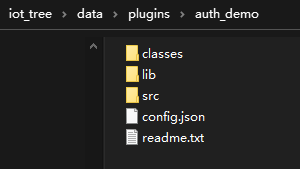
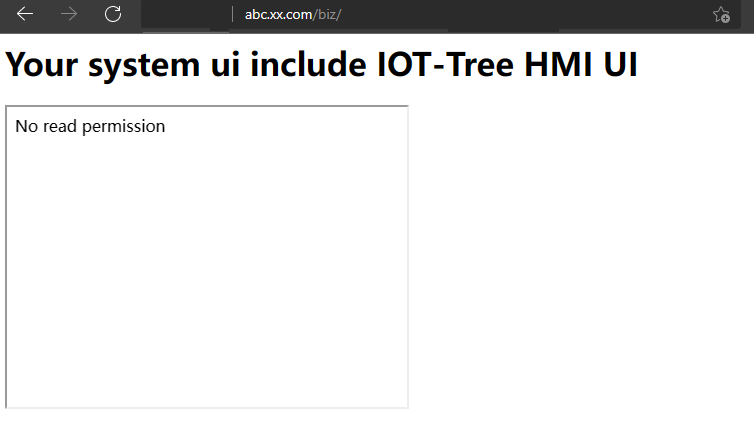
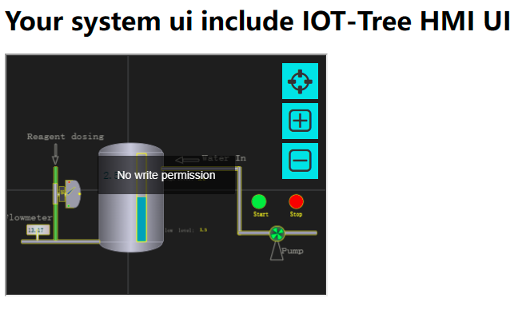
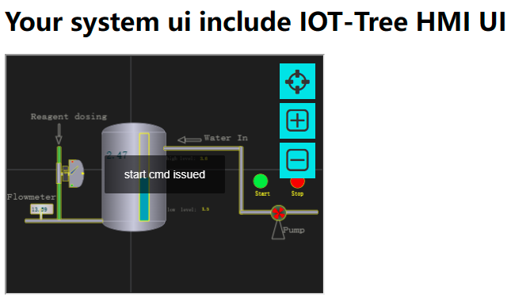

Integrate HMI into your system (including permission plug-in development)
==


IOT-Tree Server, as an independent server program, can become the background support of your business system. IOT tree server provides a variety of HTTP restful interfaces and UI (HMI) monitoring UI customized online within the system, which can be integrated into your business system. 

The business system can directly call the interface provided by IOT-Tree Server to obtain data through some docking programs developed in the background, but the UI interface cannot do so. The best (and simplest) case is that your business system web page directly refers to the "HMI UI" of "IOT Tree server" through iframe. 

So the problem is, how to restrict users' access to the HMI URL provided by IOT tree server, how to apply your own permission mechanism to IOT-Tree server. 

This example is an illustration of the whole process of solving the above problems. 

1) This example implements a simple authority plug-in. You can refer to the authority docking of your business system 

2) In this example, nginx is used as an HTTP proxy to integrate HTTP services of two different ports (one is port 9090 of "IOT-Tree server" and the other is port 8080 of HTTP service based on Tomcat), and cookies are shared through subdomain names. Perform permission verification. 


# 1 Implementation of authority plug-in 

The authority plug-in needs to be developed in Java language. You must implement two classes: one is the user class and the other is the main plug-in class. You can define the names of these two classes yourself. This example corresponds to User and AuthDemo respectively 


## 1.1 User Class Implementation 

See the following code 


```
package com.xxx.plug;

public class User
{
	String id,regName,fullName ;
	
	public User(String id,String regname,String fulln)
	{
		this.id = id ;
		this.regName = regname ;
		this.fullName = fulln ;
	}
	
	/**
	 * unique id  (option method)
	 * 
	 *  
	 * @return
	 */
	public String getId()
	{
		return this.id ;
	}
	
	/**
	 * get registion name (unique name for login)  (must have method)
	 * @return
	 */
	public String getRegName()
	{
		return this.regName ;
	}
	
	/**
	 * get display name (option method)
	 * @return
	 */
	public String getFullName()
	{
		return this.fullName ;
	}
}
```


User objects are used to store the corresponding user information after user authentication has passed. There are three main methods in this class: getId, getRegName, and getFullName. Where "getRegName" must exist, this method returns the current user's registration name. 

You can note that this class does not implement any Java interfaces.Because the IOT-Tree Server plug-in mechanism is implemented through reflection, which automatically finds the appropriate method. This way, you don't need to specifically reference interface definitions when implementing plug-ins. But the implementation functions inside, such as the three above, must be implemented strictly as defined in the example code above. 


## 1.2 AutoDemo plug-in main class implementation 

See the following code: 


```
package com.xxx.plug;

import java.io.*;
import java.util.*;

/**
 * auth demo plugin for
 * IOT-Tree Server
 * 
 * You can implement the methods in this plug-in by sharing data.
 *  For example, through relational database, redis, WebService or other
 *  
 *  
 *  
 *  The key point is that you need to bind the node tree in the IOT-Tree Server 
 *  as a resource with your user system.
 * 
 * @author demo
 *
 */
public class AuthDemo
{
	/**
	 * this method will be called when plug is inited.
	 * you can do some initial work here
	 * 
	 * @param plugdir
	 * @param params
	 * @throws Exception
	 */
	void init_plug(File plugdir, HashMap<String, String> params) throws Exception
	{
		
	}
	
	/**
	 * option method
	 * 
	 * when you access http://iot_tree_server_host:port/admin,you must login by register name and password
	 * 
	 *  if this method is here,the default user authentication provided by the system will be ignored.
	 *  
	 *  
	 * @param reg_name
	 * @param password
	 * @return
	 */
	public User checkAdminUser(String reg_name,String password)
	{
		if("admin".equals(reg_name) && "123456".equals(password))
			return new User("","admin","Adminstrator") ;
		
		return null ;
	}

	/**
	 * Obtain user information according to the token
	 * 
	 * @param token provided by page cookie or other ways
	 * @return
	 */
	public User checkUserByToken(String token)
	{
		if(token==null||"".equals(token))
			return null ;
		
		if(token.startsWith("user1"))
			return new User("","user1","User1") ;
		else if(token.startsWith("admin"))
			return new User("","admin","Adminstrator") ;
		return null ;
	}
	
	/**
	 * this method will be called when outer will access node path in iottree like /prjname/n1/u1
	 * 
	 * The node related to this path may be a context node that returns JSON data. 
	 * Or the HMI UI node outputs the UI picture
	 * 
	 * @param node_path  like /prjname/n1   /prjname/n1/u1
	 * @param reg_name login user name or null or empty
	 * @return
	 */
	public boolean checkReadRight(String node_path,String reg_name)
	{
		if("admin".equals(reg_name)||"user1".equals(reg_name))
			return true ;
		return false;
	}
	
	/**
	 * this method will be called when outer will write some data to node path in iottree like /prjname/n1/u1
	 * 
	 * this may be update some tag value in node or send cmd in hmi
	 * 
	 * @param node_path
	 * @param reg_name
	 * @return
	 */
	public boolean checkWriteRight(String node_path,String reg_name)
	{
		if("admin".equals(reg_name))
			return true ;
		return false;
	}
}

```


Similar to User, the main plug-in class does not need to implement any Java interfaces, just strictly implement the corresponding functions. The following are explained separately by function 


### 1.2.1 init_plug


init_plug method is called when the plug-in is loaded and initialized, and the directory and parameters of the plug-in deployment are used as inputs to this function. You can do some initialization preparation here. If your permission validation requires access to the database, you can initialize the database access preparation here. 


### 1.2.2 checkAdminUser


If implemented, administrative privilege validation on behalf of IOT-Tree Server itself will be replaced (this administrative entry is http://iot_tree_server_host:port/admin This function requires a user registration name and password to be entered. If the validation passes, the User object is returned. If the validation fails, null is returned. 

The implementation of this example is very simple, only string matching judgment is made. You can implement this according to your own business system privilege mechanism. 


### 1.2.3 checkUserByToken


This function must be implemented to obtain user information based on the input token string parameter, which can be passed through a shared cookie or other means. When your business system user logs in, a temporary token is generated, and the current user information should be associated with the token and stored in a specific place (such as business system memory, relational databases, or redis). 

If token is valid enough to locate the corresponding user information, the User object is returned, otherwise null is returned. 

The implementation of this example is just to illustrate the plug-in mechanism, and the implementation is only judged by the token prefix, which your actual system cannot do. 

### 1.2.4 checkReadRight


This function implementation is used to determine whether a user has read access to an IOT-Tree node. The first parameter is the node path, which for a deployed IOT-Tree Server is like: /prjname/n1  /prjname/n1/u1. The second parameter is the user registration name. 

If the path /prjname/n1/u1 corresponding to the HMI node directly supports the display of the HMI UI, this link can be included by iframe in your business system. If this permission judgment fails, a prompt will be output that does not have permission to display. 

Another example is: /prjname/n1 node contains a lot of context data (Tag data), which is accessed by the outside world to obtain the JSON format of all Tag data below the node. Similarly, this output will be affected by the result of this function. 

### 1.2.5 checkWriteRight


This function implementation is used to determine whether a user has write access to an IOT-Tree node. The first parameter is the node path, which for a deployed IOT-Tree Server is like: /prjname/n1 /prjname/n1/u1. The second parameter is the user registration name. 

For example, for an HMI node, write permissions correspond to submitting data (including instructions) to the server on the interface. If this permission judgment fails, you will be prompted that you do not have write permission. 


## 1.3 Deployment Auth Plugin 

### 1.3.1 Deployment Plug-in File 

Under the "IOT-Tree Server" installation directory, create a new directory "auth_demo" under the corresponding directory "$IOT_TREE/data/plugins", and create the following directory and files under this directory, as shown in the figure: 





Where the "classes" directory is the Java class that plug-ins may use, and lib is the jar-dependent file that plug-ins may need to run. 

You can put the above User and AuthDemo compiled classes under the classes directory (note the package name for the class and the associated subdirectories com/xxx/plug/*.class). Or you can pack these compiled files into a jar and put them into lib. 

Next, you edit the "config.json" file as follows: 

```
{
"name":"auth_demo","title":"Auth Plug,a demo for auth",
"js_api":[
	],

"auth":[
	{name:"auth_demo",class:"com.xxx.plug.AuthDemo"}
	]
}
```


The outermost "name title" of the file JSON is the plug-in name and title. The name inside "auth" plug-in corresponds to the plug-in name and the corresponding plug-in class, respectively. 

At this point, your plug-in file deployment is complete. But,when you start IOT-Tree Server, you will find that the plug-in still does not work, because there may be a variety of plug-ins deployed under the plug-in directory, which would be messy if all were started. 


#### 1.3.2 Modify config.xml 

It is not enough to place files under the plug-in directory. We also need to modify the "config.xml" file under the IOT-Tree Server installation directory to add "plug_auth" configuration 


```
<?xml version="1.0" encoding="utf-8"?>
<iottree ... >

	<plug_auth name="auth_demo">
	</plug_auth>

</iottree>
```


Where the name property of "plug_auth" is "auth_demo", which is the name of the plug-in we defined in "config.json" under the deployment file directory. With this, IOT-Tree Server will enable this plugin. 


### 1.3.3 Start Test 

Our IOT-Tree Server deployment listens on port 9090. After restarting IOT-Tree Server, when you log in to the administration ui again, you will find that the login is restricted by the implementation of "checkAdminUser". Only "admin" can log in with the password "123456". 

Next, we'll try to integrate the HMI UI into your business system. 


# 2 Shared Cookies Integrate "HMI UI" 

IOT-Tree Server already exists on port 9090. We import the Run Automation Demo Project above, refer to [case_auto]. 

Using another Tomcat running on port 8080 as your business system, 

Use ngnix as the uniform HTTP proxy entry, using port 80. And use the subdomain name mechanism to share cookies. 


## 2.1 Prepare Environment 

#### 2.1.1 Domain Name and ngnix Configuration 

(1) Domain Name Settings 

We're going to have two domain names "abc.xx.com" and "iot.xx.com" that will eventually point to two systems within us through ngnix. "abc.xx.com" points to the business system implemented by Tomcat for "localhost:8080", and "iot.xx.com" points to "IOT-Tree Server" for localhost:9090. 

To simulate that both domains resolve to 127.0.0.1 as a local IP address, we need to modify the windows /system32/drivers/etc/hosts file. 

Open Notepad with Super Administrator, then open this hosts file, adding two lines at the bottom: 


```
127.0.0.1 iot.xx.com
127.0.0.1 abc.xx.com
```


After saving, open the CMD window and use ping iot.xx.com View the effect of domain name resolution. You will find that both domains point to 127.0.0.1. 

(2) nginx installation configuration 

Download and install nginx in http://nginx.org/ , modify nginx.conf under the conf directory. Add the following configuration inside: 


```
    server {
        listen       80;
        server_name  iot.xx.com;
		charset utf-8;
        location / {
			proxy_pass http://localhost:9090;
            root   html;
            index  index.html index.htm index.jsp;
			
			proxy_http_version  1.1;
			proxy_set_header Upgrade $http_upgrade;
			proxy_set_header Connection "upgrade";
        }
	}
	
	server {
        listen       80;
        server_name  abc.xx.com;
        location / {
		proxy_pass http://localhost:8080;
            root   html;
            index  index.html index.htm index.jsp;
        }
	}
```


The configurations in these two sections allow the two domain names "iot.xx.com" and "abc.xx.com" to be accessed by nginx to point to different internal services. 

After starting nginx, browser access to "abc.xx.com" will point to "localhost:8080" business system, and "iot.xx.com" access will point to "IOT-Tree Server" of "localhost:9090". 


#### 2.1.1 Tomcat Business System Preparation 

Download and install apache-tomcat. And create a new biz directory under the webapps directory, then add an index.jsp file under the directory. Edit the file as follows: 


```
<%@ page contentType="text/html;charset=UTF-8"%>
<%@ page import="java.util.*,java.io.*,java.net.*"%>
<%
	Cookie ck = new Cookie("token","user1_sdfasdfsafdsad2312323___23");
	ck.setPath("/");
	ck.setDomain("xx.com");
	response.addCookie(ck);
%><html>
<body>
<h1>Your system ui include IOT-Tree HMI UI</h1>
<iframe id="f1" src="http://iot.xx.com/watertank/u1" style="width:400px;height:300px"></iframe>
</body>
</html>
```


This file is very simple to run. When running, set a cookie string named "token" for the domain name "xx.com" and the path "/". Also output a simple page with an iframe inside containing " http://iot.xx.com/watertank/u1 ".

Clearly, the internal "iot.xx.com" related URL can also get the "cookie token" information that this page writes to the browser. 

This example writes cookies to the browser every time it refreshes, and you can modify them at any time 

Run "startup.bat" under "tomcat/bin/" to start Tomcat and access it in your browser 


```
http://abc.xx.com/biz/index.jsp
```


You can see that the page already has output. But our IOT-Tree Server needs a little more configuration. 

### 2.1.3 Modify the config.xml of IOT-Tree Server.

Modify config.xml "plug_auth" element, as follows, then restart Server 


```
<?xml version="1.0" encoding="utf-8"?>
<iottree ... >
	<plug_auth name="auth_demo" 
			login_url="http://abc.xx.com/login/login.jsp"
			token_cookie_name="token"
			no_read_right_prompt="No read permission"
			no_write_right_prompt="No write permission"
			>
	</plug_auth>
</iottree>
```


Where token_cookie_name="token" configuration information tells the shared cookie that its name is "token". So the "token" is obtained from the cookie when the HMI UI is displayed. 

This allows subsequent user validation with the cookie content using methods provided by the plug-in. 

"No_read_right_prompt" and "no_write_right_prompt" attributes correspond to the prompt for failure to determine read and write permissions, respectively. 

You can adjust to your needs. 

After restarting, we can start testing. 


## 2.2 Tests permission differences for different cookie values 

After nginx, IOT-Tree Server, and business Tomcat have all been started. We modified the file "biz/index.jsp" below the business tomcat. 

(1) 
The creation code for the cookie object is modified as follows: 


```
Cookie ck = new Cookie("token","xxx_sdfasdfsafdsad2312323___23");
```


You can see the implementation "checkUserByToken" in section 1.2. With the current token value, no corresponding user can be found. 

That means no page in IOT-Tree can be displayed. 

Refresh http://abc.xx.com/biz/index.jsp .We see the following : 





You can see the page referenced by iframe, which directly shows "No read permission". 

(2) We modified the code as follows 


```
Cookie ck = new Cookie("token","user1_sdfasdfsafdsad2312323___23");
```


This token value, which returns user1 through "checkUserByToken", then we look at the method "checkReadRight" which returns true. 

"CheckWriteRight" returns false. That is, the referenced UI has only read-only permissions. 

Save the refresh this url. We see the following: 





This ui shows that each device is running normally, but when you click the Start Stop button, you will see the "No write permission" prompt. 

(3) We modified the code as follows 

```
Cookie ck = new Cookie("token","admin_sdfasdfsafdsad2312323___23");
```


This token value, which returns admin through "checkUserByToken", then we look at "checkReadRight" which returns true, 

"CheckWriteRight" also returns true. That is, the referenced UI has read and write permissions. 

Save the refresh ui. We see the following: 




This ui shows that each device is running normally, and click on the start stop button, you can see the instructions issued prompt, the pump status will change with it. 


# 3 Summary and Suggestions 

You can share data to implement the methods within this plug-in. Such as through relational databases, redis, webservices, or others 

The key point is that you need to bind the node tree in "IOT-Tree Server" (called with the corresponding path string) as a resource to your user system privileges. 

If you have many IOTTree items, it is a bit cumbersome to manually bind a tree node to the corresponding user permission implementation. You can use "IOT-Tree Server" 

Supported extended attribute dictionary function for attribute Association of nodes. Then get the entire node tree (with extended attribute content) between the context interfaces. 

This allows you to determine permissions later by associating nodes with extended attributes. This way, no matter how many new items you add, only the extended properties dictionary 

With limited content, your privileges are automatically supported. 


[case_auto]: ./case_auto.md 
