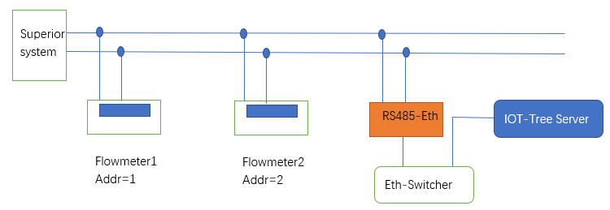
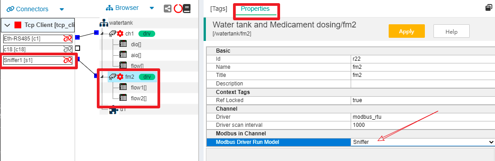

Sniff RS485 MODBUS bus data
==

# 1 Usage Scenario 
In some industrial sites, it is necessary to obtain operational data from existing devices and integrate them into new systems, which use RS485 Modbus RTU bus for communication and have an upper system occupied on the bus. 

At this point, we can use the Modbus RTU driver of IOT-Tree Server to "sniff" the data from these devices. 

# 2 Sniffing Configuration 

## 2.1 Site Conditions and Sniffing Access 

As illustrated above, a fieldbus already has two flowmeters, Flowmeter1 and Flowmeter2, and has been polled by the Superior System. 

We access it through an Ethernet to RS485 module "Eth-RS485". In order not to interfere with the operation of existing systems, our devices are not allowed to send any data, so there is no other use for the separate occupancy of the access channel. RS485 is ultimately transparently mapped to a Tcp link, which acts as a separate channel. The Ethernet to RS485 module runs on Tcp Server (192.168.0.5) and connects to this RS485 interface for port 8001. 

From the docking in the diagram above, you can see that request response data on the bus can be received by Eth-RS485 as long as the "Superior system" of the existing system is functioning properly. 

## 2.2 Configuration in IOT-Tree Server 

### 2.2.1 Connector, Channel and Device Settings 

Specific Tcp Client access, Modbus RTU-based channel establishment, and device and data label (Tag) settings beneath the channel are identical to the normal configuration method. 

In this section, you can refer to other relevant documents or examples, such as [automation system use case][case_auto]. 

#### 2.2.2 Modify the channel so that the driver runs in Sniffer mode 

We configured "Tcp Client - Sniffer1" as the TCP connection "Eth-RS485" module. Set up a channel fm2 separately in the project, as well as two flowmeter devices under the channel, and configure the related tags (Tags) for the flow rate and accumulated flow of the flowmeter. 

Next, we click on the fm2 node of the selected channel, click on the Properties column in the main content area. You can see the Modbus in Channel property item under the channel, modify the Modbus Driver Run Model, and select Sniffer mode. 

As follows: 

After saving, we've set everything up. After starting the project, the Modbus driver for the fm2 channel runs in Snifferr mode. In this mode, the driver will not initiate any requests. When a request is made by the upper system on the bus, it is listened on and the driver under the channel resolves the listened data and updates it to the configured Tag. 

[case_auto]: ./case_auto.md
