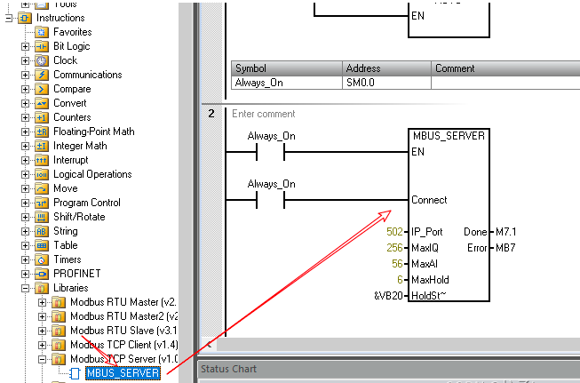
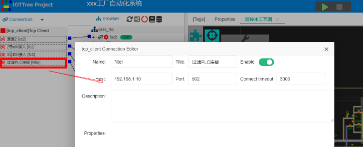
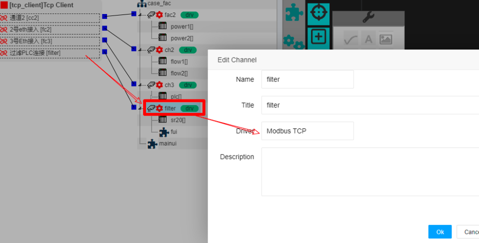
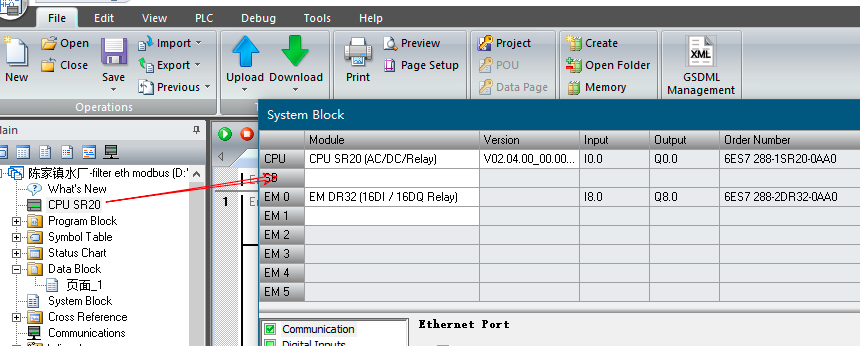
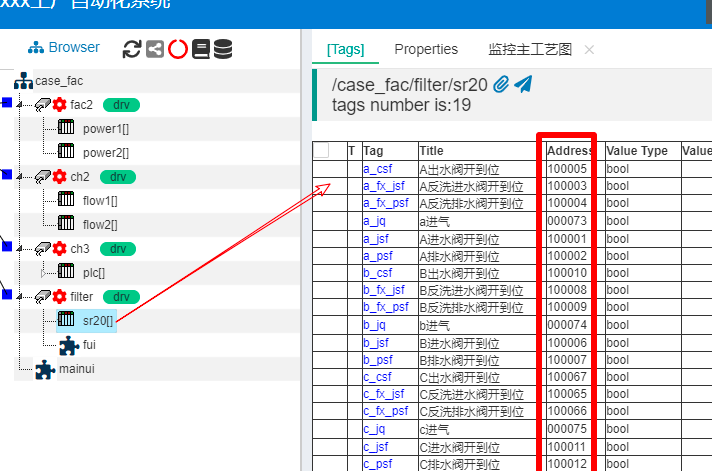
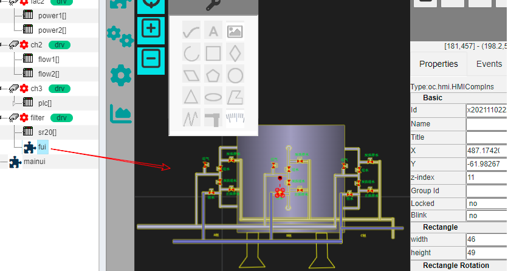
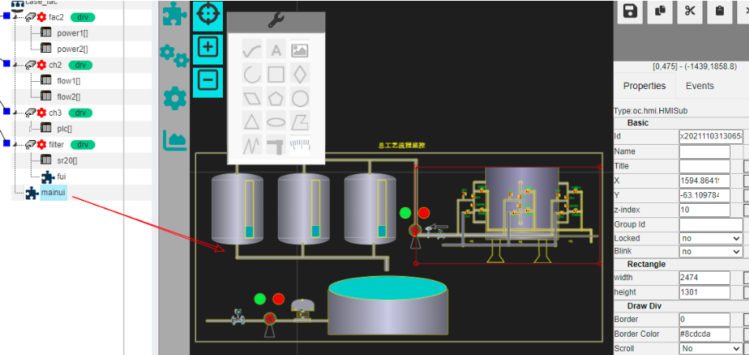

 Connecting Siemens PLC S7-200 Smart
 ==

IOT Tree supports Modbus TCP protocol internally, and can communicate with related devices directly through Ethernet. This case uses this driver to access Siemens PLC s7-200 Smart.

## 1 Case Background

In one industrial control project, one of the links is filter sub system. There is a PLC control cabinet on the site. Siemens S7-200 Smart is used for local filtering control, and the model is SR20.

In addition to accessing some newly installed sensor data, the integrated control project also needs this PLC access, which will eventually be integrated into the central control computer.

## 2 PLC adjustment

We use the Ethernet interface of SR20 to connect from central control computer. Then, modify the control program in PLC to add support for Modbus Tcp Server. Then, the central control computer uses Modbus Tcp Client to connect. As shown in the figure below, we export the original program of SR20 through Step7 MicroWIN SMART software, and then add Modbus Tcp Server support. After downloading the program to PLC, docking is supported.

Note: S7-200 Smart Modbus Tcp Server only allows one client to establish a connection with it. If it exceeds the limit, there will be a problem.

In this case, the IP address of PLC SR20 is 192.168.1.10, and the port is 502.

## 3 Connect to SR20 using IOT Tree Server

In my IOT Tree Server project, create a Tcp Client connection to SR20. As shown in the figure below:

Then, in the main directory tree of the project, create a new channel, set the channel to use the Modbus Tcp driver, and then associate the channel to the Tcp Client link created above. As shown below:

A SR20 device is established under the channel. Set the device address 1. Next, we need to add data tags under this device. Each tag needs to set the value type and corresponding address. These addresses correspond to the switching value or analog value of SR20.

First, check the point address corresponding to the S7-200 Smart CPU and expansion module in Step7-MicroWIN SMART, as shown below:

It can be seen that there is a CPU SR20 and an EM DR32 expansion module in the field control cabinet, as well as the corresponding input and output starting address. Then we check the "Correspondence between Modbus address and data area address in CPU" officially provided by Siemens, as shown in the following table

<table border="1" style="width: 700px;">
	<tbody>
		<tr>
			<th>Function Code</th>
			<th>Description</th>
			<th>RW</th>
			<th>Addr</th>
			<th>Count</th>
			<th>CPU Addr</th>
		</tr>
		<tr>
			<th>01</th>
			<td>Reading digital output (bit)</td>
			<td>0</td>
			<td>00001-09999</td>
			<td>1-1920 (bit)</td>
			<td>Q0.0-1151.7</td>
		</tr>
		<tr>
			<th>02</th>
			<td>Reading digital input (bit)</td>
			<td>0</td>
			<td>10001-19999</td>
			<td>1-1920 (bit)</td>
			<td>I0.0-1151.7</td>
		</tr>
		<tr>
			<th>03</th>
			<td>Read Register Word</td>
			<td>0</td>
			<td>40001-49999
400001-465535</td>
			<td>1-120 Word</td>
			<td>VArea</td>
		</tr>
		<tr>
			<th>04</th>
			<td>Read analog input Word</td>
			<td>0</td>
			<td>30001-39999</td>
			<td>1-120 Word</td>
			<td>AIW0-AIW110</td>
		</tr>
		<tr>
			<th>05</th>
			<td>Write digital output Single bit</td>
			<td>1</td>
			<td>00001-09999</td>
			<td>1位</td>
			<td>Q0.0-Q1151.7</td>
		</tr>
		<tr>
			<th>06</th>
			<td>Write Register Single word</td>
			<td>1</td>
			<td>40001-49999
400001-465535</td>
			<td>one word</td>
			<td>VArea</td>
		</tr>
		<tr>
			<th>15</th>
			<td>Write digital output multi bits</td>
			<td>1</td>
			<td>00001-09999</td>
			<td>1-1920 (bit)</td>
			<td>Q0.0-1151.7</td>
		</tr>
		<tr>
			<th>16</th>
			<td>Write Register multi words</td>
			<td>1</td>
			<td>40001-49999
400001-465535</td>
			<td>1-120 word</td>
			<td>VArea</td>
		</tr>
	</tbody>
</table>

Referring to the address of this table, we added the corresponding tags to be read:

In order to facilitate use, a monitoring UI - fui is specially created under the channel filter for this filtering link. This UI can be used by external UI.

Finally, under the project root, we created a general process monitoring UI - mainui, which references the fui of the filtration system:

The above is the process of docking the S7-200 smart SR20 in this case and making it a part of the project.

