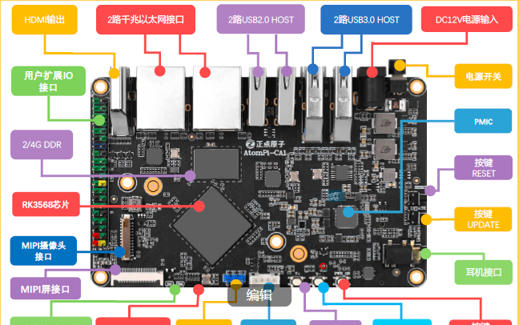
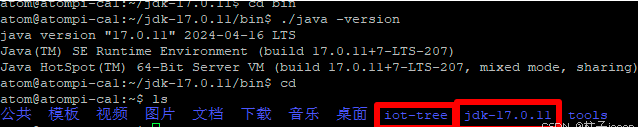
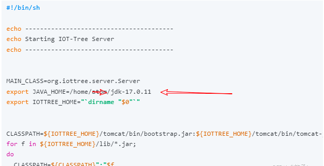

Making a edge computing Device with IOT-Tree Server (Arm Linux)
==


I recently implemented a small project where there are multiple devices from different manufacturers on site. Users need to perform simple integration and implement some linkage control.

I easily implemented it using the IOT-Tree Server software, but the process is as follows:

1) Using Modbus protocol to interface with existing devices, some devices convert analog signals through AD modules and also output Modbus RTU protocol data. All devices have been converted into Ethernet interfaces through the serial server module. Ultimately integrated into a central control device - this device is the edge device that runs the IOT Tree Server.

2) This project uses a palm sized embedded Arm Linux module, which uses the RK3568 main control chip with a clock speed of 2GHz and a memory capacity of 2G/4G. Linux is a Debian version. It is easy to run the Java runtime environment used by IOT Tree Server.

The process of device docking mentioned above will not be elaborated in this article. If you are not familiar with it, you can refer to IOT-Tree's other documents:

What this article wants to share with you is how I installed and configured this Linux device, and how I achieved the linkage of multiple devices on site.


​

# 1 Arm Linux device and installation configuration

The Arm Linux device I am using is the AtomPi-CA1 card computer, which comes with a small casing for easy on-site installation. This board looks like this, with two network ports that are particularly convenient for on-site use - one can connect to on-site devices, and the other can connect to the user's office environment. Not only can it achieve on-site control, but it also facilitates office personnel to view device monitoring screens and ensures isolation between the device network and the office network.

​





## 1.1 Installation and Configuration of IOT-Tree

Due to the release version available for download on GitHub, the built-in Java environment version is Windows, so I downloaded the iot-tree-xxx.zip file. There is no corresponding Java environment inside the file, so you need to download and install it yourself.

I am using the compressed file corresponding to Linux Arm64 provided by the official Oracle website.You can install the Java runtime environment based on the characteristics of your own ARM Linux version.

My Linux installation directory is as follows:





Go to the iot-tree directory and modify the file iot-tree.sh. Just modify one line and set JAVA_HOME to the corresponding JDK directory after decompression.




Then run the command to make this file runnable

```
chmod +x iot-tree.sh
```


Then, you can directly pass through ./iot-tree.sh command has started the IOT-Tree Server. However, my application requires the IOT-Tree to automatically run after the device is powered on and started. Therefore, using the su account, the following files have been added:

```
/usr/lib/systemd/system/iot-tree.service
```

```
[Unit]
Description=IOT-Tree Server
After=network.target

[Service]
ExecStart=/home/atom/iot-tree/iot-tree.sh linux_nohup
WorkingDirectory=/home/atom/iot-tree
Restart=always
StandardOutput=append:/home/atom/iot-tree/log/syslog.log
StandardError=append:/home/atom/iot-tree/log/syslog.log
SyslogIdentifier=iot-tree

[Install]
WantedBy=multi-user.target
```


In this way, IOT-Tree Server is configured as a service running in the Linux background. You can use the following command to manage services:

```
reload service：systemctl daemon-reload

Set up startup upon startup：systemctl enable iot-tree

start service：systemctl start iot-tree

stop service：systemctl stop iot-tree

restart service：systemctl restart iot-tree
```


​[cn]
# 2 嵌入式ARM Linux设备

只要成功运行，这个嵌入式设备就继承了IOT-Tree的全部功能。不仅可以成为功能强大的物联网边缘设备，也可以作为协议网关而存在。

这是我的一个最小体积设备：


# 2 Embedded ARM Linux Devices

As long as it runs successfully, this embedded device inherits all the functions of IOT-Tree. Not only can it become a powerful IoT edge device, but it can also exist as a protocol gateway.

This is one of my smallest volume devices:


