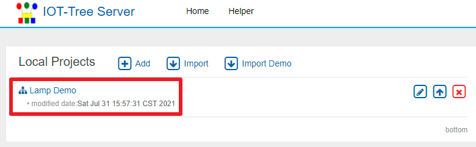
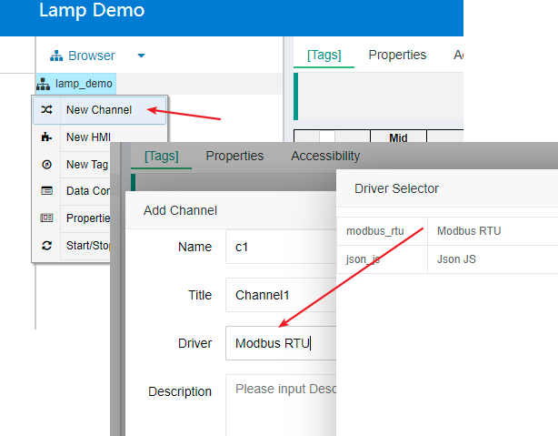
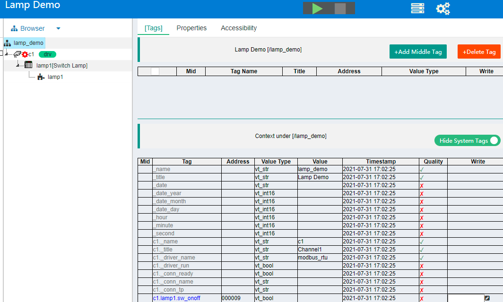
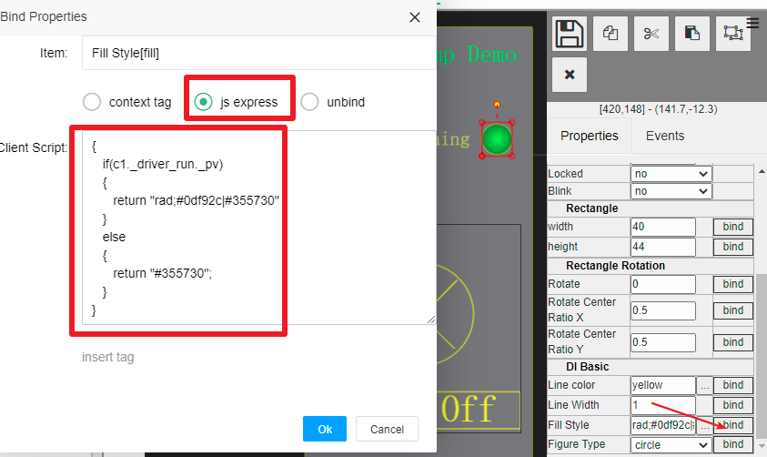
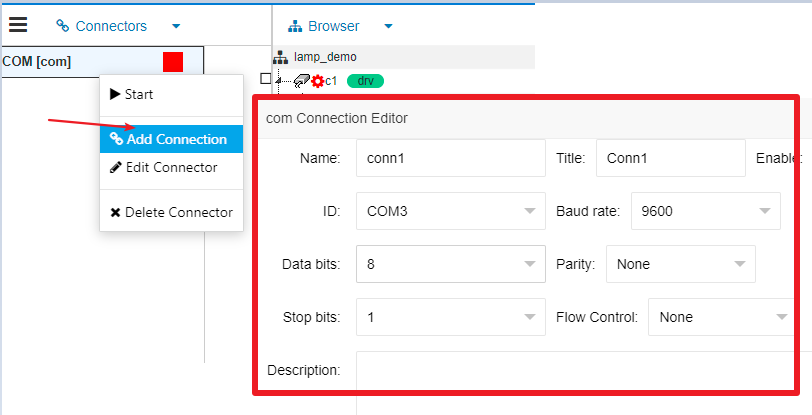
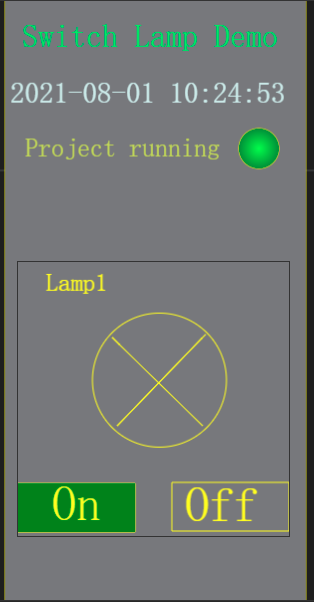

Quick Know IOTTree - Lamp Demo
==

# 1 The simplest example (controlling a light)

Through the simplest demonstration, you can intuitively understand the value iottree can bring to you in 5 minutes.

There is only one light in the demonstration, and the light equipment provides docking through RS485 Modbus RTU interface. Lighting devices have been defined in the device management in iottree. If you want to understand how devices are defined, you need to understand the Modbus RTU protocol and [quick understanding - device definition][qn_devdef].

As shown in the figure above, the lighting device is connected to the RS485 bus. When our demonstration software runs on the PC, it is also connected to the RS485 bus through usb-rs485 transfer This constitutes the master device and slave device running on the IOT tree server on the PC side

The usb-rs485 adapter is shown in the figure below:

The circuit is very simple. Next, let's see what convenience IOT-Tree Server can bring us. If you have not installed IOT-Tree Server, you can refer to [quick start][qn_start] to download and install it.

# 2 Config Project
## 2.1 Login Admin Panel
After you complete the IOT tree server according to the configuration, access http://youip:port/admin/ Enter the management interface. If you are visiting the management interface for the first time, you need to set and enter the administrator password. If the password has been set, you only need to enter the password to log in.

Click Local Projects Add button and fill in the project name and title in the pop-up window, as shown below:

After OK button clicked, we can see that this project entry is added under Local Projects, as shown in the following figure:

。

Clicking this item will open a new project management browser window. Here, we can start to configure the project. Such as establishing channels, creation connector and adding device.

## 2.2 Establishing channels and adding devices

In the project management window, right-click lamp_demo under browser root node, select the "New Channel" menu item, and fill in the channel name, title and driver in the pop-up channel editing window. As shown below:

Among them, the drive selects Modbus RTU. After that, this new channel node will appear under the lamp_demo root node. Then, right-click the channel node and select the menu item "New Device" to add devices. As shown below:

In the pop-up device editing window, fill in the device name and title. Click the device selection button and select "driver Modbus RTU" - "device classification demo" - "device switch lamp" in the pop-up device selection list. After completion, the device node is under channel c1. As shown below:

The device has been defined in the system. After adding a device, the data definition of the device and its own control switch panel UI will automatically enter the project.

At this point, click the project root node lamp_demo and click the [tags] tab in the main content area. You will find all the context contents under the project. Turn on the Show System Tags switch, and you can see all the context definitions (including customization within the system). As shown below:

In the project context table, you will find the context tags corresponding to different level nodes and the tags customized by the device. These tags have their own values at run time. These contexts are the data base of the project, on which you can define higher-level application nodes, such as UI, storage strategy, etc.

Next, we will create a monitoring UI under the project.

## 2.3 Add monitoring UI

Right click the project root node, select "New HMI" menu item, and fill in the name and title in the pop-up editing window. As shown below:

After click OK, we will see the new HMI node mainui under the project root node. Right click this node and select the "Edit UI" menu. You can see that a new Main UI editing tab appears in the main content area. From here, we can start editing the UI interface. As shown below:

### 2.3.1 Add background box

In the toolbar at the upper left corner of the UI editing area, select the rectangular drawing tool, and then click the left button in the drawing area to open an area. Release the left button to create a new rectangular element in the drawing area.

In the Properties bar on the right of the drawing area, fill 300 and 600 for "width" and "height" respectively(set the width and height of the rectangular element).

Select Yes for the "locked" property to lock the element, so that the background element cannot be dragged and shifted.

In the edit box for the fill style property, enter #77787c. As shown in the figure below:

### 2.3.2 Add display text

Select the text element in the toolbar and click add text element in the drawing area. Drag and drop the mouse to adjust the size and position and make relevant typesetting.

Adjust and modify the text content, text color and font through the properties bar. The final effect is as follows:

### 2.3.3 Add project driver running state

To the right of the text "Project Running", add a circular element. When this element is selected, click the fill style property value Edit button, select the "Radial" label in the pop-up Filling Ftyle, and select two colors at the same time. As shown below:

Record two filling styles (which will be used in the script later):
1 running:the filling style circular gradient rad#0df92c|#355730
2 non running fill style monochrome #355730

### 2.3.4 Add device panel

Click the context Sub HMI icon in the resource bar on the left of the drawing area. The context sub HMI window is displayed. Because the custom device already exists in the context, and the device has a control panel sub diagram. This subgraph is also in the context of the project.

Click and drag the subgraph /c1/lamp/lamp1 and release it to the drawing area. Then adjust the layout position of the panel subgraph based on the background box. As shown below:

### 2.3.5 binding context data

We have basically prepared the monitoring ui. Next, we can set the second text box to display the system time. At the same time, we can bind the circular element to driver state to change the corresponding filling color.

#### 2.3.5.1 bind the display time in the second text box

As shown in the figure, select the second text box and click the bind button next to property text to pop up the binding editing window.

In the Bind Properties window, select "context tag" and click the "Tag" input box. In the context tag selection box that opens, select "_date". After confirmation, the second text box is bound with the time string label. As shown below:

#### 2.3.5.2 Circular element binding drive running state

Similar to the above, select the circular element and click the bind button next to the fill style property.

Select the JS express option in the pop-up window. Because fill style requires an input string, and tag in the context is a bool value. Therefore, you need to output the corresponding fill string according to the bool value of tag. As shown below:

In the "js express" option, the JS script code is filled in. The logic is very simple if you drive the tag "c1_driver_run._pv" value is true, a bright fill is output; otherwise, a dark fill is output.

## 2.4 Add COM connector

Our project configuration is almost complete, and now we are left to communicate with external devices.

We convert USB to serial port and generate serial port COM3 in the system. Therefore, we only need to establish the link between IOT-Tree Server and COM3.

In the project, click Connectors on the left, and select "Add  Connection Provider"-"COM" from the drop-down menu. Fill in the name and title in the pop-up window. As shown below:

After adding successfully, the COM Connector Provider appears in the list. Right click the provider, select the menu item "Add Connection", edit the COM port in the pop-up ui, and fill in the COM port parameters. Including name, title, port number COM3, baud rate, etc. As shown below:

After adding successfully, an connector item is added to the left link. At this time, there is an association area between connectors and browser. Then we need to establish an association between connector and channel. Click the association point on the right of the new conn1, drag and pull out the connection line, and then release it at the association point on the left of the channel, so as to establish an association between the connector and the channel. As shown below:

# 3 Run project

Click the "start project" button at the top of the project configuration. Then right click the UI node "mainui" and select the menu item "Access". The system opens a new browser access window. This window link is the external application access URL of IOT-Tree Server for this UI.

http://host:port/lamp_demo/mainui. As shown below:

The external access ui is as follows. This access url also supports the mobile terminal.

You can find that the system time will change after the project is started. Click the light switch to control the light on the bus.

[qn_start]: ../quick_start.md
[qn_devdef]: ../quick/quick_know_devdef.md
