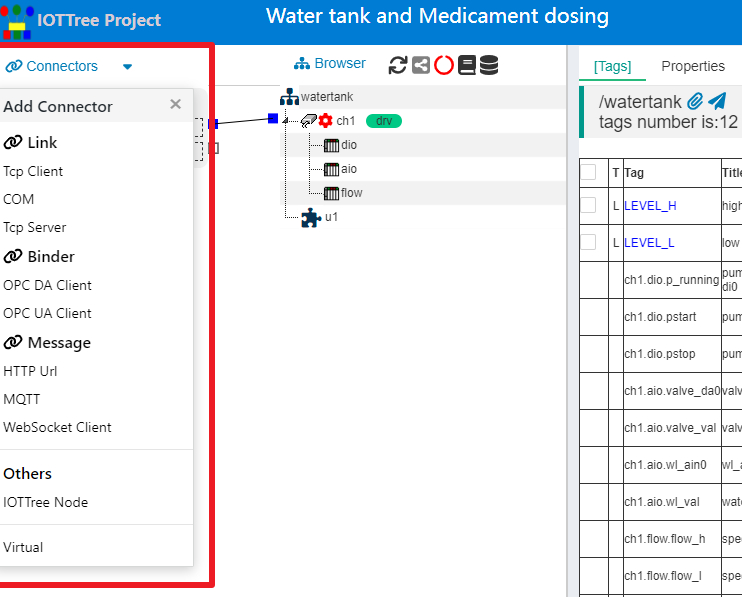
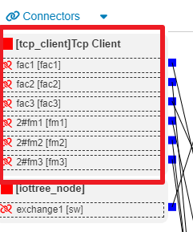
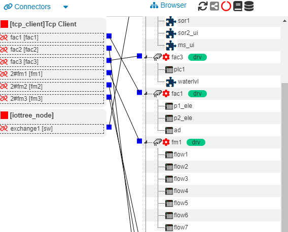
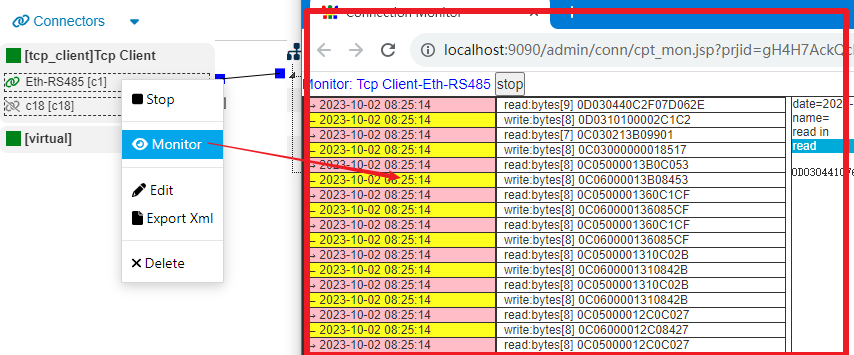
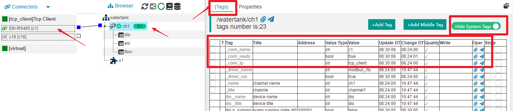

IOT-Tree Connectors
==

Connectors is an important component in IOT-Tree. If you have a general understanding, you can quickly view detailed descriptions of different access through the following content.

<a href="./link_tcpclient.md" target="main">&nbsp;&nbsp;&nbsp;Link-Tcp Client</a>

<a href="./link_tcpserver.md" target="main">&nbsp;&nbsp;&nbsp;Link-Tcp Server</a>

<a href="./link_com.md" target="main">&nbsp;&nbsp;&nbsp;Link-串口(COM)</a>

<a href="./bind_opcda.md" target="main">&nbsp;&nbsp;&nbsp;Binding - OPC DA</a>

<a href="./bind_opcua.md" target="main">&nbsp;&nbsp;&nbsp;Binding - OPC UA</a>

<a href="./msg_mqtt.md" target="main">&nbsp;&nbsp;&nbsp;Message - MQTT</a>

<a href="./msg_http_url.md" target="main">&nbsp;&nbsp;&nbsp;Message - HTTP URL</a>

<a href="./msg_http_url_html.md" target="main">&nbsp;&nbsp;&nbsp;Message - HTTP URL HTML</a>

<a href="./msg_websocket.md" target="main">&nbsp;&nbsp;&nbsp;Message - WebSocket Client</a>

<a href="./other_iottree_node.md" target="main">&nbsp;&nbsp;&nbsp;Others - IOTTree Node</a>

<a href="./other_virtual.md" target="main">&nbsp;&nbsp;&nbsp;Others - Virtual</a>

## 0 IOTTree's data connection and integration capabilities

In most existing OPC software, the access of various devices is based on the driver, and different drivers provide their own configuration support internally. Among them, the relevant parameters required for device communication, like other parameters, are also determined by their respective drivers.

We have studied a large number of devices and IoT applications and found that if device communication can be independent of the driver, it can not only simplify the implementation of the driver, but also bring more flexible combination configuration support.

That is to say, in the IOTTree architecture, the connector is also provided by specialized drivers, which can be arbitrarily extended as needed. Of course, the most common connector in today's systems is based on TCP/IP protocol, as well as HTTP and other content above it. We are already able to support Tcp Client, Tcp Server, and HTTP Url access.

Further more, although the mqtt protocol can also be based on TCP, it is quite special and we have also specifically provided connector driver support.

In some local systems, the system may communicate with on-site devices through RS232 or RS485 interfaces, while in computer content, it is reflected as a COM interface, and IOT-Tree also provides special support for this.

## 1 Connector Management

In each project of IOT-Tree, if you enter the management ui, you can directly see that the leftmost content is the "Connectors" block. Click on the Connectors menu in the upper left corner to see all the connection content that the system can support, as shown in the following figure:

It can be seen that the current support for connector is already quite rich, and more driver support can be added continuously in the future.

## 2 The hierarchical relationship of a single connector driver

In the project, connector is divided into two levels from an organizational perspective: ConnProvider and ConnPt (Connection Point). ConnProvider represents the specific connection providers under a certain driver, which can have multiple or single providers. Under ConnProvider, there can be multiple ConnPts, representing multiple specific connections.

For example 1, as shown in the following figure:

Tcp Client is a ConnProvider, and there can be multiple ConnPts below, each corresponding to a specific Tcp Connection.

Similarly, it can be imagined that if a ConnProvider is a Tcp Server (internally listening to a certain port), there may also be multiple ConnPts below representing the Tcp connections established between each remote client.

Each ConnProvider will have an independent management thread internally, which will uniformly manage all ConnPts below. In this way, the connections management and internal operation mechanism of IOTTree will become very clear, and we will provide detailed explanations for this section in the future.

## 3 Establishing Association from ConnPt to Channel

IOT-Tree stipulates that connections to specific project organizations can only be made through ConnPt and Channel, which not only meets the actual project needs but also ensures the simplicity of each project data flow. As shown in the following figure:

You can look at the figure above and imagine what a situation would be if there were no such restriction. Two hierarchical trees were connected on the left and the more complex tree of the project organization on the right to directly and arbitrarily establish associations (establish data flow) - it would certainly be a mess. Not only is the implementation complex, but it can also leave users confused.

It is obvious that appropriate and reasonable restrictions can bring great benefits to a complex system.

In fact, IOT-Tree also stipulates that device drivers must also be associated with Channels, and device drivers and communication (connected ConnPt) are closely related. Therefore, this limitation is still well founded.

## 4 Classification based on connector characteristics: link, bind, and message

Since we have managed the connections separately. So it is necessary for us to abstract the specific data source methods and features (patterns), and provide different connector configurations and processing support for different situations. It is obvious that currently we have found at least three modes of data connector: link, bind, and message. Below, we will provide a brief explanation.

### 4.1 Link

Connecting devices or programs to IOTTree directly establishes a link channel for data exchange. For example, Tcp link, RS485 serial link, etc. In general, after establishing this link between the device and IOTTree, it will be maintained continuously, and both parties will transmit and receive data through bidirectional or half duplex methods. At present, the following drivers for this method include: Tcp Client, Tcp Server, and COM.

For such connector, there are more protocol limitations for data transmission over the link, which are related to specific device support. For example, Modbus protocol based on RS485 and Modbus TCP protocol based on Tcp link. At this point, it is generally necessary to set corresponding device drivers in the associated channel, which will share these connector link resources for higher-level protocol data transmission.

Connecting devices or programs to IOTTree directly establishes a link channel for data exchange. For example, Tcp link, RS485 serial link, etc. In general, after establishing this link between the device and IOTTree, it will be maintained continuously, and both parties will transmit and receive data through bidirectional or half duplex methods. At present, the following drivers for this method include: Tcp Client, Tcp Server, and COM.

In industrial sites, a large number of devices support fieldbus, such as the simple RS485 bus (which only requires two core cables to support) and the Modbus RTU protocol based on this, with multiple devices on the bus. One of them is the master device, while the other devices are slave devices. The master device initiates a timed polling request for each slave device, and the slave device judges and responds based on the received request. At the same time, only one device on the bus sends data. For the main device, this bus is just a link.

There are also many IoT applications where there are many monitoring and collection points scattered in a single area. Each monitoring and collection point will have several sensor slave devices and a master device, and they communicate with each other through the RS485 bus Modbus RTU protocol; There is an RS485 GPRS/4G transparent transmission module inside the main device that communicates with the cloud. From the cloud perspective, each on-site monitoring point will establish a Tcp link with it. Through the transparent transmission of the on-site main module, data can be directly exchanged with the on-site RS485 bus.

The above only provides examples of the most commonly used methods of link based connection. In fact, there are many other methods of link based connector that are relatively universal. There are also many top-level protocols based on this communication method (including a large number of devices using factory owned protocols). Therefore, in general, it is necessary to set corresponding device drivers in the associated channels, which will utilize these link resources for more advanced protocol data parsing and transmission. These device drivers include protocols such as Modbus RTU, Siemens PLC's s7-200 ppi, and Siemens Tcp/IP Ethernet.

At present, IOTTree link access supports three methods: Tcp Client, Tcp Server, and COM. The following will provide detailed explanations for each method.

If you want to more detailed content, please visit <a doc_path="links.md" target="main">&nbsp;&nbsp;&nbsp;Link Detail</a>

### 4.2 Bind

If the connected device or program can provide an OPC interface, the IOTTree connector driver will directly provide node data in a tree structure based on the characteristics of OPC data. It is obvious that these data are fixed from an organizational perspective. If we want to use this data in a simple and intuitive manner, the simplest way is to bind it - mapping the connected data to a Tag defined under a certain channel in our project. At present, the following drivers for this method include OPC DA Client and OPC UA Client.

If you are not familiar with OPC, you can search for relevant information on the internet for learning and research.

If you want to more detailed content, please visit <a doc_path="binds.md" target="main">&nbsp;&nbsp;&nbsp;Bind Detail</a>

### 4.3 Message

Some connected devices or programs may transmit data packets in the form of data packets, such as mqtt sending and receiving data packets through publish subscribe mode, and WebSocket data listening and callback acquisition. These accessed data are obtained passively, and each time a complete data content is obtained.

There are also some special cases, such as HTTP access. By giving a specific URL address, internal programs can access and read data content on a regular basis. Each read content is also a completed data content, which can be strings in HTML or XML format, or a complete JSON data string. Therefore, from the data pattern, it can also be considered as a message, and the difference is actively obtained.

Due to the fact that a large portion of the message data is in a specific format, relevant data extraction can be done based on the specific format. Therefore, the associated channels do not need to use specialized device drivers to process the message data at this time. 

Of course, for some special devices that support Message, specialized drivers can also be implemented.

If you want to more detailed content, please visit <a doc_path="msgs.md" target="main">&nbsp;&nbsp;&nbsp;Message Detail</a>

## 5 Other support for connector

After IOTTree separates device connector, it can not only simplify the overall architecture and drive complexity of each device protocol. At the same time, more support can also be provided specifically for connection. Such as communication monitoring function, communication status support, etc.

### 5.1 Communication Monitor

IOTTree provides a certain length of cache support for communication data when accessing connection implementation, and can view the cached data in the project management ui. It greatly facilitates the tracking of abnormal communication situations on devices.

You only need to right-click on the corresponding link ConnPt node, select the menu item Monitor, and view it in a new monitoring window that pops up.

### 5.2 Communication Status

When an internal link is associated with a channel in the project, the corresponding system tag Tags of the channel also contain link status information.

As shown in the figure, select channel "ch1" in the project and select the \[Tags] in the main content area on the right. At the same time, open the "Show System Tags" switch in the upper right corner. You can see hidden system tags in the list, all of which have been '\_' beginning. You can see the contents related to communication links starting with "_conn". These system tags are the same as your customized device tags and can be used else where.

