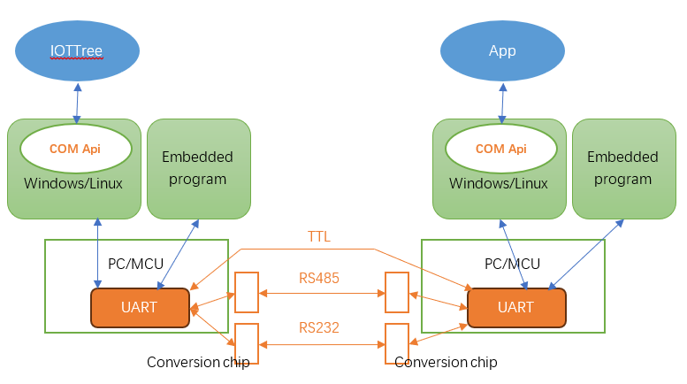
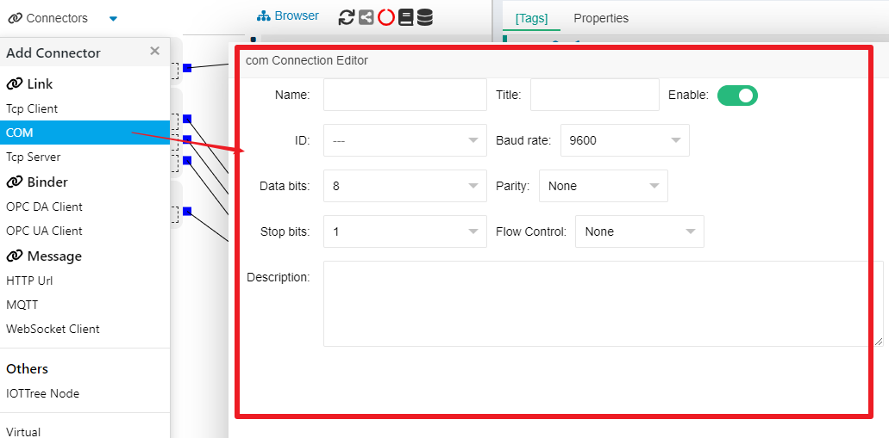
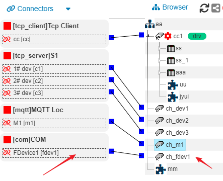
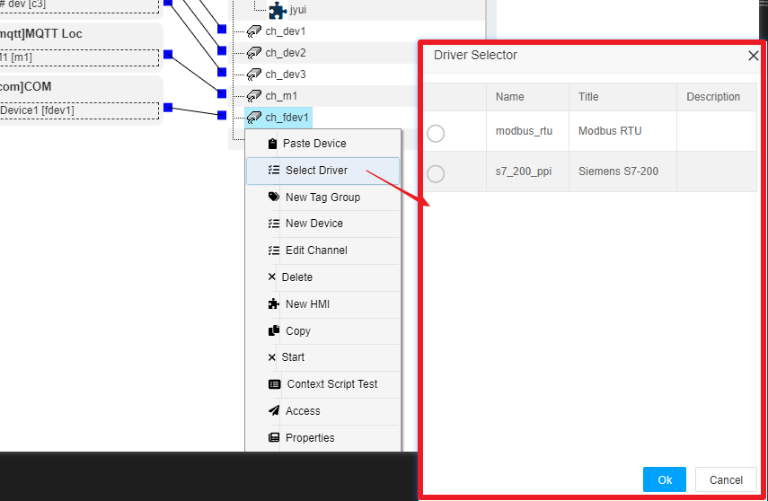

IOTTree Link - Serial Communication(COM)
==

## 1 Understanding Serial Communication - COM、UART、TTL、RS232、RS485

Before introducing the support of IOTTree connector for serial port (COM), let's first review many related terms you can see on the network, such as COM, UART, TTL, RS232, RS485, and so on.

>UART: Refers to the Universal Asynchronous Receiver/Transmitter, which is a type of logic circuit that can be independently integrated into a chip or become a module within other chips. Our computer motherboard and various embedded microcontrollers (MCUs) all have this chip or module inside. With this chip or module, the upper level can support software calls, and the lower level can provide specific physical communication interfaces.

>Serial Port (COM): In operating systems such as Windows and Linux, based on the serial communication support provided by UART, COM Api is provided at the software level, so this is a software interface provided by the operating system for the above application programs.

>TTL: It is a direct communication between two UARTs (using the same signal voltage) through three lines (TX, RX, and GND). Due to the low voltage, poor anti-interference ability, and close distance, it is suitable for communication between board level chips.

>RS232: Using a conversion chip for TTL signals, the line voltage is much higher (up to 15V), improving anti-interference ability and extending communication distance, making it suitable for short distance communication between devices.

>RS485: Using a conversion chip for TTL signals, the signal is processed in a differential manner using two cables, further improving anti-interference ability. The communication distance can reach 1200 meters, making it suitable for industrial communication occasions.

### 1.1 Serial Communication

Due to the limited number of communication lines, data can only be transmitted one character at a time, with each character being transmitted bit by bit. When transmitting a character, it always starts with the "start bit" and ends with the "end bit", and there is no fixed time interval requirement between characters.

There are three types of communication methods:

>Simplex mode: Data transmission is unidirectional, and the sending and receiving ends are fixed. Information is only a one-way transmission;

>Half duplex: The equipment can receive and send data, but it cannot be done simultaneously. Each party only receives or sends data at a certain point in time, as is the case with RS485;

>Full duplex: Communication allows data to be transmitted simultaneously in both directions. This requires both the sending and receiving ends to have independent receiving and sending capabilities.

There are also three situations in data verification: 
1) No verification;
2) Odd parity: In correct code, the number of 1 in a byte must be odd. If it is not odd, add 1 to the highest bit b7;
3) Even parity: In the correct code, the number of 1 in a byte is even, while non even numbers add 1 to the highest bit b7.

### 1.2 BAUD

Refers to the number of data bits transmitted per second. Serial communication requires that the baud rate of devices communicating with each other must be the same, so that data can be sent and received normally without confusion through simple clock synchronization support. Commonly used baud rates: 600/1200/4800/9600/19200/38400, etc.

## 2 IOT-Tree's support for COM ports

IOT-Tree is developed using a Java environment and runs on a Java virtual machine, so it is also necessary to configure underlying support for the COM port of the operating system. IOTTree internally uses RXTXComm as serial port support.

In our released version, we have already placed the corresponding DLL files for the Windows environment in the internal jre environment. You can start IOT-Tree directly to use it normally. If you want to deploy or embed a Linux environment, please copy the corresponding "xx.so" file in your Java environment.

In the future, we may provide automatic dynamic library loading support based on different bits in Windows and Linux environments for everyone's convenience. Stay tuned.

Currently, a large portion of industrial devices supports the RS485 interface. Therefore, if we need to use IOT-Tree to connect with these devices on site, we need to utilize the support of this COM port.

## 3 Creating COM connector

As shown in the figure above, select COM from the Connectors menu in the upper left corner, and the corresponding editing dialog will pop up. Among them, the ID option will enumerate all the COM ports supported by the local device operating system. Please note which one is used when connecting the on-site device and IOTTree. The content filled in this document is as follows

`
Name=fdev1 Title=FDevice1 ID=COM2 Baud rate=9600
Data bits=8 Parity=None Stop bits=1 Flow Control=None
`

After clicking "OK", you will see that the system will automatically create a "COM Provider". The newly created ConnPt we just edited is located below this. Each COM access is basically independent.

In order to see how the COM connector we have established will be used in the future, we will create a new channel "ch_fdev1" on the middle project organization tree and associate the previously connector "fdev1" with it (please refer to other documents for specific channel creation). As shown in the following figure:

At this point, the device drivers that can be used by channel "ch_fdev1" will be limited by COM. Right click on "ch_fdev1" and select the "Select Driver" option. In the pop-up device driver selection dialog, you can see the list of restricted drivers. As shown in the following figure:

The specific content of the subsequent device data organization configuration is related to the selected device driver. This document will not be discussed further. Please refer to other documents for this part of the content.

We can clearly state that the separation of communication connector and device drivers allows IOT-Tree to have more flexible support when dealing with communication and device protocols.

