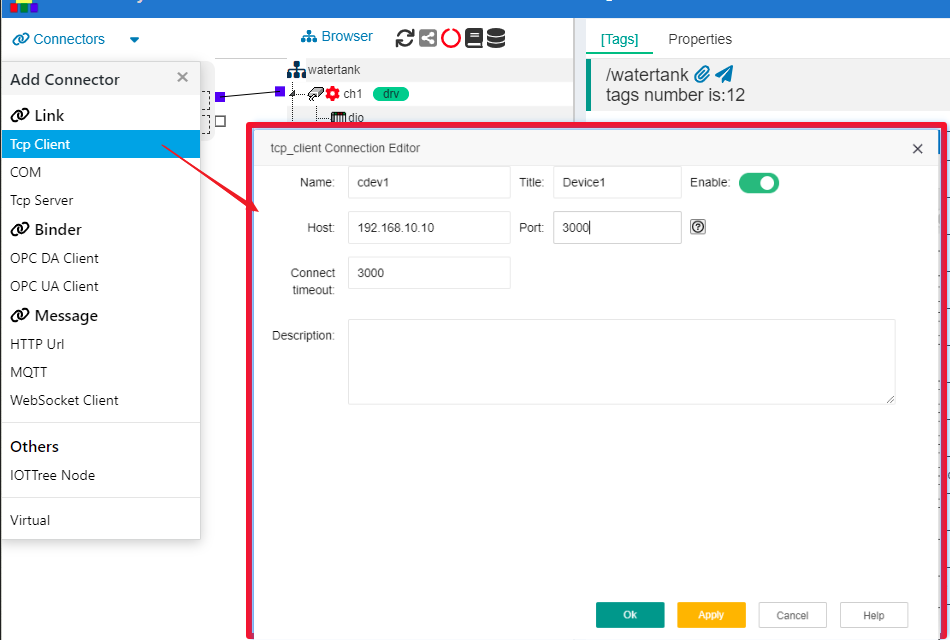
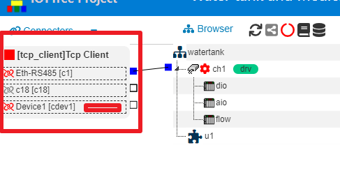
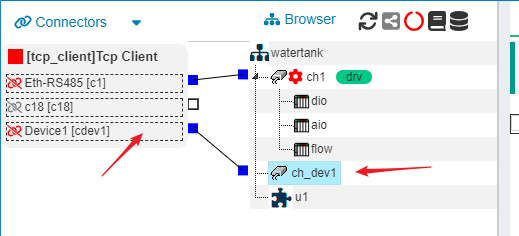
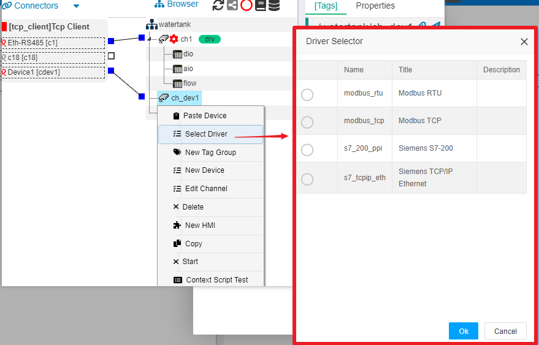

IOTTree Link Connector - Tcp Client
==

Premise: The connected device or program provides an external interface in Tcp Server mode, and these devices generally have an IP address and listening port.

In an IOT-Tree project, there may be multiple such devices, so it is necessary to support the establishment of any number of Tcp Client links. Due to the relative independence of each link in data processing (provided by the drivers below the channel). Therefore, there is only one overall ConnProvider for Tcp Client, and it only serves as an organizational role. The subsequent data interaction of each link is generally handled separately by the driver thread.

At this point, if we want to use IOT-Tree to connect to this device, we must establish a Tcp Client and establish a communication link through the IP address and port provided by the device. This section is based on the Tcp/IP protocol, which is the cornerstone of our current internet communication. If you are not familiar with this, please search for relevant information.

Assuming that our device and IOTTree are both on the same factory internal network and within the same network segment (i.e. accessible communication can be achieved through IP addresses). The address of the device is 192.168.10.10, and the listening port is 3000.

As shown in the figure above, select Tcp Client from the Connectors menu in the upper left corner, and the corresponding editing dialog will pop up. In addition to the Name=cdev1 and Title=Device1 we filled in, we must also fill in the Host=192.168.10.10 and Port=3000 parameters for the device, which correspond to the IP address and port of the device. After confirming the save, we established an connector to Tcp Client. You can see in the project that the newly created Tcp Client and the previously established link are both in the same group.

In order to see how the Tcp Client we have established will be used in the future, we will create a new channel "ch_dev1" on the middle project organization tree and associate the previously established "cdev1" with it (please refer to other documents for specific channel establishment). As shown in the following figure:

At this point, the device drivers that can be used by channel "ch_dev1" will be limited by the Tcp Client. Right click on "ch_dev1" and select the "Select Driver" option. In the pop-up device driver selection dialog, you can see the list of restricted drivers. As shown in the following figure:

The specific content of the subsequent device data organization configuration is related to the selected device driver. This document will not be discussed further. Please refer to other documents for this part of the content.

We can clearly state that the separation of communication connector and device drivers allows IOT-Tree to have more flexible support when dealing with communication and device protocols.

