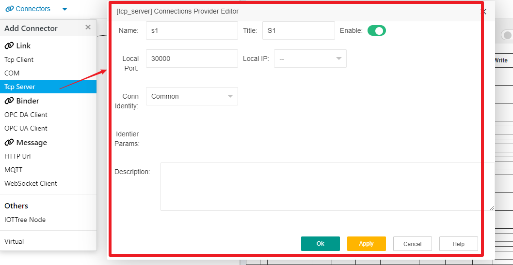
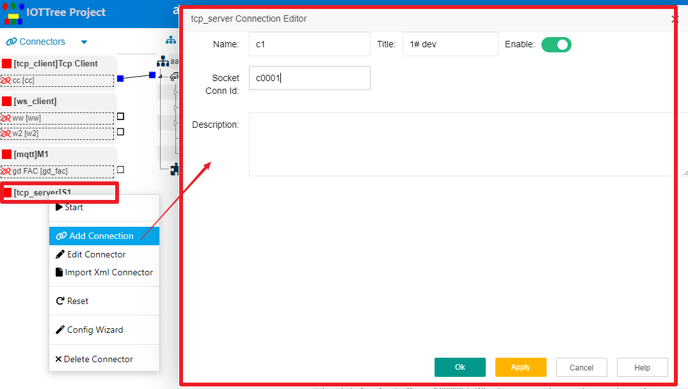
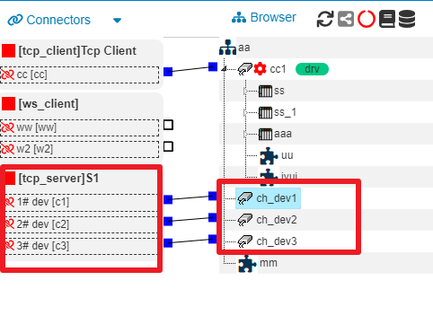
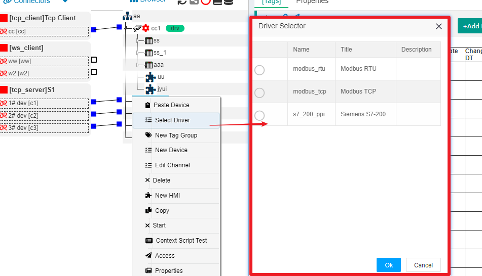

## 1 Tcp Server接入ConnProvider创建

前提：被接入设备或程序提供了Tcp Client方式的对外接口,并且会主动向Server端发起连接请求，并且在链接成功建立之后开始相关的数据传输。这种场合典型的应用情景是：在有固定IP地址的云端部署IOTTree Server，然后云端监听某个端口提供Tcp Server接入支持，设备端有多个，分布在一个很大的区域范围，并且通过移动GPRS/4G模块与云端进行连接通信。

在一个IOTTree的项目中，可能会有多个Tcp Server监听，每个Tcp Server监听不同的IP地址或端口。因此，Tcp Server的ConnProvider可以有多个，并且会自动管理连接到此IP和端口的Tcp Client端，每个接受并且建立的Tcp链路对应一个Connection Point。

假设我们的物联网应用准备采集一个区域内的温度和湿度数据，并通过4G通信传输到云端，每个设备硬件都一样采集的数据内容也一样（只有位置和标识的差异）。IOTTree部署在云端服务器中，地址为data.mydomain.com,并且准备监听端口为30000。

我们在项目中，点击Connectors菜单，选择Tcp Server，在弹出的编辑窗口中，编辑对应Connections Provider，填写内容：Name=s1 Title=S1 Local Port=30000 Conn Identity=Common。如下图：

其中，Local port=30000就是我们准备监听的端口，而Local IP不选择代表绑定所有本地地址。当然，如果你想限定某个具体的IP地址，那么选择就行。

Tcp Server接入还有个连接标识（Conn Identity）选项，有Common和Fix IP两个选项。

Common是通用情况，要求Client端连接成功之后立刻发送直接的标识信息，以告知IOTTree Server端，器原因如下：当一个设备和云端TcpServer成功建立Tcp连接之后，Server端（也即是IOTTree端）无法知道此连接来自于现场的哪个设备，因此现场设备必须在建立连接成功之后立刻发送自己的标识信息。（当然，为了安全我们也可以让设备提供验证信息，并且通过Tcp连接进行多次数据交互进行有效性验证，这个过程和具体实现有关，本文档就不做说明了）。Server端根据这个标识，使得此连接自动分配到已经配置好的某个ConnPt上。

而Fix IP一般用在内网，其要求是每个接入的设备（Client端）IP地址都是固定的，也即是这些固定IP可以代表某个设备的标识。此时，设备Client与IOTTree Server端一旦建立Tcp连接，其身份也就确定了，不需要额外的验证。

## 2 ConnPt的建立

Client端每个接入都会对应一个ConnPt。我们在上面新建的S1接入节点鼠标右键，选择Add Connection，并在弹出的窗口中，填写如下内容：Name=c1 Title=1# dev ;Socket Conn Id=c0001  ，如下图：

其中，Socket Conn Id是对于设备内部配置的唯一标识，此设备与IOTTree Server端一旦建立Tcp连接，马上就会发送此标识，server端由此确定接入的是哪个设备，并且会分配到此ConnPt。

我们可以和<a href="link_tcpclient.md">Tcp Client接入</a>对比发现,每个Tcp Client接入ConnPt是由IOTTree主动发起，连接远端的Tcp Server。而IOTServer提供的Tcp Server，则是由配置好的Tcp Server ConnProvider获取远端的接入设备建立Tcp连接，根据标识id，分配给对应的ConnPt。后续的保持的Tcp链路，两者就没什么差异了。

很明显，我们可以同样地在S1这个Tcp Server ConnProvider下面为其他设备建立ConnPt，{Name=c2，Title=2# dev,Socket Conn Id=c0002},{Name=c3，Title=3# dev,Socket Conn Id=c0003}

这样，当前的Tcp Server ConnProvider允许下面有3个限定标识远程链接的接入。

## 3 关联到通道(Channel)

为了查看我们建立的Tcp Server接入和在内部定义的3个ConnPt后续会被如何使用，我们在中间项目组织树上新建3个通道ch_dev1、ch_dev2、ch_dev3,并且把3个ConnPt与之关联（具体建立通道请参考其他文档内容）。如下图：

此时，通道ch_dev1、ch_dev2、ch_dev3能够使用的设备驱动就会被Tcp链接限定。鼠标右键ch_dev1,选择 Select Driver项，在弹出的设备驱动选择窗口中，你就可以看到限定驱动列表。如下图：

后续设备数据组织配置具体内容，和选择的设备驱动有关，此文档不做展开讨论，此部分内容请参考其他文档。

我们可以明确的是，这种通信接入和设备驱动的分离，可以使得IOTTree在处理通信和具体设备协议时，可以有着更灵活的支持。

你可以读取[快速理解TcpServer接入器][qn_tcpserver]这篇内容，从实际案例角度来了解Tcp Server接入。

[qn_tcpserver]:../main/quick_know_tcpserver_connector.md

