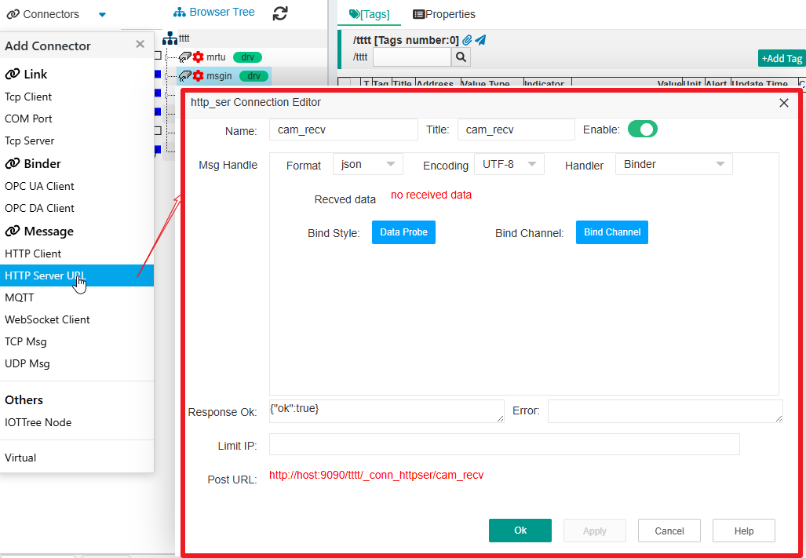
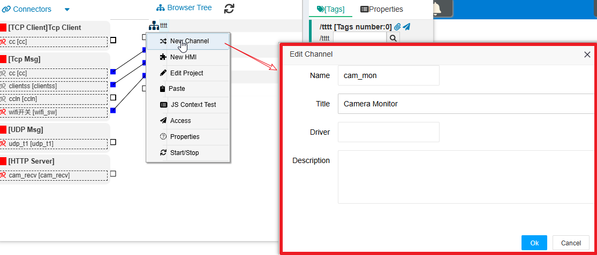
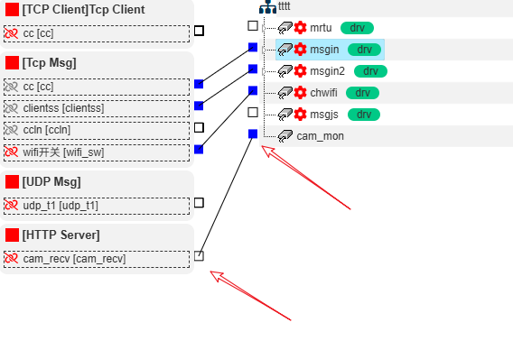
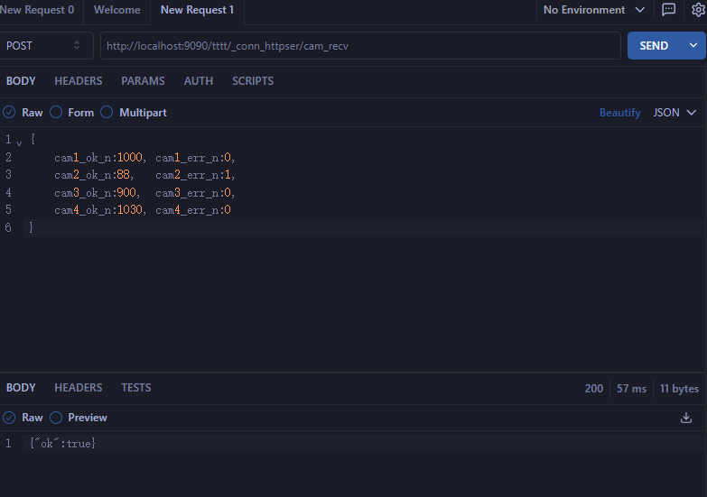
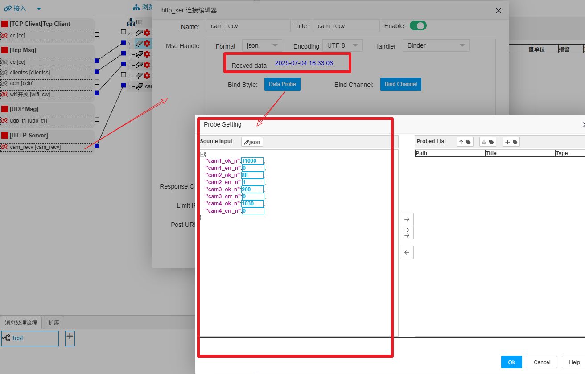
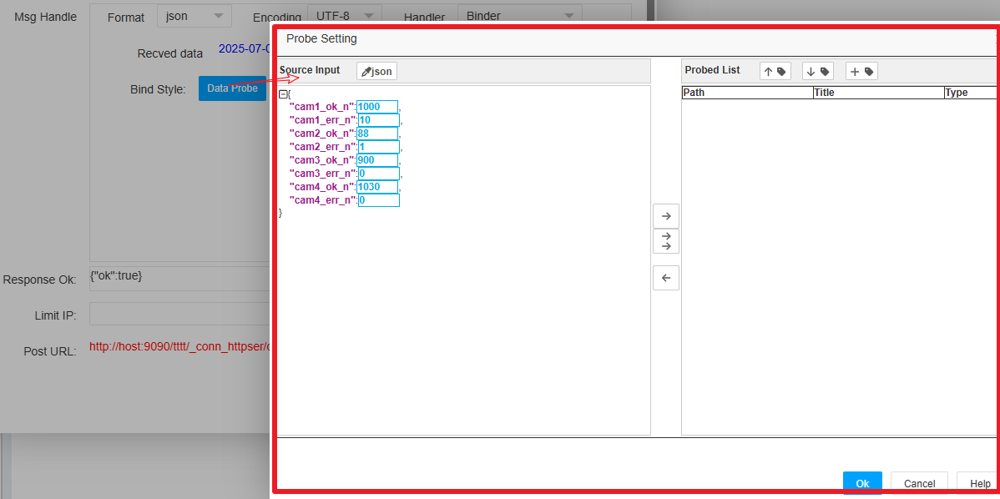
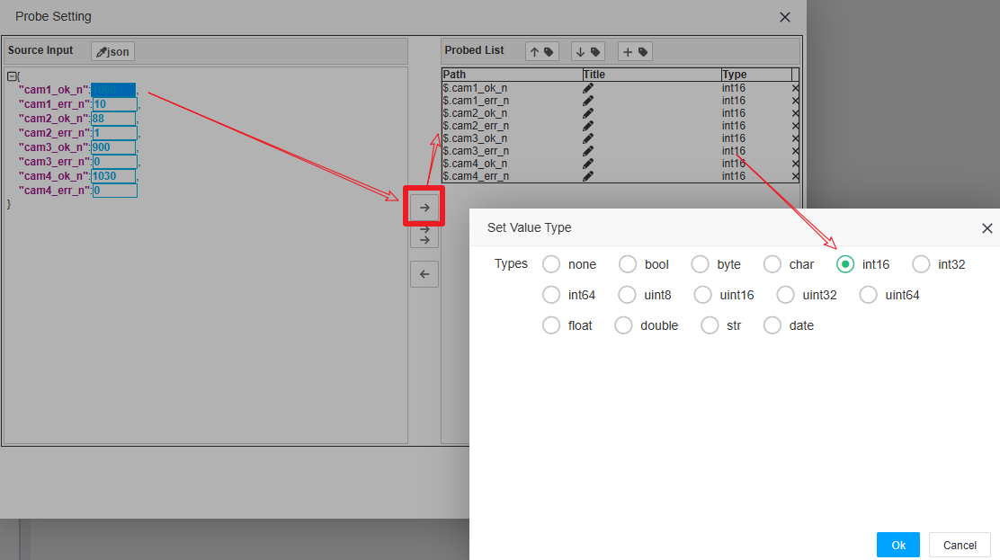
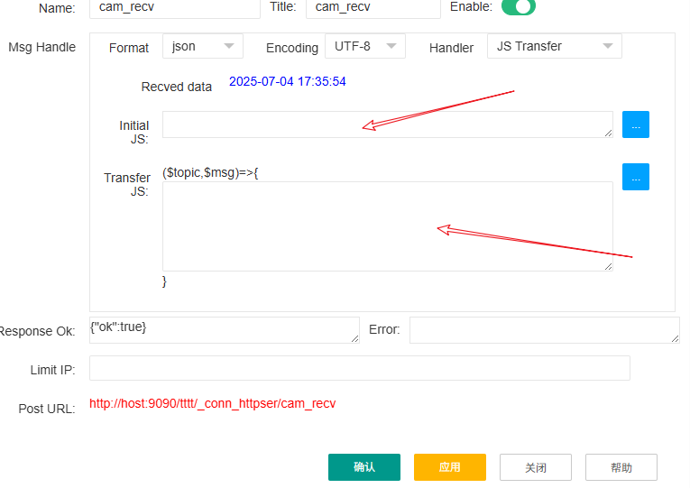
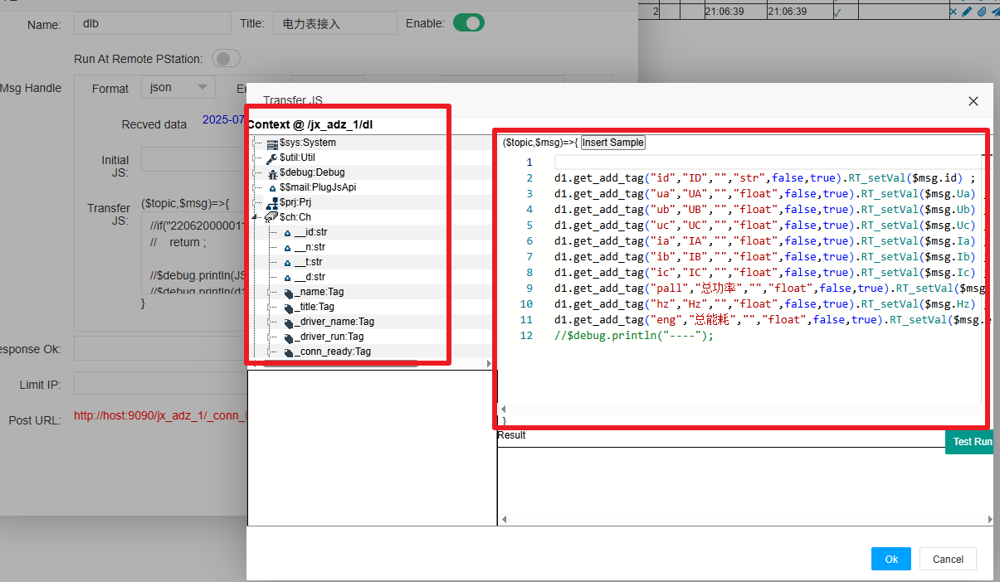
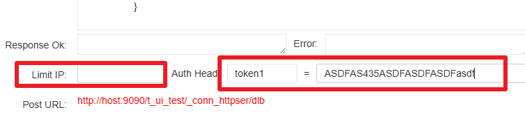

IOTTree Message Connector - HTTP Server URL
==

HTTP Server URL消息接入依赖IOT-Tree本身的对外Web端口，通过配置对应的接入，可以为外部数据提交提供Restful URL接口——通过提供特定的URL，外部设备/系统可以发送数据(Http POST)到此接入中，而此IOT-Tree接入被动的获取消息。

此接入方式对于大批量的设备数据收集有着很大的优势。

1，首先此方法非常简单轻量，和MQTT相比，不需要专门的MQTT Server。对外提供的URL由IOT-Tree对应的Web端口直接提供
2，获取的消息可以由消息处理映射、转换到相关的标签(Tag)中
3，对于数据提供方，实现消息推送也非常简单。当前很多仪器仪表可以直接通过网络接口提供http post方式的数据输出；同时当前大多数IT系统也基于web方式提供服务，要实现http post对外提供数据，也是非常容易的。

下面还是以一个实际的例子，对此接入功能进行详细说明。例子背景如下：

某组织有个AI系统，需要根据生产线上不同位置摄像头数据做识别分析，定时形成一个JSON结构的数据输出，每个JSON结构如下：

```
{
    "cam1_ok_n":1000, "cam1_err_n":0,
    "cam2_ok_n":88,   "cam2_err_n":1,
    "cam3_ok_n":900,  "cam3_err_n":0,
    "cam4_ok_n":1030, "cam4_err_n":0
}
```
分别对应四个摄像头识别正确结果和错误结果。此数据需要发送到中控室组态软件，进行展示或触发报警。我们可以在中控通过IOT-Tree接收这个消息，并作后续的相关数据处理——如触发声光报警等

## 1 新建一个HTTP Server URL接入

在IOT-Tree项目中，我们点击选择左上角"接入"菜单，选择"HTTP Server URL"。填写如下内容：



```
Name=cam_recv
Response Ok={"ok":true}   //消息被正确处理之后对HTTP Client端的响应内容
```
当填写了Name内容之后，我们可以看到下方自动生成了Post URL。
```
http://host:9090/tttt/_conn_httpser/cam_recv
```
这个url就是本接入，使用了IOT-Tree自身的Web端口，对外提供的RESTFul URL接口。当然，可能对外使用nginx做请求转发，那么host:port部分内容可以根据你的具体情况做调整。而URL后续部分分别为 /\[prj_name]/_conn_httpser/\[conn_name]。

确定之后，在左边接入列表中，就可以出现对应的节点。

## 2 新建关联通道

在项目主界面中间，项目根节点鼠标右键，选择"New Channel",在弹出通道编辑界面中填写如下：


```
Name=cam_mon
Title=Camera Monitor
```
确定之后，可以看到对应的通道已经建立。此时，我们鼠标左键左边的"cam_recv"接入小方块，拖拽到"cam_mon"对应的小方块上松开，就会建立接入和通道的关联。由此，就完成了基础工作。



接下来，我们需要配置处理接收到的消息，并把消息中的数据提取出来，并更新到关联通道的对应标签中。

## 3 消息处理和标签数据更新

由于已经协商好了此URL接收的消息格式，因此我们可以使用HTTP Post方式向此URL发送数据，这样可以方便后续的消息处理配置。

### 3.1 消息接收测试

在浏览器插件中，能够支持HTTP Post的测试应用非常多，你可以自己选择。下面是我使用的应用插件准备发送的数据。

其中，POST方式对应的URL我使用的是本机localhost,只需要修改host内容即可。（你可以根据自己的网络环境修改对应部分）

点击"Send" Post数据之后，可以看到下方返回{"ok":true}。这正是接入编辑配置的正确响应返回内容。

此时，我们鼠标右键"cam_recv"这个接入节点，选择"Edit"重新打开编辑窗口，你可以看到Msg Handle区域中，有接收到数据提示，我们可以基于此消息做数据提取。点击"Probe"按钮，在弹出的窗口中，我们可以看到格式化的JSON数据，如下图：



接下来，我们需要把JSON格式的消息数据写入到标签Tag中。目前支持两种方式，绑定方式和JS方式。在Msg Handle区域中，可以通过Handler选项进行选择。他们分别对应两个选择"JS Transfer"和"Binder"

### 3.2 绑定(Bind)方式写入

当选择"Binder"方式时，可以看到下面有两个按钮"Probe"和"Bind Channel"，他们分别对应两个步骤措施：数据提取和提取数据对应通道下的标签Tag绑定。

#### 3.2.1 消息数据提取(探测)

点击"Probe"按钮,在弹出窗口中我们可以看到，格式化的JSON结构值都被一个可选择框包裹。因为JSON格式对于数据类型相对较弱，我们需要通过这个提取设置，对JSON格式中的数据做精准定位和类型设定。



选择左边JSON格式中的数据项，然后点击中间向右箭头按钮，可以看到"Probe List"表格中会新增一行，我们可以在这一行中编辑数据项的标题和数据类型，通过多次提取添加，我们可以形成一个提取项列表。如下图：



确定之后，我们就可以对提取项做通道下面的标签绑定配置。

#### 3.2.2 绑定通道下面的标签(Tag)


#### 3.2.3 绑定方式的优缺点

绑定方式优点是：<font color="green">简单、直观、快捷</font>。缺点也很明显：<font color="red">灵活度不够</font>

如果我接收的JSON结构是单个设备固定的一些数据点，那么我们可以通过绑定方式快速轻松完成。但如果JSON结构每次接收格式虽然一样，但可能会涉及多个设备，需要在关联通道下面建立多个设备，并通过JSON数据中的某个id标识区分到不同设备对应标签值的更新。此时，绑定方式就无能为力了，但我们可以通过JS方式实现。

### 3.3 JS方式处理写入

如果选择Handler为"JS Transfer",可以看到配置界面如下：



其中，Initial JS代表着初始化JS代码，它只会在项目启动时被运行一次，你可以在此定义一些JS初始化代码。而Transfer JS对应的JS代码可以看成一个转换JS函数，每次接收到消息时，都会被调用。因此，我们可以通过JS代码实现对接收到的JSON数据进行解析处理，然后更新到通道下面的对应标签。

很明显，通过JS代码我们可以比较轻松又有着最大的灵活性来处理消息。事实上：<b>我们甚至可以在JS中通过系统提供的函数自动建立相关标签，并对此进行数据更新</b>

#### 3.3.1 JS处理消息代码辅助功能

我们双击JS编辑区域或点击边上辅助按钮，可以看到弹出JS编辑代码辅助功能。里面不仅能够对JS代码进行格式化分色显示，同时左边有个上下文成员列表树。



你可以看到，此处编辑的JS代码块本质是个JS函数，它有输入$msg参数。如果接收的数据是JSON格式，则自动会转换为JS对象并由$msg参数传入。你可以在代码中对此输入进行解析，然后把数据更新到对应通道下面的关联标签中。

您可以展开左边的$ch对象，这个对象对应接入关联的通道，可以看到此对象下面包含的属性和函数。另外，你还可以看到通道下面的设备节点也会在此树中以设备名称作为变量成员列出。

特别的，$ch和设备对象都包含了自动创建标签的函数支持。由此可以直接省掉标签的配置工作，全部由接入自动生成：

由于JS代码的灵活性，你还可以根据输入的消息一次更新多个设备下面的标签数据值。

#### 3.3.2 JS处理此消息的具体代码分析

下面的代码根据输入的消息自动创建标签(如果存在则直接返回)，然后直接对标签进行运行时赋值

```
($topic,$msg)=>{
    //
    d1.get_add_tag("id","ID","","str",false,true).RT_setVal($msg.id) ;

    d1.get_add_tag("ua","UA","","float",false,true).RT_setVal($msg.Ua) ;

    d1.get_add_tag("ub","UB","","float",false,true).RT_setVal($msg.Ub) ;
}
```
其中，d1是$ch通道下面的一个设备，可以直接通过get_add_tag函数获取（如果不存在则自动建立）标签对象。然后调用标签对象的RT_setVal函数设置运行时值。

## 4 最终效果

不论是绑定方式还是JS方式，我们都可以看到，当接入收到消息之后，通道下面的对应标签就可以跟着更新。

## 5 注意事项

### 5.1 安全性考虑

在一个企业内部网络，此方法可以很方便的接入其他设备或系统提供的数据。只需要内网安全，基本不需要考虑对接的安全问题。但如果设备通过互联网公共网络提交数据。你需要把接收数据的URL通过公网IP或域名进行接收，这就需要考虑安全问题了。

如果数据发送方也有一个固定的IP地址，那么你可以限定只接收某个IP来源的数据，这可以大大提高安全性。如果发送方IP不固定，那么你可以要求发送方在发送的HTTP请求头部加入验证密钥。每次请求都需要对此进行匹配验证。如下图：



### 5.2 可靠性考虑

发送和接收要考虑到临时网络中断的情况，并作出相应的处理措施。
