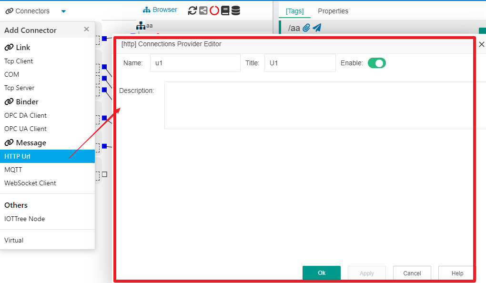
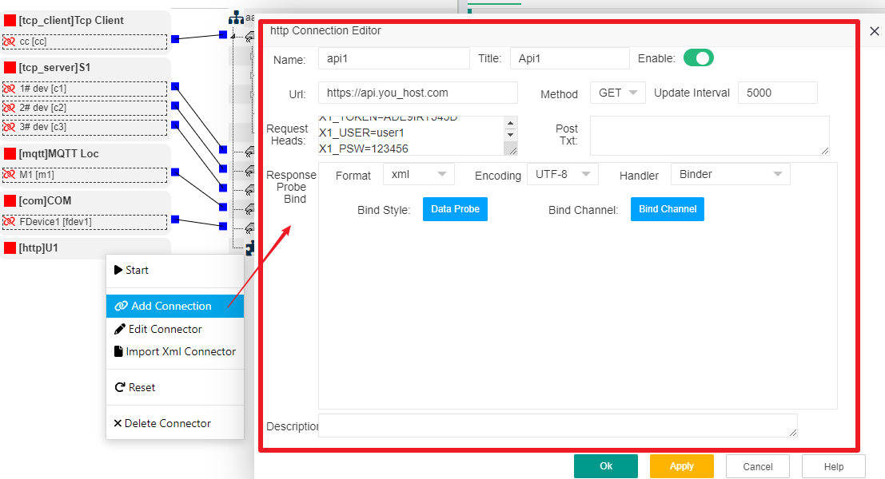
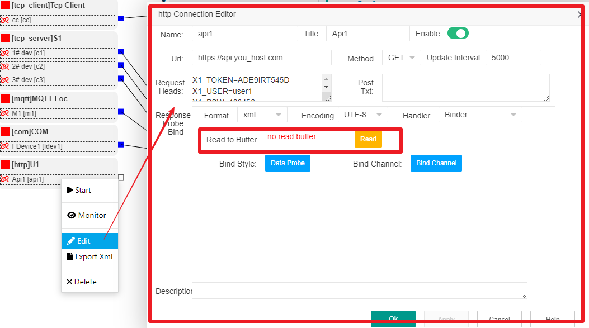
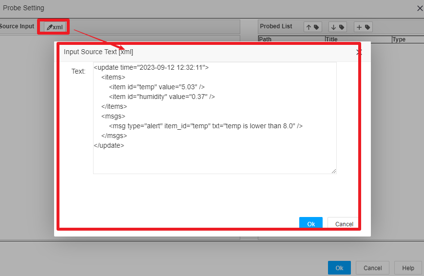
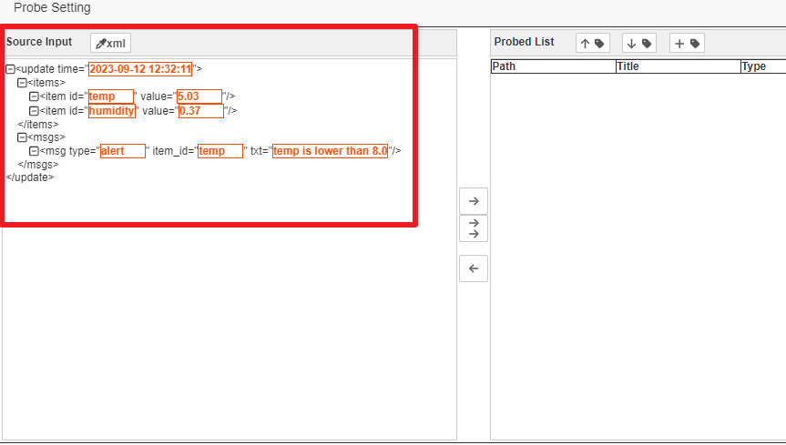
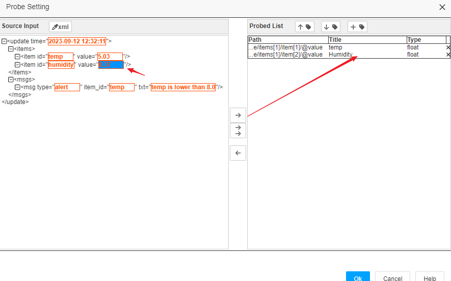
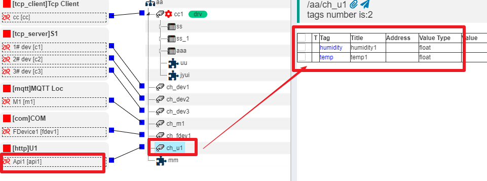
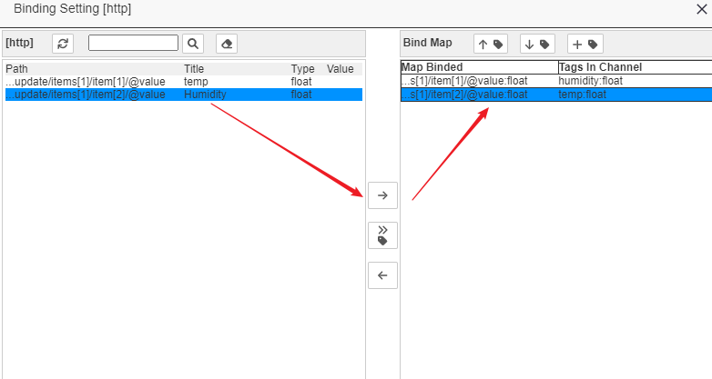

IOTTree Message Connector - HTTP Client
==


Currently, many web services provide application interfaces for HTTP access to the outside world. Whether the system is a large-scale Internet website, an Internet of Things system, a distributed system, or even a edge computing device, it can provide Api in the http mode, which greatly facilitates data interaction between heterogeneous systems.

Most HTTP interface calls provide a certain URL and verification mechanism, and the data reader regularly accesses the read content. Therefore, the HTTP access of IOTTree uses a timed operation method, and each time the corresponding URL is accessed, the returned content is read. The returned content can be JSON, XML, string, and HTML strings, and each return can reveal a complete set of data. Therefore, from the perspective of the source of the returned data usage, it can be considered a message. Obviously, the obtained messages can be unified into two steps of data extraction and binding in the subsequent processing of connector.

In most cases, the access frequency of the HTTP method cannot and does not need to be high, which is very different from the typical millisecond level data read frequency of industrial fieldbuses. Most of them are in seconds and minutes, and some low-frequency access can even be in hours. Therefore, it is not necessary to allocate separate processing threads for each URL's, which would be a waste of system resources.

Therefore, IOT-Tree allocates the processing threads for HTTP access to the ConnProvider, and multiple specific "HTTP ConnPt" (including urls) can be configured below, with their access frequency uniformly scheduled by the ConnProvider. Of course, if we have access to many URLs, you can create multiple ConnProviders as needed (with different priorities) and assign different "Http ConnPts" below.


## 1 HTTP ConnProvider Creation


Click on the Connectors menu, select "HTTP Url", and in the pop-up editing dialog, edit the corresponding HTTP Connections Provider. Fill in the content:

```
Name=u1
Title=U1
```


It can be seen that the HTTP Connection Provider only requires a name and title, which provides a thread and organization for the included HTTP ConnPt. As shown in the following figure:





After clicking "OK" to confirm, we can now create one or more HTTP ConnPts under U1.


## 2 HTTP ConnPt Creation


Right click on the U1 node and select "Add Connection" to open the HTTP Connection editor, where you can fill in the following information:

```
Name=api1
Title=Api1
Url=https://api.you_host.com
Method=GET
Update Interval=5000
```



Among them, many web servers that provide APIs remotely require special authentication information in the HTTP request header. You only need to edit it in the Request Heads area, and each row in the internal format represents an extended attribute of the HTTP header, with attribute names and values separated by '='. In addition, "Update Interval" represents the update time interval (ms/ms), which means the intermediate time interval between the end of the previous run and the start of the next run.

If the HTTP request method you want is POST, you can also enter the content that needs to be submitted in the "Post Txt" area.

In the Response Probe Bind area, each call returns the corresponding data as a formatted message for subsequent processing: data extraction and data binding (this section is similar to message based data).

If conditions permit, we recommend using structured message formats such as JSON, XML, etc. Because IOTTree specifically supports data extraction for this format, you can complete the data extraction work without writing any scripts. In the connector of [MQTT][mqtt], we use JSON format as an example, and in this HTTP access, we use XML as an example.

Our message is an XML format string:


```
<update time="2023-09-12 12:32:11">
    <items>
        <item id="temp" value="5.03" />
        <item id="humidity" value="0.37" />
    </items>
    <msgs>
        <msg type="alert" item_id="temp" txt="temp is lower than 8.0" />
    </msgs>
</update>
```


Click OK to complete the addition of HTTP ConnPt. You can view the connector content on the left and see that a new "Api1" exists. Of course, we can also add more "URL Http ConnPt" connections under "U1", which will share the internal threads of "Conn Provider U1". At this point, there will be a problem of time intervals affecting each other. Because multiple ConnPts share their own ConnProvder threads, if a certain ConnPt Url is accessed for too long, it will affect all subsequent Urls. That is to say, our mechanism cannot guarantee that the URL time interval is accurate, but for most HTTP access, the time interval is relatively long (with low requirements for time accuracy), and most URL connection reads are in seconds, which does not affect the overall performance. If you have a high accuracy requirement for obtaining data from a URL, it is recommended to create a new "HTTP Conn Provider" separately, and then add only one "HTTP ConnPt" below to ensure that the internal URLs of this ConnPt are exclusive to one thread.

You may be starting to wonder, is this done? Is there only one associated channel left for subsequent data operations, and then find a device driver to process this message. Of course, this is possible, provided that you already have the device driver and the device driver can recognize the message format, and can easily update the data to the tag under the channel device.

However, for such messages, it is not only inconvenient but also unnecessary for us to implement a driver for every structured JSON and XML format. In fact, for this structured data, extracting data and mapping it to the device tags we establish below the channel should be relatively easy, and in most cases, there is no need to specifically implement drivers.

IOTTree fully considers this situation and implements data extraction and device tag binding in the message connection section. In this way, our associated channels do not need to use device drivers. In the project, such channels and the underlying devices, tag groups, and tags are only organizational relationships.


[mqtt]: ./msg_mqtt.md

## 3 Data Extraction of Structured Messages (Data Probe)


We have created \[http\]U1 and the "Api1" connection point below (with specific URLs), and have also determined the message format. So next, we need to analyze the message format and configure the data items that need to be extracted.

Right click on the Api node and select the "Edit" menu item. In the pop-up dialog, you will find a "Data Probe" button, and above this button, you will see a prompt of "no read buffer". There is also a "Read" button on the right. As shown in the following figure:





Obviously, we need to make this ConnPt aware of the message format, which includes two methods.

---

#### Method 1: Trigger the Read button to read data


You just need to click on the "Read" button. If the URL server is ready, we can initiate a request and retrieve the response data to return. If successful, the read data success time will be displayed. At this point, you only need to click on the "Data Probe" button to see the data in the pop-up dialog.


#### Method 2: Manual input


If the URL for this message format is not ready, then you will have to manually input it.

Directly click on the "Data Probe" button. In the upper left corner of the pop-up dialog, there is a "Extract XML" button. Click this button and enter the XML text in the "Input Source Text \[xml\]" dialog that pops up, as shown in the figure:





After clicking "OK", you can see that the XML data is displayed in the "Source Input" area on the left side of the "Probe Setting" dialog, and the two methods have the same effect.




---


Whether using Method 1 or Method 2, we can now start extracting data.

Upon careful observation of the structured XML data under Source Input, you will find that each attribute member has a selectable value block. Please click on the data we need and click on the "extract data" button in the middle. The "Probed List" on the right will display the extracted content, with each extracted item including Path, Title, and Type. Path represents the location of data items in XML format, Title represents the title, and Type represents the data value type. You can make modifications as needed by simply clicking on the corresponding modification icon and following the prompts. As shown in the following figure:





By clicking the "OK" button, we have completed the data extraction, which is still very simple overall. <font color=red>Note: When returning to the Api1 editing window, don't forget to click Apply and save</font>

Next, we can perform channel association on the Api1 connector point and configure the binding.


## 4 Associate to Channel and configure data binding


The specific data in the IOTTree project must be reflected in tags, so it is obvious that the data extracted for HTTP connector also needs to be bound to specific tags. So before binding, we need to establish an associated channel and set the relevant Tags under the channel.

We create a channel "ch_u1", and directly create 2 Tags, temps, and humidities under this channel, just fill in the Name and Data type (as there is no driver, some parameters such as addresses do not need to be provided, please refer to other documents for details). 

Please note that we have not added any devices under the channel in this document. If you need to distinguish your project, please feel free to do so. We associate the connection point "Api1" with the channel "ch_u1", and now we are ready to bind. As shown in the following figure:





Right click on the "Api1" node and select the "Edit" menu item. In the pop-up dialog, you will find a "Bind Channel" button. Click on it to pop up the binding dialog (Binding Setting \[http\]). This dialog still has a left center right structure, with our extracted data list on the left, binding buttons in the middle, and binding results on the right.

Among them, the binding list on the right has already listed all the tags under the channel. We need to first select one item from each side, and then click the "bind to tag" button in the middle to complete the binding. The first column in the Bind Map on the right is the content after binding. As shown in the following figure:





After completing, we click "OK" to return to the editing dialog of Api1, and at this point, make sure to click the "Apply" or "OK" button for final saving.

We have completed the entire process of creating the HTTP Conn Provider, configuring the specific URL's ConnPt, and finally entering the specific tag through data extraction and binding. From it, we found that the access of messages is the protagonist, and the channels and tags in the project are just an organization.

If the on-site access to the web server is ready, we can start this project and right-click on the Api1 connection point to open monitoring. At the same time, we can view the real-time data of the tag list under the channel "ch_u1". You will find that the Value corresponding to the tag changes with the newly received data, which also indicates that everything is ok.


## 5 Finally


You may wonder why there are two steps to take: first, extract structured data, and then bind tags under the channel; Upon careful consideration, this can indeed be achieved in one step.

Separating is indeed a bit cumbersome, but it brings many benefits. For example, we can independently support more methods for data extraction (we will add support for JavaScript scripts later), and we can also achieve more flexible binding support.

Above, we used XML data structure for data extraction and binding. In fact, if your data format is JSON, everything else is similar except for the JSON format difference when editing the corresponding access point.

If the returned content is HTML webpage content, we have strong support specifically for extracting HTML data. We can not only obtain HTML web pages, but also support running JS inside the web pages (to ensure that the content is displayed correctly) before entering our data extraction and binding work.


Please refer to [HTTP Url HTML format connector][http_url_html]。


[http_url_html]:./msg_http_url_html.md
