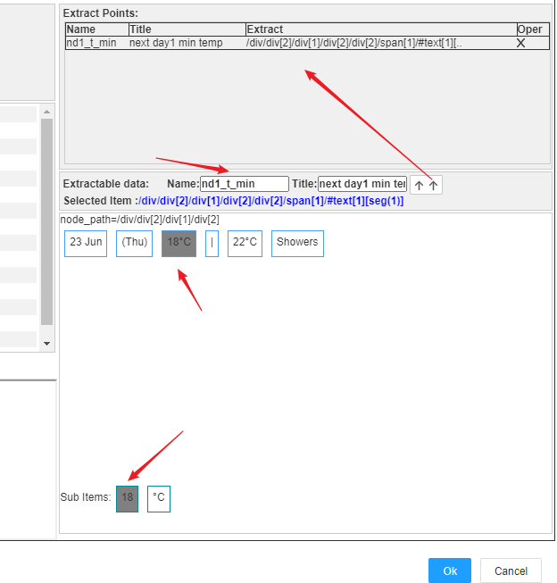

HTTP Client HTML format connector
==


IOT-Tree Server supports multiple data formats such as xml, json, txt and HTML for Http Url access. For HTML format, the internal implementation is essentially a web page data aggregation function.

For the Internet of Things system, in addition to field device access data support, data from the entire Internet should also be possible input reference. For example, meteorological data, stock data and so on. For example, you might have an automated irrigation system that minimizes the amount or number of irrigations based on weather forecasts. When the soil water content approaches the warning line, automatically combines with weather forecast data to decide whether to irrigate immediately or wait a few more days. Obviously, if rain is possible in the coming days, you can reduce unnecessary irrigation. Further more, if you use IOT-Tree Server as your smart home control or personal work assistant, you can also extract data information from the Internet that you often focus on and integrate it into your daily monitoring screen, or automatically implement some auxiliary functions for you based on this data.

Currently, there are many HTTP-based data calling interfaces, most of which are based on Web API support provided by data providers. These services typically require custom development. So for some data, if a web page already exists, you can locate and extract it directly from the web page, which is much more direct than custom development. However, for the positioning and extraction of content in Web pages, certain technical means are also required. Also, because Web pages change frequently, how to locate them effectively and steadily and extract the data they need is a challenge in itself.

IOT-Tree Server uses a very simple, robust and flexible way to extract data in HTML format, and provides a simple configuration analysis UI to support it. Ultimately, the extracted data item can be bound (bind) directly to an internally defined Tag.


# 1. HTML page data extraction mechanism

The HTML page data extraction provided by IOT-Tree Server is divided into two parts. The first is data block tracking and positioning, and the second is intra block data extraction.

The first step is data block tracking and positioning, which is a positioning method used to adapt to changes in the page. Through the analysis of most web pages, we can find that the data we care about are generally in specific page blocks, and because the pages may change every day, the location of the block is not very stable as a whole, but the internal content of the corresponding block is relatively stable. Therefore, if we can eliminate the interference of page changes and first locate the corresponding content block, we can greatly improve the probability of success and eliminate a large part of the interference.

Within the block, if the web page provider does not upgrade the version of relevant content, the internal data structure is relatively stable. Therefore, after the block is located, the specific internal data can be accurately located and obtained based on this block.

Of course, considering that the above two steps will fail when the extracted page block changes (such as a large version upgrade), it is very important to find and adjust the positioning parameters quickly and effectively. Therefore, we provide a simple and convenient page analysis and visual positioning configuration tool, which can be reset in a very short time.

At present, the page content provided by many websites is dynamically obtained through Ajax and rendered and output through JS script. At this time, we cannot directly obtain the original content of the page through URL for extraction. We need to load and calculate the page and output the relevant HTML content. This process requires a long calculation time. We conduct subsequent data analysis by reading and caching local files.


## 1.1 page content block tracking and positioning

IOT tree server uses very simple text keywords to track and locate the internal pages. Generally, one or two keywords are enough for a content block. The parsing engine automatically scans and locates the tree content structure of HTML according to the entered keywords, and finds the nearest common parent node containing these keywords. Based on this parent node, the visual configuration tool can preview and display the internal content. If we find that the block is too small to cover the data we are concerned about, we can also find the upper level or multi-level parent node as the positioning node as needed. Until the node contains all the contents of the block we are interested in.

Therefore, the first step of block tracking and positioning only requires a few parameters (block name, keyword 1, keyword x, parent node level n)


## 1.2 block internal data positioning and extraction

After locating the block parent node in the first step, we exclude most of the content in the page and only need to care about the content under the location node. At this time, the configuration management interface provided by IOT-Tree will scan and list all text contents that can be extracted under this node. And each text corresponds to an XPath parameter. You just need to select and set the extracted name.

## 1.3 string internal content segmentation

If the data we care about is inside a string, IOT-Tree will automatically segment the string. You can also select the relevant content after segmentation.


# 2 illustrate the whole process by demo

The above is the operating mechanism for IOT-Tree to extract data from HTML pages through URLs. We will explain it directly through an example below. Through the example, you will find that the configuration function provided by IOT-Tree greatly facilitates the process of page analysis and data extraction.


Our example is based on a demonstration project of irrigation automation system. By adding HTTP URL access to the project, visit the meteorological website to obtain weather forecast data. In this way, in the project, the meteorological data and control logic can be combined later to make the automatic irrigation system run more economically and effectively.

We are going to extract the weather forecast information for the next day in New York City. The URL is as follows:

https://worldweather.wmo.int/en/city.html?cityId=278


The data content areas and positioning keywords we need to extract are as follows:


The right side of the figure is obviously a weather forecast table, and the text at the head of the table is generally stable, so we selected three keywords as the positioning anchor of the table area. They are "Date", "Temp" and "Cond" respectively, as shown in the yellow mark above.

In this example, we extract the second row of the table, that is, the content of tomorrow's weather forecast. (in your actual project, you may need to extract more days of data for comprehensive utilization)

We need to extract tomorrow's minimum temperature, maximum temperature and weather conditions.


## 2.1 preparation in advance

We first use the Chrome browser to access this link. Right click the page and select view page source. Then search the source code of the page for the keywords Date Temp and Cond. You will find that except for a pile of JS script code, there are no keywords based on HTML content.

However, when you right-click temp and select inspect, you can find that these contents exist in the page elements on the right. Further, you can find that although the table header "Temp(°C)" appears to be a string together, it is not together in the elements. Therefore, we cannot use "Temp(°C)" as the positioning keyword, but only "Temp".

Obviously, this page is dynamically generated through JS script code. It is difficult to locate and obtain these data by directly extracting the source code of the URL. Therefore, we need to run the JS script when getting the page content, and then get the page content after JS runs - this will take a long time. Fortunately, when we extract the page information corresponding to the URL, the time interval is often very long, which can be based on hours.

Through the basic page analysis in the browser, we can then do specific data acquisition configuration.


## 2.2 add HTTP URL Connector in the project

For specific new projects, you can refer to other relevant documents. Now we have the irrigation automation demonstration project and the management interface of this project. we need to add HTTP URL Connector.

In the project Connectors menu, select HTTP Url. In the pop-up window, enter the name of the connections provider as web1, as shown in the following figure:


You will find that in the left list, the entry [http]Web1 is added. Right click the entry, select "Add Connection", and enter the following contents in the pop-up window:


```
Name: weather1
Title: Weather1
Url: https://worldweather.wmo.int/en/city.html?cityId=278
Method: Get
Update interval: 1800000
Source Type: html
Handler: Binder
Run Page JS: Enabled
Run JS Timeout: 30000
```


Wherein, the update interval is 1800000 milliseconds, corresponding to half an hour; And enable the page to run the script "Run Page JS", so that after the page is downloaded, the internal JS run and HTML structure will be automatically created. This process requires a long time of calculation. Therefore, we set the Run JS Timeout as 30000 milliseconds.

Click "OK" to save, and then right-click the new entry,select "Edit" to enter the editing dialog of this connection again. We found that the UI has an additional "Read to Buffer" option. As shown below:


We click the "Read" button and wait for a long enough time. IOT-Tree will access the URL, run the JS script and build the final page according to the page content, and write it to the buffer. After success, the save time is displayed. At this point, we have prepared the basic page data, and then we can start to set up the page internal data extraction.


## 2.3 configuration block - tracking, positioning and extracting data

We click the "Date Probe" button. In the pop-up window, we can see the prompt of HTML trace and extract, and there is a "+Add Block Locator" button, which adds page block positioning items.


Click this button, the system will pop up another window. This window seems a little complicated, but you don't have to worry. It's nothing more than trace and extract.

We first fill in the name and title of this block: Name=fl Title=Forecast List. As shown below:


We are going to set "Date" "Temp" and "Cond" as tracking keywords. In the Txt input box under "Trace Points", fill in the "Date" and click the button "+Set Trace Point", and you will find that keywords are added to the list. Then, you can add two keywords: "Temp" and "Cond". The final effect is as shown in the figure:


Then, we click the "Trace Root" button, which will locate the HTML page according to the three keywords configured above and find their common root node. After success, you will find that the root node below shows the tree structure of the block's HTML elements.

You can click and select the node in the tree structure under this block, the lower will display the HTML preview effect, and the extractable data area on the right will list all the data that can be extracted under the current node. As shown below:


We are lucky. The page nodes located by these three keywords have included the contents of the entire weather forecast table. Of course, if you locate other pages, it is likely that the located nodes only contain keywords, but the content around the block is not complete. At this time, you only need to increase the block area - that is, based on the currently located nodes, you can look up the parent node as the new root node. In this process, you just need to simply click the button "Upper Level". Each time you click this button, the root node will rise one level. You just need to click the new root node to check whether it contains the data you care about. If the data you need appears, stop immediately and try to control the root node within a small range.

After clicking the root node above, we found that there are many contents in the "Extractable data" area. It is not easy to distinguish that the data is related to the prediction of tomorrow. At this point, we can expand the tree content and click the following sub node to find it (of course, you need to compare the content displayed in the browser). We found the data node corresponding to the second row, as shown in the following figure:


Obviously, "18" "22" and "Showers" are the contents we need to extract.

Click the "18°C" data block, and you will find that the sub data block for data segmentation will automatically appear below. We select the "18" data block that we ultimately care about. Then fill in the following information on the right side of "Extractable data"

```
Name=nd1_t_min
title=next day1 min temp
```


Then click the up button on the right, and you will find that a data extraction item has appeared, as shown in the following figure:




We used the same method to extract the other two data, and the final settings are as follows:

```
Name=nd1_t_max
title=next day1 max temp

Name=nd1_cond
title=next day1 cond
```


At this point, we have completed a block positioning and internal data extraction configuration, which is very convenient and fast as a whole. Click "OK" to save. You will find that a block list appears in the pop-up window of the upper level.


Click "OK" again until all pop-up windows are closed, and the system will really save all the contents you set.


## 2.4 establish corresponding channels and data tags and bind them

We need to establish channels and tags in the project, and then bind the extracted data configured above, so that we can use these data in the future.

Please refer to relevant documents for specific establishment of channels and tags. In this example, we have established the channel wh, and created three Tags below. At the same time, we also associate the channels wh and Weather1. As shown in the following figure:


Right click connector - Weather1 again, select Edit, and then click the "Bind Channel" button in the pop-up window.


In the pop-up binding window, you can see the content extracted from our configuration page on the left and the tag list under the associated channel on the right. Association is performed through binding, as shown in the following figure:


Click "OK" to close all pop-up windows and save. At this time, we have completed the relevant data configuration operations.


## 2.5 run project and viewing effect

We start the project. After a certain period of time, we can see that the associated tag under the channel shows the data extracted from the page. As shown below:


# 3 Summary

If you are not familiar with IOT-Tree Server related projects, you can view this complete industrial site example. This example is a demonstration of irrigation automation related projects. Now the future weather information is added to the project, so that the on-site irrigation control can be adjusted more optimally:

<a href= "../case/case_auto.md" >cases of industrial automation demo</a>

You can access the data under the wh channel directly through JSON format. In this way, you can directly provide URL JSON data for other systems:

```
http://your_ip:yourport/irr_auto_demo/wh
```


Through this example, you can find that IOT-Tree Server can not only access field sensors, controllers and other devices, but also access huge resources on the Internet through web pages.

In fact, you may have found that the HTML page data extraction function provided through IOT-Tree is simple and convenient enough, and its convenience has exceeded the interface provided by general professional webapi. In general, professional webapi not only requires you to perform adaptation programming and joint commissioning test according to the documents provided by them, but also requires a series of steps such as application and verification in most cases.

