IOTTree Message Connector - MQTT
==


MQTT is a client server based message publish/subscribe transport protocol. She is lightweight, simple, open, and easy to implement, which makes its applicability very broad. MQTT, like HTTP, runs on the Transmission Control Protocol/Internet Protocol (TCP/IP) stack.

It provides a topic based one to many message distribution mechanism, which can achieve communication decoupling for various devices and applications. This enables the MQTT protocol to be widely applied in machine to machine and IoT systems.

MQTT messages are not directly sent from the sending endpoint to the receiving end, but are distributed by the MQTT server (also known as MQTT Broker). As shown in the figure:


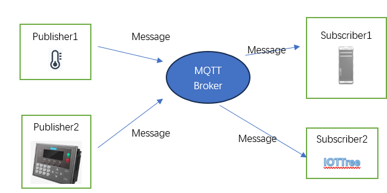


There are many software that support MQTT Broker, both open-source and commercial. Such as ActiveMQ, Mosquito, HiveMQ, and so on. You can also see from the above figure that our IOT-Tree can also communicate with an MQTT Broker as an MQTT Client.

You can obtain the MQTT Server (Broker) address port and connection requirements (such as security verification parameters) based on your application environment, and then configure connector in the IOTTree project.

If you currently do not have an MQTT Server environment and the security requirements of the connected devices are not high, you can also use an MQTT Server built-in to IOT-Tree.

Note: This built-in MQTT Server is based on ActiveMQ implementation and provides a simple security verification mechanism. This MQTT Server runs independently within IOT-Tree as a service and does not belong to an project.


## 0 Enable the built-in MQTT Broker for IOTTree


 (if you already have an MQTT Server, please ignore it)

If you want to directly use the MQTT Server (Broker) within IOTTree, you need to start the corresponding service, just perform the following simple operations.

Access and log in to the IOTTree management ui, such as http://localhost:port/admin/ . In the Services box in the upper right corner of the management main page, click the "Setup" button inside to open the Services management dialog. As shown in the following figure:


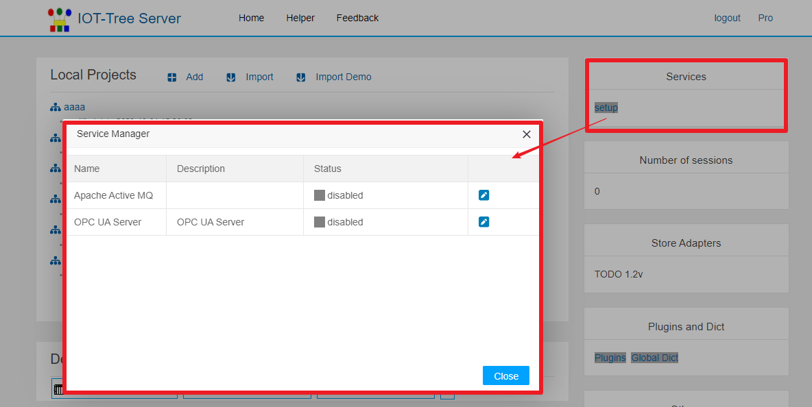


You can see that there is an "Apache Active MQ" in it, and the status is disabled. Click the corresponding edit button and set the relevant parameters of "MQTT Server" in the pop-up dialog. As shown in the following figure:


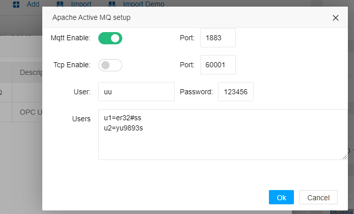


It's very simple. You just need to turn on the "Mqtt Enable" switch, specify the corresponding port (default port 1883), and then fill in the supported Client user password. It is recommended to use different user password authentication for different clients. You can enter multiple lines of "user=password" in the Users edit box, which supports password verification for multiple users. After clicking OK, our "MQTT Server (broker)" configuration is complete.

Returning to the previous management window, you will find that Apache Active MQ is ready and waiting for you to start. You just need to click on the corresponding start service button. As shown in the figure:


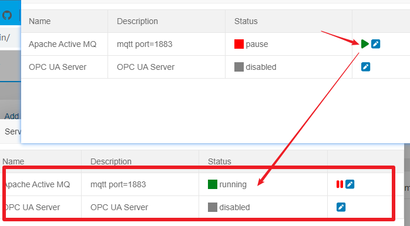


After startup, if you restart the IOTTree Server, this' Apache Active MQ 'will also automatically start internally.

At this point, you only need to publish the IP address and 1883 port of the host (or embedded device) running this IOTTree Server, as well as the authentication user password required by the "MQTT Client" to the device, and these devices can publish their message data.


## 1 MQTT Client ConnProvider Creation


Premise: We already have the MQTT Server and user authentication information (in this example, we use the built-in ActiveMQ configuration above), and we can use the MQTT Client method for connector in the project.

Click on the Connectors menu, select MQTT, and in the pop-up editing dialog, edit the corresponding MQTT Connections Provider. Fill in the following information:

```
Name=mqtt_loc
Title=MQTT Loc
MQTT Host=localhost
Port=1883
MQTT User=uu
Password=123456。
```
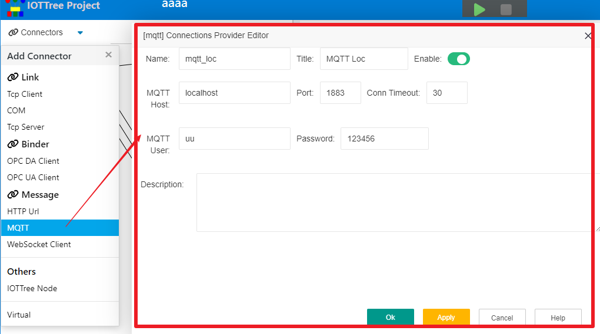


Next, we can create one or more ConnPts under this MQTT Provider.


## 2 Creationg ConnPt


In the MQTT connector of IOTTree, there are regulations for ConnPt: each ConnPt defines its own message topic to subscribe to.

However, there is only one MQTT Client instance inside the MQTT Provider, which will summarize all the message topics defined by ConnPt below and register them uniformly in the MQTT Server (Broker).

After receiving a message, the MQTT provider will automatically distribute the following ConnPt messages based on the message topic.

In fact, MQTT message subscription does not have too many restrictions, and an MQTT client can subscribe to messages on multiple topics. But for our application scenario of IOTTree connecting fixed devices, **we suggest that it is best for each MQTT ConnPt to receive messages in the same format, as each ConnPt is associated with a specific channel, and the devices below the channel are basically fixed**

We recommend using structured message formats such as JSON, XML, etc. Because IOTTree specifically supports data extraction for these formats, you can complete the data extraction work without writing any scripts.

Assuming that the on-site device (MQTT Client) we are connecting to at this ConnPt publishes a topic of "air/dev1", and the message format is JSON, which contains temperature and humidity data internally.

`
{
"temp":25.23,
"humidity":0.37
}
`


Right click on "MQTT Loc", select "Add Connection", and fill in the following information in the pop-up dialog:

```
Name=m1
Title=M1
Subscribe Topics=air/dev1
Source Type=json
Encoding=UTF-8
```


Click OK to complete the addition of ConnPt.

You may be starting to wonder, is this done? Is there only one associated channel left for subsequent data operations, and then find a device driver to process this message. Of course, this is possible, provided that you already have the device driver and the device driver can recognize the message format, and can easily update the data to the tag under the channel device.

However, for such messages, it is not only inconvenient but also unnecessary for us to implement a driver for every structured JSON and XML format. In fact, for this structured data, extracting data and mapping it to the device tags we establish below the channel should be relatively easy, and in most cases, there is no need to specifically implement drivers.

IOTTree fully considers this situation and implements data extraction and device tag binding in the message access section. In this way, our associated channels do not need to use device drivers. In the project, such channels and the underlying devices, tag groups, and tags are only organizational relationships.


## 3 Data Extraction of Structured Messages (Data Probe)


We have established "MQTT Loc" above and "M1" ConnPt below (listening to specific topics), and also determined the message format. So next, we need to analyze the message format and configure the data items that need to be extracted.

Right click on the "M1" node and select the "Edit" menu item. In the pop-up dialog, you will find a "Data Probe" button, and on this button, you will see a prompt of "no received data". As shown in the following figure:


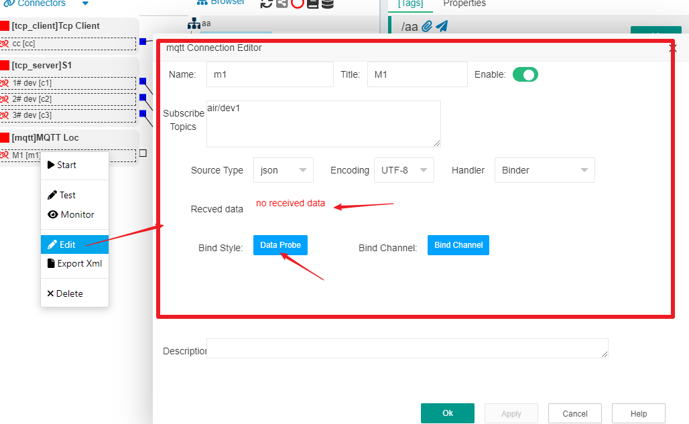


Obviously, we need to make this ConnPt aware of the message format, which includes two methods.

---

#### Method 1: Manual input


If the device that publishes this message format is not ready, then manual input is the only option.

Right click on the "M1" node and select the "Edit" menu item again. In the pop-up dialog, click the "Data Probe" button. In the upper left position of the pop-up dialog, there is a "Extract JSON" button. Click this button to enter JSON text in the "Input Source Text" [JSON ] dialog that pops up, as shown in the figure:


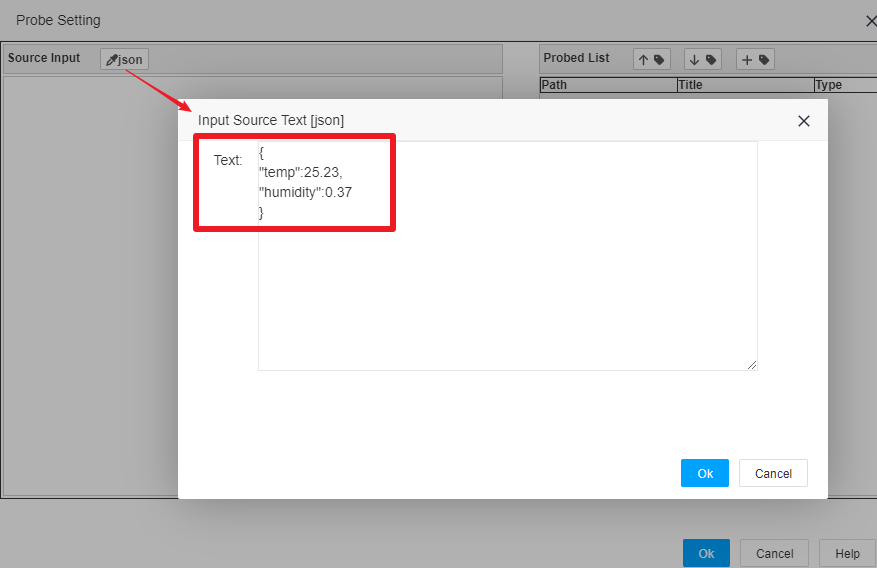


After click "Ok", you can see that the JSON data is displayed in the Source Input area on the left side of the Probe Setting dialog


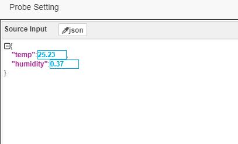

At this point, we can start extracting data.

#### Method 2: Temporarily initiate connector to obtain published data


If the device that publishes this message format is ready, and successfully connects to the MQTT Server, and publishes JSON messages at a certain time interval, then we can right-click on the "MQTT Loc" node and select the "Start" menu item to temporarily activate this connector. As long as we receive a message, it is sufficient.

The problem is coming again. How can you know if you have successfully received data after starting the connector —— Of course, you can turn on the monitor. Right click on the "M1" node and select the "Monitor" menu item. A new monitoring browser window will open. If the data is successfully received, you can see the content inside.

For ease of understanding, this instruction uses the software version "MQTT. fx -1.7.1" to replace the on-site device connecting to our MQTT Server (Broker) and simulate sending JSON data.

Firstly, start the software "MQTT. fx -1.7.1", click on the "Connect" button to set the gear on the left, and in the pop-up window, set the connection parameters as shown in the following figure:


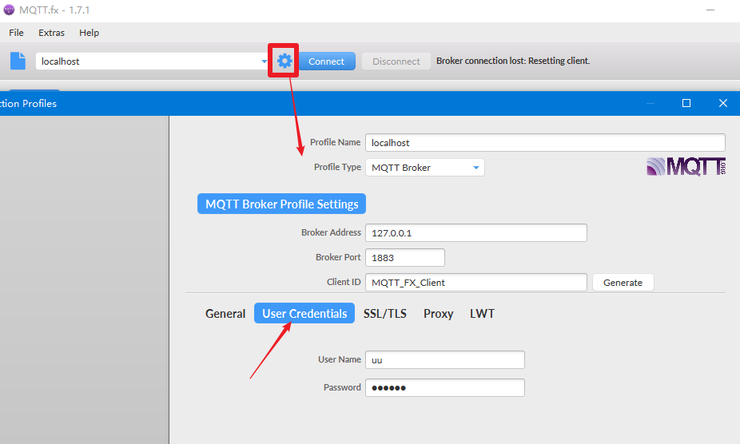


Among them, pay attention to selecting the "User Credentials" option and correctly entering the User Name and Password - these contents are the authentication username and password we set when configuring the Apache ActiveMQ service above. If this is not correct, then the connection cannot be successful. After confirming to close the window, click the button "Connect". If the connection is successful, you will notice that the red ball in the upper right corner turns green, and the Publish button below also lights up from gray.

We input the topic "air/dev1" to the left of the "publish" button. And enter the JSON data to be published in the text box below. Click the 'Publish' button to publish the data for this topic. If successful, you will notice that the monitoring window we opened on the M1 channel will display this data, indicating that our MQTT's ConnPt have successfully obtained data. As shown in the following figure:

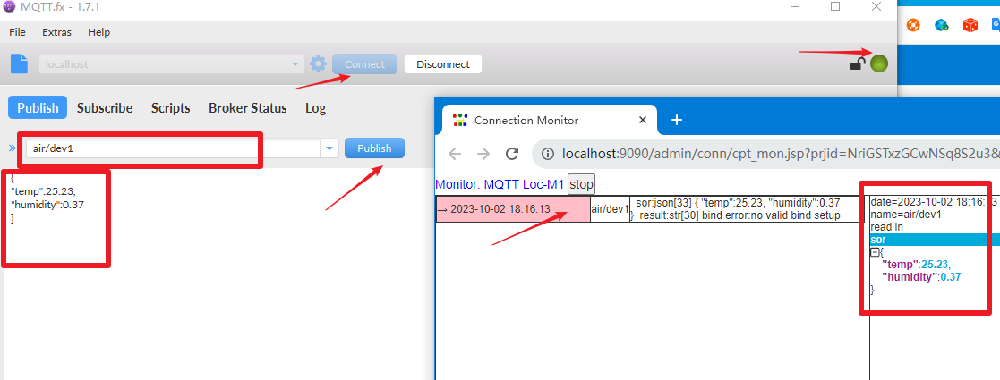


Before continuing to open the M1 editing window, right-click and select "Stop" to close this connector (the internal configuration will be locked in the connector running state, and editing changes cannot be written).

In the reopened M1 editing window, you can see the last time the data was received.

Next, we click the "Data Probe" button again, and you can directly see the JSON data displayed in the Source Input area on the left side of the Probe Setting dialog. This is same as manual input.

---


Whether using Method 1 or Method 2, we can now start extracting data.

Upon careful observation of the structured JSON data under "Source Input", you will find that each attribute member has a selectable value block. Please click on the data we need and click the "extract data" button in the middle. The Probed List on the right will display the extracted content, with each extracted item including Path, Title, and Type. Path represents the data item positioning in JSON format, Title represents the title, and Type represents the data value type. You can make modifications as needed by simply clicking on the corresponding modification icon and following the prompts. If the data type is okay, you don't need to modify it either. As shown in the following figure:


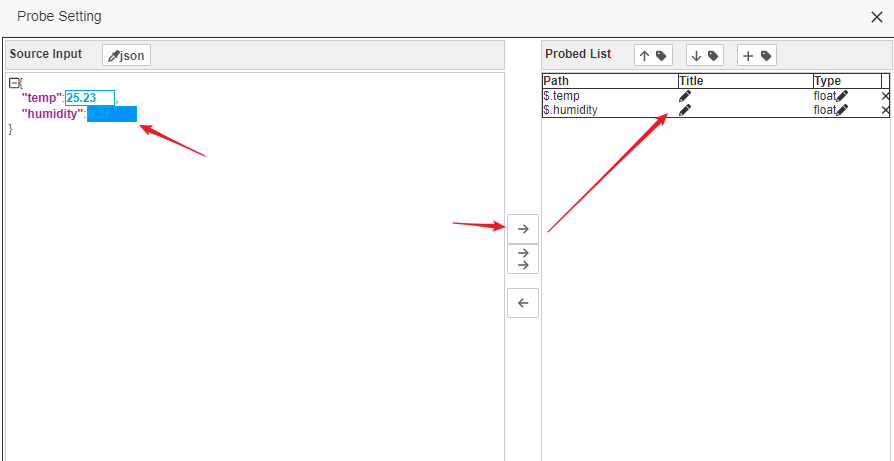


By clicking the "OK" button, we have completed the data extraction, which is still very simple overall .<font color=red> Note: When returning to the M1 editing window, don't forget to click Apply and save it</font>

Next, we can perform channel association on the M1 connection point and configure binding.


## 4 Associate to Channel and configure data binding


The specific data in the IOTTree project must be reflected in tags, so it is obvious that the data extracted for MQTT connector also needs to be bound to specific tags. So before binding, we need to establish an associated channel and set the relevant Tags under the channel.

We create a channel "ch_m1", and directly create 2 Tags, "temps", and "humidities" under this channel, just fill in the Name and Data type (as there is no driver, some parameters such as addresses do not need to be provided, please refer to other documents for details). 

Please note that we have not added any devices under the channel in this document. If you need to distinguish your project, please feel free to do so. We will establish an association between connection point "M1" and channel "ch_m1", and now we are ready to bind. As shown in the following figure:


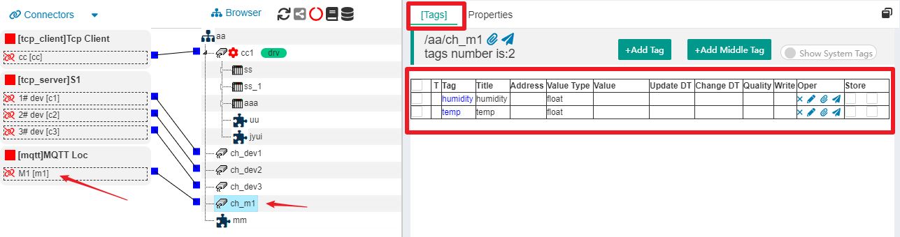


Right click on the M1 node and select the "Edit" menu item. In the pop-up dialog, you will find a "Bind Channel" button. Click on it to pop up the binding window (Binding Setting \[mqtt\]). This dialog still has a left center right structure, with our extracted data list on the left, binding buttons in the middle, and binding results on the right.

Among them, the binding list on the right has already listed all the tags under the channel. We need to first select one item from each side, and then click the "bind to tag" button in the middle to complete the binding. The first column in the Bind Map is the binding content. As shown in the following figure:


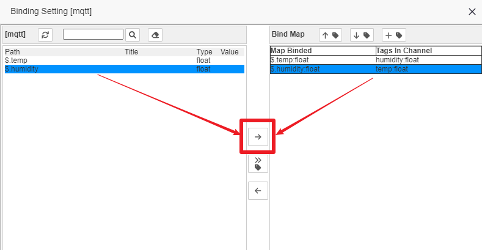


After completing, we click "OK" to return to the editing dialog of M1, and at this point, make sure to click the "Apply" or "OK" button for final saving.

At this point, we have completed the creation of the MQTT Conn Provider, monitoring the configuration of the ConnPt for a certain topic, and finally entering the specific tag process through data extraction and binding. From it, we found that the access of messages is the protagonist, and the channels and tags in the project are just an organization.

If the on-site device is ready and able to publish data normally (or you can also use the "MQTT.fx" software to simulate publishing data). We can start this project by right-clicking on the M1 access point to open monitoring and view the real-time data of the tag list under channel "ch_m1". You will find that the Value corresponding to the tag changes with the newly received data, which also indicates that everything is normal.


## 5 Finally


You may wonder why there are two steps to take: first, extract structured data, and then bind tags under the channel; Upon careful consideration, this can indeed be achieved in one step.

Separating is indeed a bit cumbersome, but it brings many benefits. For example, we can independently support more methods for data extraction (we will add support for JavaScript scripts later), and we can also achieve more flexible binding support.

Above, we used JSON data structure for data extraction and binding. In fact, if your data format is XML, everything else is similar except for selecting the XML format difference when editing the corresponding connection point. You can try when you encounter subscription data in XML format, so this article will not repeat it.


