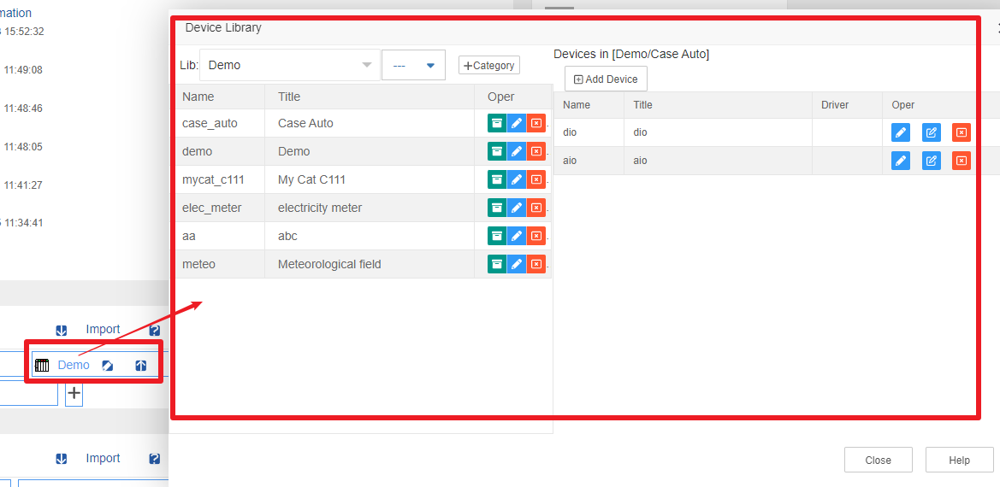
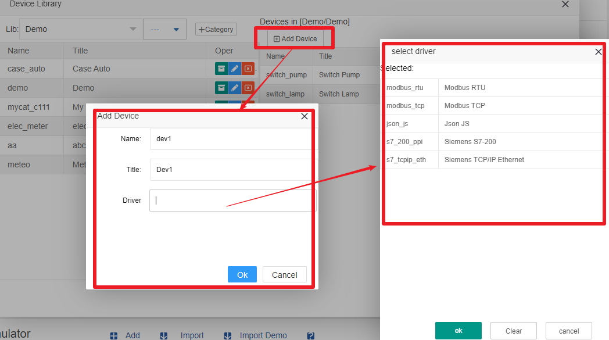
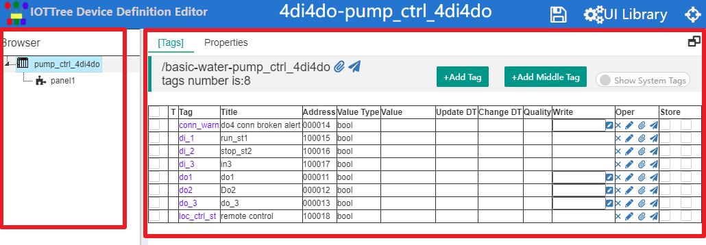
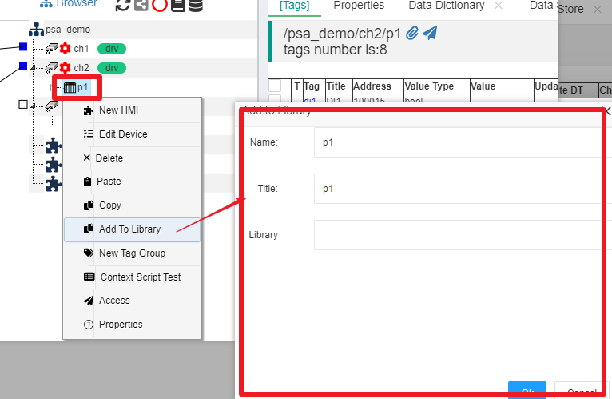

Device Library
==

After login to IOT-Tree, in the main management UI, you can see "Device Library",in which can manage all libraries and device definitions.

The device library is managed at three levels of "Library-Catgory-Device definition", which can meet the diverse needs.

## 1 Library Items

In the "Device Library" list on the management main UI, click the "+" button at the end of the list to open the "Add Device Library" dialog. You only need to enter a title. After adding, you can see the newly added library in the list.

In the library list, when the mouse is moved over a item, a small operation button icon will appear, with an export button of "↑". Click to download all the contents of this library. You can also click on the "Import" button of "Device Library" in another IOT-Tree Server deployment instance, select the corresponding export file, and then import a library.

Click on a library item to open its management UI:

On the left side of this dialog is the category list of the library. You can click "+Category" to add a category, and fill in the name and title in the pop-up dialog. There are modification and deletion operations on the right side of each category, where basic information can be modified for this category.

Select a category on the left, and the right will list all device definitions under this category. Click "+Add Device" to open the dialog for adding device definitions. At this point, in addition to the required device name and title, if the device relies on a certain device driver, you also need to click on the Driver input box and select the corresponding driver from the pop-up device driver list. As shown in the following figure:

We have added a device definition with only the most basic information. Next, we can edit the detailed content of this device.

## 2 Device Definition Editing

Click the "Edit Detail" button on the right side of the device definition list, and a new window will pop up, entering the editing UI of this device definition.

To introduce the overall content, we open an existing device as shown in the following figure:

It can be seen that the device definition is generally divided into a "Browser" tree structure on the left and a main tab ui on the right, similar to the project, which already has a Tags tab and Properties tab.

The operation of a tree is similar to project. By right-clicking on the relevant node, you can see the pop-up operation menu. The root is the device, and tag groups and HMI (UI) nodes can be added below. And when a node is selected, both the Tags and Properties tabs on the right will change accordingly. From the above figure, we can see that by selecting the root node, we can see the corresponding tag list.

### 2.1 Device tag editing

There are two types of container in device editing: root device node and tag group node. Clicking and modifying the tag inside is exactly the same as editing the tag inside the container node in the project.

Please refer to [Tag List][tag_list]

### 2.2 Device Properties Editing

The device properties editing and device editing in the project are also the same.

Please refer to [Propertis][prop]

### 2.3 Classification of tag groups under the device

Same as project management,by right-clicking and selecting "Add Tag Group", a new tag group node can be created below, and tags can also be added under the node. This also forms a tree like hierarchical context relationship.

### 2.4 Device UI Editing

Right click on the device root node or tag group node and add an HMI (UI) node for the device or the context below the device. These UI contexts are also limited by this node hierarchy. And when referencing this device in a project, this UI can be referenced by higher-level UI nodes.

For detailed instructions on HMI(UI) editing, please refer to: [HMI(UI)][hmi]。

## 3 The use and extraction of device definitions in projects

The device library serves all projects. When a project uses a certain device, if the corresponding content already exists in the device library, it is possible to use it. In the Device input field, select "Open Device Library" to add it directly. After the addition is completed, the entire device definition (sub nodes, all tags, properties, and HMI nodes) will be copied to the corresponding nodes in the project. This greatly facilitates the project configuration process.

At the same time, you must have noticed that since device definitions can be seen as device nodes and pruned branches in a project, new devices defined in actual projects should also be able to be extracted to the device library after passing the testing. 

IOT-Tree fully supports this situation. Right click on the device node in the project and select 'Add To Library'. Fill in the new name and title in the pop-up dialog, and select a library and its category below to complete the new device definition warehousing operation. As shown in the following figure:

[tag_list]:../main/tags.md
[prop]:../main/properties.md
[hmi]:../hmi/index.md
