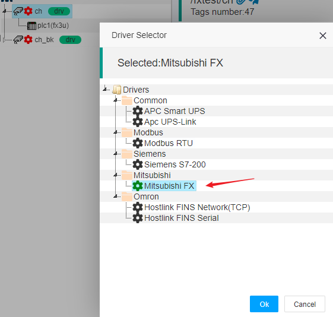
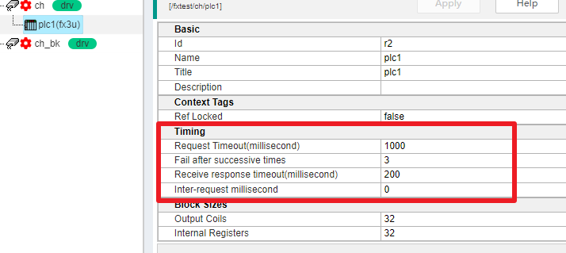
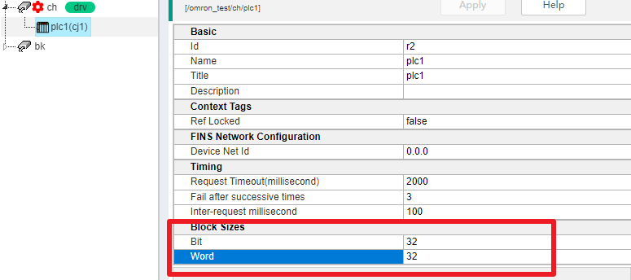

IOT-Tree Device Driver - Mitsubishi FX
==

When we run the IOT-Tree Server and connect to Mitsubishi's related series of PLCs through a serial port (including a transparent transmission serial port Eth conversion gateway), we can use the driver "Mitsubishi FX".

This driver supports PLC series such as FX3U, FX2N, FX0N, FX0, etc

## 1. Supported PLC addresses

Taking FX3U as an example, this driver supports the following addresses. Other models can view the help document when configuring Tags.

<table class="layui-table">
  <colgroup>
    <col width="150">
    <col width="150">
    <col>
  </colgroup>
  <thead>
    <tr>
      <th width="30%">Device Type</th>
      <th width="25%">Range</th>
      <th width="15%">Data Type</th>
      <th width="10%">Access</th>
      <th width="20%">Sample</th>
    </tr> 
  </thead>
  <tbody>
    <tr>
      <td rowspan="1">Inputs</td>
      <td>X000 - X377(Octal)</td>
      <td>bool</td>
      <td>Read</td>
      <td></td>
    </tr>
    <tr>
      <td rowspan="1">Outputs</td>
      <td>Y000 - Y377(Octal)</td>
      <td>bool</td>
      <td>Read/Write</td>
      <td></td>
    </tr>
    <tr>
      <td rowspan="2">Auxiliary Relays</td>
      <td>M0000 - M7679</td>
      <td>bool</td>
      <td>Read/Write</td>
      <td></td>
    </tr>
    <tr>
      <td>M8000 - M8511</td>
      <td>bool</td>
      <td>Read/Write</td>
      <td></td>
    </tr>
    <tr>
      <td rowspan="1">States</td>
      <td>S0000 - S4095</td>
      <td>bool</td>
      <td>Read/Write</td>
      <td></td>
    </tr>
    <tr>
      <td rowspan="1">Timer Contacts</td>
      <td>TS000 - TS511</td>
      <td>bool</td>
      <td>Read</td>
      <td></td>
    </tr>
    <tr>
      <td rowspan="1">Counter Contacts</td>
      <td>CS000 - CS255</td>
      <td>bool</td>
      <td>Read</td>
      <td></td>
    </tr>
    <tr>
      <td rowspan="1">Timer Reset</td>
      <td>TR000 - TR511</td>
      <td>bool</td>
      <td>Read/Write</td>
      <td></td>
    </tr>
    <tr>
      <td rowspan="1">Counter Reset</td>
      <td>CR000 - CR255</td>
      <td>bool</td>
      <td>Read/Write</td>
      <td></td>
    </tr>
    <tr>
      <td rowspan="1">Timer Value</td>
      <td>T000 - T511</td>
      <td>int16,uint16</td>
      <td>Read/Write</td>
      <td></td>
    </tr>
    <tr>
      <td rowspan="2">Counter Value</td>
      <td>C000 - C199</td>
      <td>int16,uint16</td>
      <td>Read/Write</td>
      <td></td>
    </tr>
    <tr>
      <td>C200 - C255</td>
      <td>int32,uint32</td>
      <td>Read/Write</td>
      <td></td>
    </tr>
    <tr>
      <td rowspan="4">Data Registers</td>
      <td>D0000 - D7999</td>
      <td>int16,uint16</td>
      <td>Read/Write</td>
      <td></td>
    </tr>
    <tr>
      <td>D0000 - D7998</td>
      <td>int32,uint32,float</td>
      <td>Read/Write</td>
      <td></td>
    </tr>
    <tr>
      <td>D8000 - D8511</td>
      <td>int16,uint16</td>
      <td>Read/Write</td>
      <td></td>
    </tr>
    <tr>
      <td>D8000 - D8510</td>
      <td>int32,uint32,float</td>
      <td>Read/Write</td>
      <td></td>
    </tr>
  </tbody>
</table>

## 2. Set channel drivers

In the project, when adding or modifying channel drivers, choose the following:

## 3 Device related parameters

### 3.1 Time parameters

Under the corresponding channel of this driver, the time parameters of the device are quite important. If some parameters are set too small, packet loss may occur easily:

1) Request Timeout (millisecond)

This parameter is the expiration time to wait for the return after sending a request instruction to the PLC on the IOT-Tree end. If the PLC does not return data in a timely manner, an expiration error may occur.

2) Receive response timeout (millisecond)

During the process of receiving response data, if the next data is received before the packet ends and exceeds this time, the response is considered to have failed

3) Inter-reqeust millisecond

Due to the fact that the Tags we configure may involve multiple memory areas of the PLC, basically multiple request response instructions will appear in the driver layer during a single data update. Setting appropriate time intervals between each instruction can ensure more stable communication.

### 3.2 Data Block Size

Due to the FX communication protocol of Mitsubishi PLC, the underlying layer basically reads data in two ways: coils and registers, and each request instruction has a limited size. In order to achieve more reliable communication, we can set this parameter so that each request is limited to how many coils or registers to read at once. This can ensure that the data packet is of appropriate size, which not only meets efficiency but also improves reliability.

